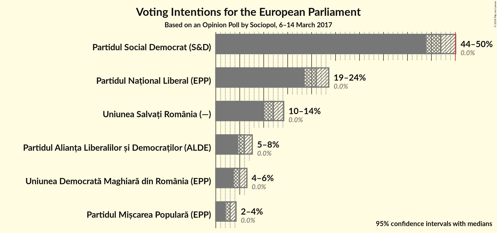
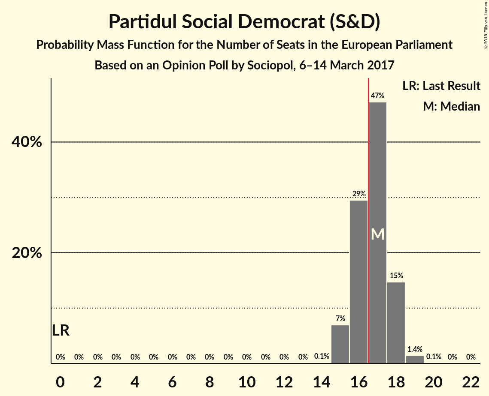
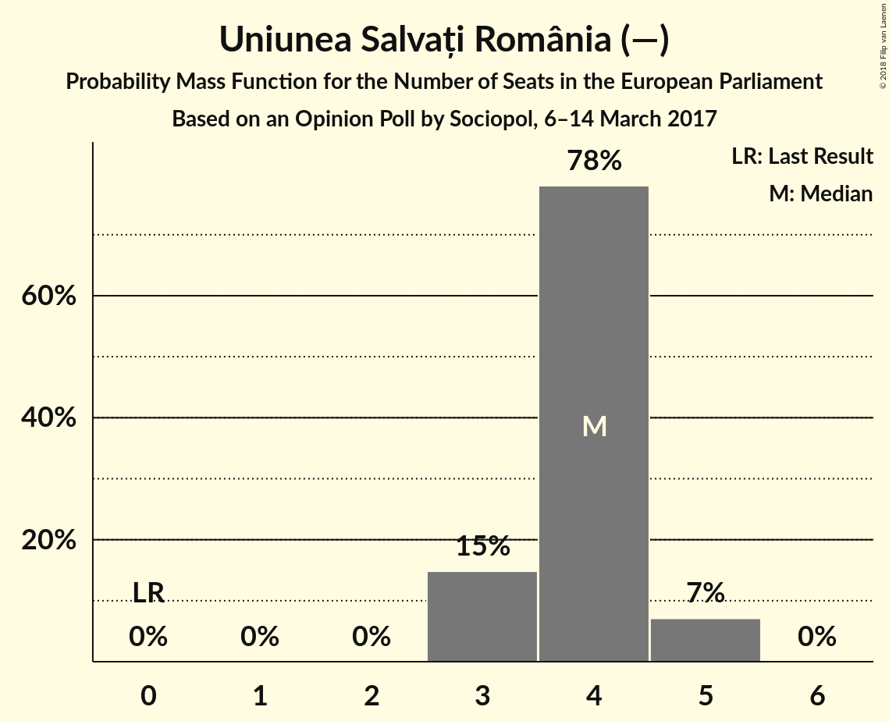
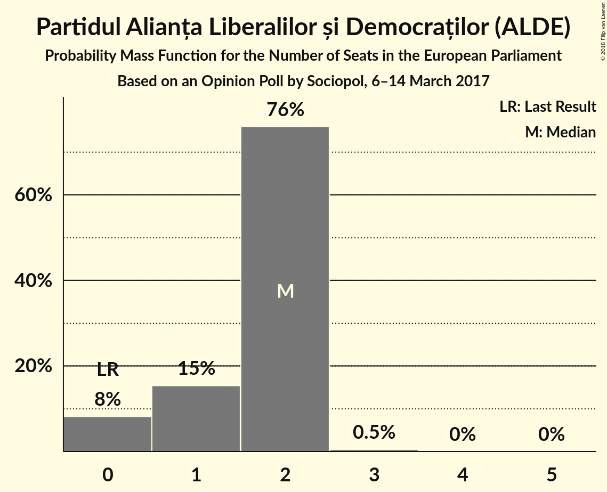
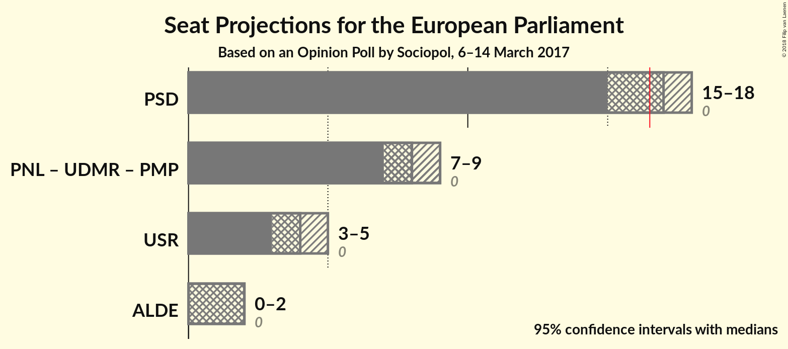

# Opinion Poll by Sociopol, 6–14 March 2017

<a href="#voting-intentions">Voting Intentions</a> | <a href="#seats">Seats</a> | <a href="#coalitions">Coalitions</a> | <a href="#technical-information">Technical Information</a>

## Voting Intentions

### Confidence Intervals

| Party | Last Result | Poll Result | 80% Confidence Interval | 90% Confidence Interval | 95% Confidence Interval | 99% Confidence Interval |
|:-----:|:-----------:|:-----------:|:-----------------------:|:-----------------------:|:-----------------------:|:-----------------------:|
| Partidul Social Democrat (S&D) | 0.0% | 47.0% | 45.0–49.0% |44.4–49.6% |43.9–50.1% |42.9–51.0% |
| Partidul Național Liberal (EPP) | 0.0% | 21.0% | 19.4–22.7% |18.9–23.2% |18.5–23.6% |17.8–24.4% |
| Uniunea Salvați România (—) | 0.0% | 12.0% | 10.8–13.4% |10.4–13.8% |10.2–14.2% |9.6–14.9% |
| Partidul Alianța Liberalilor și Democraților (ALDE) | 0.0% | 6.0% | 5.1–7.0% |4.9–7.3% |4.6–7.6% |4.3–8.1% |
| Uniunea Democrată Maghiară din România (EPP) | 0.0% | 5.0% | 4.2–6.0% |4.0–6.2% |3.8–6.5% |3.4–7.0% |
| Partidul Mișcarea Populară (EPP) | 0.0% | 3.0% | 2.4–3.8% |2.2–4.0% |2.1–4.2% |1.8–4.6% |

*Note:* The poll result column reflects the actual value used in the calculations. Published results may vary slightly, and in addition be rounded to fewer digits.

## Seats

### Confidence Intervals

| Party | Last Result | Median | 80% Confidence Interval | 90% Confidence Interval | 95% Confidence Interval | 99% Confidence Interval |
|:-----:|:-----------:|:------:|:-----------------------:|:-----------------------:|:-----------------------:|:-----------------------:|
| <a href="#partidul-social-democrat-(s&d)">Partidul Social Democrat (S&D)</a> | 0 | 18 | 16–18 |16–18 |15–20 |15–20 |
| <a href="#partidul-național-liberal-(epp)">Partidul Național Liberal (EPP)</a> | 0 | 6 | 6–7 |6–7 |6–7 |6–8 |
| <a href="#uniunea-salvați-românia-(—)">Uniunea Salvați România (—)</a> | 0 | 4 | 4 |4–5 |4–5 |4–5 |
| <a href="#partidul-alianța-liberalilor-și-democraților-(alde)">Partidul Alianța Liberalilor și Democraților (ALDE)</a> | 0 | 2 | 0–2 |0–2 |0–2 |0–2 |
| <a href="#uniunea-democrată-maghiară-din-românia-(epp)">Uniunea Democrată Maghiară din România (EPP)</a> | 0 | 0 | 0–2 |0–2 |0–2 |0–2 |
| <a href="#partidul-mișcarea-populară-(epp)">Partidul Mișcarea Populară (EPP)</a> | 0 | 0 | 0 |0 |0 |0 |

### Partidul Social Democrat (S&D)

*For a full overview of the results for this party, see the [Partidul Social Democrat (S&D)](party-partidulsocialdemocratsd.html) page.*

| Number of Seats | Probability | Accumulated | Special Marks |
|:---------------:|:-----------:|:-----------:|:-------------:|
| 0 | 0% | 100% | Last Result |
| 1 | 0% | 100% |  |
| 2 | 0% | 100% |  |
| 3 | 0% | 100% |  |
| 4 | 0% | 100% |  |
| 5 | 0% | 100% |  |
| 6 | 0% | 100% |  |
| 7 | 0% | 100% |  |
| 8 | 0% | 100% |  |
| 9 | 0% | 100% |  |
| 10 | 0% | 100% |  |
| 11 | 0% | 100% |  |
| 12 | 0% | 100% |  |
| 13 | 0% | 100% |  |
| 14 | 0% | 100% |  |
| 15 | 3% | 100% |  |
| 16 | 8% | 97% |  |
| 17 | 17% | 90% | Majority |
| 18 | 69% | 72% | Median |
| 19 | 0.7% | 3% |  |
| 20 | 3% | 3% |  |
| 21 | 0% | 0% |  |

### Partidul Național Liberal (EPP)

*For a full overview of the results for this party, see the [Partidul Național Liberal (EPP)](party-partidulnaționalliberalepp.html) page.*

| Number of Seats | Probability | Accumulated | Special Marks |
|:---------------:|:-----------:|:-----------:|:-------------:|
| 0 | 0% | 100% | Last Result |
| 1 | 0% | 100% |  |
| 2 | 0% | 100% |  |
| 3 | 0% | 100% |  |
| 4 | 0% | 100% |  |
| 5 | 0% | 100% |  |
| 6 | 74% | 100% | Median |
| 7 | 25% | 26% |  |
| 8 | 0.9% | 0.9% |  |
| 9 | 0.1% | 0.1% |  |
| 10 | 0% | 0% |  |

### Uniunea Salvați România (—)

*For a full overview of the results for this party, see the [Uniunea Salvați România (—)](party-uniuneasalvațiromânia—.html) page.*

| Number of Seats | Probability | Accumulated | Special Marks |
|:---------------:|:-----------:|:-----------:|:-------------:|
| 0 | 0% | 100% | Last Result |
| 1 | 0% | 100% |  |
| 2 | 0% | 100% |  |
| 3 | 0.1% | 100% |  |
| 4 | 91% | 99.9% | Median |
| 5 | 9% | 9% |  |
| 6 | 0.1% | 0.1% |  |
| 7 | 0% | 0% |  |

### Partidul Alianța Liberalilor și Democraților (ALDE)

*For a full overview of the results for this party, see the [Partidul Alianța Liberalilor și Democraților (ALDE)](party-partidulalianțaliberalilorșidemocrațiloralde.html) page.*

| Number of Seats | Probability | Accumulated | Special Marks |
|:---------------:|:-----------:|:-----------:|:-------------:|
| 0 | 11% | 100% | Last Result |
| 1 | 0.4% | 89% |  |
| 2 | 89% | 89% | Median |
| 3 | 0.1% | 0.1% |  |
| 4 | 0% | 0% |  |

### Uniunea Democrată Maghiară din România (EPP)

*For a full overview of the results for this party, see the [Uniunea Democrată Maghiară din România (EPP)](party-uniuneademocratămaghiarădinromâniaepp.html) page.*

| Number of Seats | Probability | Accumulated | Special Marks |
|:---------------:|:-----------:|:-----------:|:-------------:|
| 0 | 71% | 100% | Last Result, Median |
| 1 | 16% | 29% |  |
| 2 | 13% | 13% |  |
| 3 | 0% | 0% |  |

### Partidul Mișcarea Populară (EPP)

*For a full overview of the results for this party, see the [Partidul Mișcarea Populară (EPP)](party-partidulmișcareapopularăepp.html) page.*

| Number of Seats | Probability | Accumulated | Special Marks |
|:---------------:|:-----------:|:-----------:|:-------------:|
| 0 | 99.9% | 100% | Last Result, Median |
| 1 | 0.1% | 0.1% |  |
| 2 | 0% | 0% |  |

## Coalitions

### Confidence Intervals

| Coalition | Last Result | Median | Majority? | 80% Confidence Interval | 90% Confidence Interval | 95% Confidence Interval | 99% Confidence Interval |
|:---------:|:-----------:|:------:|:---------:|:-----------------------:|:-----------------------:|:-----------------------:|:-----------------------:|
| Partidul Social Democrat (S&D) | 0 | 18 | 90% | 16–18 | 16–18 | 15–20 | 15–20 |
| Partidul Național Liberal (EPP) – Uniunea Democrată Maghiară din România (EPP) – Partidul Mișcarea Populară (EPP) | 0 | 6 | 0% | 6–8 | 6–8 | 6–9 | 6–9 |
| Uniunea Salvați România (—) | 0 | 4 | 0% | 4 | 4–5 | 4–5 | 4–5 |
| Partidul Alianța Liberalilor și Democraților (ALDE) | 0 | 2 | 0% | 0–2 | 0–2 | 0–2 | 0–2 |

### Partidul Social Democrat (S&D)

| Number of Seats | Probability | Accumulated | Special Marks |
|:---------------:|:-----------:|:-----------:|:-------------:|
| 0 | 0% | 100% | Last Result |
| 1 | 0% | 100% |  |
| 2 | 0% | 100% |  |
| 3 | 0% | 100% |  |
| 4 | 0% | 100% |  |
| 5 | 0% | 100% |  |
| 6 | 0% | 100% |  |
| 7 | 0% | 100% |  |
| 8 | 0% | 100% |  |
| 9 | 0% | 100% |  |
| 10 | 0% | 100% |  |
| 11 | 0% | 100% |  |
| 12 | 0% | 100% |  |
| 13 | 0% | 100% |  |
| 14 | 0% | 100% |  |
| 15 | 3% | 100% |  |
| 16 | 8% | 97% |  |
| 17 | 17% | 90% | Majority |
| 18 | 69% | 72% | Median |
| 19 | 0.7% | 3% |  |
| 20 | 3% | 3% |  |
| 21 | 0% | 0% |  |

### Partidul Național Liberal (EPP) – Uniunea Democrată Maghiară din România (EPP) – Partidul Mișcarea Populară (EPP)

| Number of Seats | Probability | Accumulated | Special Marks |
|:---------------:|:-----------:|:-----------:|:-------------:|
| 0 | 0% | 100% | Last Result |
| 1 | 0% | 100% |  |
| 2 | 0% | 100% |  |
| 3 | 0% | 100% |  |
| 4 | 0% | 100% |  |
| 5 | 0% | 100% |  |
| 6 | 64% | 100% | Median |
| 7 | 6% | 36% |  |
| 8 | 27% | 30% |  |
| 9 | 3% | 3% |  |
| 10 | 0.1% | 0.1% |  |
| 11 | 0% | 0% |  |

### Uniunea Salvați România (—)

| Number of Seats | Probability | Accumulated | Special Marks |
|:---------------:|:-----------:|:-----------:|:-------------:|
| 0 | 0% | 100% | Last Result |
| 1 | 0% | 100% |  |
| 2 | 0% | 100% |  |
| 3 | 0.1% | 100% |  |
| 4 | 91% | 99.9% | Median |
| 5 | 9% | 9% |  |
| 6 | 0.1% | 0.1% |  |
| 7 | 0% | 0% |  |

### Partidul Alianța Liberalilor și Democraților (ALDE)

| Number of Seats | Probability | Accumulated | Special Marks |
|:---------------:|:-----------:|:-----------:|:-------------:|
| 0 | 11% | 100% | Last Result |
| 1 | 0.4% | 89% |  |
| 2 | 89% | 89% | Median |
| 3 | 0.1% | 0.1% |  |
| 4 | 0% | 0% |  |

## Technical Information

### Opinion Poll

+ **Polling firm:** Sociopol
+ **Commissioner(s):** —
+ **Fieldwork period:** 6–14 March 2017

### Calculations

+ **Sample size:** 1007
+ **Simulations done:** 1,024
+ **Error estimate:** 2.64%

