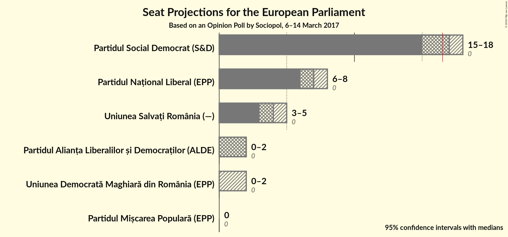

# Opinion Poll by Sociopol, 6–14 March 2017

<a href="#voting-intentions">Voting Intentions</a> | <a href="#seats">Seats</a> | <a href="#coalitions">Coalitions</a> | <a href="#technical-information">Technical Information</a>

## Voting Intentions

### Confidence Intervals

| Party | Last Result | Poll Result | 80% Confidence Interval | 90% Confidence Interval | 95% Confidence Interval | 99% Confidence Interval |
|:-----:|:-----------:|:-----------:|:-----------------------:|:-----------------------:|:-----------------------:|:-----------------------:|
| Partidul Social Democrat (S&D) | 0.0% | 47.0% | 45.0–49.0% |44.4–49.6% |43.9–50.1% |42.9–51.0% |
| Partidul Național Liberal (EPP) | 0.0% | 21.0% | 19.4–22.7% |18.9–23.2% |18.5–23.6% |17.8–24.4% |
| Uniunea Salvați România (*) | 0.0% | 12.0% | N/A |N/A |N/A |N/A |
| Partidul Alianța Liberalilor și Democraților (ALDE) | 0.0% | 6.0% | 5.1–7.0% |4.9–7.3% |4.6–7.6% |4.3–8.1% |
| Uniunea Democrată Maghiară din România (EPP) | 0.0% | 5.0% | 4.2–6.0% |4.0–6.2% |3.8–6.5% |3.4–7.0% |
| Partidul Mișcarea Populară (EPP) | 0.0% | 3.0% | 2.4–3.8% |2.2–4.0% |2.1–4.2% |1.8–4.6% |

*Note:* The poll result column reflects the actual value used in the calculations. Published results may vary slightly, and in addition be rounded to fewer digits.

## Seats

### Confidence Intervals

| Party | Last Result | Median | 80% Confidence Interval | 90% Confidence Interval | 95% Confidence Interval | 99% Confidence Interval |
|:-----:|:-----------:|:------:|:-----------------------:|:-----------------------:|:-----------------------:|:-----------------------:|
| <a href="#partidul-social-democrat-(s&d)">Partidul Social Democrat (S&D)</a> | 0 | 17 | 16–18 |16–19 |16–19 |15–19 |
| <a href="#partidul-național-liberal-(epp)">Partidul Național Liberal (EPP)</a> | 0 | 7 | 7–8 |7–8 |6–9 |6–9 |
| <a href="#uniunea-salvați-românia-(*)">Uniunea Salvați România (*)</a> | 0 | N/A | N/A |N/A |N/A |N/A |
| <a href="#partidul-alianța-liberalilor-și-democraților-(alde)">Partidul Alianța Liberalilor și Democraților (ALDE)</a> | 0 | 2 | 1–2 |0–2 |0–2 |0–3 |
| <a href="#uniunea-democrată-maghiară-din-românia-(epp)">Uniunea Democrată Maghiară din România (EPP)</a> | 0 | 0 | 0–2 |0–2 |0–2 |0–2 |
| <a href="#partidul-mișcarea-populară-(epp)">Partidul Mișcarea Populară (EPP)</a> | 0 | 0 | 0 |0 |0 |0 |

