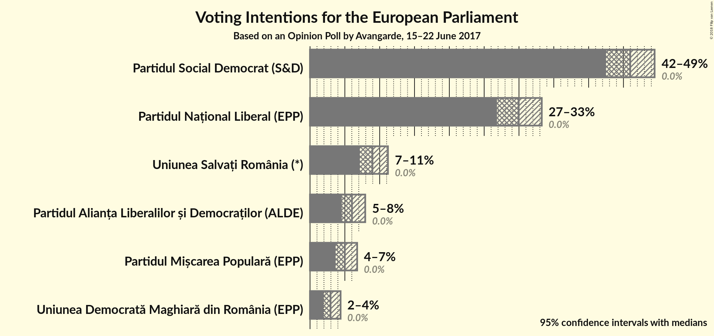
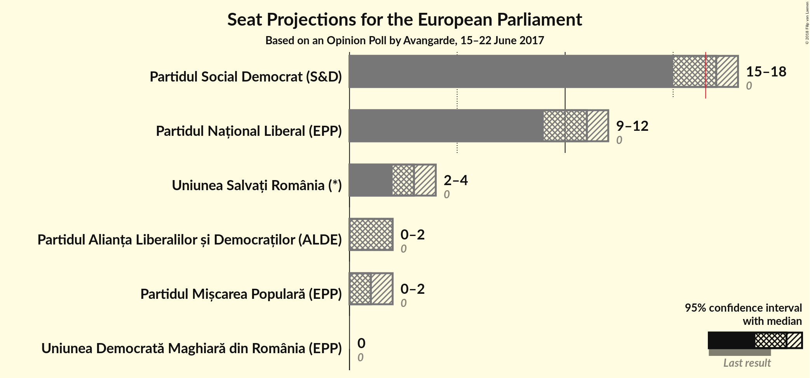

# Opinion Poll by Avangarde, 15–22 June 2017

<a href="#voting-intentions">Voting Intentions</a> | <a href="#seats">Seats</a> | <a href="#coalitions">Coalitions</a> | <a href="#technical-information">Technical Information</a>

## Voting Intentions

### Confidence Intervals

| Party | Last Result | Poll Result | 80% Confidence Interval | 90% Confidence Interval | 95% Confidence Interval | 99% Confidence Interval |
|:-----:|:-----------:|:-----------:|:-----------------------:|:-----------------------:|:-----------------------:|:-----------------------:|
| Partidul Social Democrat (S&D) | 0.0% | 46.0% | 43.7–48.3% |43.0–48.9% |42.5–49.5% |41.4–50.6% |
| Partidul Național Liberal (EPP) | 0.0% | 30.0% | 27.9–32.1% |27.3–32.7% |26.8–33.3% |25.9–34.3% |
| Uniunea Salvați România (*) | 0.0% | 9.0% | N/A |N/A |N/A |N/A |
| Partidul Alianța Liberalilor și Democraților (ALDE) | 0.0% | 6.0% | 5.0–7.3% |4.8–7.6% |4.6–7.9% |4.1–8.6% |
| Partidul Mișcarea Populară (EPP) | 0.0% | 5.0% | 4.1–6.1% |3.9–6.5% |3.7–6.8% |3.3–7.3% |
| Uniunea Democrată Maghiară din România (EPP) | 0.0% | 2.9% | 2.3–3.9% |2.1–4.1% |2.0–4.4% |1.7–4.9% |

*Note:* The poll result column reflects the actual value used in the calculations. Published results may vary slightly, and in addition be rounded to fewer digits.

## Seats

### Confidence Intervals

| Party | Last Result | Median | 80% Confidence Interval | 90% Confidence Interval | 95% Confidence Interval | 99% Confidence Interval |
|:-----:|:-----------:|:------:|:-----------------------:|:-----------------------:|:-----------------------:|:-----------------------:|
| <a href="#partidul-social-democrat-(s&d)">Partidul Social Democrat (S&D)</a> | 0 | 17 | 16–18 |15–18 |15–18 |15–19 |
| <a href="#partidul-național-liberal-(epp)">Partidul Național Liberal (EPP)</a> | 0 | 11 | 10–12 |10–12 |9–12 |9–13 |
| <a href="#uniunea-salvați-românia-(*)">Uniunea Salvați România (*)</a> | 0 | N/A | N/A |N/A |N/A |N/A |
| <a href="#partidul-alianța-liberalilor-și-democraților-(alde)">Partidul Alianța Liberalilor și Democraților (ALDE)</a> | 0 | 2 | 1–2 |0–2 |0–2 |0–3 |
| <a href="#partidul-mișcarea-populară-(epp)">Partidul Mișcarea Populară (EPP)</a> | 0 | 1 | 0–2 |0–2 |0–2 |0–2 |
| <a href="#uniunea-democrată-maghiară-din-românia-(epp)">Uniunea Democrată Maghiară din România (EPP)</a> | 0 | 0 | 0 |0 |0 |0 |

