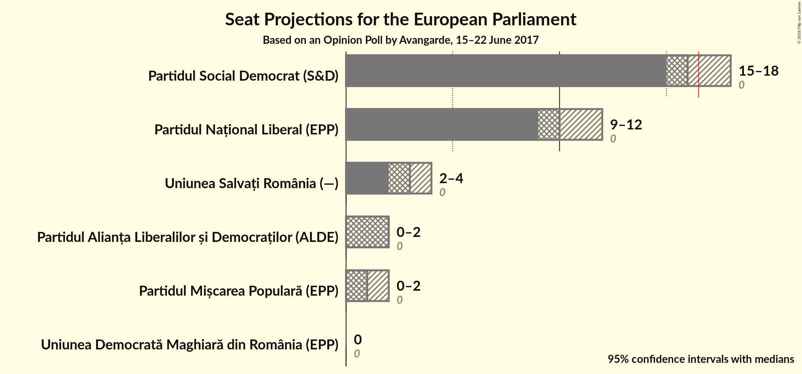
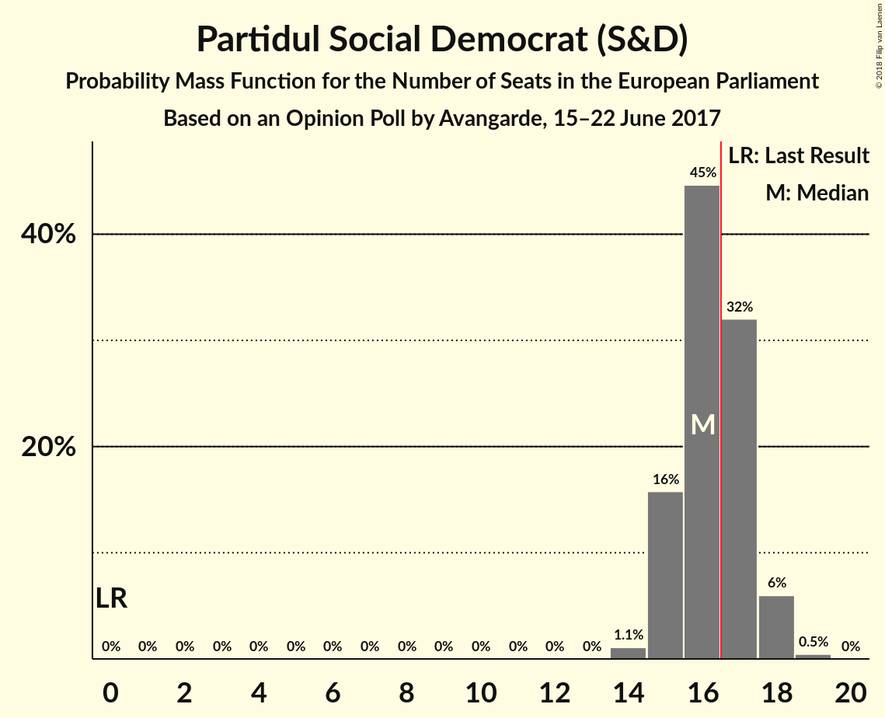
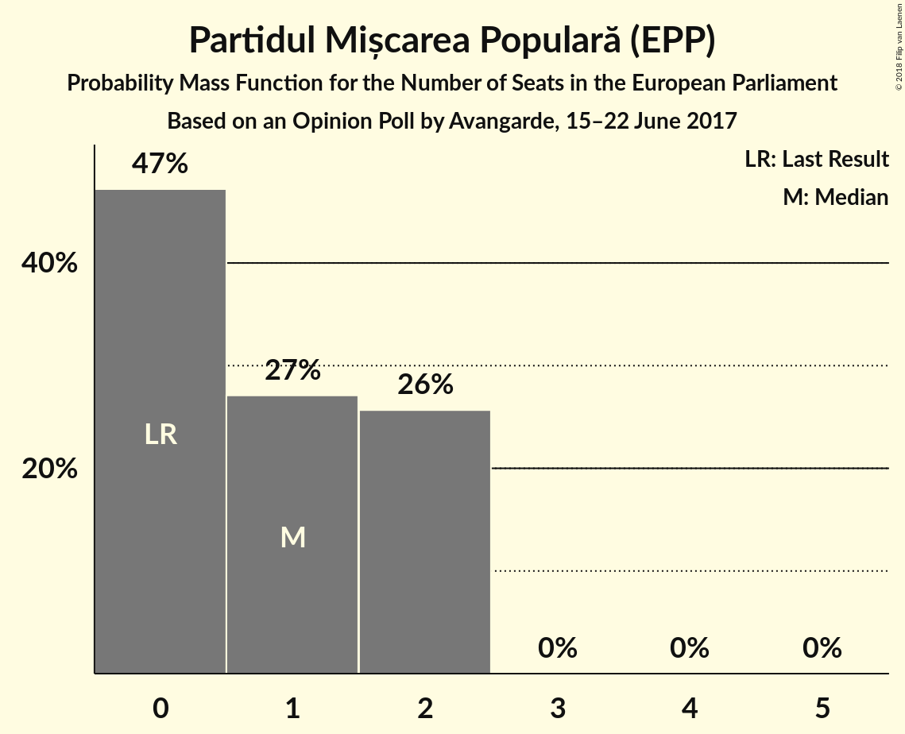
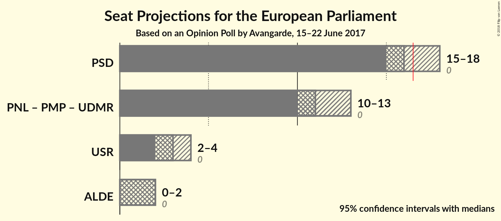

# Opinion Poll by Avangarde, 15–22 June 2017

<a href="#voting-intentions">Voting Intentions</a> | <a href="#seats">Seats</a> | <a href="#coalitions">Coalitions</a> | <a href="#technical-information">Technical Information</a>

## Voting Intentions

### Confidence Intervals

| Party | Last Result | Poll Result | 80% Confidence Interval | 90% Confidence Interval | 95% Confidence Interval | 99% Confidence Interval |
|:-----:|:-----------:|:-----------:|:-----------------------:|:-----------------------:|:-----------------------:|:-----------------------:|
| Partidul Social Democrat (S&D) | 0.0% | 46.0% | 43.7–48.3% |43.0–48.9% |42.5–49.5% |41.4–50.6% |
| Partidul Național Liberal (EPP) | 0.0% | 30.0% | 27.9–32.1% |27.3–32.7% |26.8–33.3% |25.9–34.3% |
| Uniunea Salvați România (—) | 0.0% | 9.0% | 7.8–10.4% |7.4–10.8% |7.1–11.2% |6.6–11.9% |
| Partidul Alianța Liberalilor și Democraților (ALDE) | 0.0% | 6.0% | 5.0–7.3% |4.8–7.6% |4.6–7.9% |4.1–8.6% |
| Partidul Mișcarea Populară (EPP) | 0.0% | 5.0% | 4.1–6.1% |3.9–6.5% |3.7–6.8% |3.3–7.3% |
| Uniunea Democrată Maghiară din România (EPP) | 0.0% | 2.9% | 2.3–3.9% |2.1–4.1% |2.0–4.4% |1.7–4.9% |

*Note:* The poll result column reflects the actual value used in the calculations. Published results may vary slightly, and in addition be rounded to fewer digits.

## Seats

### Confidence Intervals

| Party | Last Result | Median | 80% Confidence Interval | 90% Confidence Interval | 95% Confidence Interval | 99% Confidence Interval |
|:-----:|:-----------:|:------:|:-----------------------:|:-----------------------:|:-----------------------:|:-----------------------:|
| <a href="#partidul-social-democrat-(s&d)">Partidul Social Democrat (S&D)</a> | 0 | 16 | 15–17 |15–18 |15–18 |14–18 |
| <a href="#partidul-național-liberal-(epp)">Partidul Național Liberal (EPP)</a> | 0 | 10 | 10–11 |9–12 |9–12 |9–12 |
| <a href="#uniunea-salvați-românia-(—)">Uniunea Salvați România (—)</a> | 0 | 3 | 2–3 |2–3 |2–4 |2–4 |
| <a href="#partidul-alianța-liberalilor-și-democraților-(alde)">Partidul Alianța Liberalilor și Democraților (ALDE)</a> | 0 | 2 | 1–2 |0–2 |0–2 |0–3 |
| <a href="#partidul-mișcarea-populară-(epp)">Partidul Mișcarea Populară (EPP)</a> | 0 | 1 | 0–2 |0–2 |0–2 |0–2 |
| <a href="#uniunea-democrată-maghiară-din-românia-(epp)">Uniunea Democrată Maghiară din România (EPP)</a> | 0 | 0 | 0 |0 |0 |0 |

### Partidul Social Democrat (S&D)

*For a full overview of the results for this party, see the [Partidul Social Democrat (S&D)](party-partidulsocialdemocratsd.html) page.*

| Number of Seats | Probability | Accumulated | Special Marks |
|:---------------:|:-----------:|:-----------:|:-------------:|
| 0 | 0% | 100% | Last Result |
| 1 | 0% | 100% |  |
| 2 | 0% | 100% |  |
| 3 | 0% | 100% |  |
| 4 | 0% | 100% |  |
| 5 | 0% | 100% |  |
| 6 | 0% | 100% |  |
| 7 | 0% | 100% |  |
| 8 | 0% | 100% |  |
| 9 | 0% | 100% |  |
| 10 | 0% | 100% |  |
| 11 | 0% | 100% |  |
| 12 | 0% | 100% |  |
| 13 | 0% | 100% |  |
| 14 | 1.1% | 100% |  |
| 15 | 16% | 98.9% |  |
| 16 | 45% | 83% | Median |
| 17 | 32% | 38% | Majority |
| 18 | 6% | 6% |  |
| 19 | 0.5% | 0.5% |  |
| 20 | 0% | 0% |  |

### Partidul Național Liberal (EPP)

*For a full overview of the results for this party, see the [Partidul Național Liberal (EPP)](party-partidulnaționalliberalepp.html) page.*

| Number of Seats | Probability | Accumulated | Special Marks |
|:---------------:|:-----------:|:-----------:|:-------------:|
| 0 | 0% | 100% | Last Result |
| 1 | 0% | 100% |  |
| 2 | 0% | 100% |  |
| 3 | 0% | 100% |  |
| 4 | 0% | 100% |  |
| 5 | 0% | 100% |  |
| 6 | 0% | 100% |  |
| 7 | 0% | 100% |  |
| 8 | 0.1% | 100% |  |
| 9 | 8% | 99.9% |  |
| 10 | 47% | 92% | Median |
| 11 | 39% | 45% |  |
| 12 | 6% | 6% |  |
| 13 | 0.2% | 0.2% |  |
| 14 | 0% | 0% |  |

### Uniunea Salvați România (—)

*For a full overview of the results for this party, see the [Uniunea Salvați România (—)](party-uniuneasalvațiromânia—.html) page.*

| Number of Seats | Probability | Accumulated | Special Marks |
|:---------------:|:-----------:|:-----------:|:-------------:|
| 0 | 0% | 100% | Last Result |
| 1 | 0% | 100% |  |
| 2 | 22% | 100% |  |
| 3 | 74% | 78% | Median |
| 4 | 4% | 4% |  |
| 5 | 0% | 0% |  |

### Partidul Alianța Liberalilor și Democraților (ALDE)

*For a full overview of the results for this party, see the [Partidul Alianța Liberalilor și Democraților (ALDE)](party-partidulalianțaliberalilorșidemocrațiloralde.html) page.*

| Number of Seats | Probability | Accumulated | Special Marks |
|:---------------:|:-----------:|:-----------:|:-------------:|
| 0 | 9% | 100% | Last Result |
| 1 | 14% | 91% |  |
| 2 | 75% | 76% | Median |
| 3 | 1.2% | 1.2% |  |
| 4 | 0% | 0% |  |

### Partidul Mișcarea Populară (EPP)

*For a full overview of the results for this party, see the [Partidul Mișcarea Populară (EPP)](party-partidulmișcareapopularăepp.html) page.*

| Number of Seats | Probability | Accumulated | Special Marks |
|:---------------:|:-----------:|:-----------:|:-------------:|
| 0 | 47% | 100% | Last Result |
| 1 | 27% | 53% | Median |
| 2 | 26% | 26% |  |
| 3 | 0% | 0% |  |

### Uniunea Democrată Maghiară din România (EPP)

*For a full overview of the results for this party, see the [Uniunea Democrată Maghiară din România (EPP)](party-uniuneademocratămaghiarădinromâniaepp.html) page.*

| Number of Seats | Probability | Accumulated | Special Marks |
|:---------------:|:-----------:|:-----------:|:-------------:|
| 0 | 99.7% | 100% | Last Result, Median |
| 1 | 0.2% | 0.3% |  |
| 2 | 0% | 0% |  |

## Coalitions

### Confidence Intervals

| Coalition | Last Result | Median | Majority? | 80% Confidence Interval | 90% Confidence Interval | 95% Confidence Interval | 99% Confidence Interval |
|:---------:|:-----------:|:------:|:---------:|:-----------------------:|:-----------------------:|:-----------------------:|:-----------------------:|
| Partidul Social Democrat (S&D) | 0 | 16 | 38% | 15–17 | 15–18 | 15–18 | 14–18 |
| Partidul Național Liberal (EPP) – Partidul Mișcarea Populară (EPP) – Uniunea Democrată Maghiară din România (EPP) | 0 | 11 | 0% | 10–12 | 10–13 | 10–13 | 9–13 |
| Uniunea Salvați România (—) | 0 | 3 | 0% | 2–3 | 2–3 | 2–4 | 2–4 |
| Partidul Alianța Liberalilor și Democraților (ALDE) | 0 | 2 | 0% | 1–2 | 0–2 | 0–2 | 0–3 |

### Partidul Social Democrat (S&D)

| Number of Seats | Probability | Accumulated | Special Marks |
|:---------------:|:-----------:|:-----------:|:-------------:|
| 0 | 0% | 100% | Last Result |
| 1 | 0% | 100% |  |
| 2 | 0% | 100% |  |
| 3 | 0% | 100% |  |
| 4 | 0% | 100% |  |
| 5 | 0% | 100% |  |
| 6 | 0% | 100% |  |
| 7 | 0% | 100% |  |
| 8 | 0% | 100% |  |
| 9 | 0% | 100% |  |
| 10 | 0% | 100% |  |
| 11 | 0% | 100% |  |
| 12 | 0% | 100% |  |
| 13 | 0% | 100% |  |
| 14 | 1.1% | 100% |  |
| 15 | 16% | 98.9% |  |
| 16 | 45% | 83% | Median |
| 17 | 32% | 38% | Majority |
| 18 | 6% | 6% |  |
| 19 | 0.5% | 0.5% |  |
| 20 | 0% | 0% |  |

### Partidul Național Liberal (EPP) – Partidul Mișcarea Populară (EPP) – Uniunea Democrată Maghiară din România (EPP)

| Number of Seats | Probability | Accumulated | Special Marks |
|:---------------:|:-----------:|:-----------:|:-------------:|
| 0 | 0% | 100% | Last Result |
| 1 | 0% | 100% |  |
| 2 | 0% | 100% |  |
| 3 | 0% | 100% |  |
| 4 | 0% | 100% |  |
| 5 | 0% | 100% |  |
| 6 | 0% | 100% |  |
| 7 | 0% | 100% |  |
| 8 | 0% | 100% |  |
| 9 | 1.1% | 100% |  |
| 10 | 19% | 98.9% |  |
| 11 | 44% | 80% | Median |
| 12 | 28% | 35% |  |
| 13 | 7% | 8% |  |
| 14 | 0.4% | 0.4% |  |
| 15 | 0% | 0% |  |

### Uniunea Salvați România (—)

| Number of Seats | Probability | Accumulated | Special Marks |
|:---------------:|:-----------:|:-----------:|:-------------:|
| 0 | 0% | 100% | Last Result |
| 1 | 0% | 100% |  |
| 2 | 22% | 100% |  |
| 3 | 74% | 78% | Median |
| 4 | 4% | 4% |  |
| 5 | 0% | 0% |  |

### Partidul Alianța Liberalilor și Democraților (ALDE)

| Number of Seats | Probability | Accumulated | Special Marks |
|:---------------:|:-----------:|:-----------:|:-------------:|
| 0 | 9% | 100% | Last Result |
| 1 | 14% | 91% |  |
| 2 | 75% | 76% | Median |
| 3 | 1.2% | 1.2% |  |
| 4 | 0% | 0% |  |

## Technical Information

### Opinion Poll

+ **Polling firm:** Avangarde
+ **Commissioner(s):** —
+ **Fieldwork period:** 15–22 June 2017

### Calculations

+ **Sample size:** 781
+ **Simulations done:** 1,048,576
+ **Error estimate:** 0.43%

