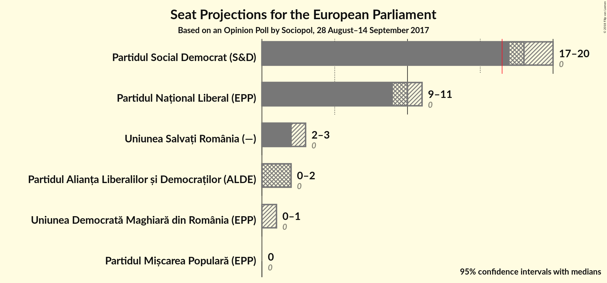
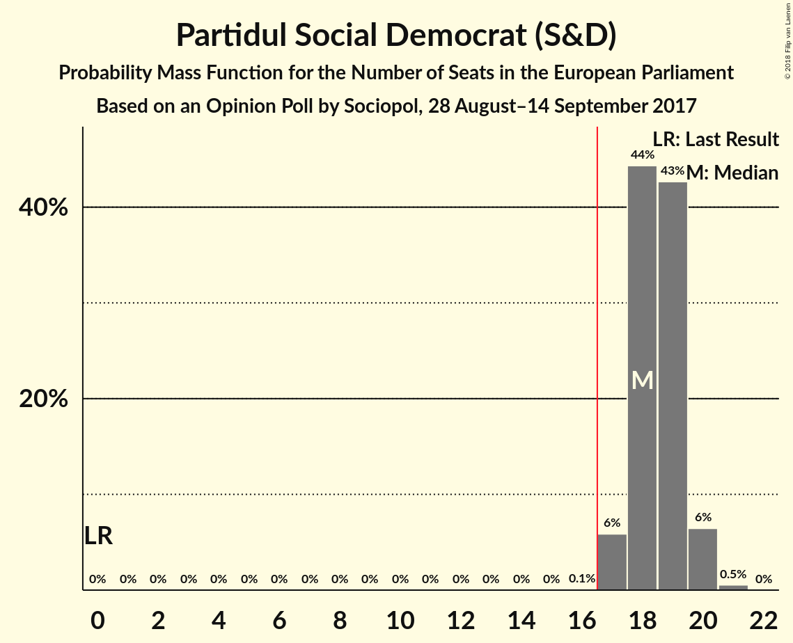
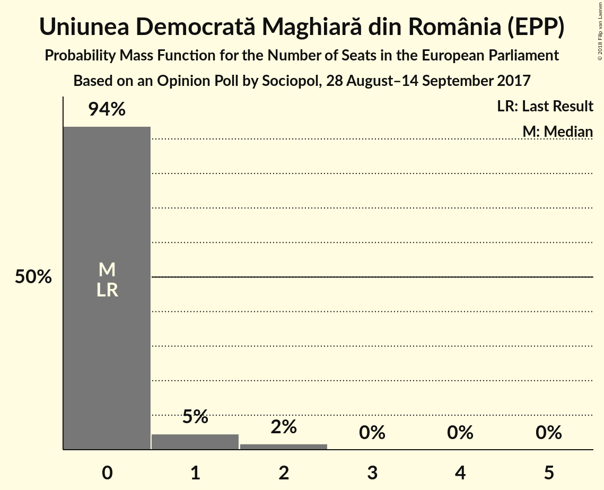
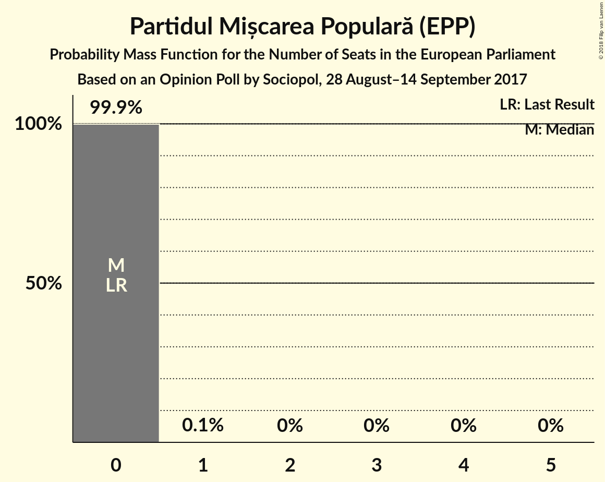

# Opinion Poll by Sociopol, 28 August–14 September 2017

<a href="#voting-intentions">Voting Intentions</a> | <a href="#seats">Seats</a> | <a href="#coalitions">Coalitions</a> | <a href="#technical-information">Technical Information</a>

## Voting Intentions

### Confidence Intervals

| Party | Last Result | Poll Result | 80% Confidence Interval | 90% Confidence Interval | 95% Confidence Interval | 99% Confidence Interval |
|:-----:|:-----------:|:-----------:|:-----------------------:|:-----------------------:|:-----------------------:|:-----------------------:|
| Partidul Social Democrat (S&D) | 0.0% | 51.0% | 49.0–53.1% |48.4–53.6% |47.9–54.1% |47.0–55.1% |
| Partidul Național Liberal (EPP) | 0.0% | 27.0% | 25.2–28.8% |24.7–29.3% |24.3–29.8% |23.5–30.7% |
| Uniunea Salvați România (—) | 0.0% | 7.0% | 6.0–8.1% |5.8–8.4% |5.5–8.7% |5.1–9.3% |
| Partidul Alianța Liberalilor și Democraților (ALDE) | 0.0% | 6.0% | 5.1–7.0% |4.9–7.3% |4.7–7.6% |4.3–8.2% |
| Uniunea Democrată Maghiară din România (EPP) | 0.0% | 4.0% | 3.3–4.9% |3.1–5.2% |2.9–5.4% |2.6–5.9% |
| Partidul Mișcarea Populară (EPP) | 0.0% | 3.0% | 2.4–3.8% |2.2–4.0% |2.1–4.2% |1.8–4.7% |

*Note:* The poll result column reflects the actual value used in the calculations. Published results may vary slightly, and in addition be rounded to fewer digits.

## Seats

### Confidence Intervals

| Party | Last Result | Median | 80% Confidence Interval | 90% Confidence Interval | 95% Confidence Interval | 99% Confidence Interval |
|:-----:|:-----------:|:------:|:-----------------------:|:-----------------------:|:-----------------------:|:-----------------------:|
| <a href="#partidul-social-democrat-(s&d)">Partidul Social Democrat (S&D)</a> | 0 | 19 | 19 |18–19 |18–20 |18–21 |
| <a href="#partidul-național-liberal-(epp)">Partidul Național Liberal (EPP)</a> | 0 | 10 | 10 |9–11 |9–11 |8–11 |
| <a href="#uniunea-salvați-românia-(—)">Uniunea Salvați România (—)</a> | 0 | 2 | 2 |2 |2–3 |1–3 |
| <a href="#partidul-alianța-liberalilor-și-democraților-(alde)">Partidul Alianța Liberalilor și Democraților (ALDE)</a> | 0 | 2 | 2 |2 |2 |0–2 |
| <a href="#uniunea-democrată-maghiară-din-românia-(epp)">Uniunea Democrată Maghiară din România (EPP)</a> | 0 | 0 | 0 |0 |0–1 |0–2 |
| <a href="#partidul-mișcarea-populară-(epp)">Partidul Mișcarea Populară (EPP)</a> | 0 | 0 | 0 |0 |0 |0 |

### Partidul Social Democrat (S&D)

*For a full overview of the results for this party, see the [Partidul Social Democrat (S&D)](party-partidulsocialdemocratsd.html) page.*

| Number of Seats | Probability | Accumulated | Special Marks |
|:---------------:|:-----------:|:-----------:|:-------------:|
| 0 | 0% | 100% | Last Result |
| 1 | 0% | 100% |  |
| 2 | 0% | 100% |  |
| 3 | 0% | 100% |  |
| 4 | 0% | 100% |  |
| 5 | 0% | 100% |  |
| 6 | 0% | 100% |  |
| 7 | 0% | 100% |  |
| 8 | 0% | 100% |  |
| 9 | 0% | 100% |  |
| 10 | 0% | 100% |  |
| 11 | 0% | 100% |  |
| 12 | 0% | 100% |  |
| 13 | 0% | 100% |  |
| 14 | 0% | 100% |  |
| 15 | 0% | 100% |  |
| 16 | 0% | 100% |  |
| 17 | 0.5% | 100% | Majority |
| 18 | 6% | 99.5% |  |
| 19 | 90% | 94% | Median |
| 20 | 3% | 4% |  |
| 21 | 0.8% | 0.9% |  |
| 22 | 0% | 0% |  |

### Partidul Național Liberal (EPP)

*For a full overview of the results for this party, see the [Partidul Național Liberal (EPP)](party-partidulnaționalliberalepp.html) page.*

| Number of Seats | Probability | Accumulated | Special Marks |
|:---------------:|:-----------:|:-----------:|:-------------:|
| 0 | 0% | 100% | Last Result |
| 1 | 0% | 100% |  |
| 2 | 0% | 100% |  |
| 3 | 0% | 100% |  |
| 4 | 0% | 100% |  |
| 5 | 0% | 100% |  |
| 6 | 0% | 100% |  |
| 7 | 0% | 100% |  |
| 8 | 1.4% | 100% |  |
| 9 | 5% | 98.6% |  |
| 10 | 88% | 93% | Median |
| 11 | 5% | 5% |  |
| 12 | 0.1% | 0.1% |  |
| 13 | 0% | 0% |  |

### Uniunea Salvați România (—)

*For a full overview of the results for this party, see the [Uniunea Salvați România (—)](party-uniuneasalvațiromânia—.html) page.*

| Number of Seats | Probability | Accumulated | Special Marks |
|:---------------:|:-----------:|:-----------:|:-------------:|
| 0 | 0.2% | 100% | Last Result |
| 1 | 0.6% | 99.8% |  |
| 2 | 95% | 99.2% | Median |
| 3 | 4% | 4% |  |
| 4 | 0% | 0% |  |

### Partidul Alianța Liberalilor și Democraților (ALDE)

*For a full overview of the results for this party, see the [Partidul Alianța Liberalilor și Democraților (ALDE)](party-partidulalianțaliberalilorșidemocrațiloralde.html) page.*

| Number of Seats | Probability | Accumulated | Special Marks |
|:---------------:|:-----------:|:-----------:|:-------------:|
| 0 | 2% | 100% | Last Result |
| 1 | 0.7% | 98% |  |
| 2 | 97% | 98% | Median |
| 3 | 0.2% | 0.2% |  |
| 4 | 0% | 0% |  |

### Uniunea Democrată Maghiară din România (EPP)

*For a full overview of the results for this party, see the [Uniunea Democrată Maghiară din România (EPP)](party-uniuneademocratămaghiarădinromâniaepp.html) page.*

| Number of Seats | Probability | Accumulated | Special Marks |
|:---------------:|:-----------:|:-----------:|:-------------:|
| 0 | 96% | 100% | Last Result, Median |
| 1 | 3% | 4% |  |
| 2 | 0.9% | 0.9% |  |
| 3 | 0% | 0% |  |

### Partidul Mișcarea Populară (EPP)

*For a full overview of the results for this party, see the [Partidul Mișcarea Populară (EPP)](party-partidulmișcareapopularăepp.html) page.*

| Number of Seats | Probability | Accumulated | Special Marks |
|:---------------:|:-----------:|:-----------:|:-------------:|
| 0 | 100% | 100% | Last Result, Median |

## Coalitions

### Confidence Intervals

| Coalition | Last Result | Median | Majority? | 80% Confidence Interval | 90% Confidence Interval | 95% Confidence Interval | 99% Confidence Interval |
|:---------:|:-----------:|:------:|:---------:|:-----------------------:|:-----------------------:|:-----------------------:|:-----------------------:|
| Partidul Social Democrat (S&D) | 0 | 19 | 100% | 19 | 18–19 | 18–20 | 18–21 |
| Partidul Național Liberal (EPP) – Uniunea Democrată Maghiară din România (EPP) – Partidul Mișcarea Populară (EPP) | 0 | 10 | 0% | 10 | 9–11 | 9–11 | 9–11 |
| Uniunea Salvați România (—) | 0 | 2 | 0% | 2 | 2 | 2–3 | 1–3 |
| Partidul Alianța Liberalilor și Democraților (ALDE) | 0 | 2 | 0% | 2 | 2 | 2 | 0–2 |

### Partidul Social Democrat (S&D)

| Number of Seats | Probability | Accumulated | Special Marks |
|:---------------:|:-----------:|:-----------:|:-------------:|
| 0 | 0% | 100% | Last Result |
| 1 | 0% | 100% |  |
| 2 | 0% | 100% |  |
| 3 | 0% | 100% |  |
| 4 | 0% | 100% |  |
| 5 | 0% | 100% |  |
| 6 | 0% | 100% |  |
| 7 | 0% | 100% |  |
| 8 | 0% | 100% |  |
| 9 | 0% | 100% |  |
| 10 | 0% | 100% |  |
| 11 | 0% | 100% |  |
| 12 | 0% | 100% |  |
| 13 | 0% | 100% |  |
| 14 | 0% | 100% |  |
| 15 | 0% | 100% |  |
| 16 | 0% | 100% |  |
| 17 | 0.5% | 100% | Majority |
| 18 | 6% | 99.5% |  |
| 19 | 90% | 94% | Median |
| 20 | 3% | 4% |  |
| 21 | 0.8% | 0.9% |  |
| 22 | 0% | 0% |  |

### Partidul Național Liberal (EPP) – Uniunea Democrată Maghiară din România (EPP) – Partidul Mișcarea Populară (EPP)

| Number of Seats | Probability | Accumulated | Special Marks |
|:---------------:|:-----------:|:-----------:|:-------------:|
| 0 | 0% | 100% | Last Result |
| 1 | 0% | 100% |  |
| 2 | 0% | 100% |  |
| 3 | 0% | 100% |  |
| 4 | 0% | 100% |  |
| 5 | 0% | 100% |  |
| 6 | 0% | 100% |  |
| 7 | 0% | 100% |  |
| 8 | 0% | 100% |  |
| 9 | 6% | 100% |  |
| 10 | 86% | 94% | Median |
| 11 | 8% | 8% |  |
| 12 | 0.1% | 0.1% |  |
| 13 | 0% | 0% |  |

### Uniunea Salvați România (—)

| Number of Seats | Probability | Accumulated | Special Marks |
|:---------------:|:-----------:|:-----------:|:-------------:|
| 0 | 0.2% | 100% | Last Result |
| 1 | 0.6% | 99.8% |  |
| 2 | 95% | 99.2% | Median |
| 3 | 4% | 4% |  |
| 4 | 0% | 0% |  |

### Partidul Alianța Liberalilor și Democraților (ALDE)

| Number of Seats | Probability | Accumulated | Special Marks |
|:---------------:|:-----------:|:-----------:|:-------------:|
| 0 | 2% | 100% | Last Result |
| 1 | 0.7% | 98% |  |
| 2 | 97% | 98% | Median |
| 3 | 0.2% | 0.2% |  |
| 4 | 0% | 0% |  |

## Technical Information

### Opinion Poll

+ **Polling firm:** Sociopol
+ **Commissioner(s):** —
+ **Fieldwork period:** 28 August–14 September 2017

### Calculations

+ **Sample size:** 1005
+ **Simulations done:** 1,024
+ **Error estimate:** 3.92%

