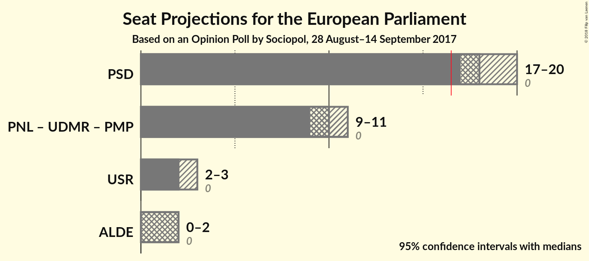

# Opinion Poll by Sociopol, 28 August–14 September 2017

<a href="#voting-intentions">Voting Intentions</a> | <a href="#seats">Seats</a> | <a href="#coalitions">Coalitions</a> | <a href="#technical-information">Technical Information</a>

## Voting Intentions

### Confidence Intervals

| Party | Last Result | Poll Result | 80% Confidence Interval | 90% Confidence Interval | 95% Confidence Interval | 99% Confidence Interval |
|:-----:|:-----------:|:-----------:|:-----------------------:|:-----------------------:|:-----------------------:|:-----------------------:|
| Partidul Social Democrat (S&D) | 0.0% | 51.0% | N/A |N/A |N/A |N/A |
| Partidul Național Liberal (EPP) | 0.0% | 27.0% | N/A |N/A |N/A |N/A |
| Uniunea Salvați România (—) | 0.0% | 7.0% | N/A |N/A |N/A |N/A |
| Partidul Alianța Liberalilor și Democraților (ALDE) | 0.0% | 6.0% | N/A |N/A |N/A |N/A |
| Uniunea Democrată Maghiară din România (EPP) | 0.0% | 4.0% | N/A |N/A |N/A |N/A |
| Partidul Mișcarea Populară (EPP) | 0.0% | 3.0% | N/A |N/A |N/A |N/A |

*Note:* The poll result column reflects the actual value used in the calculations. Published results may vary slightly, and in addition be rounded to fewer digits.

## Seats

### Confidence Intervals

| Party | Last Result | Median | 80% Confidence Interval | 90% Confidence Interval | 95% Confidence Interval | 99% Confidence Interval |
|:-----:|:-----------:|:------:|:-----------------------:|:-----------------------:|:-----------------------:|:-----------------------:|
| <a href="#partidul-social-democrat-(s&d)">Partidul Social Democrat (S&D)</a> | 0 | N/A | N/A |N/A |N/A |N/A |
| <a href="#partidul-național-liberal-(epp)">Partidul Național Liberal (EPP)</a> | 0 | N/A | N/A |N/A |N/A |N/A |
| <a href="#uniunea-salvați-românia-(—)">Uniunea Salvați România (—)</a> | 0 | N/A | N/A |N/A |N/A |N/A |
| <a href="#partidul-alianța-liberalilor-și-democraților-(alde)">Partidul Alianța Liberalilor și Democraților (ALDE)</a> | 0 | N/A | N/A |N/A |N/A |N/A |
| <a href="#uniunea-democrată-maghiară-din-românia-(epp)">Uniunea Democrată Maghiară din România (EPP)</a> | 0 | N/A | N/A |N/A |N/A |N/A |
| <a href="#partidul-mișcarea-populară-(epp)">Partidul Mișcarea Populară (EPP)</a> | 0 | N/A | N/A |N/A |N/A |N/A |

## Coalitions

## Technical Information

### Opinion Poll

+ **Polling firm:** Sociopol
+ **Commissioner(s):** —
+ **Fieldwork period:** 28 August–14 September 2017

### Calculations

+ **Sample size:** 1005
+ **Simulations done:** 0
+ **Error estimate:** 100.00%

