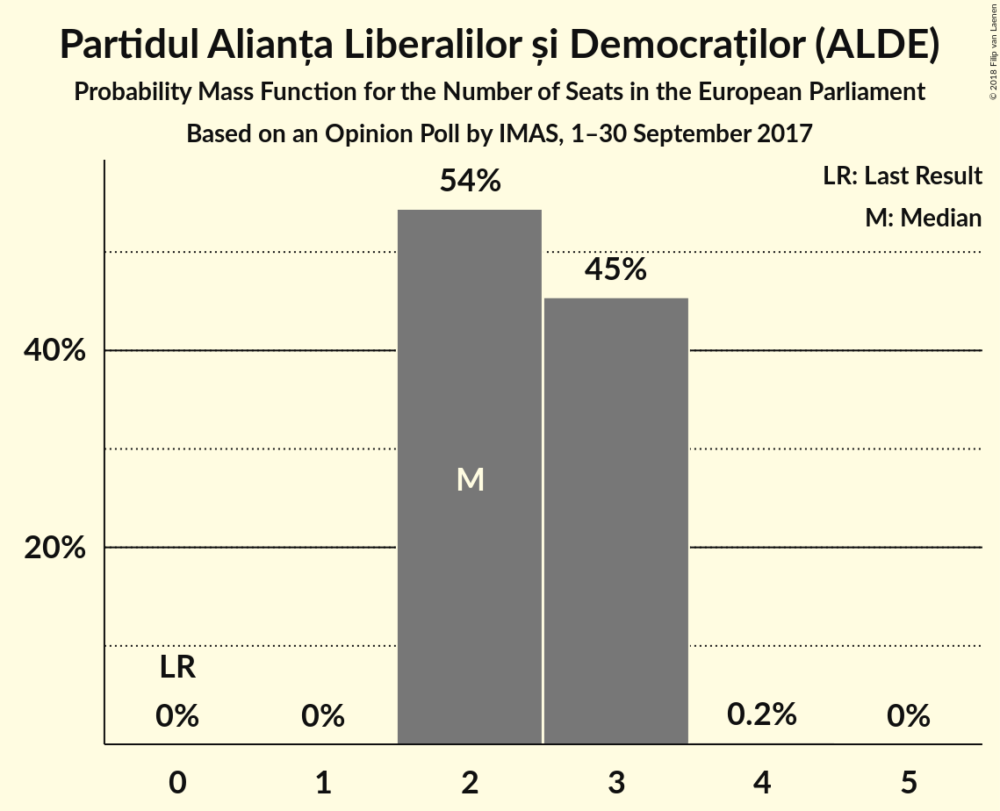
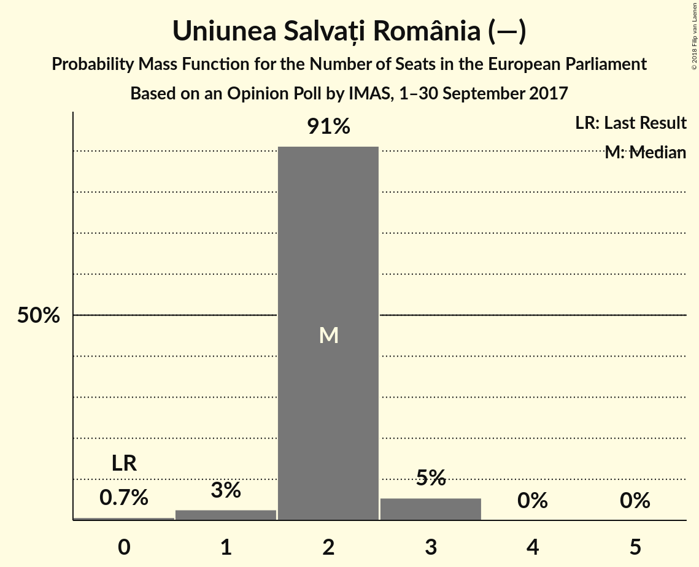
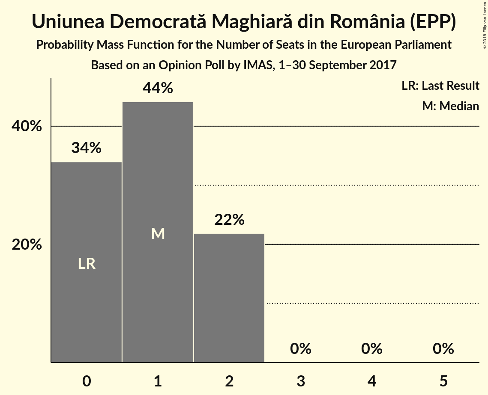
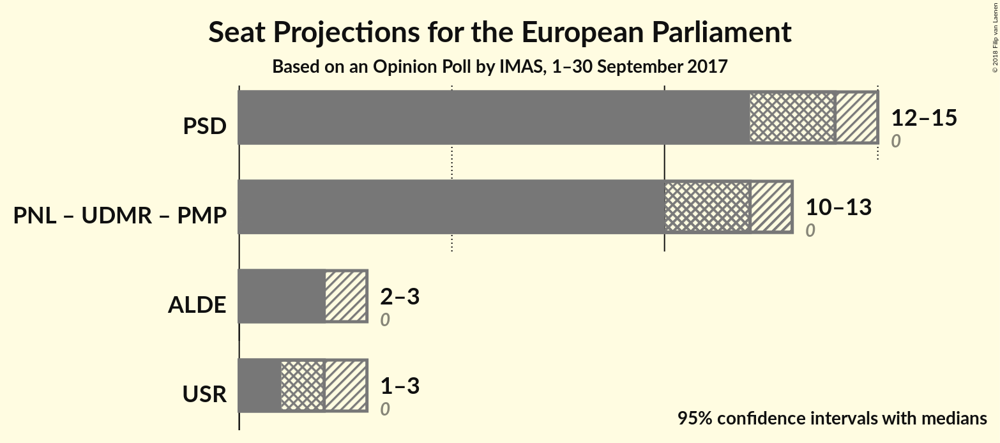

# Opinion Poll by IMAS, 1–30 September 2017

<a href="#voting-intentions">Voting Intentions</a> | <a href="#seats">Seats</a> | <a href="#coalitions">Coalitions</a> | <a href="#technical-information">Technical Information</a>

## Voting Intentions

### Confidence Intervals

| Party | Last Result | Poll Result | 80% Confidence Interval | 90% Confidence Interval | 95% Confidence Interval | 99% Confidence Interval |
|:-----:|:-----------:|:-----------:|:-----------------------:|:-----------------------:|:-----------------------:|:-----------------------:|
| Partidul Social Democrat (S&D) | 0.0% | 38.8% | 36.9–40.8% |36.3–41.4% |35.8–41.9% |34.9–42.8% |
| Partidul Național Liberal (EPP) | 0.0% | 30.9% | 29.1–32.8% |28.5–33.4% |28.1–33.8% |27.3–34.8% |
| Partidul Alianța Liberalilor și Democraților (ALDE) | 0.0% | 8.1% | 7.1–9.3% |6.8–9.7% |6.6–10.0% |6.1–10.6% |
| Uniunea Salvați România (—) | 0.0% | 6.8% | 5.9–7.9% |5.6–8.3% |5.4–8.5% |5.0–9.1% |
| Uniunea Democrată Maghiară din România (EPP) | 0.0% | 5.0% | 4.2–6.0% |4.0–6.3% |3.8–6.5% |3.5–7.1% |
| Partidul Mișcarea Populară (EPP) | 0.0% | 3.0% | 2.4–3.8% |2.2–4.1% |2.1–4.3% |1.9–4.7% |

*Note:* The poll result column reflects the actual value used in the calculations. Published results may vary slightly, and in addition be rounded to fewer digits.

## Seats

### Confidence Intervals

| Party | Last Result | Median | 80% Confidence Interval | 90% Confidence Interval | 95% Confidence Interval | 99% Confidence Interval |
|:-----:|:-----------:|:------:|:-----------------------:|:-----------------------:|:-----------------------:|:-----------------------:|
| <a href="#partidul-social-democrat-(s&d)">Partidul Social Democrat (S&D)</a> | 0 | 14 | 13–15 |13–15 |12–15 |12–16 |
| <a href="#partidul-național-liberal-(epp)">Partidul Național Liberal (EPP)</a> | 0 | 11 | 10–12 |10–12 |10–12 |9–12 |
| <a href="#partidul-alianța-liberalilor-și-democraților-(alde)">Partidul Alianța Liberalilor și Democraților (ALDE)</a> | 0 | 2 | 2–3 |2–3 |2–3 |2–3 |
| <a href="#uniunea-salvați-românia-(—)">Uniunea Salvați România (—)</a> | 0 | 2 | 2 |2–3 |1–3 |0–3 |
| <a href="#uniunea-democrată-maghiară-din-românia-(epp)">Uniunea Democrată Maghiară din România (EPP)</a> | 0 | 1 | 0–2 |0–2 |0–2 |0–2 |
| <a href="#partidul-mișcarea-populară-(epp)">Partidul Mișcarea Populară (EPP)</a> | 0 | 0 | 0 |0 |0 |0 |

### Partidul Social Democrat (S&D)

*For a full overview of the results for this party, see the [Partidul Social Democrat (S&D)](party-partidulsocialdemocratsd.html) page.*

| Number of Seats | Probability | Accumulated | Special Marks |
|:---------------:|:-----------:|:-----------:|:-------------:|
| 0 | 0% | 100% | Last Result |
| 1 | 0% | 100% |  |
| 2 | 0% | 100% |  |
| 3 | 0% | 100% |  |
| 4 | 0% | 100% |  |
| 5 | 0% | 100% |  |
| 6 | 0% | 100% |  |
| 7 | 0% | 100% |  |
| 8 | 0% | 100% |  |
| 9 | 0% | 100% |  |
| 10 | 0% | 100% |  |
| 11 | 0% | 100% |  |
| 12 | 4% | 100% |  |
| 13 | 35% | 96% |  |
| 14 | 49% | 60% | Median |
| 15 | 11% | 11% |  |
| 16 | 0.7% | 0.7% |  |
| 17 | 0% | 0% | Majority |

### Partidul Național Liberal (EPP)

*For a full overview of the results for this party, see the [Partidul Național Liberal (EPP)](party-partidulnaționalliberalepp.html) page.*

| Number of Seats | Probability | Accumulated | Special Marks |
|:---------------:|:-----------:|:-----------:|:-------------:|
| 0 | 0% | 100% | Last Result |
| 1 | 0% | 100% |  |
| 2 | 0% | 100% |  |
| 3 | 0% | 100% |  |
| 4 | 0% | 100% |  |
| 5 | 0% | 100% |  |
| 6 | 0% | 100% |  |
| 7 | 0% | 100% |  |
| 8 | 0% | 100% |  |
| 9 | 1.0% | 100% |  |
| 10 | 31% | 99.0% |  |
| 11 | 58% | 68% | Median |
| 12 | 10% | 10% |  |
| 13 | 0.4% | 0.4% |  |
| 14 | 0% | 0% |  |

### Partidul Alianța Liberalilor și Democraților (ALDE)

*For a full overview of the results for this party, see the [Partidul Alianța Liberalilor și Democraților (ALDE)](party-partidulalianțaliberalilorșidemocrațiloralde.html) page.*

| Number of Seats | Probability | Accumulated | Special Marks |
|:---------------:|:-----------:|:-----------:|:-------------:|
| 0 | 0% | 100% | Last Result |
| 1 | 0% | 100% |  |
| 2 | 54% | 100% | Median |
| 3 | 46% | 46% |  |
| 4 | 0.2% | 0.2% |  |
| 5 | 0% | 0% |  |

### Uniunea Salvați România (—)

*For a full overview of the results for this party, see the [Uniunea Salvați România (—)](party-uniuneasalvațiromânia—.html) page.*

| Number of Seats | Probability | Accumulated | Special Marks |
|:---------------:|:-----------:|:-----------:|:-------------:|
| 0 | 0.7% | 100% | Last Result |
| 1 | 3% | 99.3% |  |
| 2 | 91% | 97% | Median |
| 3 | 5% | 5% |  |
| 4 | 0% | 0% |  |

### Uniunea Democrată Maghiară din România (EPP)

*For a full overview of the results for this party, see the [Uniunea Democrată Maghiară din România (EPP)](party-uniuneademocratămaghiarădinromâniaepp.html) page.*

| Number of Seats | Probability | Accumulated | Special Marks |
|:---------------:|:-----------:|:-----------:|:-------------:|
| 0 | 34% | 100% | Last Result |
| 1 | 45% | 66% | Median |
| 2 | 21% | 21% |  |
| 3 | 0% | 0% |  |

### Partidul Mișcarea Populară (EPP)

*For a full overview of the results for this party, see the [Partidul Mișcarea Populară (EPP)](party-partidulmișcareapopularăepp.html) page.*

| Number of Seats | Probability | Accumulated | Special Marks |
|:---------------:|:-----------:|:-----------:|:-------------:|
| 0 | 99.9% | 100% | Last Result, Median |
| 1 | 0.1% | 0.1% |  |
| 2 | 0% | 0% |  |

## Coalitions

### Confidence Intervals

| Coalition | Last Result | Median | Majority? | 80% Confidence Interval | 90% Confidence Interval | 95% Confidence Interval | 99% Confidence Interval |
|:---------:|:-----------:|:------:|:---------:|:-----------------------:|:-----------------------:|:-----------------------:|:-----------------------:|
| Partidul Social Democrat (S&D) | 0 | 14 | 0% | 13–15 | 13–15 | 12–15 | 12–16 |
| Partidul Național Liberal (EPP) – Uniunea Democrată Maghiară din România (EPP) – Partidul Mișcarea Populară (EPP) | 0 | 12 | 0% | 11–13 | 10–13 | 10–13 | 10–14 |
| Partidul Alianța Liberalilor și Democraților (ALDE) | 0 | 2 | 0% | 2–3 | 2–3 | 2–3 | 2–3 |
| Uniunea Salvați România (—) | 0 | 2 | 0% | 2 | 2–3 | 1–3 | 0–3 |

### Partidul Social Democrat (S&D)

| Number of Seats | Probability | Accumulated | Special Marks |
|:---------------:|:-----------:|:-----------:|:-------------:|
| 0 | 0% | 100% | Last Result |
| 1 | 0% | 100% |  |
| 2 | 0% | 100% |  |
| 3 | 0% | 100% |  |
| 4 | 0% | 100% |  |
| 5 | 0% | 100% |  |
| 6 | 0% | 100% |  |
| 7 | 0% | 100% |  |
| 8 | 0% | 100% |  |
| 9 | 0% | 100% |  |
| 10 | 0% | 100% |  |
| 11 | 0% | 100% |  |
| 12 | 4% | 100% |  |
| 13 | 35% | 96% |  |
| 14 | 49% | 60% | Median |
| 15 | 11% | 11% |  |
| 16 | 0.7% | 0.7% |  |
| 17 | 0% | 0% | Majority |

### Partidul Național Liberal (EPP) – Uniunea Democrată Maghiară din România (EPP) – Partidul Mișcarea Populară (EPP)

| Number of Seats | Probability | Accumulated | Special Marks |
|:---------------:|:-----------:|:-----------:|:-------------:|
| 0 | 0% | 100% | Last Result |
| 1 | 0% | 100% |  |
| 2 | 0% | 100% |  |
| 3 | 0% | 100% |  |
| 4 | 0% | 100% |  |
| 5 | 0% | 100% |  |
| 6 | 0% | 100% |  |
| 7 | 0% | 100% |  |
| 8 | 0% | 100% |  |
| 9 | 0.1% | 100% |  |
| 10 | 8% | 99.9% |  |
| 11 | 33% | 92% |  |
| 12 | 44% | 59% | Median |
| 13 | 13% | 14% |  |
| 14 | 0.8% | 0.8% |  |
| 15 | 0% | 0% |  |

### Partidul Alianța Liberalilor și Democraților (ALDE)

| Number of Seats | Probability | Accumulated | Special Marks |
|:---------------:|:-----------:|:-----------:|:-------------:|
| 0 | 0% | 100% | Last Result |
| 1 | 0% | 100% |  |
| 2 | 54% | 100% | Median |
| 3 | 46% | 46% |  |
| 4 | 0.2% | 0.2% |  |
| 5 | 0% | 0% |  |

### Uniunea Salvați România (—)

| Number of Seats | Probability | Accumulated | Special Marks |
|:---------------:|:-----------:|:-----------:|:-------------:|
| 0 | 0.7% | 100% | Last Result |
| 1 | 3% | 99.3% |  |
| 2 | 91% | 97% | Median |
| 3 | 5% | 5% |  |
| 4 | 0% | 0% |  |

## Technical Information

### Opinion Poll

+ **Polling firm:** IMAS
+ **Commissioner(s):** —
+ **Fieldwork period:** 1–30 September 2017

### Calculations

+ **Sample size:** 1000
+ **Simulations done:** 1,048,576
+ **Error estimate:** 0.85%

