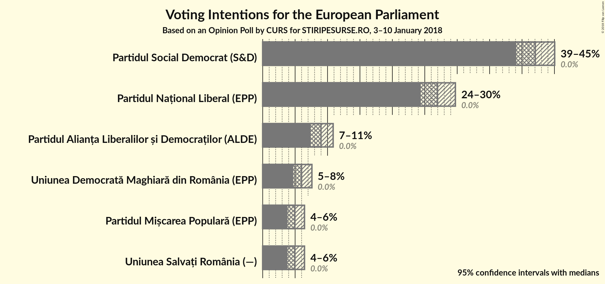

# Opinion Poll by CURS for STIRIPESURSE.RO, 3–10 January 2018

<a href="#voting-intentions">Voting Intentions</a> | <a href="#seats">Seats</a> | <a href="#coalitions">Coalitions</a> | <a href="#technical-information">Technical Information</a>

## Voting Intentions

### Confidence Intervals

| Party | Last Result | Poll Result | 80% Confidence Interval | 90% Confidence Interval | 95% Confidence Interval | 99% Confidence Interval |
|:-----:|:-----------:|:-----------:|:-----------------------:|:-----------------------:|:-----------------------:|:-----------------------:|
| Partidul Social Democrat (S&D) | 37.6% | 40.4% | 38.5–42.3% |37.9–42.9% |37.4–43.3% |36.5–44.3% |
| Partidul Național Liberal (EPP) | 12.2% | 25.9% | 24.3–27.7% |23.8–28.2% |23.4–28.7% |22.6–29.5% |
| Partidul Alianța Liberalilor și Democraților (ALDE) | 15.0% | 8.6% | 7.6–9.8% |7.3–10.2% |7.1–10.5% |6.6–11.1% |
| Uniunea Democrată Maghiară din România (EPP) | 6.3% | 5.8% | 5.0–6.8% |4.7–7.1% |4.6–7.4% |4.2–7.9% |
| Uniunea Salvați România (*) | 0.0% | 4.8% | 4.0–5.7% |3.8–6.0% |3.6–6.2% |3.3–6.7% |
| Partidul Mișcarea Populară (EPP) | 6.2% | 4.8% | 4.0–5.7% |3.8–6.0% |3.6–6.2% |3.3–6.7% |
| Mișcarea România Împreună (EPP) | 0.0% | 2.0% | 1.5–2.6% |1.4–2.8% |1.3–3.0% |1.1–3.4% |
| PRO România (ECR) | 0.0% | 2.0% | N/A |N/A |N/A |N/A |

*Note:* The poll result column reflects the actual value used in the calculations. Published results may vary slightly, and in addition be rounded to fewer digits.

## Seats

### Confidence Intervals

| Party | Last Result | Median | 80% Confidence Interval | 90% Confidence Interval | 95% Confidence Interval | 99% Confidence Interval |
|:-----:|:-----------:|:------:|:-----------------------:|:-----------------------:|:-----------------------:|:-----------------------:|
| <a href="#partidul-social-democrat-(s&d)">Partidul Social Democrat (S&D)</a> | 16 | 15 | 15–17 |15–17 |15–17 |14–17 |
| <a href="#partidul-național-liberal-(epp)">Partidul Național Liberal (EPP)</a> | 5 | 11 | 11 |9–11 |9–11 |9–11 |
| <a href="#partidul-alianța-liberalilor-și-democraților-(alde)">Partidul Alianța Liberalilor și Democraților (ALDE)</a> | 6 | 3 | 3 |3 |3 |2–4 |
| <a href="#uniunea-democrată-maghiară-din-românia-(epp)">Uniunea Democrată Maghiară din România (EPP)</a> | 2 | 2 | 2 |2 |2 |0–3 |
| <a href="#uniunea-salvați-românia-(*)">Uniunea Salvați România (*)</a> | 0 | 0 | 0 |0 |0 |0–2 |
| <a href="#partidul-mișcarea-populară-(epp)">Partidul Mișcarea Populară (EPP)</a> | 2 | 0 | 0 |0–2 |0–2 |0–2 |
| <a href="#mișcarea-românia-împreună-(epp)">Mișcarea România Împreună (EPP)</a> | 0 | 0 | 0 |0 |0 |0 |
| <a href="#pro-românia-(ecr)">PRO România (ECR)</a> | 0 | N/A | N/A |N/A |N/A |N/A |

