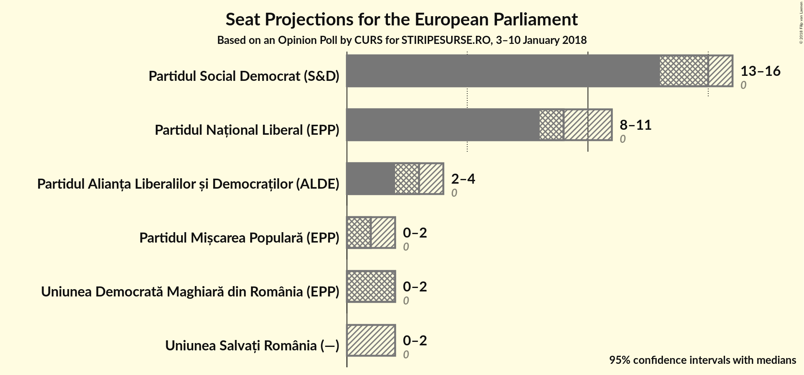
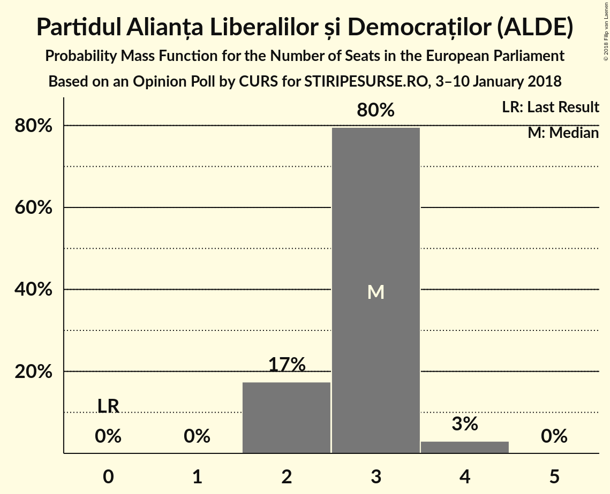
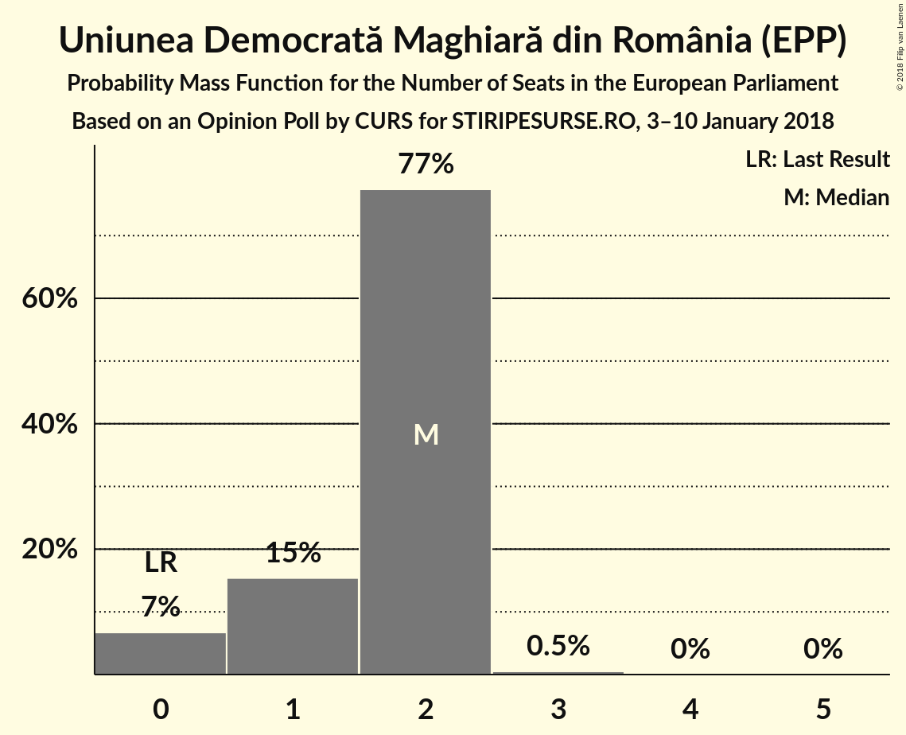
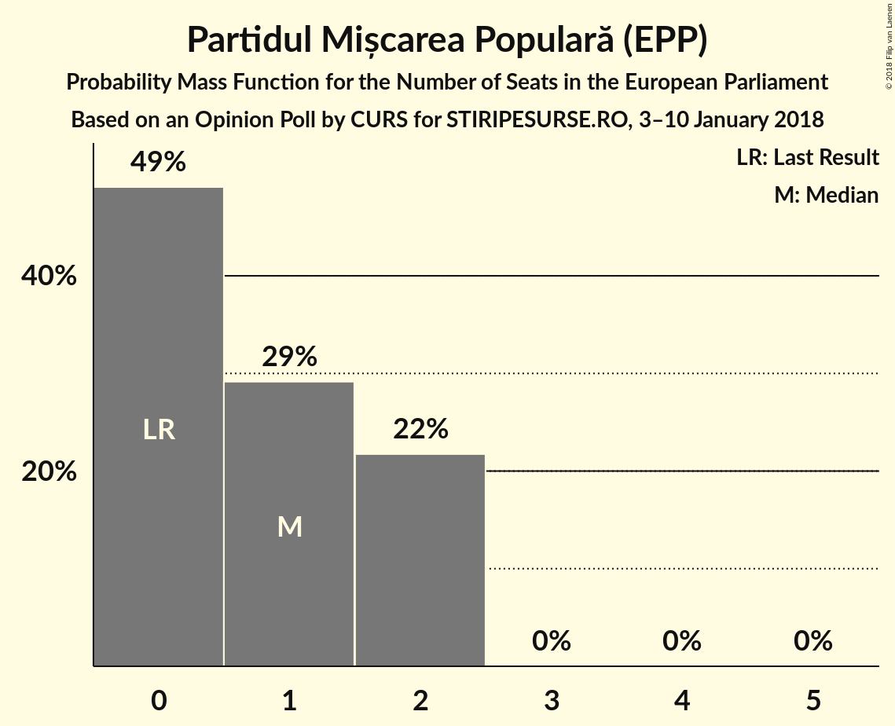
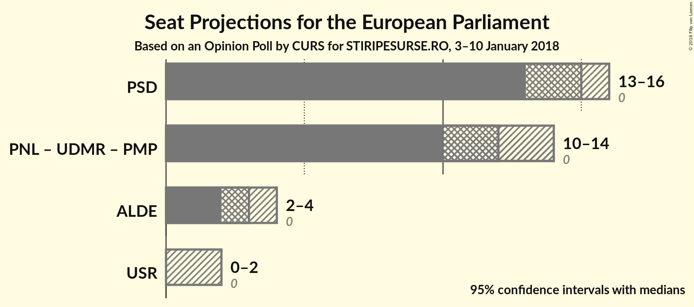

# Opinion Poll by CURS for STIRIPESURSE.RO, 3–10 January 2018

<a href="#voting-intentions">Voting Intentions</a> | <a href="#seats">Seats</a> | <a href="#coalitions">Coalitions</a> | <a href="#technical-information">Technical Information</a>

## Voting Intentions

### Confidence Intervals

| Party | Last Result | Poll Result | 80% Confidence Interval | 90% Confidence Interval | 95% Confidence Interval | 99% Confidence Interval |
|:-----:|:-----------:|:-----------:|:-----------------------:|:-----------------------:|:-----------------------:|:-----------------------:|
| Partidul Social Democrat (S&D) | 37.6% | 40.4% | 38.5–42.3% |37.9–42.9% |37.4–43.3% |36.5–44.3% |
| Partidul Național Liberal (EPP) | 12.2% | 25.9% | 24.3–27.7% |23.8–28.2% |23.4–28.7% |22.6–29.5% |
| Partidul Alianța Liberalilor și Democraților (ALDE) | 15.0% | 8.6% | 7.6–9.8% |7.3–10.2% |7.1–10.5% |6.6–11.1% |
| Uniunea Democrată Maghiară din România (EPP) | 6.3% | 5.8% | 5.0–6.8% |4.7–7.1% |4.6–7.4% |4.2–7.9% |
| Uniunea Salvați România (*) | 0.0% | 4.8% | 4.0–5.7% |3.8–6.0% |3.6–6.2% |3.3–6.7% |
| Partidul Mișcarea Populară (EPP) | 6.2% | 4.8% | 4.0–5.7% |3.8–6.0% |3.6–6.2% |3.3–6.7% |
| Mișcarea România Împreună (EPP) | 0.0% | 2.0% | 1.5–2.6% |1.4–2.8% |1.3–3.0% |1.1–3.4% |
| PRO România (ECR) | 0.0% | 2.0% | 1.5–2.6% |1.4–2.8% |1.3–3.0% |1.1–3.4% |

*Note:* The poll result column reflects the actual value used in the calculations. Published results may vary slightly, and in addition be rounded to fewer digits.

## Seats

### Confidence Intervals

| Party | Last Result | Median | 80% Confidence Interval | 90% Confidence Interval | 95% Confidence Interval | 99% Confidence Interval |
|:-----:|:-----------:|:------:|:-----------------------:|:-----------------------:|:-----------------------:|:-----------------------:|
| <a href="#partidul-social-democrat-(s&d)">Partidul Social Democrat (S&D)</a> | 16 | 15 | 14–17 |14–17 |14–18 |13–18 |
| <a href="#partidul-național-liberal-(epp)">Partidul Național Liberal (EPP)</a> | 5 | 10 | 9–11 |9–11 |9–11 |8–12 |
| <a href="#partidul-alianța-liberalilor-și-democraților-(alde)">Partidul Alianța Liberalilor și Democraților (ALDE)</a> | 6 | 3 | 2–3 |2–4 |2–4 |2–4 |
| <a href="#uniunea-democrată-maghiară-din-românia-(epp)">Uniunea Democrată Maghiară din România (EPP)</a> | 2 | 2 | 0–2 |0–2 |0–2 |0–3 |
| <a href="#uniunea-salvați-românia-(*)">Uniunea Salvați România (*)</a> | 0 | 0 | 0–2 |0–2 |0–2 |0–2 |
| <a href="#partidul-mișcarea-populară-(epp)">Partidul Mișcarea Populară (EPP)</a> | 2 | 0 | 0–2 |0–2 |0–2 |0–2 |
| <a href="#mișcarea-românia-împreună-(epp)">Mișcarea România Împreună (EPP)</a> | 0 | 0 | 0 |0 |0 |0 |
| <a href="#pro-românia-(ecr)">PRO România (ECR)</a> | 0 | 0 | 0 |0 |0 |0 |

### Partidul Social Democrat (S&D)

*For a full overview of the results for this party, see the [Partidul Social Democrat (S&D)](party-partidulsocialdemocratsd.html) page.*

| Number of Seats | Probability | Accumulated | Special Marks |
|:---------------:|:-----------:|:-----------:|:-------------:|
| 13 | 0.9% | 100% |  |
| 14 | 13% | 99.1% |  |
| 15 | 38% | 86% | Median |
| 16 | 37% | 49% | Last Result |
| 17 | 9% | 12% | Majority |
| 18 | 3% | 3% |  |
| 19 | 0.2% | 0.2% |  |
| 20 | 0% | 0% |  |

### Partidul Național Liberal (EPP)

*For a full overview of the results for this party, see the [Partidul Național Liberal (EPP)](party-partidulnaționalliberalepp.html) page.*

| Number of Seats | Probability | Accumulated | Special Marks |
|:---------------:|:-----------:|:-----------:|:-------------:|
| 5 | 0% | 100% | Last Result |
| 6 | 0% | 100% |  |
| 7 | 0% | 100% |  |
| 8 | 2% | 100% |  |
| 9 | 37% | 98% |  |
| 10 | 48% | 60% | Median |
| 11 | 11% | 12% |  |
| 12 | 1.1% | 1.1% |  |
| 13 | 0% | 0% |  |

### Partidul Alianța Liberalilor și Democraților (ALDE)

*For a full overview of the results for this party, see the [Partidul Alianța Liberalilor și Democraților (ALDE)](party-partidulalianțaliberalilorșidemocrațiloralde.html) page.*

| Number of Seats | Probability | Accumulated | Special Marks |
|:---------------:|:-----------:|:-----------:|:-------------:|
| 2 | 10% | 100% |  |
| 3 | 82% | 90% | Median |
| 4 | 8% | 8% |  |
| 5 | 0% | 0% |  |
| 6 | 0% | 0% | Last Result |

### Uniunea Democrată Maghiară din România (EPP)

*For a full overview of the results for this party, see the [Uniunea Democrată Maghiară din România (EPP)](party-uniuneademocratămaghiarădinromâniaepp.html) page.*

| Number of Seats | Probability | Accumulated | Special Marks |
|:---------------:|:-----------:|:-----------:|:-------------:|
| 0 | 11% | 100% |  |
| 1 | 4% | 89% |  |
| 2 | 83% | 84% | Last Result, Median |
| 3 | 1.4% | 1.4% |  |
| 4 | 0% | 0% |  |

### Uniunea Salvați România (*)

*For a full overview of the results for this party, see the [Uniunea Salvați România (*)](party-uniuneasalvațiromânia.html) page.*

| Number of Seats | Probability | Accumulated | Special Marks |
|:---------------:|:-----------:|:-----------:|:-------------:|
| 0 | 64% | 100% | Last Result, Median |
| 1 | 6% | 36% |  |
| 2 | 30% | 30% |  |
| 3 | 0% | 0% |  |

### Partidul Mișcarea Populară (EPP)

*For a full overview of the results for this party, see the [Partidul Mișcarea Populară (EPP)](party-partidulmișcareapopularăepp.html) page.*

| Number of Seats | Probability | Accumulated | Special Marks |
|:---------------:|:-----------:|:-----------:|:-------------:|
| 0 | 64% | 100% | Median |
| 1 | 8% | 36% |  |
| 2 | 29% | 29% | Last Result |
| 3 | 0% | 0% |  |

### Mișcarea România Împreună (EPP)

*For a full overview of the results for this party, see the [Mișcarea România Împreună (EPP)](party-mișcarearomâniaîmpreunăepp.html) page.*

| Number of Seats | Probability | Accumulated | Special Marks |
|:---------------:|:-----------:|:-----------:|:-------------:|
| 0 | 100% | 100% | Last Result, Median |

### PRO România (ECR)

*For a full overview of the results for this party, see the [PRO România (ECR)](party-proromâniaecr.html) page.*

| Number of Seats | Probability | Accumulated | Special Marks |
|:---------------:|:-----------:|:-----------:|:-------------:|
| 0 | 100% | 100% | Last Result, Median |

## Coalitions

### Confidence Intervals

| Coalition | Last Result | Median | Majority? | 80% Confidence Interval | 90% Confidence Interval | 95% Confidence Interval | 99% Confidence Interval |
|:---------:|:-----------:|:------:|:---------:|:-----------------------:|:-----------------------:|:-----------------------:|:-----------------------:|
| Partidul Social Democrat (S&D) | 16 | 15 | 12% | 14–17 | 14–17 | 14–18 | 13–18 |
| Partidul Național Liberal (EPP) – Uniunea Democrată Maghiară din România (EPP) – Partidul Mișcarea Populară (EPP) – Mișcarea România Împreună (EPP) | 9 | 12 | 0% | 11–14 | 10–14 | 10–14 | 10–14 |
| Partidul Alianța Liberalilor și Democraților (ALDE) | 6 | 3 | 0% | 2–3 | 2–4 | 2–4 | 2–4 |
| Uniunea Salvați România (*) | 0 | 0 | 0% | 0–2 | 0–2 | 0–2 | 0–2 |
| PRO România (ECR) | 0 | 0 | 0% | 0 | 0 | 0 | 0 |

### Partidul Social Democrat (S&D)

| Number of Seats | Probability | Accumulated | Special Marks |
|:---------------:|:-----------:|:-----------:|:-------------:|
| 13 | 0.9% | 100% |  |
| 14 | 13% | 99.1% |  |
| 15 | 38% | 86% | Median |
| 16 | 37% | 49% | Last Result |
| 17 | 9% | 12% | Majority |
| 18 | 3% | 3% |  |
| 19 | 0.2% | 0.2% |  |
| 20 | 0% | 0% |  |

### Partidul Național Liberal (EPP) – Uniunea Democrată Maghiară din România (EPP) – Partidul Mișcarea Populară (EPP) – Mișcarea România Împreună (EPP)

| Number of Seats | Probability | Accumulated | Special Marks |
|:---------------:|:-----------:|:-----------:|:-------------:|
| 9 | 0.2% | 100% | Last Result |
| 10 | 5% | 99.8% |  |
| 11 | 22% | 94% |  |
| 12 | 41% | 73% | Median |
| 13 | 21% | 32% |  |
| 14 | 10% | 11% |  |
| 15 | 0.5% | 0.5% |  |
| 16 | 0% | 0% |  |

### Partidul Alianța Liberalilor și Democraților (ALDE)

| Number of Seats | Probability | Accumulated | Special Marks |
|:---------------:|:-----------:|:-----------:|:-------------:|
| 2 | 10% | 100% |  |
| 3 | 82% | 90% | Median |
| 4 | 8% | 8% |  |
| 5 | 0% | 0% |  |
| 6 | 0% | 0% | Last Result |

### Uniunea Salvați România (*)

| Number of Seats | Probability | Accumulated | Special Marks |
|:---------------:|:-----------:|:-----------:|:-------------:|
| 0 | 64% | 100% | Last Result, Median |
| 1 | 6% | 36% |  |
| 2 | 30% | 30% |  |
| 3 | 0% | 0% |  |

### PRO România (ECR)

| Number of Seats | Probability | Accumulated | Special Marks |
|:---------------:|:-----------:|:-----------:|:-------------:|
| 0 | 100% | 100% | Last Result, Median |

## Technical Information

### Opinion Poll

+ **Polling firm:** CURS
+ **Commissioner(s):** STIRIPESURSE.RO
+ **Fieldwork period:** 3–10 January 2018

### Calculations

+ **Sample size:** 1068
+ **Simulations done:** 1,048,576
+ **Error estimate:** 1.16%

