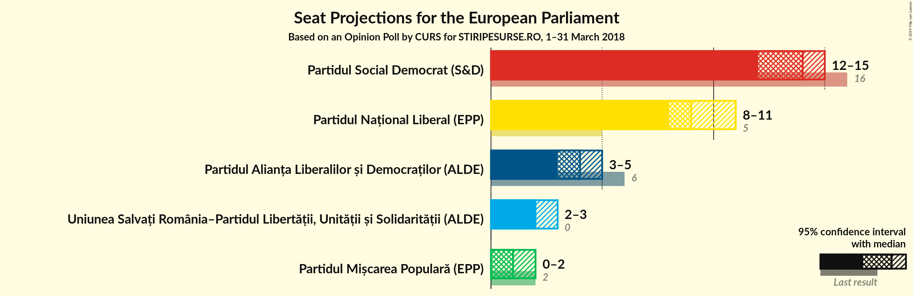
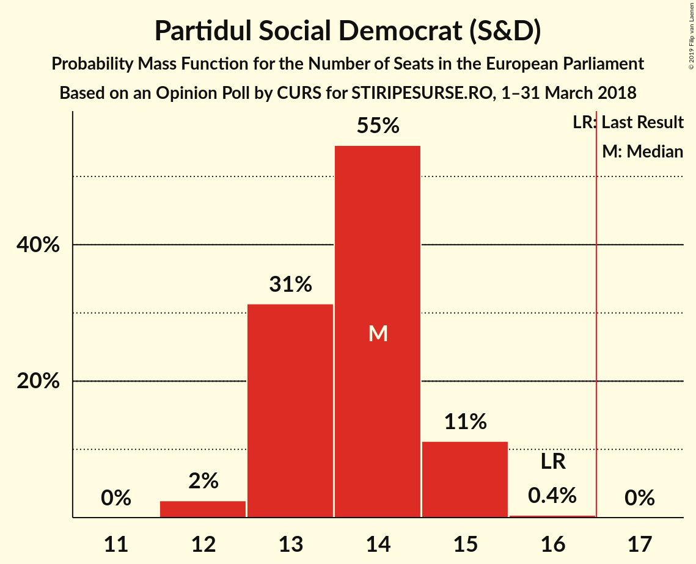
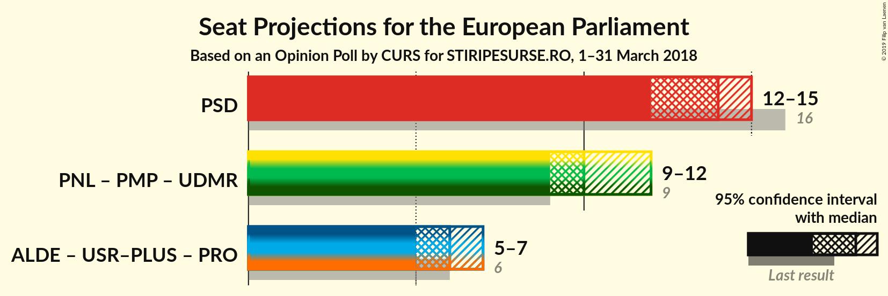
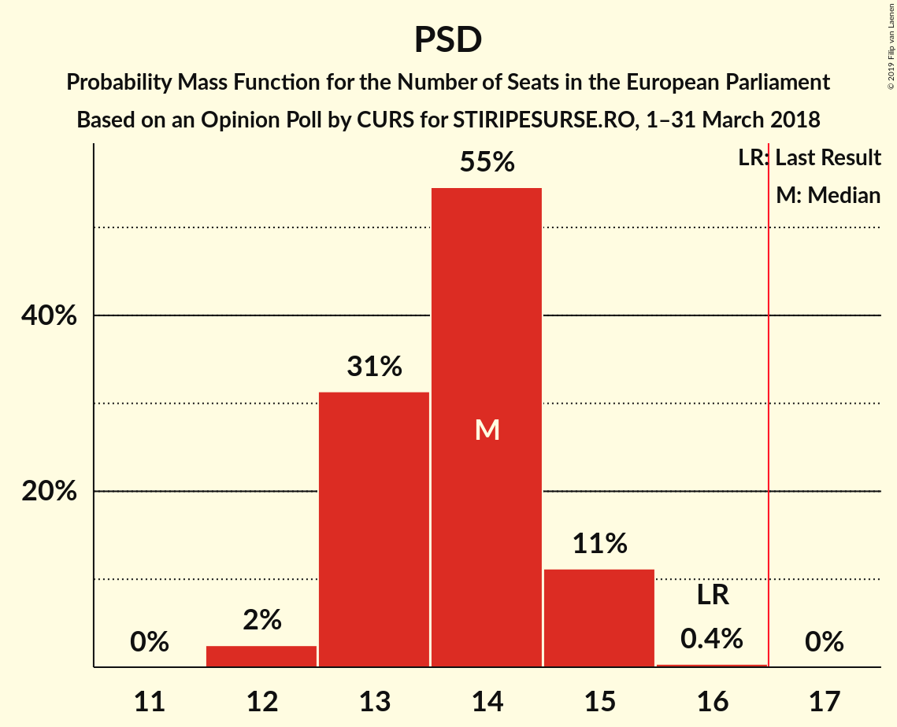

# Opinion Poll by CURS for STIRIPESURSE.RO, 1–31 March 2018

<a href="#voting-intentions">Voting Intentions</a> | <a href="#seats">Seats</a> | <a href="#coalitions">Coalitions</a> | <a href="#technical-information">Technical Information</a>

## Voting Intentions

### Confidence Intervals

| Party | Last Result | Poll Result | 80% Confidence Interval | 90% Confidence Interval | 95% Confidence Interval | 99% Confidence Interval |
|:-----:|:-----------:|:-----------:|:-----------------------:|:-----------------------:|:-----------------------:|:-----------------------:|
| Partidul Social Democrat (S&D) | 37.6% | 39.0% | 37.1–40.9% |36.6–41.5% |36.1–42.0% |35.2–42.9% |
| Partidul Național Liberal (EPP) | 12.2% | 27.0% | 25.3–28.8% |24.8–29.3% |24.4–29.7% |23.6–30.6% |
| Partidul Alianța Liberalilor și Democraților (ALDE) | 15.0% | 12.0% | 10.8–13.4% |10.5–13.7% |10.2–14.1% |9.6–14.8% |
| Uniunea Salvați România–Partidul Libertății, Unității și Solidarității (ALDE) | 0.0% | 7.0% | 6.1–8.1% |5.9–8.5% |5.6–8.7% |5.2–9.3% |
| Partidul Mișcarea Populară (EPP) | 6.2% | 5.0% | 4.2–5.9% |4.0–6.2% |3.8–6.4% |3.5–6.9% |

*Note:* The poll result column reflects the actual value used in the calculations. Published results may vary slightly, and in addition be rounded to fewer digits.

## Seats

### Confidence Intervals

| Party | Last Result | Median | 80% Confidence Interval | 90% Confidence Interval | 95% Confidence Interval | 99% Confidence Interval |
|:-----:|:-----------:|:------:|:-----------------------:|:-----------------------:|:-----------------------:|:-----------------------:|
| <a href="#partidul-social-democrat-(s&d)">Partidul Social Democrat (S&D)</a> | 16 | 15 | 15–16 |14–16 |14–16 |12–16 |
| <a href="#partidul-național-liberal-(epp)">Partidul Național Liberal (EPP)</a> | 5 | 8 | 8–9 |8–9 |8–10 |8–11 |
| <a href="#partidul-alianța-liberalilor-și-democraților-(alde)">Partidul Alianța Liberalilor și Democraților (ALDE)</a> | 6 | 4 | 3–4 |3–4 |3–4 |3–5 |
| <a href="#uniunea-salvați-românia–partidul-libertății,-unității-și-solidarității-(alde)">Uniunea Salvați România–Partidul Libertății, Unității și Solidarității (ALDE)</a> | 0 | 2 | 2 |2 |2 |2–3 |
| <a href="#partidul-mișcarea-populară-(epp)">Partidul Mișcarea Populară (EPP)</a> | 2 | 1 | 0–1 |0–1 |0–2 |0–2 |

### Partidul Social Democrat (S&D)

*For a full overview of the results for this party, see the [Partidul Social Democrat (S&D)](party-partidulsocialdemocratsd.html) page.*

| Number of Seats | Probability | Accumulated | Special Marks |
|:---------------:|:-----------:|:-----------:|:-------------:|
| 11 | 0.3% | 100% |  |
| 12 | 0.9% | 99.7% |  |
| 13 | 0.4% | 98.8% |  |
| 14 | 5% | 98% |  |
| 15 | 72% | 93% | Median |
| 16 | 21% | 21% | Last Result |
| 17 | 0% | 0% | Majority |

### Partidul Național Liberal (EPP)

*For a full overview of the results for this party, see the [Partidul Național Liberal (EPP)](party-partidulnaționalliberalepp.html) page.*

| Number of Seats | Probability | Accumulated | Special Marks |
|:---------------:|:-----------:|:-----------:|:-------------:|
| 5 | 0% | 100% | Last Result |
| 6 | 0% | 100% |  |
| 7 | 0.2% | 100% |  |
| 8 | 50% | 99.8% | Median |
| 9 | 46% | 50% |  |
| 10 | 3% | 3% |  |
| 11 | 0.7% | 0.8% |  |
| 12 | 0.1% | 0.1% |  |
| 13 | 0% | 0% |  |

### Partidul Alianța Liberalilor și Democraților (ALDE)

*For a full overview of the results for this party, see the [Partidul Alianța Liberalilor și Democraților (ALDE)](party-partidulalianțaliberalilorșidemocrațiloralde.html) page.*

| Number of Seats | Probability | Accumulated | Special Marks |
|:---------------:|:-----------:|:-----------:|:-------------:|
| 3 | 48% | 100% |  |
| 4 | 50% | 52% | Median |
| 5 | 2% | 2% |  |
| 6 | 0% | 0% | Last Result |

### Uniunea Salvați România–Partidul Libertății, Unității și Solidarității (ALDE)

*For a full overview of the results for this party, see the [Uniunea Salvați România–Partidul Libertății, Unității și Solidarității (ALDE)](party-uniuneasalvațiromânia–partidullibertățiiunitățiișisolidaritățiialde.html) page.*

| Number of Seats | Probability | Accumulated | Special Marks |
|:---------------:|:-----------:|:-----------:|:-------------:|
| 0 | 0.1% | 100% | Last Result |
| 1 | 0.2% | 99.9% |  |
| 2 | 98% | 99.7% | Median |
| 3 | 2% | 2% |  |
| 4 | 0% | 0% |  |

### Partidul Mișcarea Populară (EPP)

*For a full overview of the results for this party, see the [Partidul Mișcarea Populară (EPP)](party-partidulmișcareapopularăepp.html) page.*

| Number of Seats | Probability | Accumulated | Special Marks |
|:---------------:|:-----------:|:-----------:|:-------------:|
| 0 | 47% | 100% |  |
| 1 | 48% | 53% | Median |
| 2 | 5% | 5% | Last Result |
| 3 | 0% | 0% |  |

## Coalitions

### Confidence Intervals

| Coalition | Last Result | Median | Majority? | 80% Confidence Interval | 90% Confidence Interval | 95% Confidence Interval | 99% Confidence Interval |
|:---------:|:-----------:|:------:|:---------:|:-----------------------:|:-----------------------:|:-----------------------:|:-----------------------:|
| Partidul Social Democrat (S&D) | 16 | 15 | 0% | 15–16 | 14–16 | 14–16 | 12–16 |

### Partidul Social Democrat (S&D)

| Number of Seats | Probability | Accumulated | Special Marks |
|:---------------:|:-----------:|:-----------:|:-------------:|
| 11 | 0.3% | 100% |  |
| 12 | 0.9% | 99.7% |  |
| 13 | 0.4% | 98.8% |  |
| 14 | 5% | 98% |  |
| 15 | 72% | 93% | Median |
| 16 | 21% | 21% | Last Result |
| 17 | 0% | 0% | Majority |

## Technical Information

### Opinion Poll

+ **Polling firm:** CURS
+ **Commissioner(s):** STIRIPESURSE.RO
+ **Fieldwork period:** 1–31 March 2018

### Calculations

+ **Sample size:** 1067
+ **Simulations done:** 1,024
+ **Error estimate:** 3.00%

