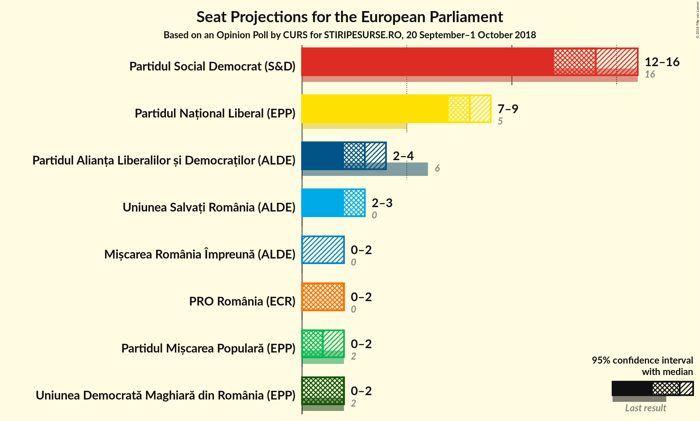
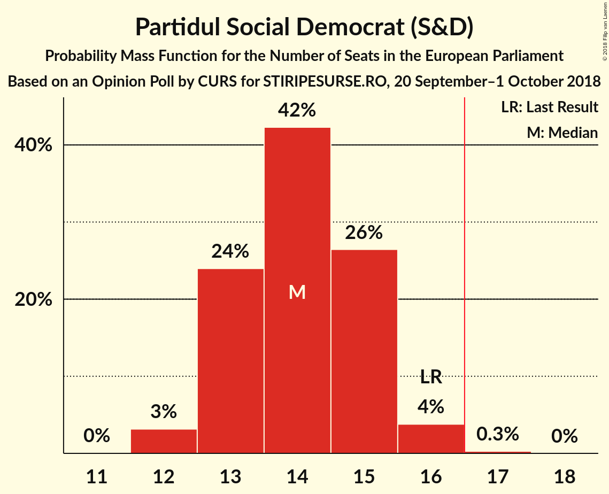
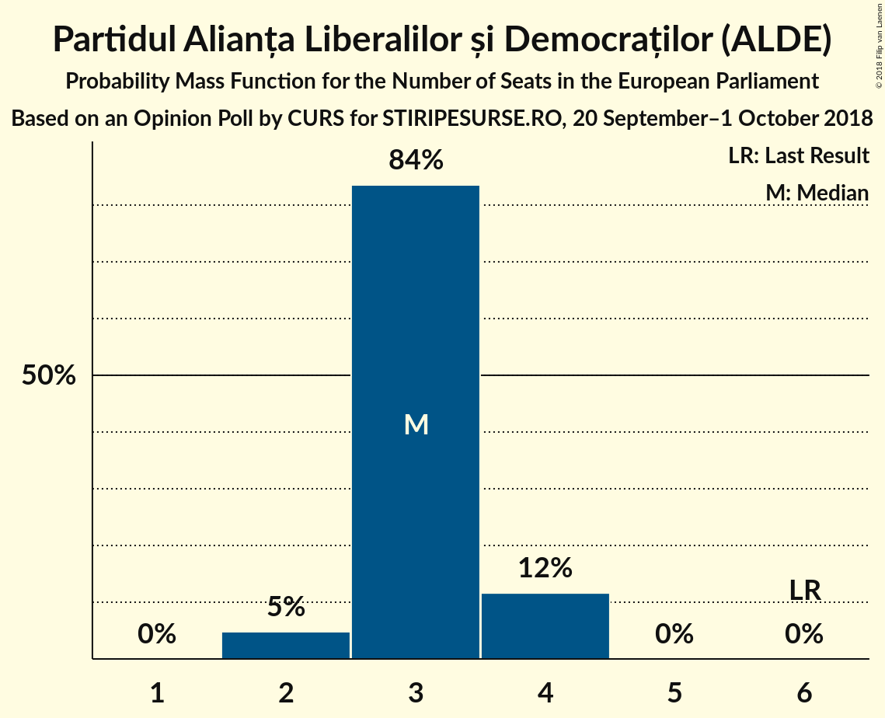
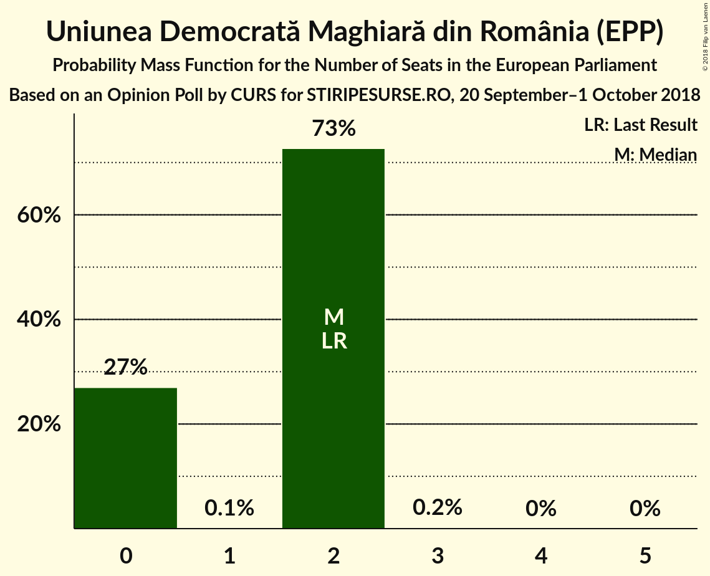
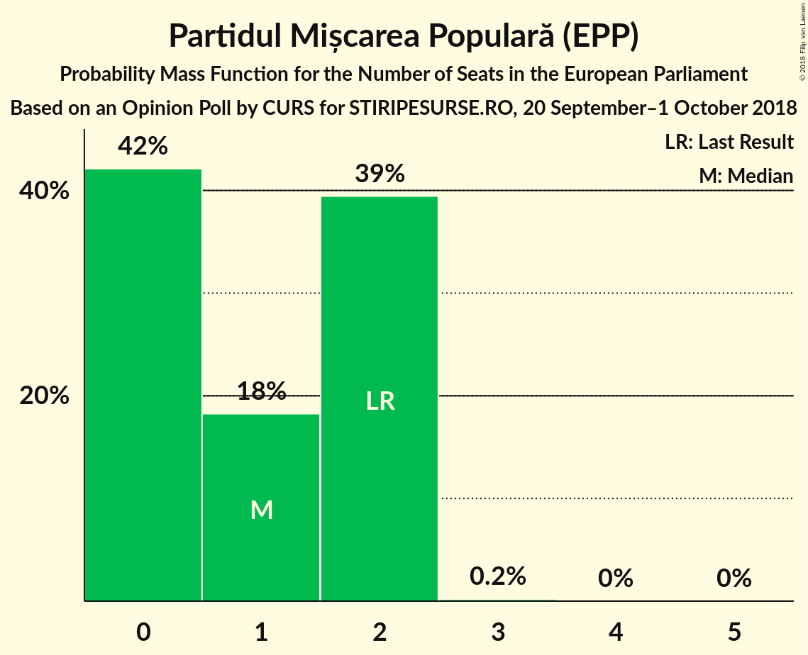
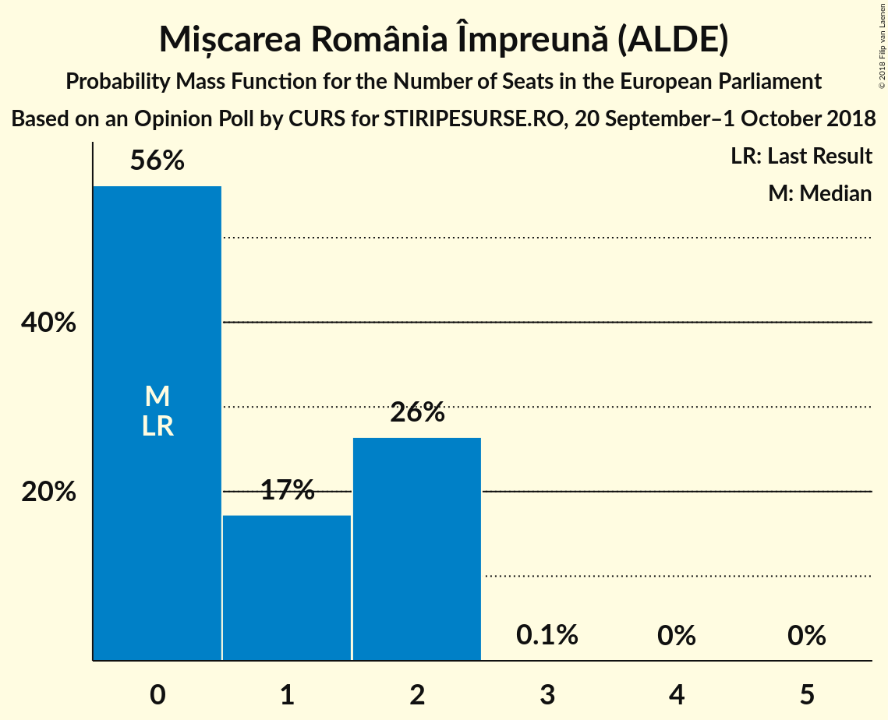

# Opinion Poll by CURS for STIRIPESURSE.RO, 20 September–1 October 2018

<a href="#voting-intentions">Voting Intentions</a> | <a href="#seats">Seats</a> | <a href="#coalitions">Coalitions</a> | <a href="#technical-information">Technical Information</a>

## Voting Intentions

### Confidence Intervals

| Party | Last Result | Poll Result | 80% Confidence Interval | 90% Confidence Interval | 95% Confidence Interval | 99% Confidence Interval |
|:-----:|:-----------:|:-----------:|:-----------------------:|:-----------------------:|:-----------------------:|:-----------------------:|
| Partidul Social Democrat (S&D) | 37.6% | 37.0% | 35.1–38.9% |34.6–39.5% |34.2–40.0% |33.3–40.9% |
| Partidul Național Liberal (EPP) | 12.2% | 22.0% | 20.5–23.7% |20.0–24.2% |19.6–24.6% |18.9–25.4% |
| Partidul Alianța Liberalilor și Democraților (ALDE) | 15.0% | 9.0% | 8.0–10.2% |7.7–10.6% |7.4–10.9% |7.0–11.5% |
| Uniunea Salvați România (ALDE) | 0.0% | 8.0% | 7.0–9.1% |6.7–9.5% |6.5–9.8% |6.1–10.3% |
| PRO România (ECR) | 0.0% | 6.0% | 5.2–7.0% |4.9–7.3% |4.7–7.6% |4.3–8.1% |
| Uniunea Democrată Maghiară din România (EPP) | 6.3% | 5.0% | 4.2–5.9% |4.0–6.2% |3.8–6.4% |3.5–6.9% |
| Partidul Mișcarea Populară (EPP) | 6.2% | 5.0% | 4.2–5.9% |4.0–6.2% |3.8–6.4% |3.5–6.9% |
| Mișcarea România Împreună (ALDE) | 0.0% | 5.0% | 4.2–5.9% |4.0–6.2% |3.8–6.4% |3.5–6.9% |

*Note:* The poll result column reflects the actual value used in the calculations. Published results may vary slightly, and in addition be rounded to fewer digits.

## Seats

### Confidence Intervals

| Party | Last Result | Median | 80% Confidence Interval | 90% Confidence Interval | 95% Confidence Interval | 99% Confidence Interval |
|:-----:|:-----------:|:------:|:-----------------------:|:-----------------------:|:-----------------------:|:-----------------------:|
| <a href="#partidul-social-democrat-(s&d)">Partidul Social Democrat (S&D)</a> | 16 | 14 | 13–15 |13–15 |12–16 |12–16 |
| <a href="#partidul-național-liberal-(epp)">Partidul Național Liberal (EPP)</a> | 5 | 8 | 7–9 |7–9 |7–10 |7–10 |
| <a href="#partidul-alianța-liberalilor-și-democraților-(alde)">Partidul Alianța Liberalilor și Democraților (ALDE)</a> | 6 | 3 | 3–4 |2–4 |2–4 |2–4 |
| <a href="#uniunea-salvați-românia-(alde)">Uniunea Salvați România (ALDE)</a> | 0 | 3 | 2–3 |2–3 |2–3 |2–4 |
| <a href="#pro-românia-(ecr)">PRO România (ECR)</a> | 0 | 2 | 1–2 |0–2 |0–2 |0–3 |
| <a href="#uniunea-democrată-maghiară-din-românia-(epp)">Uniunea Democrată Maghiară din România (EPP)</a> | 2 | 2 | 0–2 |0–2 |0–2 |0–2 |
| <a href="#partidul-mișcarea-populară-(epp)">Partidul Mișcarea Populară (EPP)</a> | 2 | 2 | 0–2 |0–2 |0–2 |0–2 |
| <a href="#mișcarea-românia-împreună-(alde)">Mișcarea România Împreună (ALDE)</a> | 0 | 1 | 0–2 |0–2 |0–2 |0–2 |

### Partidul Social Democrat (S&D)

*For a full overview of the results for this party, see the [Partidul Social Democrat (S&D)](party-partidulsocialdemocratsd.html) page.*

| Number of Seats | Probability | Accumulated | Special Marks |
|:---------------:|:-----------:|:-----------:|:-------------:|
| 11 | 0.1% | 100% |  |
| 12 | 2% | 99.9% |  |
| 13 | 34% | 97% |  |
| 14 | 35% | 63% | Median |
| 15 | 24% | 28% |  |
| 16 | 4% | 4% | Last Result |
| 17 | 0.1% | 0.1% | Majority |
| 18 | 0% | 0% |  |

### Partidul Național Liberal (EPP)

*For a full overview of the results for this party, see the [Partidul Național Liberal (EPP)](party-partidulnaționalliberalepp.html) page.*

| Number of Seats | Probability | Accumulated | Special Marks |
|:---------------:|:-----------:|:-----------:|:-------------:|
| 5 | 0% | 100% | Last Result |
| 6 | 0.5% | 100% |  |
| 7 | 33% | 99.5% |  |
| 8 | 39% | 67% | Median |
| 9 | 25% | 28% |  |
| 10 | 3% | 3% |  |
| 11 | 0% | 0% |  |

### Partidul Alianța Liberalilor și Democraților (ALDE)

*For a full overview of the results for this party, see the [Partidul Alianța Liberalilor și Democraților (ALDE)](party-partidulalianțaliberalilorșidemocrațiloralde.html) page.*

| Number of Seats | Probability | Accumulated | Special Marks |
|:---------------:|:-----------:|:-----------:|:-------------:|
| 2 | 10% | 100% |  |
| 3 | 78% | 90% | Median |
| 4 | 12% | 12% |  |
| 5 | 0% | 0% |  |
| 6 | 0% | 0% | Last Result |

### Uniunea Salvați România (ALDE)

*For a full overview of the results for this party, see the [Uniunea Salvați România (ALDE)](party-uniuneasalvațiromâniaalde.html) page.*

| Number of Seats | Probability | Accumulated | Special Marks |
|:---------------:|:-----------:|:-----------:|:-------------:|
| 0 | 0% | 100% | Last Result |
| 1 | 0% | 100% |  |
| 2 | 35% | 100% |  |
| 3 | 64% | 65% | Median |
| 4 | 1.2% | 1.2% |  |
| 5 | 0% | 0% |  |

### PRO România (ECR)

*For a full overview of the results for this party, see the [PRO România (ECR)](party-proromâniaecr.html) page.*

| Number of Seats | Probability | Accumulated | Special Marks |
|:---------------:|:-----------:|:-----------:|:-------------:|
| 0 | 9% | 100% | Last Result |
| 1 | 9% | 91% |  |
| 2 | 79% | 82% | Median |
| 3 | 2% | 2% |  |
| 4 | 0% | 0% |  |

### Uniunea Democrată Maghiară din România (EPP)

*For a full overview of the results for this party, see the [Uniunea Democrată Maghiară din România (EPP)](party-uniuneademocratămaghiarădinromâniaepp.html) page.*

| Number of Seats | Probability | Accumulated | Special Marks |
|:---------------:|:-----------:|:-----------:|:-------------:|
| 0 | 31% | 100% |  |
| 1 | 0% | 69% |  |
| 2 | 69% | 69% | Last Result, Median |
| 3 | 0.3% | 0.3% |  |
| 4 | 0% | 0% |  |

### Partidul Mișcarea Populară (EPP)

*For a full overview of the results for this party, see the [Partidul Mișcarea Populară (EPP)](party-partidulmișcareapopularăepp.html) page.*

| Number of Seats | Probability | Accumulated | Special Marks |
|:---------------:|:-----------:|:-----------:|:-------------:|
| 0 | 31% | 100% |  |
| 1 | 5% | 69% |  |
| 2 | 64% | 64% | Last Result, Median |
| 3 | 0.1% | 0.1% |  |
| 4 | 0% | 0% |  |

### Mișcarea România Împreună (ALDE)

*For a full overview of the results for this party, see the [Mișcarea România Împreună (ALDE)](party-mișcarearomâniaîmpreunăalde.html) page.*

| Number of Seats | Probability | Accumulated | Special Marks |
|:---------------:|:-----------:|:-----------:|:-------------:|
| 0 | 44% | 100% | Last Result |
| 1 | 19% | 56% | Median |
| 2 | 36% | 37% |  |
| 3 | 0.3% | 0.3% |  |
| 4 | 0% | 0% |  |

## Coalitions

### Confidence Intervals

| Coalition | Last Result | Median | Majority? | 80% Confidence Interval | 90% Confidence Interval | 95% Confidence Interval | 99% Confidence Interval |
|:---------:|:-----------:|:------:|:---------:|:-----------------------:|:-----------------------:|:-----------------------:|:-----------------------:|
| Partidul Social Democrat (S&D) | 16 | 14 | 0.1% | 13–15 | 13–15 | 12–16 | 12–16 |
| Partidul Național Liberal (EPP) – Partidul Mișcarea Populară (EPP) – Uniunea Democrată Maghiară din România (EPP) | 9 | 11 | 0% | 9–12 | 8–12 | 8–12 | 7–13 |
| Partidul Alianța Liberalilor și Democraților (ALDE) – Uniunea Salvați România (ALDE) – Mișcarea România Împreună (ALDE) | 6 | 7 | 0% | 5–8 | 5–8 | 5–8 | 5–9 |
| PRO România (ECR) | 0 | 2 | 0% | 1–2 | 0–2 | 0–2 | 0–3 |

### Partidul Social Democrat (S&D)

| Number of Seats | Probability | Accumulated | Special Marks |
|:---------------:|:-----------:|:-----------:|:-------------:|
| 11 | 0.1% | 100% |  |
| 12 | 2% | 99.9% |  |
| 13 | 34% | 97% |  |
| 14 | 35% | 63% | Median |
| 15 | 24% | 28% |  |
| 16 | 4% | 4% | Last Result |
| 17 | 0.1% | 0.1% | Majority |
| 18 | 0% | 0% |  |

### Partidul Național Liberal (EPP) – Partidul Mișcarea Populară (EPP) – Uniunea Democrată Maghiară din România (EPP)

| Number of Seats | Probability | Accumulated | Special Marks |
|:---------------:|:-----------:|:-----------:|:-------------:|
| 7 | 0.6% | 100% |  |
| 8 | 5% | 99.4% |  |
| 9 | 7% | 95% | Last Result |
| 10 | 20% | 88% |  |
| 11 | 49% | 68% |  |
| 12 | 18% | 19% | Median |
| 13 | 1.0% | 1.0% |  |
| 14 | 0% | 0% |  |

### Partidul Alianța Liberalilor și Democraților (ALDE) – Uniunea Salvați România (ALDE) – Mișcarea România Împreună (ALDE)

| Number of Seats | Probability | Accumulated | Special Marks |
|:---------------:|:-----------:|:-----------:|:-------------:|
| 4 | 0.1% | 100% |  |
| 5 | 11% | 99.9% |  |
| 6 | 38% | 89% | Last Result |
| 7 | 30% | 51% | Median |
| 8 | 19% | 21% |  |
| 9 | 2% | 2% |  |
| 10 | 0% | 0% |  |

### PRO România (ECR)

| Number of Seats | Probability | Accumulated | Special Marks |
|:---------------:|:-----------:|:-----------:|:-------------:|
| 0 | 9% | 100% | Last Result |
| 1 | 9% | 91% |  |
| 2 | 79% | 82% | Median |
| 3 | 2% | 2% |  |
| 4 | 0% | 0% |  |

## Technical Information

### Opinion Poll

+ **Polling firm:** CURS
+ **Commissioner(s):** STIRIPESURSE.RO
+ **Fieldwork period:** 20 September–1 October 2018

### Calculations

+ **Sample size:** 1067
+ **Simulations done:** 131,072
+ **Error estimate:** 1.46%

