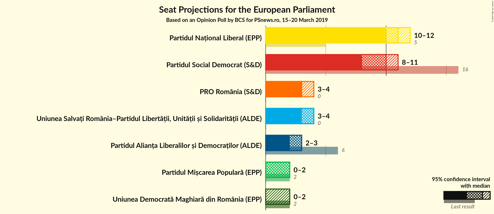
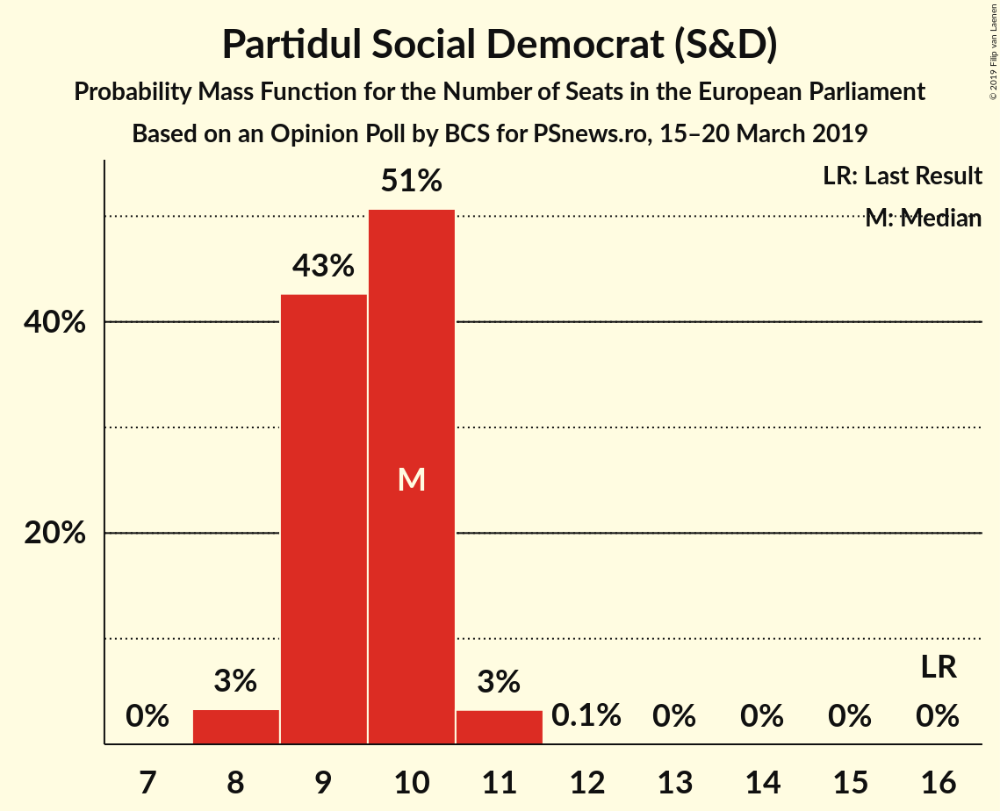
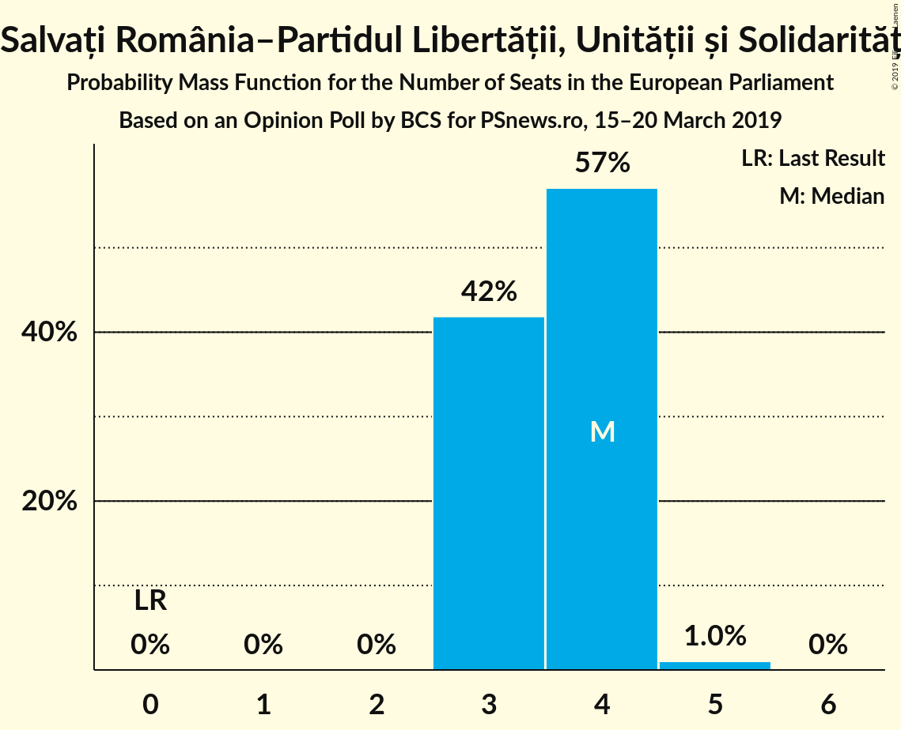
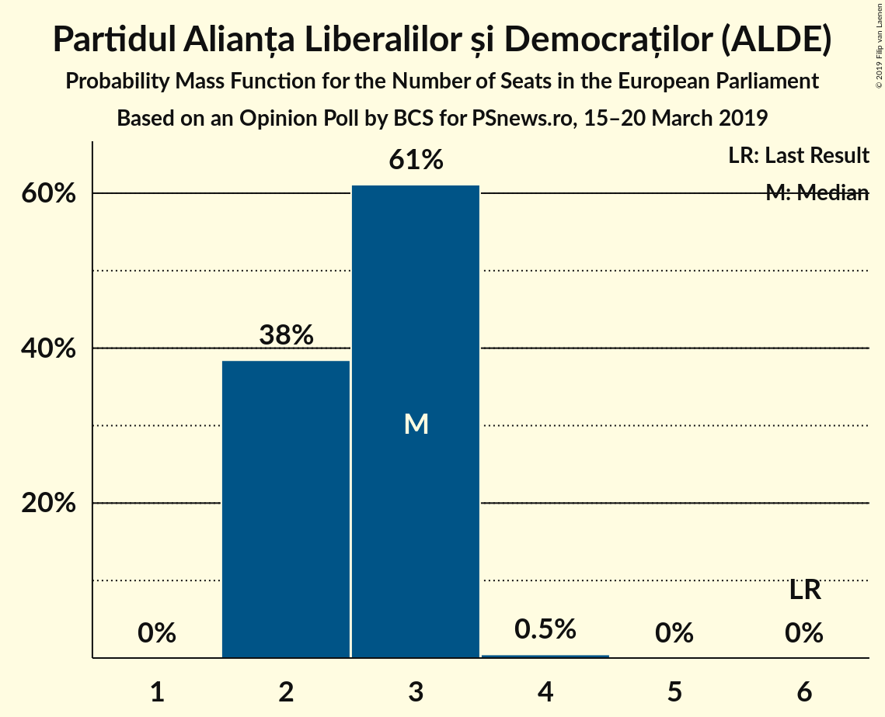
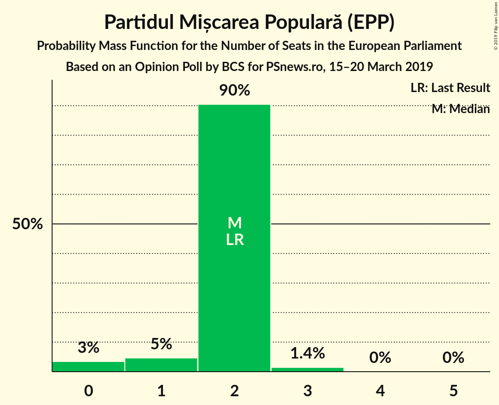
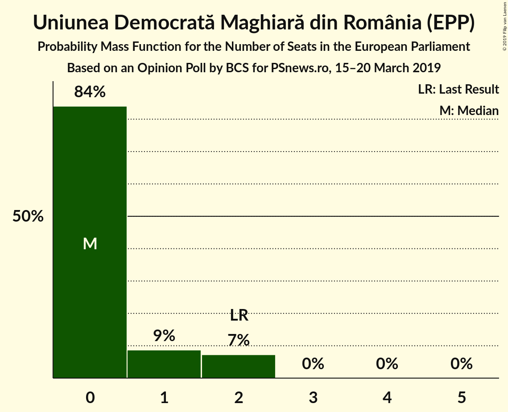
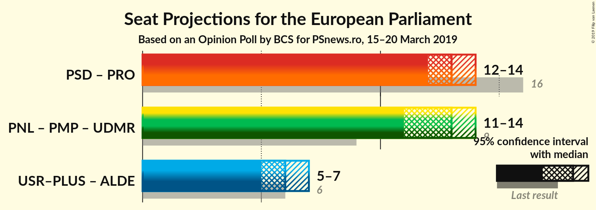
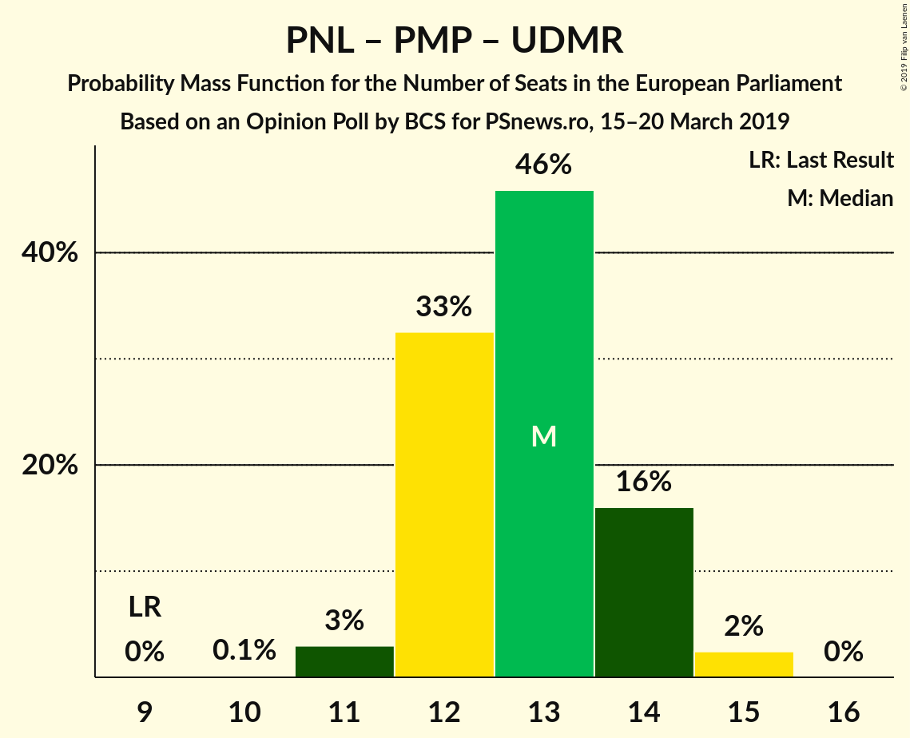
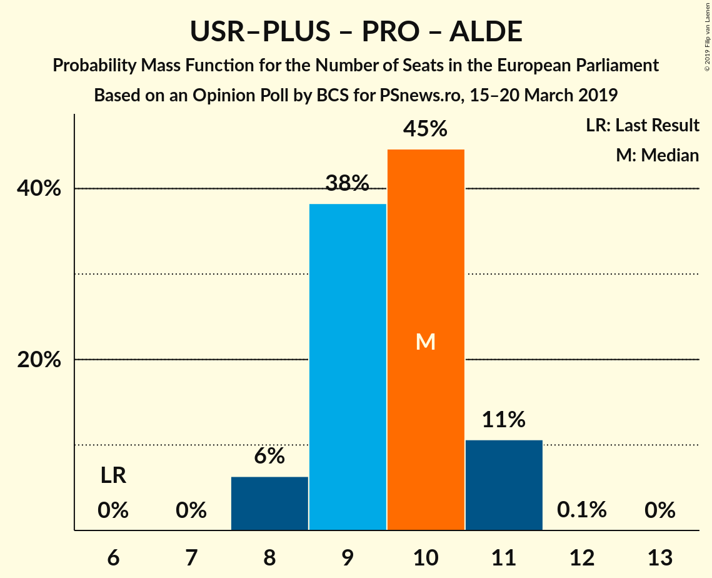
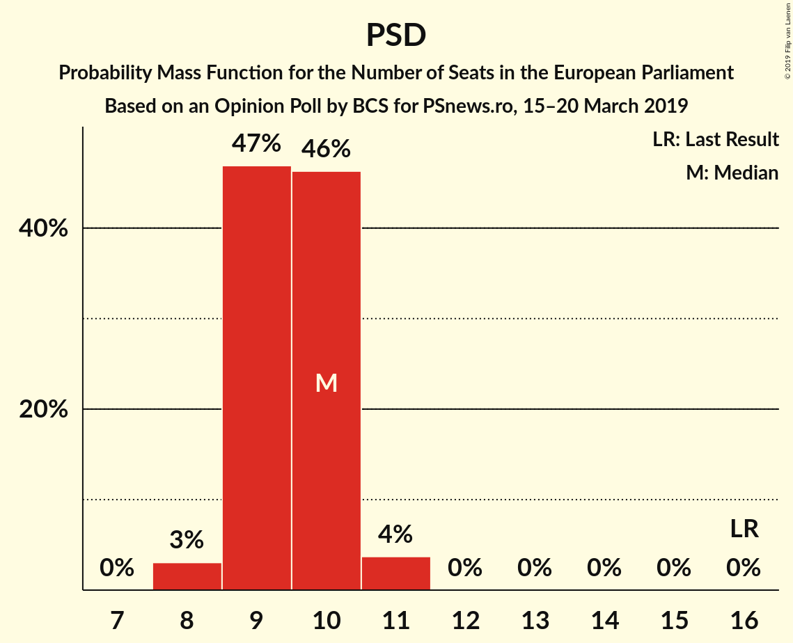

# Opinion Poll by BCS for PSnews.ro, 15–20 March 2019

<a href="#voting-intentions">Voting Intentions</a> | <a href="#seats">Seats</a> | <a href="#coalitions">Coalitions</a> | <a href="#technical-information">Technical Information</a>

## Voting Intentions

### Confidence Intervals

| Party | Last Result | Poll Result | 80% Confidence Interval | 90% Confidence Interval | 95% Confidence Interval | 99% Confidence Interval |
|:-----:|:-----------:|:-----------:|:-----------------------:|:-----------------------:|:-----------------------:|:-----------------------:|
| Partidul Național Liberal (EPP) | 12.2% | 29.8% | 28.1–31.6% |27.6–32.1% |27.2–32.5% |26.4–33.4% |
| Partidul Social Democrat (S&D) | 37.6% | 26.5% | 24.9–28.2% |24.4–28.7% |24.0–29.1% |23.2–30.0% |
| Uniunea Salvați România–Partidul Libertății, Unității și Solidarității (ALDE) | 0.0% | 10.8% | 9.7–12.1% |9.4–12.5% |9.2–12.8% |8.7–13.4% |
| PRO România (ALDE) | 0.0% | 10.2% | 9.2–11.5% |8.9–11.8% |8.6–12.1% |8.1–12.7% |
| Partidul Alianța Liberalilor și Democraților (ALDE) | 15.0% | 8.1% | 7.2–9.3% |6.9–9.6% |6.7–9.9% |6.2–10.4% |
| Partidul Mișcarea Populară (EPP) | 6.2% | 6.2% | 5.4–7.2% |5.1–7.5% |4.9–7.8% |4.6–8.3% |
| Uniunea Democrată Maghiară din România (EPP) | 6.3% | 4.4% | 3.7–5.3% |3.5–5.5% |3.3–5.7% |3.0–6.2% |

*Note:* The poll result column reflects the actual value used in the calculations. Published results may vary slightly, and in addition be rounded to fewer digits.

## Seats

### Confidence Intervals

| Party | Last Result | Median | 80% Confidence Interval | 90% Confidence Interval | 95% Confidence Interval | 99% Confidence Interval |
|:-----:|:-----------:|:------:|:-----------------------:|:-----------------------:|:-----------------------:|:-----------------------:|
| <a href="#partidul-național-liberal-(epp)">Partidul Național Liberal (EPP)</a> | 5 | 11 | 10–12 |10–12 |10–12 |9–13 |
| <a href="#partidul-social-democrat-(s&d)">Partidul Social Democrat (S&D)</a> | 16 | 10 | 9–10 |9–11 |9–11 |8–11 |
| <a href="#uniunea-salvați-românia–partidul-libertății,-unității-și-solidarității-(alde)">Uniunea Salvați România–Partidul Libertății, Unității și Solidarității (ALDE)</a> | 0 | 4 | 3–4 |3–4 |3–4 |3–5 |
| <a href="#pro-românia-(alde)">PRO România (ALDE)</a> | 0 | 3 | 3–4 |3–4 |3–4 |3–4 |
| <a href="#partidul-alianța-liberalilor-și-democraților-(alde)">Partidul Alianța Liberalilor și Democraților (ALDE)</a> | 6 | 3 | 2–3 |2–3 |2–3 |2–4 |
| <a href="#partidul-mișcarea-populară-(epp)">Partidul Mișcarea Populară (EPP)</a> | 2 | 2 | 2 |1–2 |0–3 |0–3 |
| <a href="#uniunea-democrată-maghiară-din-românia-(epp)">Uniunea Democrată Maghiară din România (EPP)</a> | 2 | 0 | 0–2 |0–2 |0–2 |0–2 |

### Partidul Național Liberal (EPP)

*For a full overview of the results for this party, see the [Partidul Național Liberal (EPP)](party-partidulnaționalliberalepp.html) page.*

| Number of Seats | Probability | Accumulated | Special Marks |
|:---------------:|:-----------:|:-----------:|:-------------:|
| 5 | 0% | 100% | Last Result |
| 6 | 0% | 100% |  |
| 7 | 0% | 100% |  |
| 8 | 0% | 100% |  |
| 9 | 0.9% | 100% |  |
| 10 | 13% | 99.1% |  |
| 11 | 60% | 86% | Median |
| 12 | 26% | 27% |  |
| 13 | 1.0% | 1.0% |  |
| 14 | 0% | 0% |  |

### Partidul Social Democrat (S&D)

*For a full overview of the results for this party, see the [Partidul Social Democrat (S&D)](party-partidulsocialdemocratsd.html) page.*

| Number of Seats | Probability | Accumulated | Special Marks |
|:---------------:|:-----------:|:-----------:|:-------------:|
| 8 | 0.6% | 100% |  |
| 9 | 39% | 99.4% |  |
| 10 | 53% | 61% | Median |
| 11 | 7% | 7% |  |
| 12 | 0.1% | 0.1% |  |
| 13 | 0% | 0% |  |
| 14 | 0% | 0% |  |
| 15 | 0% | 0% |  |
| 16 | 0% | 0% | Last Result |

### Uniunea Salvați România–Partidul Libertății, Unității și Solidarității (ALDE)

*For a full overview of the results for this party, see the [Uniunea Salvați România–Partidul Libertății, Unității și Solidarității (ALDE)](party-uniuneasalvațiromânia–partidullibertățiiunitățiișisolidaritățiialde.html) page.*

| Number of Seats | Probability | Accumulated | Special Marks |
|:---------------:|:-----------:|:-----------:|:-------------:|
| 0 | 0% | 100% | Last Result |
| 1 | 0% | 100% |  |
| 2 | 0% | 100% |  |
| 3 | 36% | 100% |  |
| 4 | 62% | 64% | Median |
| 5 | 2% | 2% |  |
| 6 | 0% | 0% |  |

### PRO România (ALDE)

*For a full overview of the results for this party, see the [PRO România (ALDE)](party-proromâniaalde.html) page.*

| Number of Seats | Probability | Accumulated | Special Marks |
|:---------------:|:-----------:|:-----------:|:-------------:|
| 0 | 0% | 100% | Last Result |
| 1 | 0% | 100% |  |
| 2 | 0.1% | 100% |  |
| 3 | 53% | 99.9% | Median |
| 4 | 47% | 47% |  |
| 5 | 0.3% | 0.3% |  |
| 6 | 0% | 0% |  |

### Partidul Alianța Liberalilor și Democraților (ALDE)

*For a full overview of the results for this party, see the [Partidul Alianța Liberalilor și Democraților (ALDE)](party-partidulalianțaliberalilorșidemocrațiloralde.html) page.*

| Number of Seats | Probability | Accumulated | Special Marks |
|:---------------:|:-----------:|:-----------:|:-------------:|
| 2 | 27% | 100% |  |
| 3 | 72% | 73% | Median |
| 4 | 0.8% | 0.8% |  |
| 5 | 0% | 0% |  |
| 6 | 0% | 0% | Last Result |

### Partidul Mișcarea Populară (EPP)

*For a full overview of the results for this party, see the [Partidul Mișcarea Populară (EPP)](party-partidulmișcareapopularăepp.html) page.*

| Number of Seats | Probability | Accumulated | Special Marks |
|:---------------:|:-----------:|:-----------:|:-------------:|
| 0 | 4% | 100% |  |
| 1 | 2% | 96% |  |
| 2 | 91% | 94% | Last Result, Median |
| 3 | 3% | 3% |  |
| 4 | 0% | 0% |  |

### Uniunea Democrată Maghiară din România (EPP)

*For a full overview of the results for this party, see the [Uniunea Democrată Maghiară din România (EPP)](party-uniuneademocratămaghiarădinromâniaepp.html) page.*

| Number of Seats | Probability | Accumulated | Special Marks |
|:---------------:|:-----------:|:-----------:|:-------------:|
| 0 | 81% | 100% | Median |
| 1 | 4% | 19% |  |
| 2 | 15% | 15% | Last Result |
| 3 | 0% | 0% |  |

## Coalitions

### Confidence Intervals

| Coalition | Last Result | Median | Majority? | 80% Confidence Interval | 90% Confidence Interval | 95% Confidence Interval | 99% Confidence Interval |
|:---------:|:-----------:|:------:|:---------:|:-----------------------:|:-----------------------:|:-----------------------:|:-----------------------:|
| Partidul Național Liberal (EPP) – Partidul Mișcarea Populară (EPP) – Uniunea Democrată Maghiară din România (EPP) | 9 | 13 | 0% | 13–14 | 12–15 | 12–15 | 11–15 |
| Uniunea Salvați România–Partidul Libertății, Unității și Solidarității (ALDE) – PRO România (ALDE) – Partidul Alianța Liberalilor și Democraților (ALDE) | 6 | 10 | 0% | 9–11 | 9–11 | 9–11 | 8–12 |
| Partidul Social Democrat (S&D) | 16 | 10 | 0% | 9–10 | 9–11 | 9–11 | 8–11 |

### Partidul Național Liberal (EPP) – Partidul Mișcarea Populară (EPP) – Uniunea Democrată Maghiară din România (EPP)

| Number of Seats | Probability | Accumulated | Special Marks |
|:---------------:|:-----------:|:-----------:|:-------------:|
| 9 | 0% | 100% | Last Result |
| 10 | 0% | 100% |  |
| 11 | 0.8% | 100% |  |
| 12 | 8% | 99.1% |  |
| 13 | 51% | 91% | Median |
| 14 | 32% | 41% |  |
| 15 | 8% | 9% |  |
| 16 | 0.3% | 0.3% |  |
| 17 | 0% | 0% | Majority |

### Uniunea Salvați România–Partidul Libertății, Unității și Solidarității (ALDE) – PRO România (ALDE) – Partidul Alianța Liberalilor și Democraților (ALDE)

| Number of Seats | Probability | Accumulated | Special Marks |
|:---------------:|:-----------:|:-----------:|:-------------:|
| 6 | 0% | 100% | Last Result |
| 7 | 0% | 100% |  |
| 8 | 2% | 100% |  |
| 9 | 26% | 98% |  |
| 10 | 56% | 72% | Median |
| 11 | 15% | 16% |  |
| 12 | 0.8% | 0.8% |  |
| 13 | 0% | 0% |  |

### Partidul Social Democrat (S&D)

| Number of Seats | Probability | Accumulated | Special Marks |
|:---------------:|:-----------:|:-----------:|:-------------:|
| 8 | 0.6% | 100% |  |
| 9 | 39% | 99.4% |  |
| 10 | 53% | 61% | Median |
| 11 | 7% | 7% |  |
| 12 | 0.1% | 0.1% |  |
| 13 | 0% | 0% |  |
| 14 | 0% | 0% |  |
| 15 | 0% | 0% |  |
| 16 | 0% | 0% | Last Result |

## Technical Information

### Opinion Poll

+ **Polling firm:** BCS
+ **Commissioner(s):** PSnews.ro
+ **Fieldwork period:** 15–20 March 2019

### Calculations

+ **Sample size:** 1144
+ **Simulations done:** 131,072
+ **Error estimate:** 1.36%

