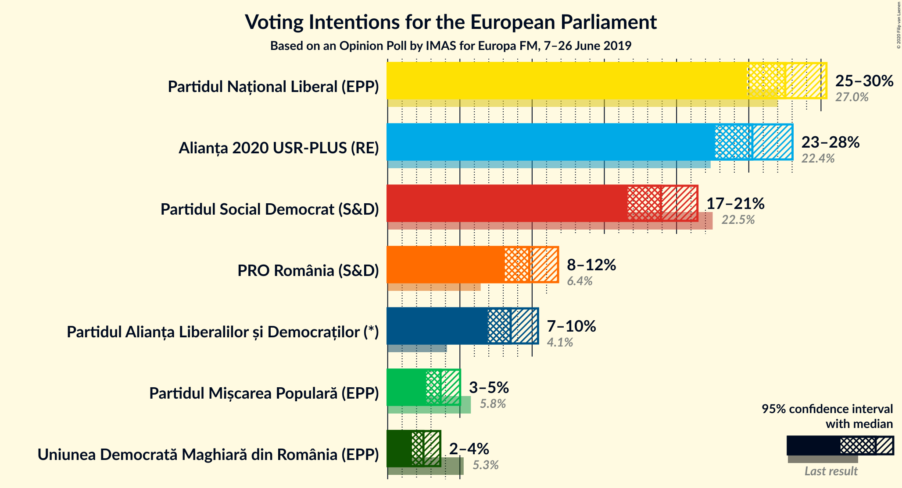

# Opinion Poll by IMAS for Europa FM, 7–26 June 2019

<a href="#voting-intentions">Voting Intentions</a> | <a href="#seats">Seats</a> | <a href="#coalitions">Coalitions</a> | <a href="#technical-information">Technical Information</a>

## Voting Intentions

### Confidence Intervals

| Party | Last Result | Poll Result | 80% Confidence Interval | 90% Confidence Interval | 95% Confidence Interval | 99% Confidence Interval |
|:-----:|:-----------:|:-----------:|:-----------------------:|:-----------------------:|:-----------------------:|:-----------------------:|
| Partidul Național Liberal (EPP) | 12.2% | 27.5% | 25.8–29.4% |25.3–29.9% |24.9–30.4% |24.0–31.3% |
| Partidul Social Democrat (S&D) | 37.6% | 18.9% | 17.4–20.6% |17.0–21.0% |16.6–21.4% |15.9–22.3% |
| Uniunea Salvați România (RE) | N/A | 17.6% | 16.2–19.3% |15.7–19.7% |15.4–20.1% |14.7–20.9% |
| PRO România (S&D) | 0.0% | 9.8% | 8.7–11.1% |8.4–11.5% |8.1–11.8% |7.6–12.5% |
| Partidul Alianța Liberalilor și Democraților (*) | 15.0% | 8.5% | 7.5–9.8% |7.2–10.1% |6.9–10.4% |6.5–11.0% |
| Partidul Libertății, Unității și Solidarității (RE) | N/A | 7.6% | 6.6–8.8% |6.4–9.1% |6.1–9.4% |5.7–10.0% |
| Partidul Mișcarea Populară (EPP) | 6.2% | 3.7% | 3.0–4.5% |2.8–4.8% |2.7–5.0% |2.4–5.5% |
| Uniunea Democrată Maghiară din România (EPP) | 6.3% | 2.5% | 2.0–3.2% |1.8–3.4% |1.7–3.6% |1.5–4.0% |

*Note:* The poll result column reflects the actual value used in the calculations. Published results may vary slightly, and in addition be rounded to fewer digits.

## Seats

### Confidence Intervals

| Party | Last Result | Median | 80% Confidence Interval | 90% Confidence Interval | 95% Confidence Interval | 99% Confidence Interval |
|:-----:|:-----------:|:------:|:-----------------------:|:-----------------------:|:-----------------------:|:-----------------------:|
| <a href="#partidul-național-liberal-(epp)">Partidul Național Liberal (EPP)</a> | 5 | 10 | 9–11 |9–11 |9–11 |9–12 |
| <a href="#partidul-social-democrat-(s&d)">Partidul Social Democrat (S&D)</a> | 16 | 7 | 6–7 |6–8 |6–8 |6–8 |
| <a href="#uniunea-salvați-românia-(re)">Uniunea Salvați România (RE)</a> | N/A | 6 | 6–7 |6–7 |5–7 |5–8 |
| <a href="#pro-românia-(s&d)">PRO România (S&D)</a> | 0 | 3 | 3–4 |3–4 |3–4 |2–4 |
| <a href="#partidul-alianța-liberalilor-și-democraților-(*)">Partidul Alianța Liberalilor și Democraților (*)</a> | 6 | 3 | 2–3 |2–3 |2–4 |2–4 |
| <a href="#partidul-libertății,-unității-și-solidarității-(re)">Partidul Libertății, Unității și Solidarității (RE)</a> | N/A | 2 | 2–3 |2–3 |2–3 |2–3 |
| <a href="#partidul-mișcarea-populară-(epp)">Partidul Mișcarea Populară (EPP)</a> | 2 | 0 | 0 |0 |0 |0–2 |
| <a href="#uniunea-democrată-maghiară-din-românia-(epp)">Uniunea Democrată Maghiară din România (EPP)</a> | 2 | 0 | 0 |0 |0 |0 |

