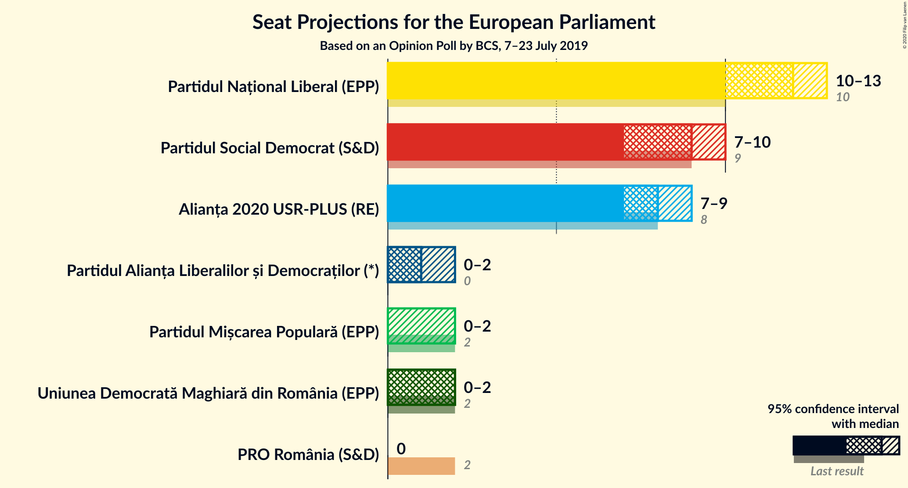
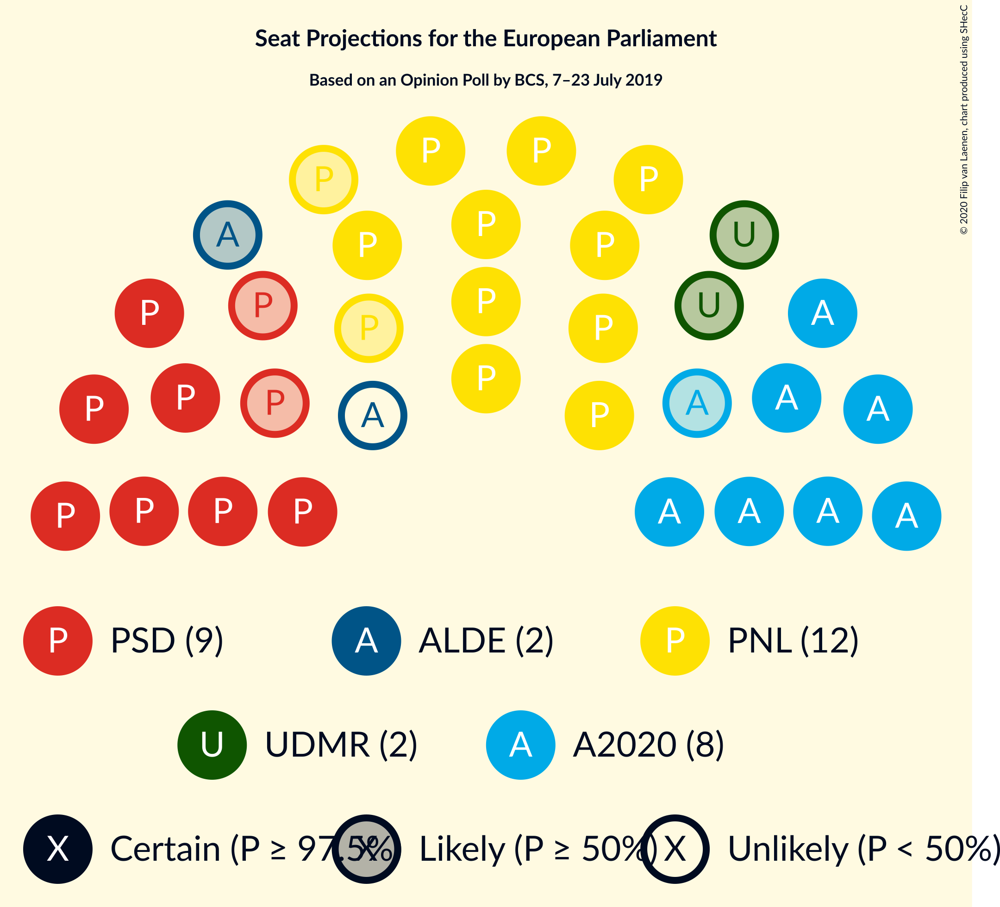
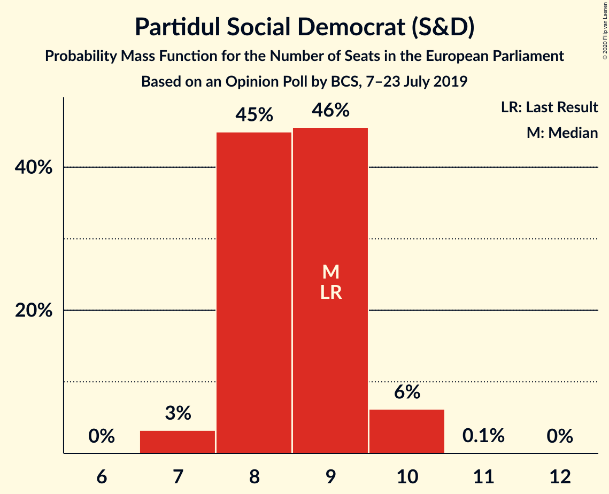
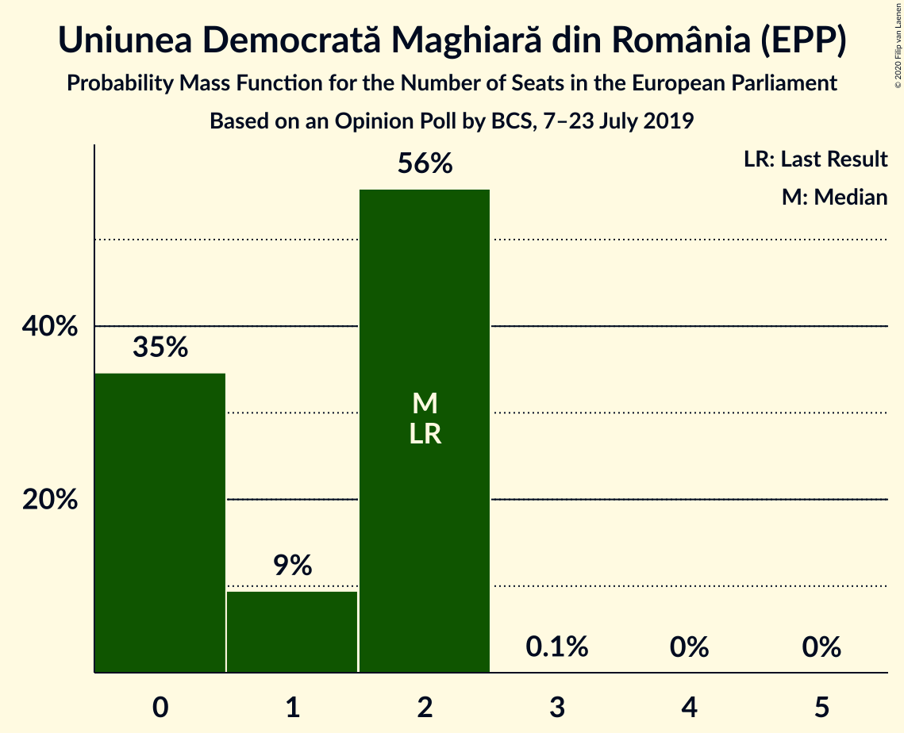
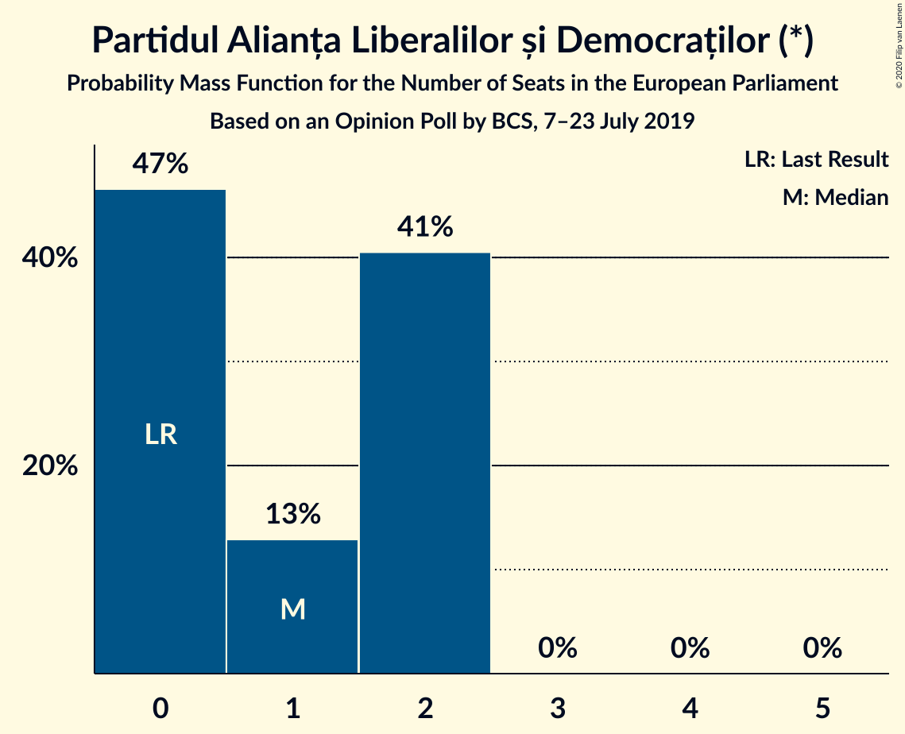
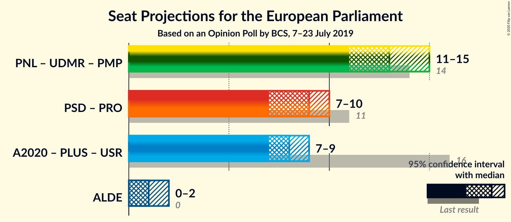
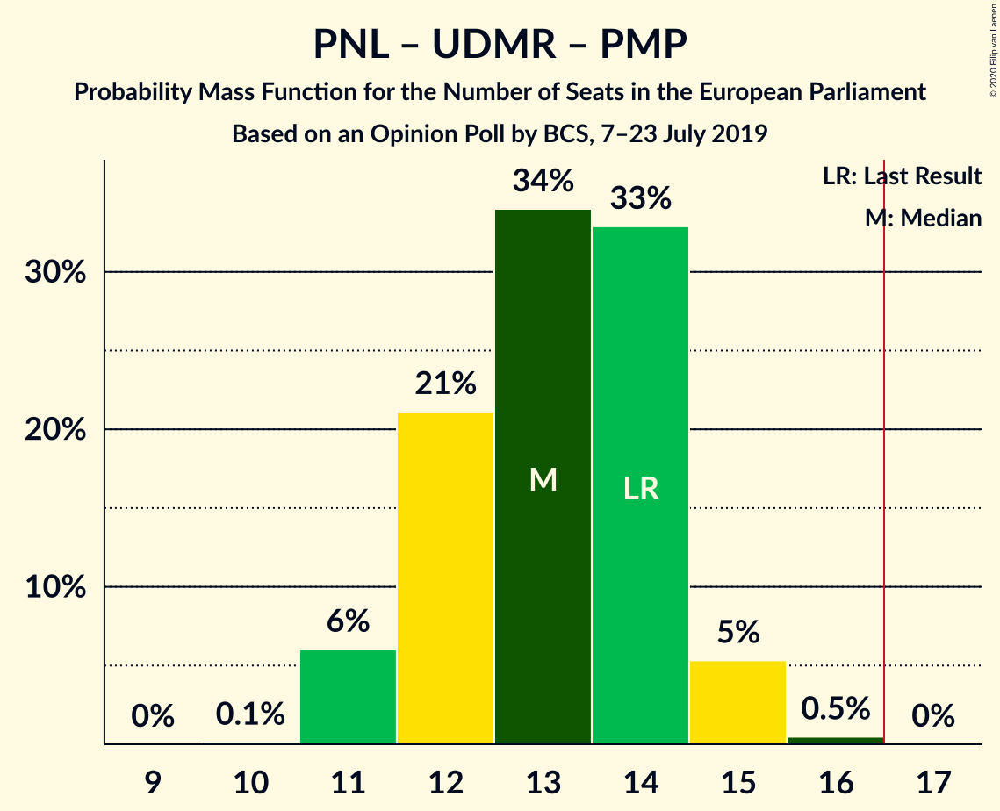
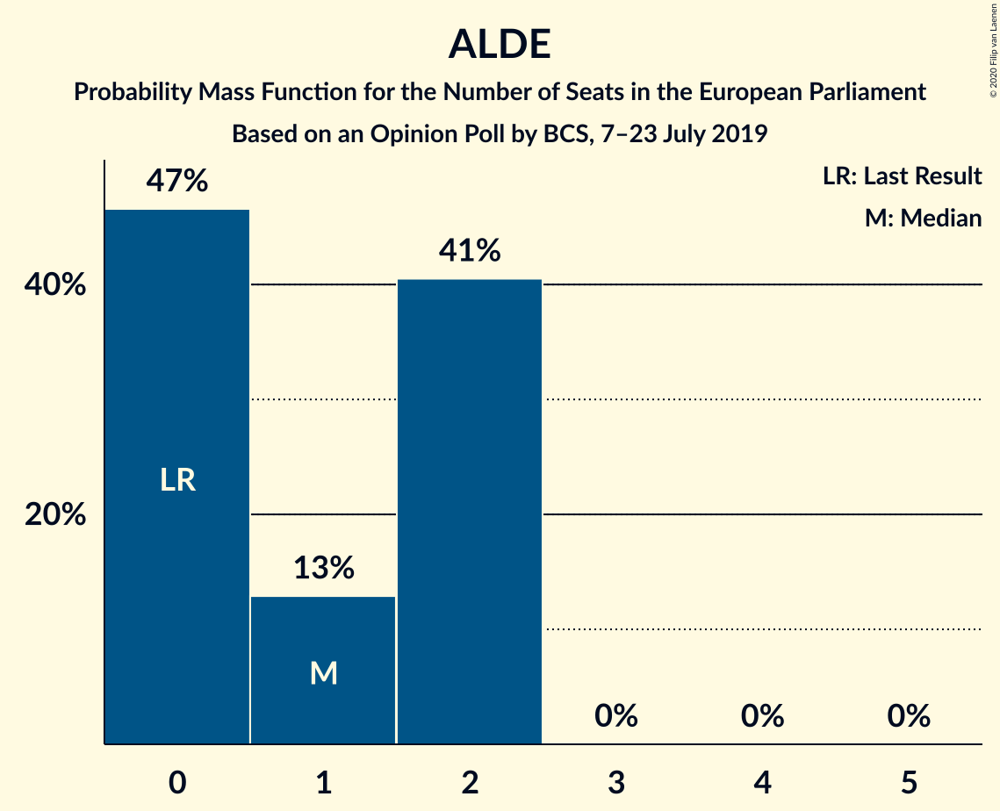

# Opinion Poll by BCS, 7–23 July 2019

<a href="#voting-intentions">Voting Intentions</a> | <a href="#seats">Seats</a> | <a href="#coalitions">Coalitions</a> | <a href="#technical-information">Technical Information</a>

## Voting Intentions

### Confidence Intervals

| Party | Last Result | Poll Result | 80% Confidence Interval | 90% Confidence Interval | 95% Confidence Interval | 99% Confidence Interval |
|:-----:|:-----------:|:-----------:|:-----------------------:|:-----------------------:|:-----------------------:|:-----------------------:|
| Partidul Național Liberal (EPP) | 27.0% | 31.5% | 29.7–33.3% |29.2–33.8% |28.8–34.2% |28.0–35.1% |
| Partidul Social Democrat (S&D) | 22.5% | 23.4% | 21.8–25.1% |21.4–25.6% |21.0–26.0% |20.3–26.8% |
| Alianța 2020 USR-PLUS (RE) | 22.4% | 21.4% | 19.9–23.0% |19.4–23.5% |19.1–23.9% |18.4–24.7% |
| Uniunea Democrată Maghiară din România (EPP) | 5.3% | 5.2% | 4.5–6.2% |4.3–6.5% |4.1–6.7% |3.7–7.2% |
| Partidul Alianța Liberalilor și Democraților (*) | 4.1% | 5.1% | 4.3–6.0% |4.1–6.3% |3.9–6.5% |3.6–7.0% |
| Partidul Mișcarea Populară (EPP) | 5.8% | 4.4% | 3.7–5.3% |3.5–5.6% |3.4–5.8% |3.1–6.3% |
| PRO România (S&D) | 6.4% | 1.0% | 0.7–1.5% |0.6–1.6% |0.5–1.7% |0.4–2.0% |

*Note:* The poll result column reflects the actual value used in the calculations. Published results may vary slightly, and in addition be rounded to fewer digits.

## Seats

### Confidence Intervals

| Party | Last Result | Median | 80% Confidence Interval | 90% Confidence Interval | 95% Confidence Interval | 99% Confidence Interval |
|:-----:|:-----------:|:------:|:-----------------------:|:-----------------------:|:-----------------------:|:-----------------------:|
| <a href="#partidul-național-liberal-(epp)">Partidul Național Liberal (EPP)</a> | 10 | 12 | 11–12 |11–13 |10–13 |10–14 |
| <a href="#partidul-social-democrat-(s&d)">Partidul Social Democrat (S&D)</a> | 9 | 9 | 8–9 |8–10 |8–10 |7–10 |
| <a href="#alianța-2020-usr-plus-(re)">Alianța 2020 USR-PLUS (RE)</a> | 8 | 8 | 7–8 |7–9 |7–9 |6–9 |
| <a href="#uniunea-democrată-maghiară-din-românia-(epp)">Uniunea Democrată Maghiară din România (EPP)</a> | 2 | 2 | 0–2 |0–2 |0–2 |0–2 |
| <a href="#partidul-alianța-liberalilor-și-democraților-(*)">Partidul Alianța Liberalilor și Democraților (*)</a> | 0 | 1 | 0–2 |0–2 |0–2 |0–2 |
| <a href="#partidul-mișcarea-populară-(epp)">Partidul Mișcarea Populară (EPP)</a> | 2 | 0 | 0 |0–2 |0–2 |0–2 |
| <a href="#pro-românia-(s&d)">PRO România (S&D)</a> | 2 | 0 | 0 |0 |0 |0 |

### Partidul Național Liberal (EPP)

*For a full overview of the results for this party, see the [Partidul Național Liberal (EPP)](party-partidulnaționalliberalepp.html) page.*

| Number of Seats | Probability | Accumulated | Special Marks |
|:---------------:|:-----------:|:-----------:|:-------------:|
| 10 | 3% | 100% | Last Result |
| 11 | 32% | 97% |  |
| 12 | 55% | 64% | Median |
| 13 | 9% | 9% |  |
| 14 | 0.6% | 0.6% |  |
| 15 | 0% | 0% |  |

### Partidul Social Democrat (S&D)

*For a full overview of the results for this party, see the [Partidul Social Democrat (S&D)](party-partidulsocialdemocratsd.html) page.*

| Number of Seats | Probability | Accumulated | Special Marks |
|:---------------:|:-----------:|:-----------:|:-------------:|
| 7 | 2% | 100% |  |
| 8 | 38% | 98% |  |
| 9 | 51% | 60% | Last Result, Median |
| 10 | 9% | 9% |  |
| 11 | 0.1% | 0.1% |  |
| 12 | 0% | 0% |  |

### Alianța 2020 USR-PLUS (RE)

*For a full overview of the results for this party, see the [Alianța 2020 USR-PLUS (RE)](party-alianța2020usr-plusre.html) page.*

| Number of Seats | Probability | Accumulated | Special Marks |
|:---------------:|:-----------:|:-----------:|:-------------:|
| 6 | 0.7% | 100% |  |
| 7 | 34% | 99.3% |  |
| 8 | 55% | 65% | Last Result, Median |
| 9 | 10% | 10% |  |
| 10 | 0.1% | 0.1% |  |
| 11 | 0% | 0% |  |

### Uniunea Democrată Maghiară din România (EPP)

*For a full overview of the results for this party, see the [Uniunea Democrată Maghiară din România (EPP)](party-uniuneademocratămaghiarădinromâniaepp.html) page.*

| Number of Seats | Probability | Accumulated | Special Marks |
|:---------------:|:-----------:|:-----------:|:-------------:|
| 0 | 41% | 100% |  |
| 1 | 8% | 59% |  |
| 2 | 51% | 51% | Last Result, Median |
| 3 | 0.1% | 0.1% |  |
| 4 | 0% | 0% |  |

### Partidul Alianța Liberalilor și Democraților (*)

*For a full overview of the results for this party, see the [Partidul Alianța Liberalilor și Democraților (*)](party-partidulalianțaliberalilorșidemocraților.html) page.*

| Number of Seats | Probability | Accumulated | Special Marks |
|:---------------:|:-----------:|:-----------:|:-------------:|
| 0 | 43% | 100% | Last Result |
| 1 | 17% | 57% | Median |
| 2 | 39% | 39% |  |
| 3 | 0% | 0% |  |

### Partidul Mișcarea Populară (EPP)

*For a full overview of the results for this party, see the [Partidul Mișcarea Populară (EPP)](party-partidulmișcareapopularăepp.html) page.*

| Number of Seats | Probability | Accumulated | Special Marks |
|:---------------:|:-----------:|:-----------:|:-------------:|
| 0 | 91% | 100% | Median |
| 1 | 4% | 9% |  |
| 2 | 5% | 5% | Last Result |
| 3 | 0% | 0% |  |

### PRO România (S&D)

*For a full overview of the results for this party, see the [PRO România (S&D)](party-proromâniasd.html) page.*

| Number of Seats | Probability | Accumulated | Special Marks |
|:---------------:|:-----------:|:-----------:|:-------------:|
| 0 | 100% | 100% | Median |
| 1 | 0% | 0% |  |
| 2 | 0% | 0% | Last Result |

## Coalitions

### Confidence Intervals

| Coalition | Last Result | Median | Majority? | 80% Confidence Interval | 90% Confidence Interval | 95% Confidence Interval | 99% Confidence Interval |
|:---------:|:-----------:|:------:|:---------:|:-----------------------:|:-----------------------:|:-----------------------:|:-----------------------:|
| Partidul Național Liberal (EPP) – Uniunea Democrată Maghiară din România (EPP) – Partidul Mișcarea Populară (EPP) | 14 | 13 | 0% | 12–14 | 11–14 | 11–15 | 11–15 |
| Partidul Social Democrat (S&D) – PRO România (S&D) | 11 | 9 | 0% | 8–9 | 8–10 | 8–10 | 7–10 |
| Partidul Alianța Liberalilor și Democraților (*) | 0 | 1 | 0% | 0–2 | 0–2 | 0–2 | 0–2 |

### Partidul Național Liberal (EPP) – Uniunea Democrată Maghiară din România (EPP) – Partidul Mișcarea Populară (EPP)

| Number of Seats | Probability | Accumulated | Special Marks |
|:---------------:|:-----------:|:-----------:|:-------------:|
| 10 | 0.1% | 100% |  |
| 11 | 7% | 99.9% |  |
| 12 | 30% | 93% |  |
| 13 | 27% | 63% |  |
| 14 | 31% | 35% | Last Result, Median |
| 15 | 4% | 4% |  |
| 16 | 0.3% | 0.4% |  |
| 17 | 0% | 0% | Majority |

### Partidul Social Democrat (S&D) – PRO România (S&D)

| Number of Seats | Probability | Accumulated | Special Marks |
|:---------------:|:-----------:|:-----------:|:-------------:|
| 7 | 2% | 100% |  |
| 8 | 38% | 98% |  |
| 9 | 51% | 60% | Median |
| 10 | 9% | 9% |  |
| 11 | 0.1% | 0.1% | Last Result |
| 12 | 0% | 0% |  |

### Partidul Alianța Liberalilor și Democraților (*)

| Number of Seats | Probability | Accumulated | Special Marks |
|:---------------:|:-----------:|:-----------:|:-------------:|
| 0 | 43% | 100% | Last Result |
| 1 | 17% | 57% | Median |
| 2 | 39% | 39% |  |
| 3 | 0% | 0% |  |

## Technical Information

### Opinion Poll

+ **Polling firm:** BCS
+ **Commissioner(s):** —
+ **Fieldwork period:** 7–23 July 2019

### Calculations

+ **Sample size:** 1128
+ **Simulations done:** 131,072
+ **Error estimate:** 1.42%

