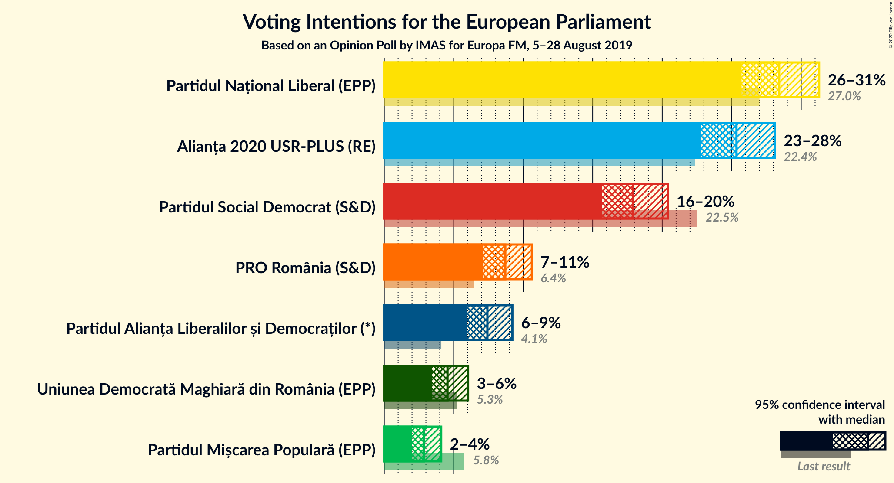
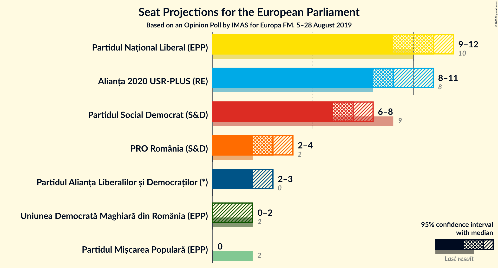
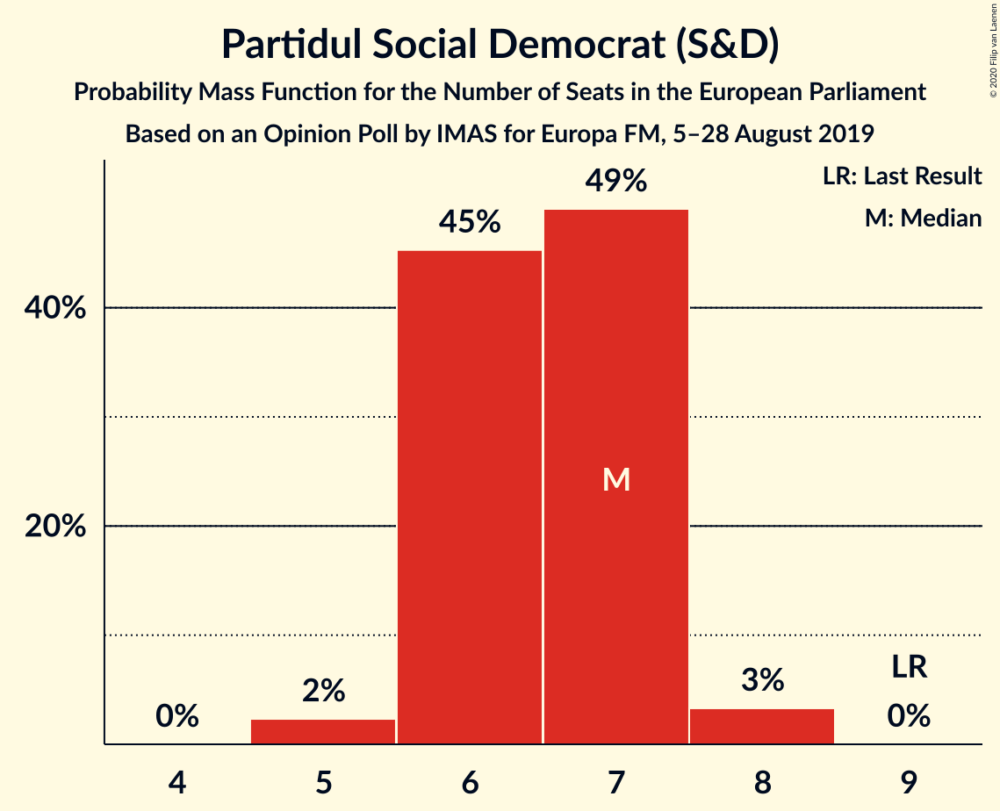
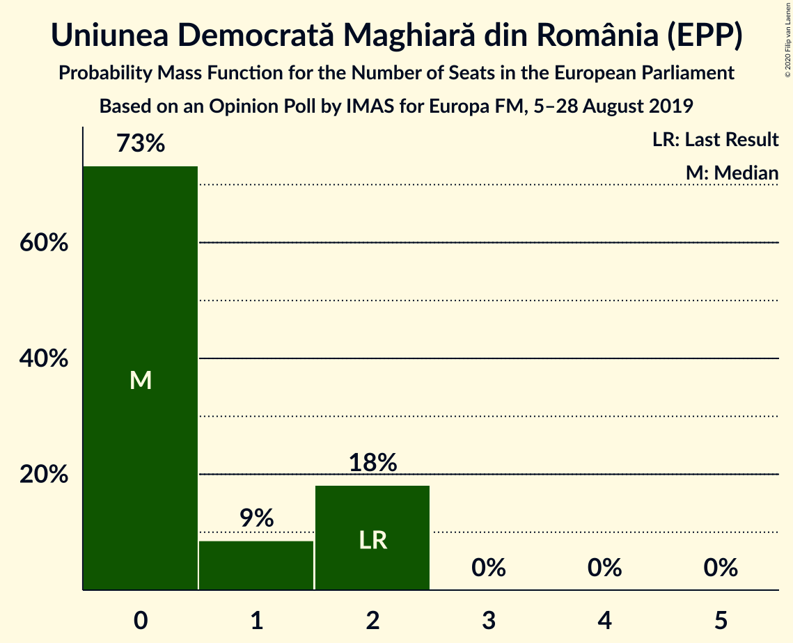
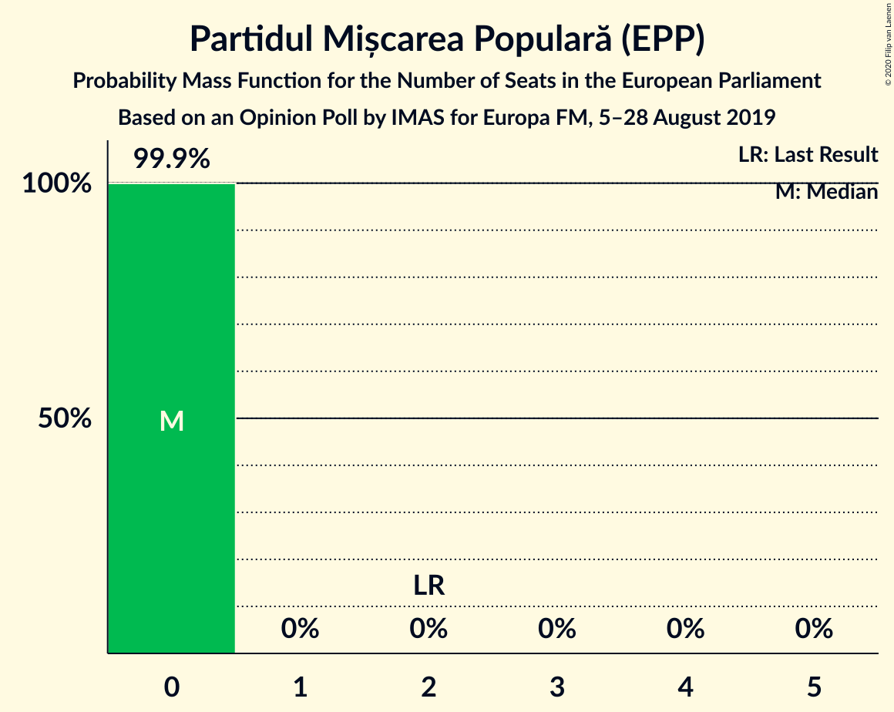
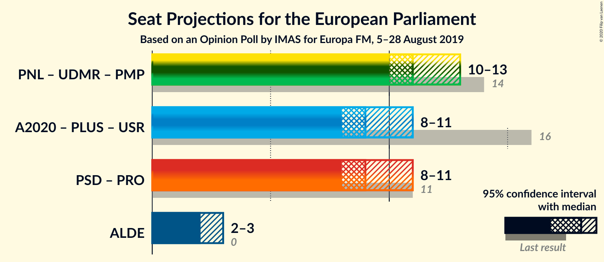
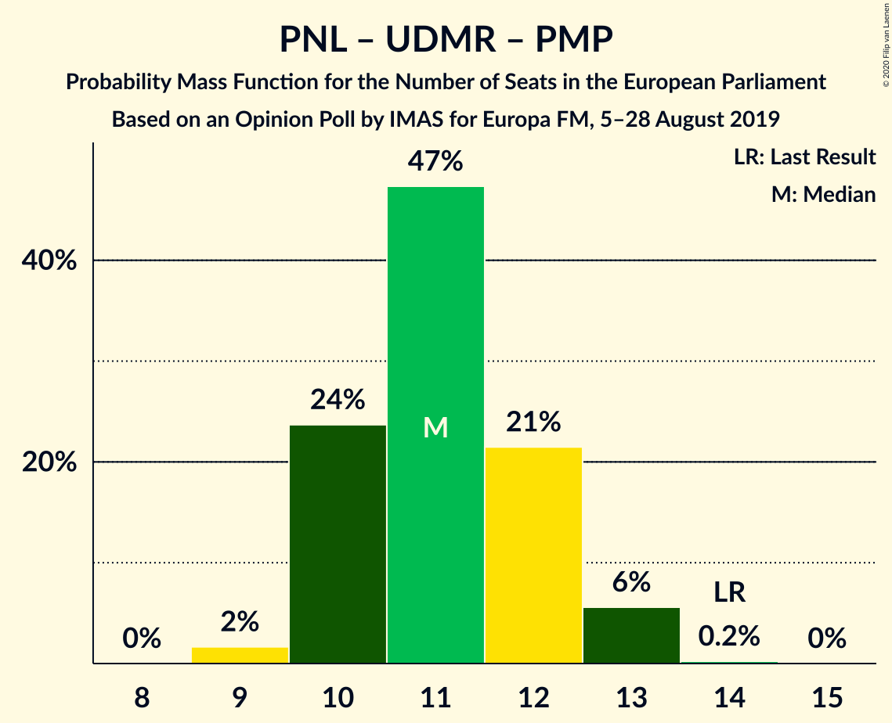
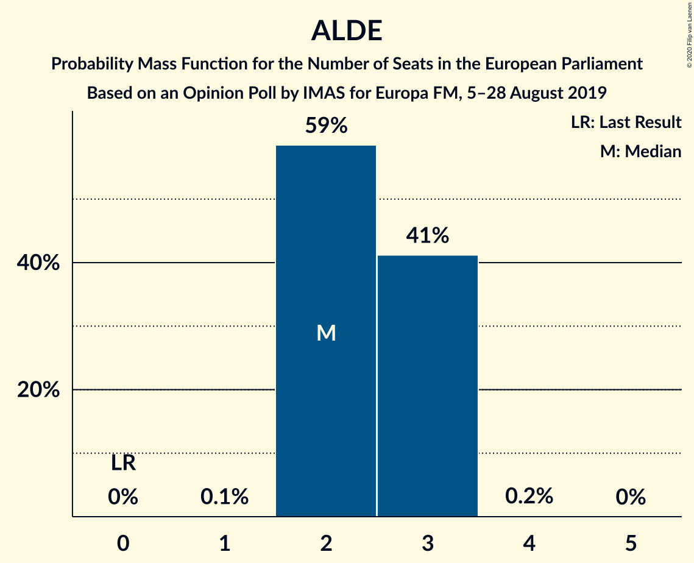

# Opinion Poll by IMAS for Europa FM, 5–28 August 2019

<a href="#voting-intentions">Voting Intentions</a> | <a href="#seats">Seats</a> | <a href="#coalitions">Coalitions</a> | <a href="#technical-information">Technical Information</a>

## Voting Intentions

### Confidence Intervals

| Party | Last Result | Poll Result | 80% Confidence Interval | 90% Confidence Interval | 95% Confidence Interval | 99% Confidence Interval |
|:-----:|:-----------:|:-----------:|:-----------------------:|:-----------------------:|:-----------------------:|:-----------------------:|
| Partidul Național Liberal (EPP) | 27.0% | 28.4% | 26.6–30.3% |26.1–30.8% |25.7–31.3% |24.9–32.2% |
| Alianța 2020 USR-PLUS (RE) | 22.4% | 25.3% | 23.6–27.2% |23.2–27.7% |22.8–28.1% |22.0–29.0% |
| Partidul Social Democrat (S&D) | 22.5% | 17.9% | 16.4–19.6% |16.0–20.0% |15.7–20.4% |15.0–21.2% |
| PRO România (S&D) | 6.4% | 8.7% | 7.7–10.0% |7.4–10.3% |7.1–10.6% |6.6–11.2% |
| Partidul Alianța Liberalilor și Democraților (*) | 4.1% | 7.4% | 6.5–8.6% |6.2–8.9% |6.0–9.2% |5.5–9.8% |
| Uniunea Democrată Maghiară din România (EPP) | 5.3% | 4.6% | 3.8–5.5% |3.6–5.8% |3.4–6.0% |3.1–6.5% |
| Partidul Mișcarea Populară (EPP) | 5.8% | 2.9% | 2.3–3.7% |2.1–3.9% |2.0–4.1% |1.8–4.5% |

*Note:* The poll result column reflects the actual value used in the calculations. Published results may vary slightly, and in addition be rounded to fewer digits.

## Seats

### Confidence Intervals

| Party | Last Result | Median | 80% Confidence Interval | 90% Confidence Interval | 95% Confidence Interval | 99% Confidence Interval |
|:-----:|:-----------:|:------:|:-----------------------:|:-----------------------:|:-----------------------:|:-----------------------:|
| <a href="#partidul-național-liberal-(epp)">Partidul Național Liberal (EPP)</a> | 10 | 11 | 10–11 |10–12 |9–12 |9–12 |
| <a href="#alianța-2020-usr-plus-(re)">Alianța 2020 USR-PLUS (RE)</a> | 8 | 9 | 9–10 |8–10 |8–11 |8–11 |
| <a href="#partidul-social-democrat-(s&d)">Partidul Social Democrat (S&D)</a> | 9 | 6 | 6–7 |6–7 |5–7 |5–8 |
| <a href="#pro-românia-(s&d)">PRO România (S&D)</a> | 2 | 3 | 2–3 |2–4 |2–4 |2–4 |
| <a href="#partidul-alianța-liberalilor-și-democraților-(*)">Partidul Alianța Liberalilor și Democraților (*)</a> | 0 | 3 | 2–3 |2–3 |2–3 |2–3 |
| <a href="#uniunea-democrată-maghiară-din-românia-(epp)">Uniunea Democrată Maghiară din România (EPP)</a> | 2 | 0 | 0–2 |0–2 |0–2 |0–2 |
| <a href="#partidul-mișcarea-populară-(epp)">Partidul Mișcarea Populară (EPP)</a> | 2 | 0 | 0 |0 |0 |0 |

### Partidul Național Liberal (EPP)

*For a full overview of the results for this party, see the [Partidul Național Liberal (EPP)](party-partidulnaționalliberalepp.html) page.*

| Number of Seats | Probability | Accumulated | Special Marks |
|:---------------:|:-----------:|:-----------:|:-------------:|
| 9 | 4% | 100% |  |
| 10 | 42% | 96% | Last Result |
| 11 | 46% | 54% | Median |
| 12 | 8% | 9% |  |
| 13 | 0.2% | 0.2% |  |
| 14 | 0% | 0% |  |

### Alianța 2020 USR-PLUS (RE)

*For a full overview of the results for this party, see the [Alianța 2020 USR-PLUS (RE)](party-alianța2020usr-plusre.html) page.*

| Number of Seats | Probability | Accumulated | Special Marks |
|:---------------:|:-----------:|:-----------:|:-------------:|
| 8 | 7% | 100% | Last Result |
| 9 | 44% | 93% | Median |
| 10 | 47% | 49% |  |
| 11 | 3% | 3% |  |
| 12 | 0% | 0% |  |

### Partidul Social Democrat (S&D)

*For a full overview of the results for this party, see the [Partidul Social Democrat (S&D)](party-partidulsocialdemocratsd.html) page.*

| Number of Seats | Probability | Accumulated | Special Marks |
|:---------------:|:-----------:|:-----------:|:-------------:|
| 5 | 3% | 100% |  |
| 6 | 49% | 97% | Median |
| 7 | 46% | 48% |  |
| 8 | 2% | 2% |  |
| 9 | 0% | 0% | Last Result |

### PRO România (S&D)

*For a full overview of the results for this party, see the [PRO România (S&D)](party-proromâniasd.html) page.*

| Number of Seats | Probability | Accumulated | Special Marks |
|:---------------:|:-----------:|:-----------:|:-------------:|
| 2 | 17% | 100% | Last Result |
| 3 | 77% | 83% | Median |
| 4 | 6% | 6% |  |
| 5 | 0% | 0% |  |

### Partidul Alianța Liberalilor și Democraților (*)

*For a full overview of the results for this party, see the [Partidul Alianța Liberalilor și Democraților (*)](party-partidulalianțaliberalilorșidemocraților.html) page.*

| Number of Seats | Probability | Accumulated | Special Marks |
|:---------------:|:-----------:|:-----------:|:-------------:|
| 0 | 0% | 100% | Last Result |
| 1 | 0.1% | 100% |  |
| 2 | 48% | 99.9% |  |
| 3 | 52% | 52% | Median |
| 4 | 0.2% | 0.2% |  |
| 5 | 0% | 0% |  |

### Uniunea Democrată Maghiară din România (EPP)

*For a full overview of the results for this party, see the [Uniunea Democrată Maghiară din România (EPP)](party-uniuneademocratămaghiarădinromâniaepp.html) page.*

| Number of Seats | Probability | Accumulated | Special Marks |
|:---------------:|:-----------:|:-----------:|:-------------:|
| 0 | 74% | 100% | Median |
| 1 | 3% | 26% |  |
| 2 | 24% | 24% | Last Result |
| 3 | 0% | 0% |  |

### Partidul Mișcarea Populară (EPP)

*For a full overview of the results for this party, see the [Partidul Mișcarea Populară (EPP)](party-partidulmișcareapopularăepp.html) page.*

| Number of Seats | Probability | Accumulated | Special Marks |
|:---------------:|:-----------:|:-----------:|:-------------:|
| 0 | 99.9% | 100% | Median |
| 1 | 0% | 0.1% |  |
| 2 | 0% | 0% | Last Result |

## Coalitions

### Confidence Intervals

| Coalition | Last Result | Median | Majority? | 80% Confidence Interval | 90% Confidence Interval | 95% Confidence Interval | 99% Confidence Interval |
|:---------:|:-----------:|:------:|:---------:|:-----------------------:|:-----------------------:|:-----------------------:|:-----------------------:|
| Partidul Național Liberal (EPP) – Uniunea Democrată Maghiară din România (EPP) – Partidul Mișcarea Populară (EPP) | 14 | 11 | 0% | 10–12 | 10–13 | 10–13 | 9–13 |
| Partidul Social Democrat (S&D) – PRO România (S&D) | 11 | 9 | 0% | 9–10 | 8–10 | 8–11 | 8–11 |
| Partidul Alianța Liberalilor și Democraților (*) | 0 | 3 | 0% | 2–3 | 2–3 | 2–3 | 2–3 |

### Partidul Național Liberal (EPP) – Uniunea Democrată Maghiară din România (EPP) – Partidul Mișcarea Populară (EPP)

| Number of Seats | Probability | Accumulated | Special Marks |
|:---------------:|:-----------:|:-----------:|:-------------:|
| 9 | 0.8% | 100% |  |
| 10 | 25% | 99.2% |  |
| 11 | 45% | 74% | Median |
| 12 | 23% | 29% |  |
| 13 | 6% | 6% |  |
| 14 | 0.2% | 0.2% | Last Result |
| 15 | 0% | 0% |  |

### Partidul Social Democrat (S&D) – PRO România (S&D)

| Number of Seats | Probability | Accumulated | Special Marks |
|:---------------:|:-----------:|:-----------:|:-------------:|
| 7 | 0.1% | 100% |  |
| 8 | 10% | 99.9% |  |
| 9 | 49% | 90% | Median |
| 10 | 36% | 41% |  |
| 11 | 4% | 4% | Last Result |
| 12 | 0.1% | 0.1% |  |
| 13 | 0% | 0% |  |

### Partidul Alianța Liberalilor și Democraților (*)

| Number of Seats | Probability | Accumulated | Special Marks |
|:---------------:|:-----------:|:-----------:|:-------------:|
| 0 | 0% | 100% | Last Result |
| 1 | 0.1% | 100% |  |
| 2 | 48% | 99.9% |  |
| 3 | 52% | 52% | Median |
| 4 | 0.2% | 0.2% |  |
| 5 | 0% | 0% |  |

## Technical Information

### Opinion Poll

+ **Polling firm:** IMAS
+ **Commissioner(s):** Europa FM
+ **Fieldwork period:** 5–28 August 2019

### Calculations

+ **Sample size:** 1010
+ **Simulations done:** 131,072
+ **Error estimate:** 2.62%

