# Opinion Poll by INSCOP for News.ro, 20–27 November 2023

<a href="#voting-intentions">Voting Intentions</a> | <a href="#seats">Seats</a> | <a href="#coalitions">Coalitions</a> | <a href="#technical-information">Technical Information</a>

## Voting Intentions

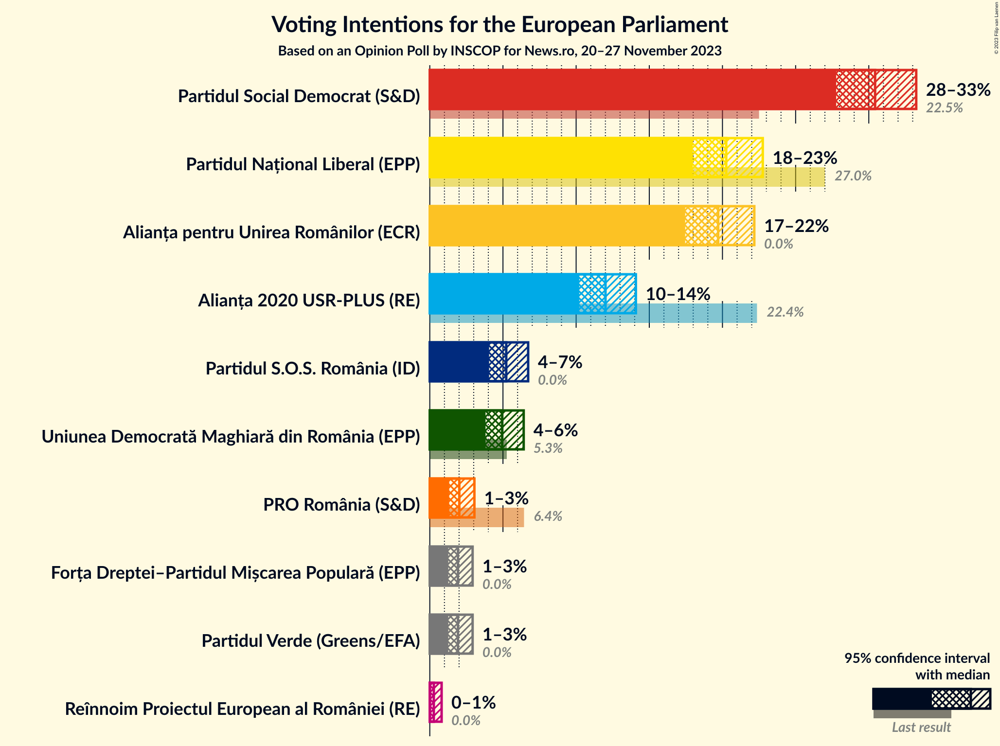

### Confidence Intervals

| Party | Last Result | Poll Result | 80% Confidence Interval | 90% Confidence Interval | 95% Confidence Interval | 99% Confidence Interval |
|:-----:|:-----------:|:-----------:|:-----------------------:|:-----------------------:|:-----------------------:|:-----------------------:|
| Partidul Social Democrat (S&D) | 22.5% | 30.4% | 28.7–32.3% |28.2–32.8% |27.8–33.2% |26.9–34.1% |
| Partidul Național Liberal (EPP) | 27.0% | 20.3% | 18.8–21.9% |18.3–22.3% |18.0–22.8% |17.3–23.5% |
| Alianța pentru Unirea Românilor (ECR) | 0.0% | 19.7% | 18.2–21.3% |17.8–21.8% |17.5–22.2% |16.8–23.0% |
| Alianța 2020 USR-PLUS (RE) | 22.4% | 12.0% | 10.8–13.4% |10.5–13.7% |10.2–14.1% |9.7–14.8% |
| Partidul S.O.S. România (ID) | 0.0% | 5.2% | 4.5–6.2% |4.2–6.5% |4.1–6.7% |3.7–7.2% |
| Uniunea Democrată Maghiară din România (EPP) | 5.3% | 4.9% | 4.2–5.9% |4.0–6.2% |3.8–6.4% |3.5–6.9% |
| PRO România (S&D) | 6.4% | 2.0% | 1.6–2.7% |1.4–2.9% |1.3–3.0% |1.1–3.4% |
| Partidul Verde (Greens/EFA) | 0.0% | 1.9% | 1.5–2.6% |1.4–2.8% |1.3–2.9% |1.1–3.3% |
| Forța Dreptei–Partidul Mișcarea Populară (EPP) | 0.0% | 1.9% | 1.5–2.6% |1.4–2.8% |1.3–2.9% |1.1–3.3% |
| Reînnoim Proiectul European al României (RE) | 0.0% | 0.3% | 0.2–0.6% |0.1–0.7% |0.1–0.8% |0.1–1.0% |

*Note:* The poll result column reflects the actual value used in the calculations. Published results may vary slightly, and in addition be rounded to fewer digits.

## Seats

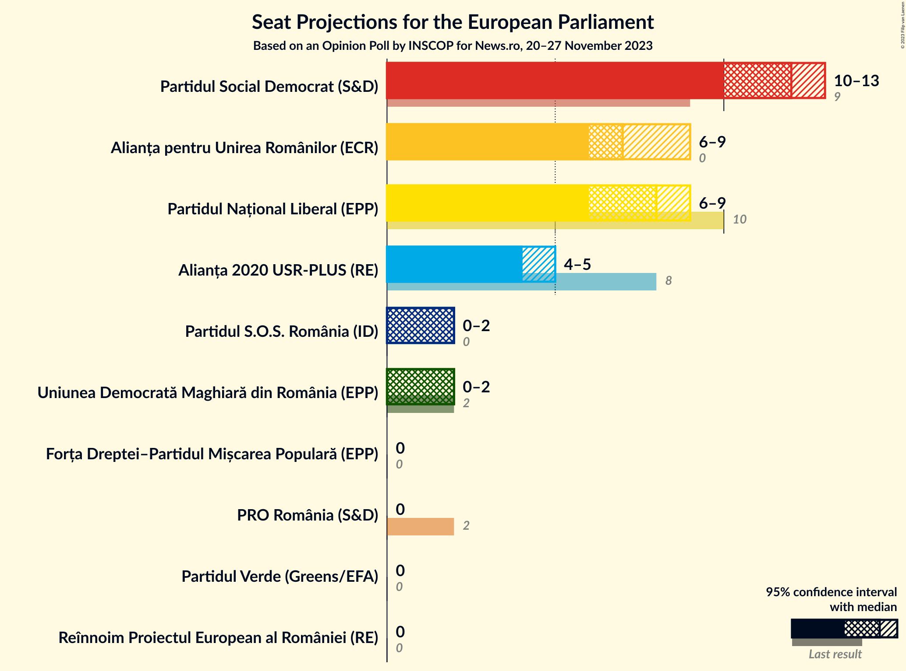

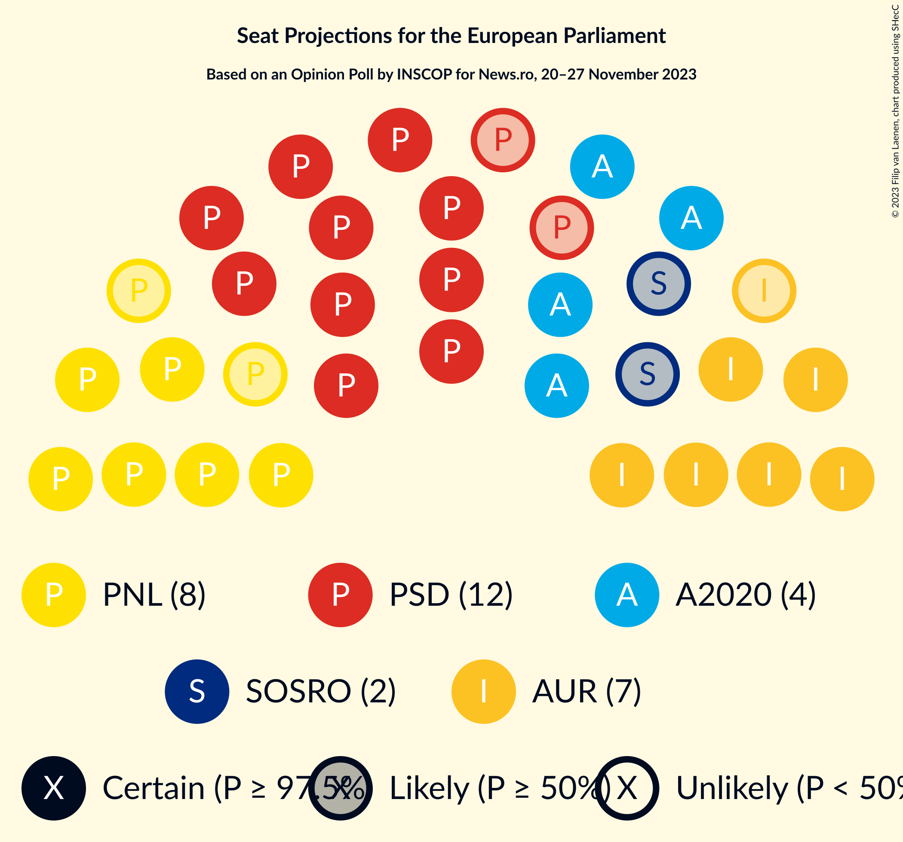

### Confidence Intervals

| Party | Last Result | Median | 80% Confidence Interval | 90% Confidence Interval | 95% Confidence Interval | 99% Confidence Interval |
|:-----:|:-----------:|:------:|:-----------------------:|:-----------------------:|:-----------------------:|:-----------------------:|
| <a href="#partidul-social-democrat-(s&d)">Partidul Social Democrat (S&D)</a> | 9 | 12 | 11–13 |10–13 |10–13 |10–13 |
| <a href="#partidul-național-liberal-(epp)">Partidul Național Liberal (EPP)</a> | 10 | 8 | 7–8 |7–9 |6–9 |6–9 |
| <a href="#alianța-pentru-unirea-românilor-(ecr)">Alianța pentru Unirea Românilor (ECR)</a> | 0 | 7 | 6–8 |6–8 |6–9 |6–9 |
| <a href="#alianța-2020-usr-plus-(re)">Alianța 2020 USR-PLUS (RE)</a> | 8 | 4 | 4–5 |4–5 |4–5 |3–5 |
| <a href="#partidul-s.o.s.-românia-(id)">Partidul S.O.S. România (ID)</a> | 0 | 2 | 0–2 |0–2 |0–2 |0–2 |
| <a href="#uniunea-democrată-maghiară-din-românia-(epp)">Uniunea Democrată Maghiară din România (EPP)</a> | 2 | 2 | 0–2 |0–2 |0–2 |0–2 |
| <a href="#pro-românia-(s&d)">PRO România (S&D)</a> | 2 | 0 | 0 |0 |0 |0 |
| <a href="#partidul-verde-(greens/efa)">Partidul Verde (Greens/EFA)</a> | 0 | 0 | 0 |0 |0 |0 |
| <a href="#forța-dreptei–partidul-mișcarea-populară-(epp)">Forța Dreptei–Partidul Mișcarea Populară (EPP)</a> | 0 | 0 | 0 |0 |0 |0 |
| <a href="#reînnoim-proiectul-european-al-româniei-(re)">Reînnoim Proiectul European al României (RE)</a> | 0 | 0 | 0 |0 |0 |0 |

### Partidul Social Democrat (S&D)

*For a full overview of the results for this party, see the [Partidul Social Democrat (S&D)](party-partidulsocialdemocratsd.html) page.*

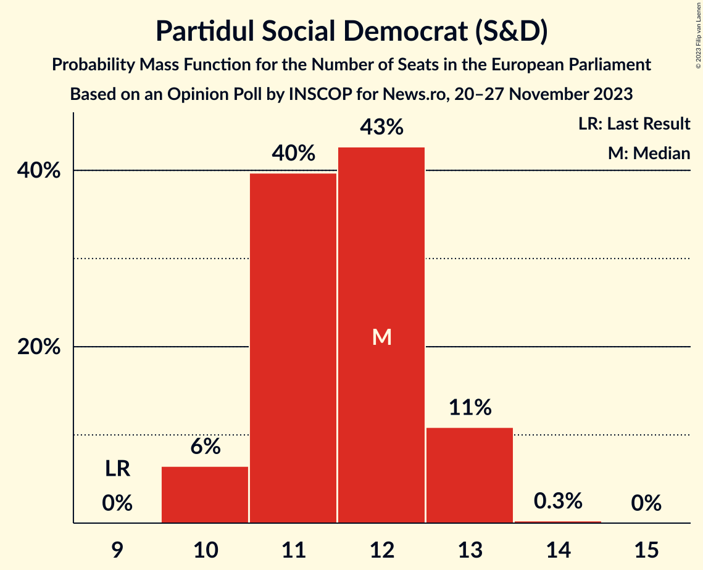

| Number of Seats | Probability | Accumulated | Special Marks |
|:---------------:|:-----------:|:-----------:|:-------------:|
| 9 | 0% | 100% | Last Result |
| 10 | 6% | 100% |  |
| 11 | 40% | 94% |  |
| 12 | 43% | 54% | Median |
| 13 | 11% | 11% |  |
| 14 | 0.3% | 0.3% |  |
| 15 | 0% | 0% |  |

### Partidul Național Liberal (EPP)

*For a full overview of the results for this party, see the [Partidul Național Liberal (EPP)](party-partidulnaționalliberalepp.html) page.*

| Number of Seats | Probability | Accumulated | Special Marks |
|:---------------:|:-----------:|:-----------:|:-------------:|
| 6 | 3% | 100% |  |
| 7 | 40% | 97% |  |
| 8 | 50% | 58% | Median |
| 9 | 7% | 7% |  |
| 10 | 0% | 0% | Last Result |

### Alianța pentru Unirea Românilor (ECR)

*For a full overview of the results for this party, see the [Alianța pentru Unirea Românilor (ECR)](party-alianțapentruunirearomânilorecr.html) page.*

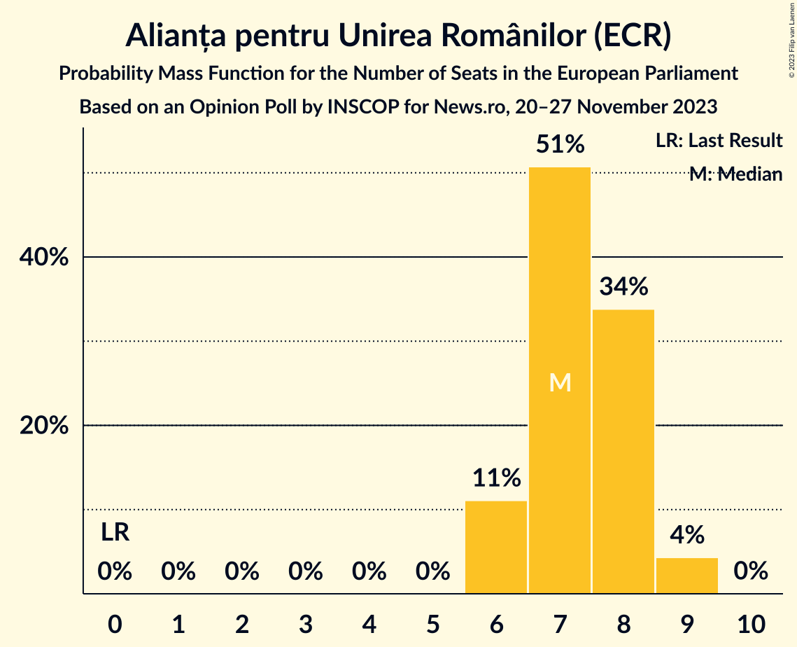

| Number of Seats | Probability | Accumulated | Special Marks |
|:---------------:|:-----------:|:-----------:|:-------------:|
| 0 | 0% | 100% | Last Result |
| 1 | 0% | 100% |  |
| 2 | 0% | 100% |  |
| 3 | 0% | 100% |  |
| 4 | 0% | 100% |  |
| 5 | 0% | 100% |  |
| 6 | 11% | 100% |  |
| 7 | 51% | 89% | Median |
| 8 | 34% | 38% |  |
| 9 | 4% | 4% |  |
| 10 | 0% | 0% |  |

### Alianța 2020 USR-PLUS (RE)

*For a full overview of the results for this party, see the [Alianța 2020 USR-PLUS (RE)](party-alianța2020usr-plusre.html) page.*

| Number of Seats | Probability | Accumulated | Special Marks |
|:---------------:|:-----------:|:-----------:|:-------------:|
| 3 | 2% | 100% |  |
| 4 | 77% | 98% | Median |
| 5 | 21% | 21% |  |
| 6 | 0.4% | 0.4% |  |
| 7 | 0% | 0% |  |
| 8 | 0% | 0% | Last Result |

### Partidul S.O.S. România (ID)

*For a full overview of the results for this party, see the [Partidul S.O.S. România (ID)](party-partidulsosromâniaid.html) page.*

| Number of Seats | Probability | Accumulated | Special Marks |
|:---------------:|:-----------:|:-----------:|:-------------:|
| 0 | 28% | 100% | Last Result |
| 1 | 21% | 72% |  |
| 2 | 50% | 51% | Median |
| 3 | 0.2% | 0.2% |  |
| 4 | 0% | 0% |  |

### Uniunea Democrată Maghiară din România (EPP)

*For a full overview of the results for this party, see the [Uniunea Democrată Maghiară din România (EPP)](party-uniuneademocratămaghiarădinromâniaepp.html) page.*

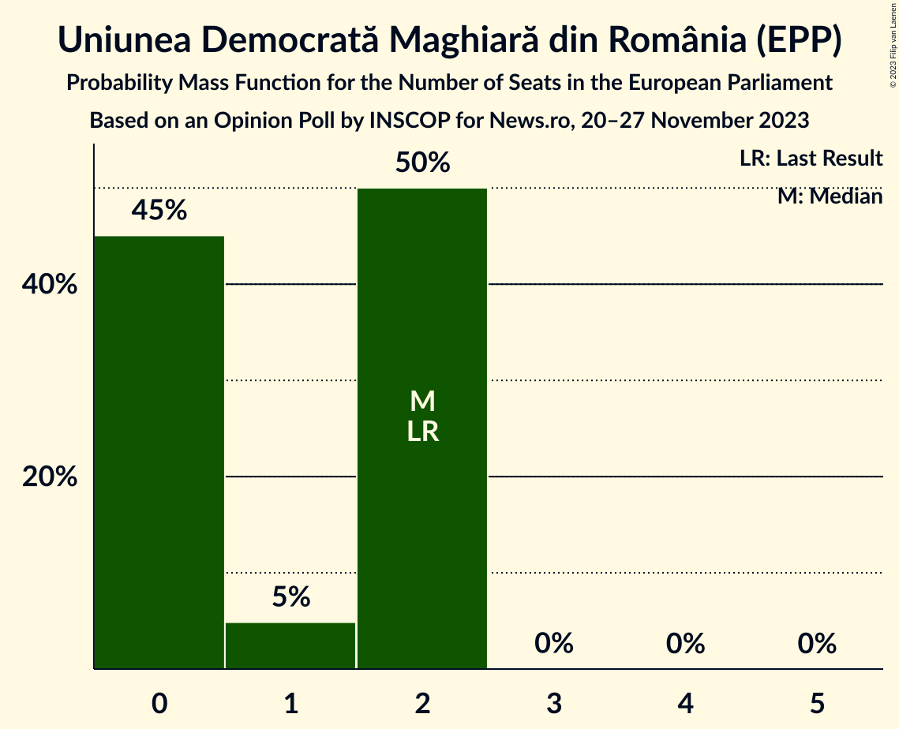

| Number of Seats | Probability | Accumulated | Special Marks |
|:---------------:|:-----------:|:-----------:|:-------------:|
| 0 | 45% | 100% |  |
| 1 | 5% | 55% |  |
| 2 | 50% | 50% | Last Result, Median |
| 3 | 0% | 0% |  |

### PRO România (S&D)

*For a full overview of the results for this party, see the [PRO România (S&D)](party-proromâniasd.html) page.*

| Number of Seats | Probability | Accumulated | Special Marks |
|:---------------:|:-----------:|:-----------:|:-------------:|
| 0 | 100% | 100% | Median |
| 1 | 0% | 0% |  |
| 2 | 0% | 0% | Last Result |

### Partidul Verde (Greens/EFA)

*For a full overview of the results for this party, see the [Partidul Verde (Greens/EFA)](party-partidulverdegreensefa.html) page.*

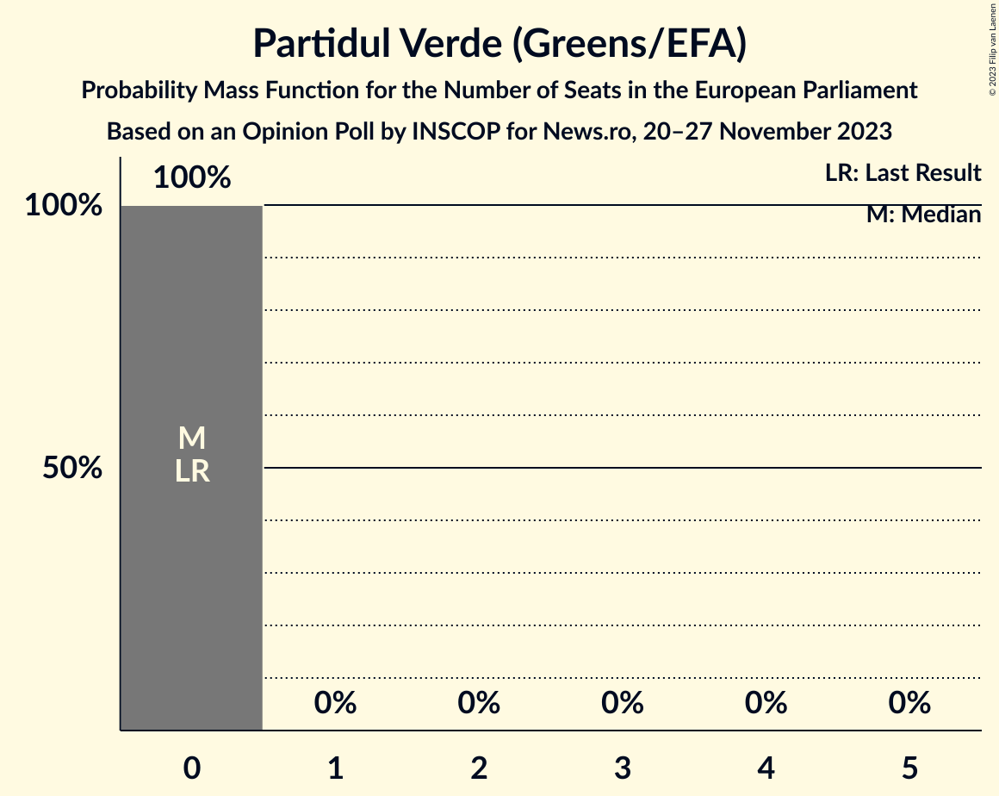

| Number of Seats | Probability | Accumulated | Special Marks |
|:---------------:|:-----------:|:-----------:|:-------------:|
| 0 | 100% | 100% | Last Result, Median |

### Forța Dreptei–Partidul Mișcarea Populară (EPP)

*For a full overview of the results for this party, see the [Forța Dreptei–Partidul Mișcarea Populară (EPP)](party-forțadreptei–partidulmișcareapopularăepp.html) page.*

| Number of Seats | Probability | Accumulated | Special Marks |
|:---------------:|:-----------:|:-----------:|:-------------:|
| 0 | 100% | 100% | Last Result, Median |

### Reînnoim Proiectul European al României (RE)

*For a full overview of the results for this party, see the [Reînnoim Proiectul European al României (RE)](party-reînnoimproiectuleuropeanalromânieire.html) page.*

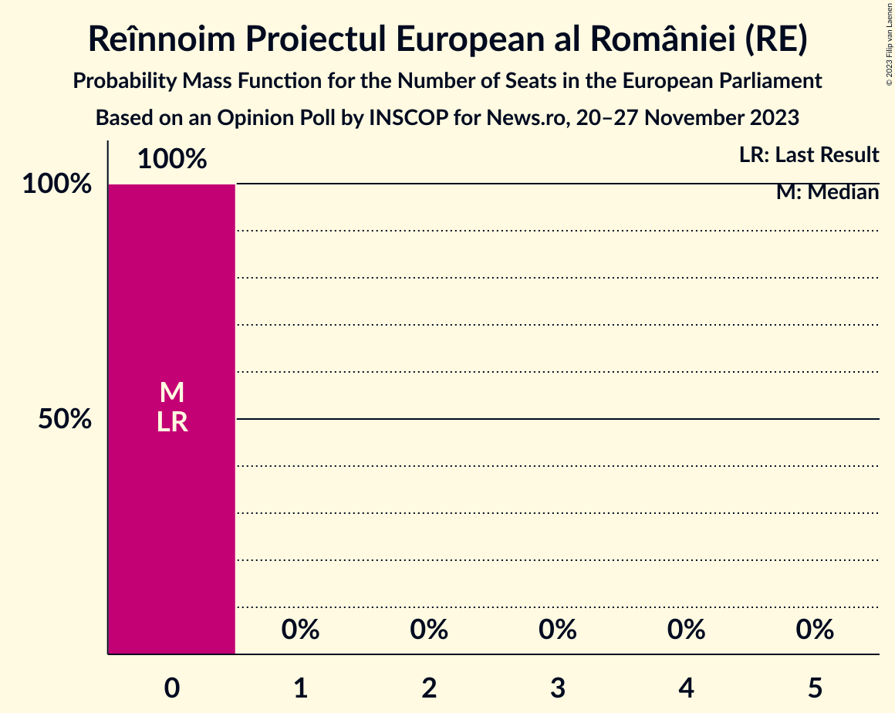

| Number of Seats | Probability | Accumulated | Special Marks |
|:---------------:|:-----------:|:-----------:|:-------------:|
| 0 | 100% | 100% | Last Result, Median |

## Coalitions

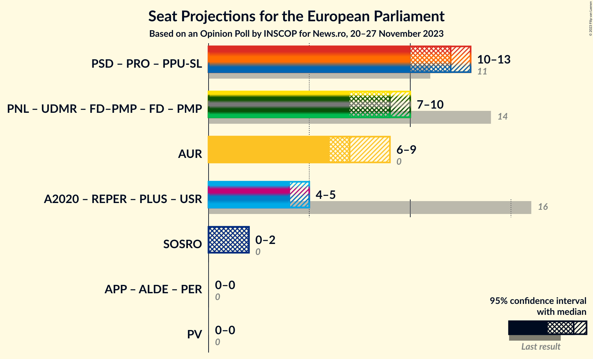

### Confidence Intervals

| Coalition | Last Result | Median | Majority? | 80% Confidence Interval | 90% Confidence Interval | 95% Confidence Interval | 99% Confidence Interval |
|:---------:|:-----------:|:------:|:---------:|:-----------------------:|:-----------------------:|:-----------------------:|:-----------------------:|
| Alianța pentru Unirea Românilor (ECR) | 0 | 7 | 0% | 6–8 | 6–8 | 6–9 | 6–9 |
| Partidul S.O.S. România (ID) | 0 | 2 | 0% | 0–2 | 0–2 | 0–2 | 0–2 |
| Partidul Verde (Greens/EFA) | 0 | 0 | 0% | 0 | 0 | 0 | 0 |

### Alianța pentru Unirea Românilor (ECR)

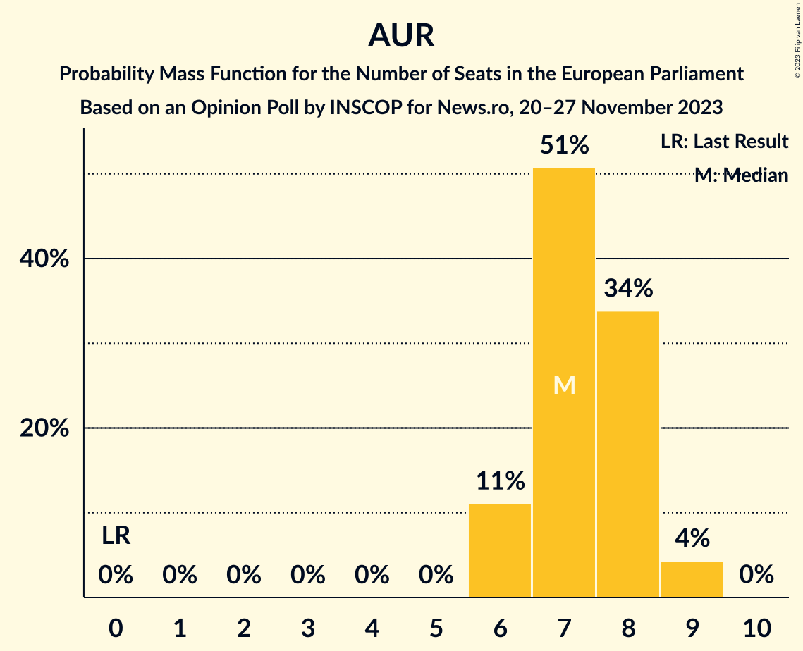

| Number of Seats | Probability | Accumulated | Special Marks |
|:---------------:|:-----------:|:-----------:|:-------------:|
| 0 | 0% | 100% | Last Result |
| 1 | 0% | 100% |  |
| 2 | 0% | 100% |  |
| 3 | 0% | 100% |  |
| 4 | 0% | 100% |  |
| 5 | 0% | 100% |  |
| 6 | 11% | 100% |  |
| 7 | 51% | 89% | Median |
| 8 | 34% | 38% |  |
| 9 | 4% | 4% |  |
| 10 | 0% | 0% |  |

### Partidul S.O.S. România (ID)

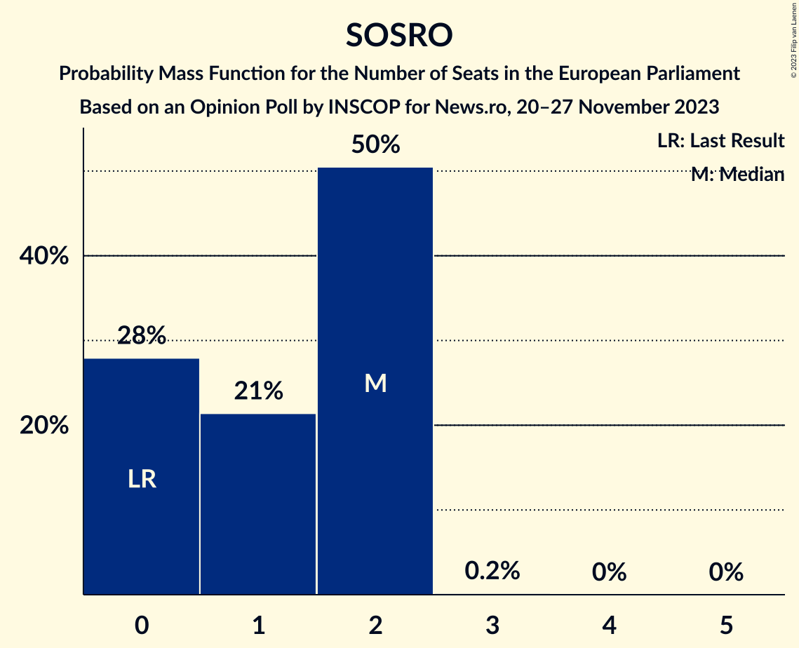

| Number of Seats | Probability | Accumulated | Special Marks |
|:---------------:|:-----------:|:-----------:|:-------------:|
| 0 | 28% | 100% | Last Result |
| 1 | 21% | 72% |  |
| 2 | 50% | 51% | Median |
| 3 | 0.2% | 0.2% |  |
| 4 | 0% | 0% |  |

### Partidul Verde (Greens/EFA)

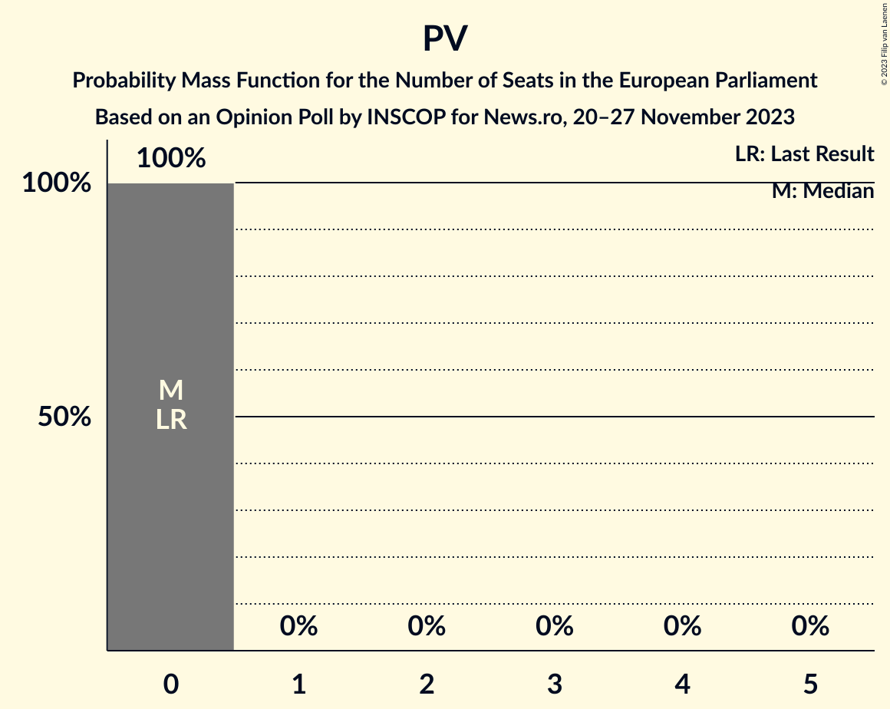

| Number of Seats | Probability | Accumulated | Special Marks |
|:---------------:|:-----------:|:-----------:|:-------------:|
| 0 | 100% | 100% | Last Result, Median |

## Technical Information

### Opinion Poll

+ **Polling firm:** INSCOP
+ **Commissioner(s):** News.ro
+ **Fieldwork period:** 20–27 November 2023

### Calculations

+ **Sample size:** 1091
+ **Simulations done:** 1,048,576
+ **Error estimate:** 0.85%

