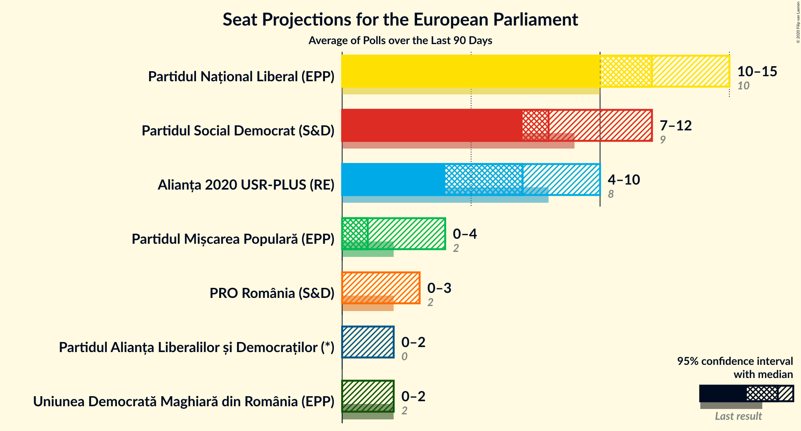
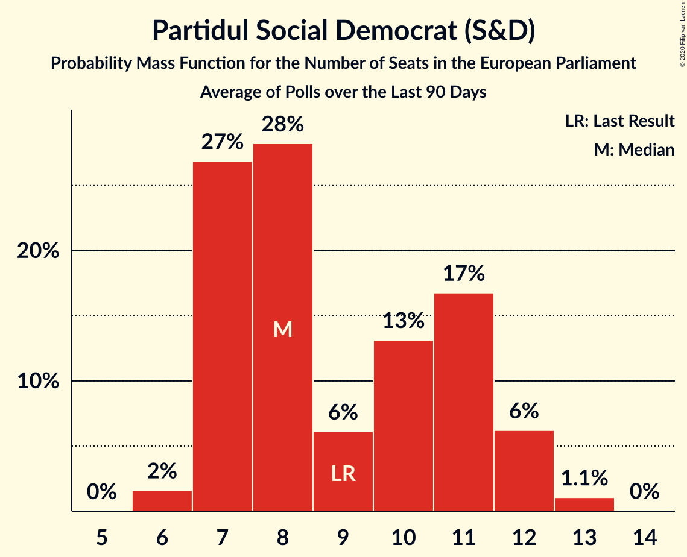
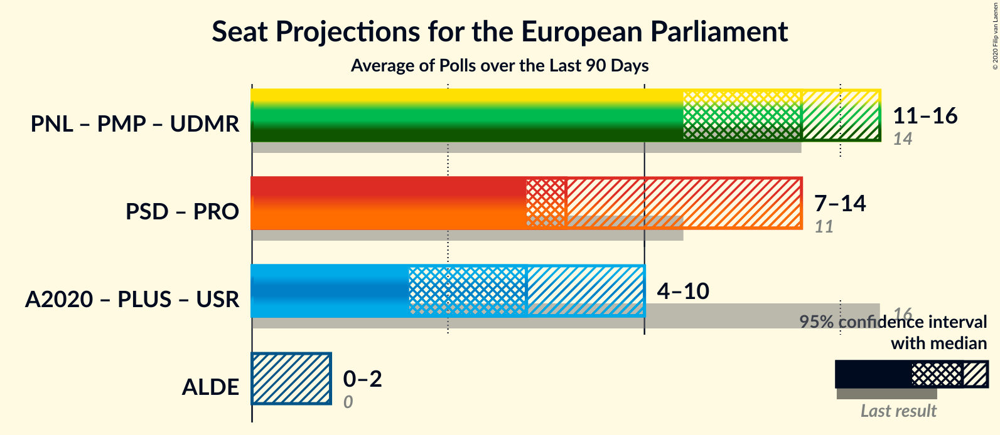
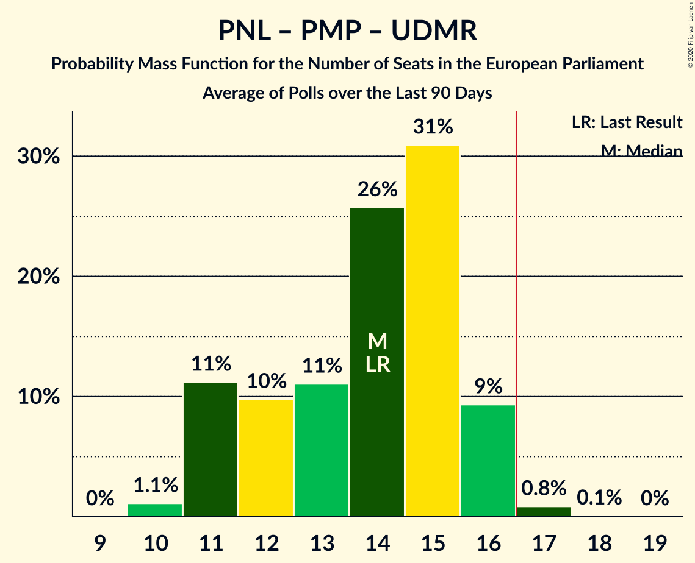
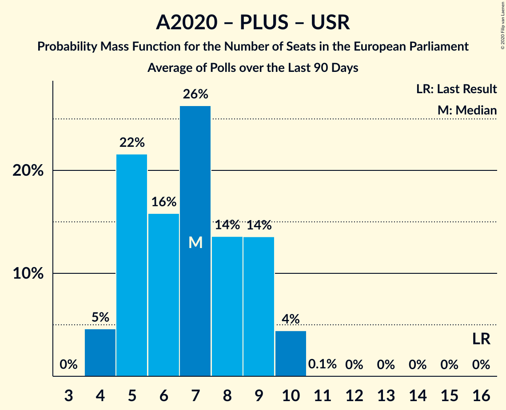

# Poll Average

<a href="#voting-intentions">Voting Intentions</a> | <a href="#seats">Seats</a> | <a href="#coalitions">Coalitions</a> | <a href="#technical-information">Technical Information</a>

## Summary

The table below lists the polls on which the average is based. They are the most recent polls (less than 90 days old) registered and analyzed so far.

| Period     | Polling firm/Commissioner(s) | PNL | PSD | A2020 | PRO | PMP | UDMR | ALDE | PLUS | USR |
|:----------:|:----------------------------:|:--:|:--:|:--:|:--:|:--:|:--:|:--:|:--:|:--:|
| 26 May 2019 | General Election | 27.0%   10 | 22.5%   9 | 22.4%   8 | 6.4%   2 | 5.8%   2 | 5.3%   2 | 4.1%   0 | 22.4%   4 | 22.4%   4 |
| N/A | Poll Average | 28–37%   10–15 | 18–31%   7–12 | 12–26%   4–10 | 1–8%   0–3 | 3–11%   0–4 | 1–6%   0–2 | 3–7%   0–2 | N/A   N/A | N/A   N/A |
| [19–30 June 2020](2020-06-30-CURS.html) | CURS   STIRIPESURSE.RO | 29–35%   10–13 | 25–31%   9–12 | 14–18%   5–7 | 6–9%   2–3 | 4–6%   0–2 | 4–6%   0–2 | 4–6%   0–2 | N/A   N/A | N/A   N/A |
| [5–27 June 2020](2020-06-27-IMAS.html) | IMAS   Europa FM | 27–33%   10–12 | 17–22%   6–8 | 17–22%   6–8 | 3–5%   0 | 8–12%   3–4 | 2–5%   0 | 3–6%   0–2 | N/A   N/A | N/A   N/A |
| [15–26 May 2020](2020-05-26-Avangarde.html) | Avangarde | 32–38%   12–15 | 26–32%   10–13 | 11–15%   4–6 | 5–8%   0–3 | 3–5%   0–2 | 4–7%   0–2 | 3–5%   0 | N/A   N/A | N/A   N/A |
| [15–20 May 2020](2020-05-20-INSCOP.html) | INSCOP | 29–34%   11–13 | 20–24%   7–9 | 18–23%   6–8 | 0–2%   0 | 6–10%   2–3 | 3–6%   0–2 | 3–6%   0–2 | N/A   N/A | N/A   N/A |
| [1–7 May 2020](2020-05-07-BCS.html) | BCS | 28–32%   10–12 | 18–22%   7–8 | 23–27%   8–10 | 3–5%   0 | 4–6%   0–2 | 1–2%   0 | 5–7%   0–2 | N/A   N/A | N/A   N/A |
| 26 May 2019 | General Election | 27.0%   10 | 22.5%   9 | 22.4%   8 | 6.4%   2 | 5.8%   2 | 5.3%   2 | 4.1%   0 | 22.4%   4 | 22.4%   4 |

Only polls for which at least the sample size has been published are included in the table above.

**Legend:**
+ **Top half of each row:** Voting intentions (95% confidence interval)
+ **Bottom half of each row:** Seat projections for the European Parliament (95% confidence interval)
+ **PNL:** Partidul Național Liberal (EPP)
+ **PSD:** Partidul Social Democrat (S&D)
+ **A2020:** Alianța 2020 USR-PLUS (RE)
+ **PRO:** PRO România (S&D)
+ **PMP:** Partidul Mișcarea Populară (EPP)
+ **UDMR:** Uniunea Democrată Maghiară din România (EPP)
+ **ALDE:** Partidul Alianța Liberalilor și Democraților (*)
+ **PLUS:** Partidul Libertății, Unității și Solidarității (RE)
+ **USR:** Uniunea Salvați România (RE)
+ **N/A (single party):** Party not included the published results
+ **N/A (entire row):** Calculation for this opinion poll not started yet

## Voting Intentions

### Confidence Intervals

| Party | Last Result | Median | 80% Confidence Interval | 90% Confidence Interval | 95% Confidence Interval | 99% Confidence Interval |
|:-----:|:-----------:|:------:|:-----------------------:|:-----------------------:|:-----------------------:|:-----------------------:|
| <a href="#partidul-național-liberal-(epp)">Partidul Național Liberal (EPP)</a> | 27.0% | 31.4% | 28.9–35.1% |28.3–36.1% | 27.8–36.8% | 26.8–38.0% |
| <a href="#partidul-social-democrat-(s&d)">Partidul Social Democrat (S&D)</a> | 22.5% | 22.1% | 19.3–29.5% |18.7–30.3% | 18.2–30.9% | 17.3–32.0% |
| <a href="#alianța-2020-usr-plus-(re)">Alianța 2020 USR-PLUS (RE)</a> | 22.4% | 19.0% | 13.0–24.7% |12.3–25.4% | 11.9–26.0% | 11.1–26.9% |
| <a href="#partidul-libertății,-unității-și-solidarității-(re)">Partidul Libertății, Unității și Solidarității (RE)</a> | 22.4% | N/A | N/A |N/A | N/A | N/A |
| <a href="#uniunea-salvați-românia-(re)">Uniunea Salvați România (RE)</a> | 22.4% | N/A | N/A |N/A | N/A | N/A |
| <a href="#pro-românia-(s&d)">PRO România (S&D)</a> | 6.4% | 4.2% | 0.9–7.2% |0.8–7.6% | 0.6–8.0% | 0.5–8.7% |
| <a href="#partidul-mișcarea-populară-(epp)">Partidul Mișcarea Populară (EPP)</a> | 5.8% | 5.3% | 3.9–10.2% |3.6–10.8% | 3.4–11.3% | 2.9–12.1% |
| <a href="#uniunea-democrată-maghiară-din-românia-(epp)">Uniunea Democrată Maghiară din România (EPP)</a> | 5.3% | 4.3% | 1.3–5.6% |1.2–5.9% | 1.0–6.2% | 0.8–6.7% |
| <a href="#partidul-alianța-liberalilor-și-democraților-(*)">Partidul Alianța Liberalilor și Democraților (*)</a> | 4.1% | 4.7% | 3.7–6.1% |3.4–6.4% | 3.2–6.7% | 2.9–7.2% |

### Partidul Național Liberal (EPP)

*For a full overview of the results for this party, see the [Partidul Național Liberal (EPP)](party-partidulnaționalliberalepp.html) page.*

| Voting Intentions | Probability | Accumulated | Special Marks |
|:-----------------:|:-----------:|:-----------:|:-------------:|
| 24.5–25.5% | 0% | 100% |  |
| 25.5–26.5% | 0.2% | 100% |  |
| 26.5–27.5% | 1.5% | 99.7% | Last Result |
| 27.5–28.5% | 5% | 98% |  |
| 28.5–29.5% | 12% | 93% |  |
| 29.5–30.5% | 17% | 81% |  |
| 30.5–31.5% | 17% | 65% | Median |
| 31.5–32.5% | 15% | 47% |  |
| 32.5–33.5% | 11% | 32% |  |
| 33.5–34.5% | 8% | 22% |  |
| 34.5–35.5% | 6% | 14% |  |
| 35.5–36.5% | 4% | 7% |  |
| 36.5–37.5% | 2% | 3% |  |
| 37.5–38.5% | 0.8% | 1.0% |  |
| 38.5–39.5% | 0.2% | 0.2% |  |
| 39.5–40.5% | 0% | 0% |  |

### Partidul Social Democrat (S&D)

*For a full overview of the results for this party, see the [Partidul Social Democrat (S&D)](party-partidulsocialdemocratsd.html) page.*

| Voting Intentions | Probability | Accumulated | Special Marks |
|:-----------------:|:-----------:|:-----------:|:-------------:|
| 14.5–15.5% | 0% | 100% |  |
| 15.5–16.5% | 0.1% | 100% |  |
| 16.5–17.5% | 0.7% | 99.9% |  |
| 17.5–18.5% | 3% | 99.3% |  |
| 18.5–19.5% | 10% | 96% |  |
| 19.5–20.5% | 15% | 86% |  |
| 20.5–21.5% | 15% | 71% |  |
| 21.5–22.5% | 10% | 56% | Median |
| 22.5–23.5% | 5% | 46% | Last Result |
| 23.5–24.5% | 2% | 42% |  |
| 24.5–25.5% | 0.9% | 40% |  |
| 25.5–26.5% | 3% | 39% |  |
| 26.5–27.5% | 7% | 37% |  |
| 27.5–28.5% | 10% | 30% |  |
| 28.5–29.5% | 10% | 20% |  |
| 29.5–30.5% | 6% | 10% |  |
| 30.5–31.5% | 3% | 4% |  |
| 31.5–32.5% | 0.8% | 0.9% |  |
| 32.5–33.5% | 0.1% | 0.2% |  |
| 33.5–34.5% | 0% | 0% |  |

### Alianța 2020 USR-PLUS (RE)

*For a full overview of the results for this party, see the [Alianța 2020 USR-PLUS (RE)](party-alianța2020usr-plusre.html) page.*

| Voting Intentions | Probability | Accumulated | Special Marks |
|:-----------------:|:-----------:|:-----------:|:-------------:|
| 8.5–9.5% | 0% | 100% |  |
| 9.5–10.5% | 0.1% | 100% |  |
| 10.5–11.5% | 1.3% | 99.9% |  |
| 11.5–12.5% | 5% | 98.5% |  |
| 12.5–13.5% | 7% | 94% |  |
| 13.5–14.5% | 6% | 86% |  |
| 14.5–15.5% | 6% | 80% |  |
| 15.5–16.5% | 7% | 74% |  |
| 16.5–17.5% | 6% | 66% |  |
| 17.5–18.5% | 6% | 61% |  |
| 18.5–19.5% | 10% | 54% | Median |
| 19.5–20.5% | 12% | 44% |  |
| 20.5–21.5% | 8% | 32% |  |
| 21.5–22.5% | 4% | 24% | Last Result |
| 22.5–23.5% | 3% | 20% |  |
| 23.5–24.5% | 6% | 17% |  |
| 24.5–25.5% | 7% | 11% |  |
| 25.5–26.5% | 3% | 4% |  |
| 26.5–27.5% | 0.8% | 0.9% |  |
| 27.5–28.5% | 0.1% | 0.1% |  |
| 28.5–29.5% | 0% | 0% |  |

### PRO România (S&D)

*For a full overview of the results for this party, see the [PRO România (S&D)](party-proromâniasd.html) page.*

| Voting Intentions | Probability | Accumulated | Special Marks |
|:-----------------:|:-----------:|:-----------:|:-------------:|
| 0.0–0.5% | 1.0% | 100% |  |
| 0.5–1.5% | 18% | 99.0% |  |
| 1.5–2.5% | 1.1% | 81% |  |
| 2.5–3.5% | 13% | 80% |  |
| 3.5–4.5% | 23% | 67% | Median |
| 4.5–5.5% | 8% | 43% |  |
| 5.5–6.5% | 15% | 35% | Last Result |
| 6.5–7.5% | 14% | 20% |  |
| 7.5–8.5% | 5% | 6% |  |
| 8.5–9.5% | 0.7% | 0.7% |  |
| 9.5–10.5% | 0% | 0% |  |

### Partidul Mișcarea Populară (EPP)

*For a full overview of the results for this party, see the [Partidul Mișcarea Populară (EPP)](party-partidulmișcareapopularăepp.html) page.*

| Voting Intentions | Probability | Accumulated | Special Marks |
|:-----------------:|:-----------:|:-----------:|:-------------:|
| 1.5–2.5% | 0% | 100% |  |
| 2.5–3.5% | 4% | 100% |  |
| 3.5–4.5% | 24% | 96% |  |
| 4.5–5.5% | 25% | 71% | Median |
| 5.5–6.5% | 6% | 46% | Last Result |
| 6.5–7.5% | 6% | 40% |  |
| 7.5–8.5% | 10% | 34% |  |
| 8.5–9.5% | 8% | 24% |  |
| 9.5–10.5% | 8% | 15% |  |
| 10.5–11.5% | 5% | 7% |  |
| 11.5–12.5% | 1.4% | 2% |  |
| 12.5–13.5% | 0.2% | 0.2% |  |
| 13.5–14.5% | 0% | 0% |  |

### Uniunea Democrată Maghiară din România (EPP)

*For a full overview of the results for this party, see the [Uniunea Democrată Maghiară din România (EPP)](party-uniuneademocratămaghiarădinromâniaepp.html) page.*

| Voting Intentions | Probability | Accumulated | Special Marks |
|:-----------------:|:-----------:|:-----------:|:-------------:|
| 0.0–0.5% | 0% | 100% |  |
| 0.5–1.5% | 15% | 100% |  |
| 1.5–2.5% | 6% | 85% |  |
| 2.5–3.5% | 12% | 79% |  |
| 3.5–4.5% | 25% | 67% | Median |
| 4.5–5.5% | 31% | 42% | Last Result |
| 5.5–6.5% | 10% | 11% |  |
| 6.5–7.5% | 0.9% | 0.9% |  |
| 7.5–8.5% | 0% | 0% |  |

### Partidul Alianța Liberalilor și Democraților (*)

*For a full overview of the results for this party, see the [Partidul Alianța Liberalilor și Democraților (*)](party-partidulalianțaliberalilorșidemocraților.html) page.*

| Voting Intentions | Probability | Accumulated | Special Marks |
|:-----------------:|:-----------:|:-----------:|:-------------:|
| 1.5–2.5% | 0.1% | 100% |  |
| 2.5–3.5% | 7% | 99.9% |  |
| 3.5–4.5% | 38% | 92% | Last Result |
| 4.5–5.5% | 34% | 55% | Median |
| 5.5–6.5% | 18% | 21% |  |
| 6.5–7.5% | 3% | 4% |  |
| 7.5–8.5% | 0.1% | 0.1% |  |
| 8.5–9.5% | 0% | 0% |  |

## Seats

### Confidence Intervals

| Party | Last Result | Median | 80% Confidence Interval | 90% Confidence Interval | 95% Confidence Interval | 99% Confidence Interval |
|:-----:|:-----------:|:------:|:-----------------------:|:-----------------------:|:-----------------------:|:-----------------------:|
| <a href="#partidul-național-liberal-(epp)">Partidul Național Liberal (EPP)</a> | 10 | 12 | 11–14 |10–14 | 10–15 | 10–15 |
| <a href="#partidul-social-democrat-(s&d)">Partidul Social Democrat (S&D)</a> | 9 | 8 | 7–11 |7–12 | 7–12 | 6–13 |
| <a href="#alianța-2020-usr-plus-(re)">Alianța 2020 USR-PLUS (RE)</a> | 8 | 7 | 5–9 |5–9 | 4–10 | 4–10 |
| <a href="#partidul-libertății,-unității-și-solidarității-(re)">Partidul Libertății, Unității și Solidarității (RE)</a> | 4 | N/A | N/A |N/A | N/A | N/A |
| <a href="#uniunea-salvați-românia-(re)">Uniunea Salvați România (RE)</a> | 4 | N/A | N/A |N/A | N/A | N/A |
| <a href="#pro-românia-(s&d)">PRO România (S&D)</a> | 2 | 0 | 0–2 |0–2 | 0–3 | 0–3 |
| <a href="#partidul-mișcarea-populară-(epp)">Partidul Mișcarea Populară (EPP)</a> | 2 | 1 | 0–4 |0–4 | 0–4 | 0–4 |
| <a href="#uniunea-democrată-maghiară-din-românia-(epp)">Uniunea Democrată Maghiară din România (EPP)</a> | 2 | 0 | 0–2 |0–2 | 0–2 | 0–2 |
| <a href="#partidul-alianța-liberalilor-și-democraților-(*)">Partidul Alianța Liberalilor și Democraților (*)</a> | 0 | 0 | 0–2 |0–2 | 0–2 | 0–2 |

### Partidul Național Liberal (EPP)

*For a full overview of the results for this party, see the [Partidul Național Liberal (EPP)](party-partidulnaționalliberalepp.html) page.*

| Number of Seats | Probability | Accumulated | Special Marks |
|:---------------:|:-----------:|:-----------:|:-------------:|
| 9 | 0.1% | 100% |  |
| 10 | 6% | 99.9% | Last Result |
| 11 | 37% | 94% |  |
| 12 | 32% | 57% | Median |
| 13 | 14% | 25% |  |
| 14 | 8% | 10% |  |
| 15 | 2% | 3% |  |
| 16 | 0.3% | 0.3% |  |
| 17 | 0% | 0% | Majority |

### Partidul Social Democrat (S&D)

*For a full overview of the results for this party, see the [Partidul Social Democrat (S&D)](party-partidulsocialdemocratsd.html) page.*

| Number of Seats | Probability | Accumulated | Special Marks |
|:---------------:|:-----------:|:-----------:|:-------------:|
| 6 | 2% | 100% |  |
| 7 | 27% | 98% |  |
| 8 | 28% | 72% | Median |
| 9 | 6% | 43% | Last Result |
| 10 | 13% | 37% |  |
| 11 | 17% | 24% |  |
| 12 | 6% | 7% |  |
| 13 | 1.1% | 1.1% |  |
| 14 | 0% | 0% |  |

### Alianța 2020 USR-PLUS (RE)

*For a full overview of the results for this party, see the [Alianța 2020 USR-PLUS (RE)](party-alianța2020usr-plusre.html) page.*

| Number of Seats | Probability | Accumulated | Special Marks |
|:---------------:|:-----------:|:-----------:|:-------------:|
| 4 | 5% | 100% |  |
| 5 | 22% | 95% |  |
| 6 | 16% | 74% |  |
| 7 | 26% | 58% | Median |
| 8 | 14% | 32% | Last Result |
| 9 | 14% | 18% |  |
| 10 | 4% | 5% |  |
| 11 | 0.1% | 0.1% |  |
| 12 | 0% | 0% |  |

### Partidul Libertății, Unității și Solidarității (RE)

*For a full overview of the results for this party, see the [Partidul Libertății, Unității și Solidarității (RE)](party-partidullibertățiiunitățiișisolidaritățiire.html) page.*

### Uniunea Salvați România (RE)

*For a full overview of the results for this party, see the [Uniunea Salvați România (RE)](party-uniuneasalvațiromâniare.html) page.*

### PRO România (S&D)

*For a full overview of the results for this party, see the [PRO România (S&D)](party-proromâniasd.html) page.*

| Number of Seats | Probability | Accumulated | Special Marks |
|:---------------:|:-----------:|:-----------:|:-------------:|
| 0 | 60% | 100% | Median |
| 1 | 0.6% | 40% |  |
| 2 | 35% | 39% | Last Result |
| 3 | 4% | 4% |  |
| 4 | 0% | 0% |  |

### Partidul Mișcarea Populară (EPP)

*For a full overview of the results for this party, see the [Partidul Mișcarea Populară (EPP)](party-partidulmișcareapopularăepp.html) page.*

| Number of Seats | Probability | Accumulated | Special Marks |
|:---------------:|:-----------:|:-----------:|:-------------:|
| 0 | 44% | 100% |  |
| 1 | 7% | 56% | Median |
| 2 | 17% | 48% | Last Result |
| 3 | 21% | 31% |  |
| 4 | 10% | 10% |  |
| 5 | 0.1% | 0.1% |  |
| 6 | 0% | 0% |  |

### Uniunea Democrată Maghiară din România (EPP)

*For a full overview of the results for this party, see the [Uniunea Democrată Maghiară din România (EPP)](party-uniuneademocratămaghiarădinromâniaepp.html) page.*

| Number of Seats | Probability | Accumulated | Special Marks |
|:---------------:|:-----------:|:-----------:|:-------------:|
| 0 | 72% | 100% | Median |
| 1 | 8% | 28% |  |
| 2 | 20% | 20% | Last Result |
| 3 | 0% | 0% |  |

### Partidul Alianța Liberalilor și Democraților (*)

*For a full overview of the results for this party, see the [Partidul Alianța Liberalilor și Democraților (*)](party-partidulalianțaliberalilorșidemocraților.html) page.*

| Number of Seats | Probability | Accumulated | Special Marks |
|:---------------:|:-----------:|:-----------:|:-------------:|
| 0 | 60% | 100% | Last Result, Median |
| 1 | 3% | 40% |  |
| 2 | 36% | 36% |  |
| 3 | 0.1% | 0.1% |  |
| 4 | 0% | 0% |  |

## Coalitions

### Confidence Intervals

| Coalition | Last Result | Median | Majority? | 80% Confidence Interval | 90% Confidence Interval | 95% Confidence Interval | 99% Confidence Interval |
|:---------:|:-----------:|:------:|:---------:|:-----------------------:|:-----------------------:|:-----------------------:|:-----------------------:|
| Partidul Național Liberal (EPP) – Partidul Mișcarea Populară (EPP) – Uniunea Democrată Maghiară din România (EPP) | 14 | 14 | 0.9% | 11–16 | 11–16 | 11–16 | 10–17 |
| Partidul Social Democrat (S&D) – PRO România (S&D) | 11 | 8 | 0% | 7–13 | 7–14 | 7–14 | 6–15 |
| Alianța 2020 USR-PLUS (RE) – Partidul Libertății, Unității și Solidarității (RE) – Uniunea Salvați România (RE) | 16 | 7 | 0% | 5–9 | 5–9 | 4–10 | 4–10 |
| Partidul Alianța Liberalilor și Democraților (*) | 0 | 0 | 0% | 0–2 | 0–2 | 0–2 | 0–2 |

### Partidul Național Liberal (EPP) – Partidul Mișcarea Populară (EPP) – Uniunea Democrată Maghiară din România (EPP)

| Number of Seats | Probability | Accumulated | Special Marks |
|:---------------:|:-----------:|:-----------:|:-------------:|
| 10 | 1.1% | 100% |  |
| 11 | 11% | 98.9% |  |
| 12 | 10% | 88% |  |
| 13 | 11% | 78% | Median |
| 14 | 26% | 67% | Last Result |
| 15 | 31% | 41% |  |
| 16 | 9% | 10% |  |
| 17 | 0.8% | 0.9% | Majority |
| 18 | 0.1% | 0.1% |  |
| 19 | 0% | 0% |  |

### Partidul Social Democrat (S&D) – PRO România (S&D)

| Number of Seats | Probability | Accumulated | Special Marks |
|:---------------:|:-----------:|:-----------:|:-------------:|
| 6 | 2% | 100% |  |
| 7 | 26% | 98% |  |
| 8 | 28% | 72% | Median |
| 9 | 4% | 44% |  |
| 10 | 0.2% | 40% |  |
| 11 | 3% | 40% | Last Result |
| 12 | 12% | 37% |  |
| 13 | 17% | 25% |  |
| 14 | 7% | 8% |  |
| 15 | 1.0% | 1.1% |  |
| 16 | 0% | 0% |  |

### Alianța 2020 USR-PLUS (RE) – Partidul Libertății, Unității și Solidarității (RE) – Uniunea Salvați România (RE)

| Number of Seats | Probability | Accumulated | Special Marks |
|:---------------:|:-----------:|:-----------:|:-------------:|
| 4 | 5% | 100% |  |
| 5 | 22% | 95% |  |
| 6 | 16% | 74% |  |
| 7 | 26% | 58% | Median |
| 8 | 14% | 32% |  |
| 9 | 14% | 18% |  |
| 10 | 4% | 5% |  |
| 11 | 0.1% | 0.1% |  |
| 12 | 0% | 0% |  |
| 13 | 0% | 0% |  |
| 14 | 0% | 0% |  |
| 15 | 0% | 0% |  |
| 16 | 0% | 0% | Last Result |

### Partidul Alianța Liberalilor și Democraților (*)

| Number of Seats | Probability | Accumulated | Special Marks |
|:---------------:|:-----------:|:-----------:|:-------------:|
| 0 | 60% | 100% | Last Result, Median |
| 1 | 3% | 40% |  |
| 2 | 36% | 36% |  |
| 3 | 0.1% | 0.1% |  |
| 4 | 0% | 0% |  |

## Technical Information

+ **Number of polls included in this average:** 5
+ **Lowest number of simulations done in a poll included in this average:** 1,048,576
+ **Total number of simulations done in the polls included in this average:** 5,242,880
+ **Error estimate:** 1.68%
