# Poll Average

<a href="#voting-intentions">Voting Intentions</a> | <a href="#seats">Seats</a> | <a href="#coalitions">Coalitions</a> | <a href="#technical-information">Technical Information</a>

## Summary

The table below lists the polls on which the average is based. They are the most recent polls (less than 90 days old) registered and analyzed so far.

| Period     | Polling firm/Commissioner(s) | PNL | PSD | A2020 | PRO | PMP | UDMR | ALDE | PLUS | USR | AUR | PPU-SL | PER | APP | FD | REPER | SOSRO |
|:----------:|:----------------------------:|:--:|:--:|:--:|:--:|:--:|:--:|:--:|:--:|:--:|:--:|:--:|:--:|:--:|:--:|:--:|:--:|
| 26 May 2019 | General Election | 27.0%   10 | 22.5%   9 | 22.4%   8 | 6.4%   2 | 5.8%   2 | 5.3%   2 | 4.1%   0 | 22.4%   4 | 22.4%   4 | 0.0%   0 | 0.0%   0 | 0.0%   0 | 0.0%   0 | 0.0%   0 | 0.0%   0 | 0.0%   0 |
| N/A | Poll Average | 13–25%   4–10 | 30–39%   10–16 | 7–13%   2–4 | 1–5%   0–1 | 3–6%   0–2 | 4–7%   0–2 | N/A   N/A | N/A   N/A | N/A   N/A | 10–27%   3–9 | 2–5%   0–2 | N/A   N/A | 1–3%   0 | 1–3%   0 | 0–2%   0 | 1–3%   0 |
| [8–22 September 2022](2022-09-22-CURS.html) | CURS | 19–24%   7–9 | 32–38%   12–15 | 6–10%   2–3 | 3–5%   0–2 | N/A   N/A | 4–6%   0–2 | N/A   N/A | N/A   N/A | N/A   N/A | 13–17%   5–6 | 3–5%   0–2 | N/A   N/A | N/A   N/A | N/A   N/A | N/A   N/A | 1–3%   0 |
| [1–31 August 2022](2022-08-31-Sociopol.html) | Sociopol | 13–18%   4–6 | 29–35%   10–12 | 9–13%   3–4 | N/A   N/A | N/A   N/A | 5–8%   0–2 | N/A   N/A | N/A   N/A | N/A   N/A | 22–28%   7–10 | N/A   N/A | N/A   N/A | N/A   N/A | N/A   N/A | N/A   N/A | N/A   N/A |
| [22–31 July 2022](2022-07-31-Avangarde.html) | Avangarde | 20–26%   8–10 | 34–40%   14–17 | 7–11%   2–4 | 1–2%   0 | 3–6%   0–2 | 4–7%   0–2 | N/A   N/A | N/A   N/A | N/A   N/A | 9–13%   3–5 | 2–4%   0 | N/A   N/A | 1–3%   0 | 1–3%   0 | 1–2%   0 | N/A   N/A |
| 26 May 2019 | General Election | 27.0%   10 | 22.5%   9 | 22.4%   8 | 6.4%   2 | 5.8%   2 | 5.3%   2 | 4.1%   0 | 22.4%   4 | 22.4%   4 | 0.0%   0 | 0.0%   0 | 0.0%   0 | 0.0%   0 | 0.0%   0 | 0.0%   0 | 0.0%   0 |

Only polls for which at least the sample size has been published are included in the table above.

**Legend:**
+ **Top half of each row:** Voting intentions (95% confidence interval)
+ **Bottom half of each row:** Seat projections for the European Parliament (95% confidence interval)
+ **PNL:** Partidul Național Liberal (EPP)
+ **PSD:** Partidul Social Democrat (S&D)
+ **A2020:** Alianța 2020 USR-PLUS (RE)
+ **PRO:** PRO România (S&D)
+ **PMP:** Partidul Mișcarea Populară (EPP)
+ **UDMR:** Uniunea Democrată Maghiară din România (EPP)
+ **ALDE:** Partidul Alianța Liberalilor și Democraților (*)
+ **PLUS:** Partidul Libertății, Unității și Solidarității (RE)
+ **USR:** Uniunea Salvați România (RE)
+ **AUR:** Alianța pentru Unirea Românilor (ECR)
+ **PPU-SL:** Partidul Puterii Umaniste (social-liberal) (S&D)
+ **PER:** Partidul Ecologist Român (*)
+ **APP:** Alianța pentru Patrie (*)
+ **FD:** Forța Dreptei (EPP)
+ **REPER:** Reînnoim Proiectul European al României (RE)
+ **SOSRO:** Partidul S.O.S. România (*)
+ **N/A (single party):** Party not included the published results
+ **N/A (entire row):** Calculation for this opinion poll not started yet

## Voting Intentions

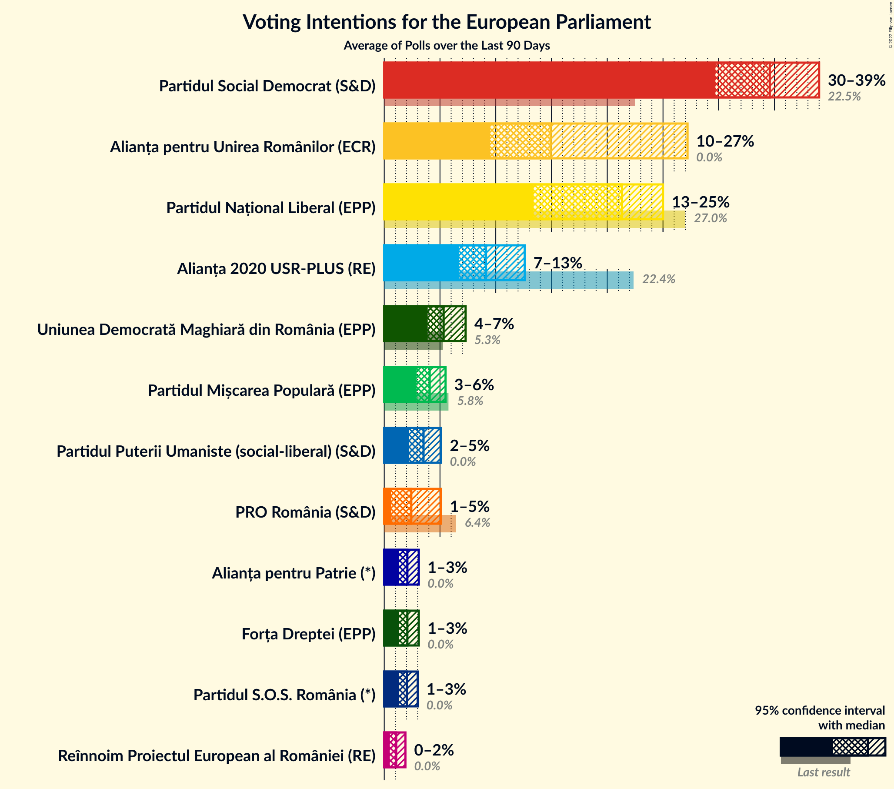

### Confidence Intervals

| Party | Last Result | Median | 80% Confidence Interval | 90% Confidence Interval | 95% Confidence Interval | 99% Confidence Interval |
|:-----:|:-----------:|:------:|:-----------------------:|:-----------------------:|:-----------------------:|:-----------------------:|
| <a href="#partidul-național-liberal-(epp)">Partidul Național Liberal (EPP)</a> | 27.0% | 21.3% | 14.4–23.8% |13.8–24.4% | 13.4–25.0% | 12.6–26.0% |
| <a href="#partidul-social-democrat-(s&d)">Partidul Social Democrat (S&D)</a> | 22.5% | 34.6% | 31.1–37.7% |30.4–38.4% | 29.7–39.0% | 28.6–40.2% |
| <a href="#alianța-2020-usr-plus-(re)">Alianța 2020 USR-PLUS (RE)</a> | 22.4% | 9.1% | 7.4–11.6% |7.0–12.2% | 6.7–12.6% | 6.2–13.5% |
| <a href="#partidul-libertății,-unității-și-solidarității-(re)">Partidul Libertății, Unității și Solidarității (RE)</a> | 22.4% | N/A | N/A |N/A | N/A | N/A |
| <a href="#uniunea-salvați-românia-(re)">Uniunea Salvați România (RE)</a> | 22.4% | N/A | N/A |N/A | N/A | N/A |
| <a href="#pro-românia-(s&d)">PRO România (S&D)</a> | 6.4% | 2.4% | 0.8–4.5% |0.7–4.8% | 0.6–5.1% | 0.5–5.6% |
| <a href="#partidul-mișcarea-populară-(epp)">Partidul Mișcarea Populară (EPP)</a> | 5.8% | 4.1% | 3.3–5.0% |3.1–5.2% | 2.9–5.5% | 2.6–6.0% |
| <a href="#uniunea-democrată-maghiară-din-românia-(epp)">Uniunea Democrată Maghiară din România (EPP)</a> | 5.3% | 5.3% | 4.3–6.6% |4.1–7.0% | 3.9–7.3% | 3.5–7.9% |
| <a href="#partidul-alianța-liberalilor-și-democraților-(*)">Partidul Alianța Liberalilor și Democraților (*)</a> | 4.1% | N/A | N/A |N/A | N/A | N/A |
| <a href="#alianța-pentru-unirea-românilor-(ecr)">Alianța pentru Unirea Românilor (ECR)</a> | 0.0% | 14.9% | 10.4–25.8% |9.9–26.5% | 9.5–27.2% | 8.8–28.3% |
| <a href="#partidul-puterii-umaniste-(social-liberal)-(s&d)">Partidul Puterii Umaniste (social-liberal) (S&D)</a> | 0.0% | 3.5% | 2.6–4.6% |2.4–4.9% | 2.2–5.1% | 1.9–5.6% |
| <a href="#partidul-ecologist-român-(*)">Partidul Ecologist Român (*)</a> | 0.0% | N/A | N/A |N/A | N/A | N/A |
| <a href="#alianța-pentru-patrie-(*)">Alianța pentru Patrie (*)</a> | 0.0% | 2.1% | 1.5–2.7% |1.4–2.9% | 1.3–3.1% | 1.1–3.5% |
| <a href="#forța-dreptei-(epp)">Forța Dreptei (EPP)</a> | 0.0% | 2.1% | 1.5–2.7% |1.4–2.9% | 1.3–3.1% | 1.1–3.5% |
| <a href="#reînnoim-proiectul-european-al-româniei-(re)">Reînnoim Proiectul European al României (RE)</a> | 0.0% | 1.1% | 0.7–1.6% |0.6–1.7% | 0.5–1.9% | 0.4–2.2% |
| <a href="#partidul-s.o.s.-românia-(*)">Partidul S.O.S. România (*)</a> | 0.0% | 2.0% | 1.5–2.7% |1.4–2.8% | 1.3–3.0% | 1.1–3.4% |

### Partidul Național Liberal (EPP)

*For a full overview of the results for this party, see the [Partidul Național Liberal (EPP)](party-partidulnaționalliberalepp.html) page.*

| Voting Intentions | Probability | Accumulated | Special Marks |
|:-----------------:|:-----------:|:-----------:|:-------------:|
| 10.5–11.5% | 0% | 100% |  |
| 11.5–12.5% | 0.4% | 100% |  |
| 12.5–13.5% | 3% | 99.5% |  |
| 13.5–14.5% | 8% | 97% |  |
| 14.5–15.5% | 11% | 89% |  |
| 15.5–16.5% | 8% | 78% |  |
| 16.5–17.5% | 3% | 70% |  |
| 17.5–18.5% | 0.9% | 67% |  |
| 18.5–19.5% | 1.4% | 67% |  |
| 19.5–20.5% | 5% | 65% |  |
| 20.5–21.5% | 13% | 60% | Median |
| 21.5–22.5% | 18% | 47% |  |
| 22.5–23.5% | 15% | 29% |  |
| 23.5–24.5% | 9% | 13% |  |
| 24.5–25.5% | 3% | 4% |  |
| 25.5–26.5% | 0.9% | 1.0% |  |
| 26.5–27.5% | 0.2% | 0.2% | Last Result |
| 27.5–28.5% | 0% | 0% |  |

### Partidul Social Democrat (S&D)

*For a full overview of the results for this party, see the [Partidul Social Democrat (S&D)](party-partidulsocialdemocratsd.html) page.*

| Voting Intentions | Probability | Accumulated | Special Marks |
|:-----------------:|:-----------:|:-----------:|:-------------:|
| 22.5–23.5% | 0% | 100% | Last Result |
| 23.5–24.5% | 0% | 100% |  |
| 24.5–25.5% | 0% | 100% |  |
| 25.5–26.5% | 0% | 100% |  |
| 26.5–27.5% | 0.1% | 100% |  |
| 27.5–28.5% | 0.4% | 99.9% |  |
| 28.5–29.5% | 2% | 99.6% |  |
| 29.5–30.5% | 4% | 98% |  |
| 30.5–31.5% | 8% | 94% |  |
| 31.5–32.5% | 10% | 86% |  |
| 32.5–33.5% | 12% | 76% |  |
| 33.5–34.5% | 14% | 64% |  |
| 34.5–35.5% | 15% | 50% | Median |
| 35.5–36.5% | 14% | 35% |  |
| 36.5–37.5% | 11% | 22% |  |
| 37.5–38.5% | 6% | 11% |  |
| 38.5–39.5% | 3% | 4% |  |
| 39.5–40.5% | 1.0% | 1.3% |  |
| 40.5–41.5% | 0.2% | 0.3% |  |
| 41.5–42.5% | 0% | 0% |  |
| 42.5–43.5% | 0% | 0% |  |

### Alianța 2020 USR-PLUS (RE)

*For a full overview of the results for this party, see the [Alianța 2020 USR-PLUS (RE)](party-alianța2020usr-plusre.html) page.*

| Voting Intentions | Probability | Accumulated | Special Marks |
|:-----------------:|:-----------:|:-----------:|:-------------:|
| 4.5–5.5% | 0% | 100% |  |
| 5.5–6.5% | 1.5% | 100% |  |
| 6.5–7.5% | 11% | 98.5% |  |
| 7.5–8.5% | 24% | 87% |  |
| 8.5–9.5% | 22% | 63% | Median |
| 9.5–10.5% | 16% | 41% |  |
| 10.5–11.5% | 14% | 25% |  |
| 11.5–12.5% | 8% | 11% |  |
| 12.5–13.5% | 3% | 3% |  |
| 13.5–14.5% | 0.4% | 0.4% |  |
| 14.5–15.5% | 0% | 0% |  |
| 15.5–16.5% | 0% | 0% |  |
| 16.5–17.5% | 0% | 0% |  |
| 17.5–18.5% | 0% | 0% |  |
| 18.5–19.5% | 0% | 0% |  |
| 19.5–20.5% | 0% | 0% |  |
| 20.5–21.5% | 0% | 0% |  |
| 21.5–22.5% | 0% | 0% | Last Result |

### PRO România (S&D)

*For a full overview of the results for this party, see the [PRO România (S&D)](party-proromâniasd.html) page.*

| Voting Intentions | Probability | Accumulated | Special Marks |
|:-----------------:|:-----------:|:-----------:|:-------------:|
| 0.0–0.5% | 1.5% | 100% |  |
| 0.5–1.5% | 43% | 98.5% |  |
| 1.5–2.5% | 5% | 55% | Median |
| 2.5–3.5% | 11% | 50% |  |
| 3.5–4.5% | 29% | 39% |  |
| 4.5–5.5% | 9% | 10% |  |
| 5.5–6.5% | 0.6% | 0.6% | Last Result |
| 6.5–7.5% | 0% | 0% |  |

### Partidul Mișcarea Populară (EPP)

*For a full overview of the results for this party, see the [Partidul Mișcarea Populară (EPP)](party-partidulmișcareapopularăepp.html) page.*

| Voting Intentions | Probability | Accumulated | Special Marks |
|:-----------------:|:-----------:|:-----------:|:-------------:|
| 0.5–1.5% | 0% | 100% |  |
| 1.5–2.5% | 0.4% | 100% |  |
| 2.5–3.5% | 20% | 99.6% |  |
| 3.5–4.5% | 56% | 79% | Median |
| 4.5–5.5% | 22% | 24% |  |
| 5.5–6.5% | 2% | 2% | Last Result |
| 6.5–7.5% | 0.1% | 0.1% |  |
| 7.5–8.5% | 0% | 0% |  |

### Uniunea Democrată Maghiară din România (EPP)

*For a full overview of the results for this party, see the [Uniunea Democrată Maghiară din România (EPP)](party-uniuneademocratămaghiarădinromâniaepp.html) page.*

| Voting Intentions | Probability | Accumulated | Special Marks |
|:-----------------:|:-----------:|:-----------:|:-------------:|
| 1.5–2.5% | 0% | 100% |  |
| 2.5–3.5% | 0.7% | 100% |  |
| 3.5–4.5% | 17% | 99.3% |  |
| 4.5–5.5% | 43% | 83% | Last Result, Median |
| 5.5–6.5% | 30% | 40% |  |
| 6.5–7.5% | 9% | 10% |  |
| 7.5–8.5% | 1.3% | 1.4% |  |
| 8.5–9.5% | 0.1% | 0.1% |  |
| 9.5–10.5% | 0% | 0% |  |

### Alianța pentru Unirea Românilor (ECR)

*For a full overview of the results for this party, see the [Alianța pentru Unirea Românilor (ECR)](party-alianțapentruunirearomânilorecr.html) page.*

| Voting Intentions | Probability | Accumulated | Special Marks |
|:-----------------:|:-----------:|:-----------:|:-------------:|
| 0.0–0.5% | 0% | 100% | Last Result |
| 0.5–1.5% | 0% | 100% |  |
| 1.5–2.5% | 0% | 100% |  |
| 2.5–3.5% | 0% | 100% |  |
| 3.5–4.5% | 0% | 100% |  |
| 4.5–5.5% | 0% | 100% |  |
| 5.5–6.5% | 0% | 100% |  |
| 6.5–7.5% | 0% | 100% |  |
| 7.5–8.5% | 0.2% | 100% |  |
| 8.5–9.5% | 3% | 99.8% |  |
| 9.5–10.5% | 9% | 97% |  |
| 10.5–11.5% | 12% | 88% |  |
| 11.5–12.5% | 8% | 76% |  |
| 12.5–13.5% | 5% | 69% |  |
| 13.5–14.5% | 9% | 64% |  |
| 14.5–15.5% | 11% | 54% | Median |
| 15.5–16.5% | 7% | 43% |  |
| 16.5–17.5% | 2% | 36% |  |
| 17.5–18.5% | 0.4% | 34% |  |
| 18.5–19.5% | 0% | 33% |  |
| 19.5–20.5% | 0% | 33% |  |
| 20.5–21.5% | 0.2% | 33% |  |
| 21.5–22.5% | 1.2% | 33% |  |
| 22.5–23.5% | 4% | 32% |  |
| 23.5–24.5% | 7% | 28% |  |
| 24.5–25.5% | 9% | 21% |  |
| 25.5–26.5% | 7% | 12% |  |
| 26.5–27.5% | 4% | 5% |  |
| 27.5–28.5% | 1.2% | 1.5% |  |
| 28.5–29.5% | 0.3% | 0.3% |  |
| 29.5–30.5% | 0% | 0% |  |
| 30.5–31.5% | 0% | 0% |  |

### Partidul Puterii Umaniste (social-liberal) (S&D)

*For a full overview of the results for this party, see the [Partidul Puterii Umaniste (social-liberal) (S&D)](party-partidulputeriiumanistesocial-liberalsd.html) page.*

| Voting Intentions | Probability | Accumulated | Special Marks |
|:-----------------:|:-----------:|:-----------:|:-------------:|
| 0.0–0.5% | 0% | 100% | Last Result |
| 0.5–1.5% | 0% | 100% |  |
| 1.5–2.5% | 8% | 100% |  |
| 2.5–3.5% | 42% | 92% |  |
| 3.5–4.5% | 39% | 49% | Median |
| 4.5–5.5% | 10% | 10% |  |
| 5.5–6.5% | 0.6% | 0.6% |  |
| 6.5–7.5% | 0% | 0% |  |

### Partidul S.O.S. România (*)

*For a full overview of the results for this party, see the [Partidul S.O.S. România (*)](party-partidulsosromânia.html) page.*

| Voting Intentions | Probability | Accumulated | Special Marks |
|:-----------------:|:-----------:|:-----------:|:-------------:|
| 0.0–0.5% | 0% | 100% | Last Result |
| 0.5–1.5% | 12% | 100% |  |
| 1.5–2.5% | 74% | 88% | Median |
| 2.5–3.5% | 14% | 14% |  |
| 3.5–4.5% | 0.2% | 0.2% |  |
| 4.5–5.5% | 0% | 0% |  |

### Alianța pentru Patrie (*)

*For a full overview of the results for this party, see the [Alianța pentru Patrie (*)](party-alianțapentrupatrie.html) page.*

| Voting Intentions | Probability | Accumulated | Special Marks |
|:-----------------:|:-----------:|:-----------:|:-------------:|
| 0.0–0.5% | 0% | 100% | Last Result |
| 0.5–1.5% | 12% | 100% |  |
| 1.5–2.5% | 71% | 88% | Median |
| 2.5–3.5% | 17% | 17% |  |
| 3.5–4.5% | 0.5% | 0.5% |  |
| 4.5–5.5% | 0% | 0% |  |

### Forța Dreptei (EPP)

*For a full overview of the results for this party, see the [Forța Dreptei (EPP)](party-forțadrepteiepp.html) page.*

| Voting Intentions | Probability | Accumulated | Special Marks |
|:-----------------:|:-----------:|:-----------:|:-------------:|
| 0.0–0.5% | 0% | 100% | Last Result |
| 0.5–1.5% | 12% | 100% |  |
| 1.5–2.5% | 71% | 88% | Median |
| 2.5–3.5% | 17% | 17% |  |
| 3.5–4.5% | 0.5% | 0.5% |  |
| 4.5–5.5% | 0% | 0% |  |

### Reînnoim Proiectul European al României (RE)

*For a full overview of the results for this party, see the [Reînnoim Proiectul European al României (RE)](party-reînnoimproiectuleuropeanalromânieire.html) page.*

| Voting Intentions | Probability | Accumulated | Special Marks |
|:-----------------:|:-----------:|:-----------:|:-------------:|
| 0.0–0.5% | 3% | 100% | Last Result |
| 0.5–1.5% | 86% | 97% | Median |
| 1.5–2.5% | 11% | 11% |  |
| 2.5–3.5% | 0.1% | 0.1% |  |
| 3.5–4.5% | 0% | 0% |  |

## Seats

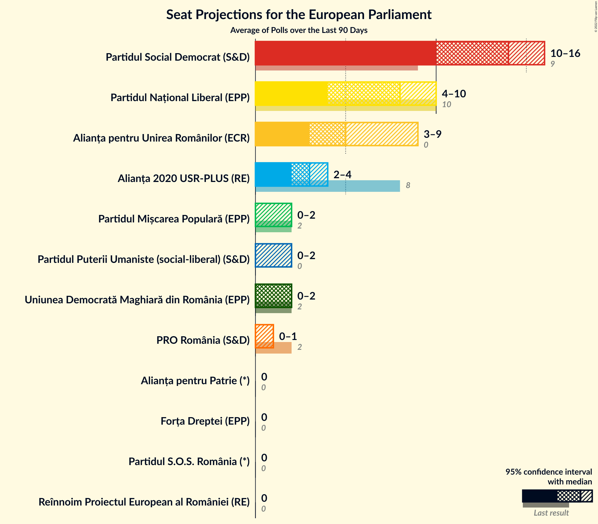

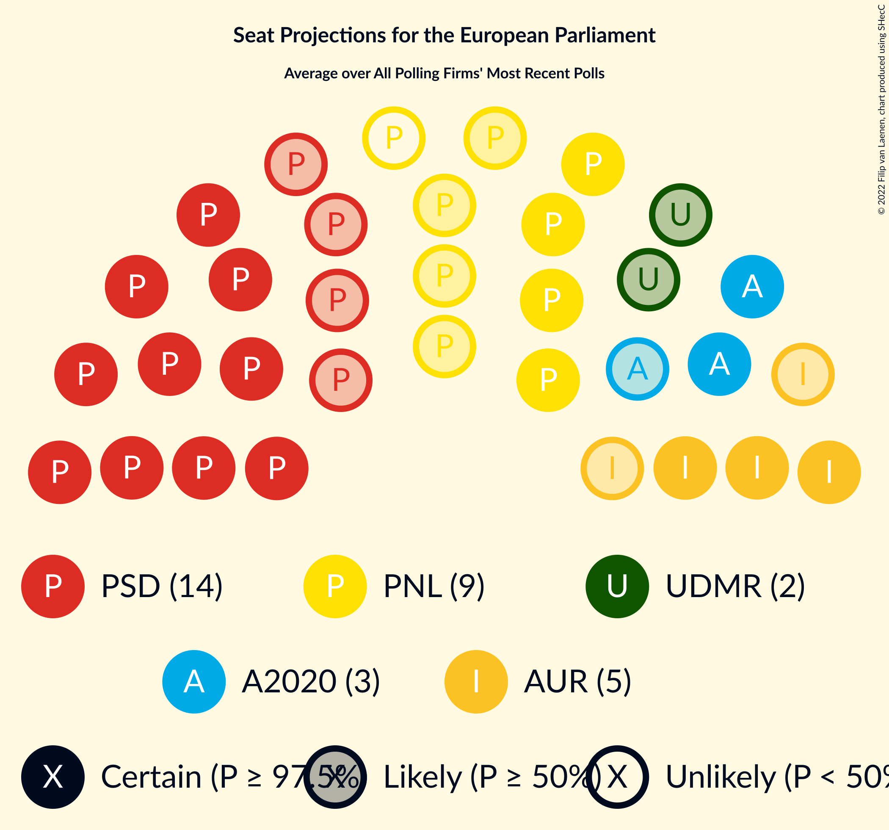

### Confidence Intervals

| Party | Last Result | Median | 80% Confidence Interval | 90% Confidence Interval | 95% Confidence Interval | 99% Confidence Interval |
|:-----:|:-----------:|:------:|:-----------------------:|:-----------------------:|:-----------------------:|:-----------------------:|
| <a href="#partidul-național-liberal-(epp)">Partidul Național Liberal (EPP)</a> | 10 | 8 | 5–10 |4–10 | 4–10 | 4–11 |
| <a href="#partidul-social-democrat-(s&d)">Partidul Social Democrat (S&D)</a> | 9 | 14 | 11–16 |10–16 | 10–16 | 10–17 |
| <a href="#alianța-2020-usr-plus-(re)">Alianța 2020 USR-PLUS (RE)</a> | 8 | 3 | 2–4 |2–4 | 2–4 | 2–4 |
| <a href="#partidul-libertății,-unității-și-solidarității-(re)">Partidul Libertății, Unității și Solidarității (RE)</a> | 4 | N/A | N/A |N/A | N/A | N/A |
| <a href="#uniunea-salvați-românia-(re)">Uniunea Salvați România (RE)</a> | 4 | N/A | N/A |N/A | N/A | N/A |
| <a href="#pro-românia-(s&d)">PRO România (S&D)</a> | 2 | 0 | 0 |0 | 0–1 | 0–2 |
| <a href="#partidul-mișcarea-populară-(epp)">Partidul Mișcarea Populară (EPP)</a> | 2 | 0 | 0 |0–2 | 0–2 | 0–2 |
| <a href="#uniunea-democrată-maghiară-din-românia-(epp)">Uniunea Democrată Maghiară din România (EPP)</a> | 2 | 2 | 0–2 |0–2 | 0–2 | 0–2 |
| <a href="#partidul-alianța-liberalilor-și-democraților-(*)">Partidul Alianța Liberalilor și Democraților (*)</a> | 0 | N/A | N/A |N/A | N/A | N/A |
| <a href="#alianța-pentru-unirea-românilor-(ecr)">Alianța pentru Unirea Românilor (ECR)</a> | 0 | 5 | 4–9 |4–9 | 3–9 | 3–10 |
| <a href="#partidul-puterii-umaniste-(social-liberal)-(s&d)">Partidul Puterii Umaniste (social-liberal) (S&D)</a> | 0 | 0 | 0 |0 | 0–2 | 0–2 |
| <a href="#partidul-ecologist-român-(*)">Partidul Ecologist Român (*)</a> | 0 | N/A | N/A |N/A | N/A | N/A |
| <a href="#alianța-pentru-patrie-(*)">Alianța pentru Patrie (*)</a> | 0 | 0 | 0 |0 | 0 | 0 |
| <a href="#forța-dreptei-(epp)">Forța Dreptei (EPP)</a> | 0 | 0 | 0 |0 | 0 | 0 |
| <a href="#reînnoim-proiectul-european-al-româniei-(re)">Reînnoim Proiectul European al României (RE)</a> | 0 | 0 | 0 |0 | 0 | 0 |
| <a href="#partidul-s.o.s.-românia-(*)">Partidul S.O.S. România (*)</a> | 0 | 0 | 0 |0 | 0 | 0 |

### Partidul Național Liberal (EPP)

*For a full overview of the results for this party, see the [Partidul Național Liberal (EPP)](party-partidulnaționalliberalepp.html) page.*

| Number of Seats | Probability | Accumulated | Special Marks |
|:---------------:|:-----------:|:-----------:|:-------------:|
| 4 | 6% | 100% |  |
| 5 | 24% | 94% |  |
| 6 | 3% | 70% |  |
| 7 | 3% | 67% |  |
| 8 | 26% | 64% | Median |
| 9 | 26% | 38% |  |
| 10 | 12% | 12% | Last Result |
| 11 | 0.6% | 0.6% |  |
| 12 | 0% | 0% |  |

### Partidul Social Democrat (S&D)

*For a full overview of the results for this party, see the [Partidul Social Democrat (S&D)](party-partidulsocialdemocratsd.html) page.*

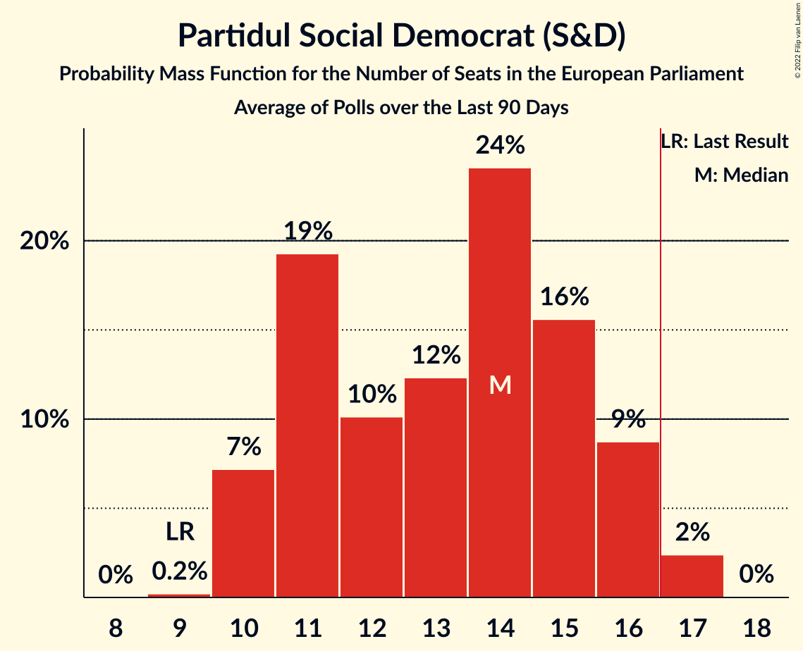

| Number of Seats | Probability | Accumulated | Special Marks |
|:---------------:|:-----------:|:-----------:|:-------------:|
| 9 | 0.2% | 100% | Last Result |
| 10 | 7% | 99.8% |  |
| 11 | 19% | 93% |  |
| 12 | 10% | 73% |  |
| 13 | 12% | 63% |  |
| 14 | 24% | 51% | Median |
| 15 | 16% | 27% |  |
| 16 | 9% | 11% |  |
| 17 | 2% | 2% | Majority |
| 18 | 0% | 0% |  |

### Alianța 2020 USR-PLUS (RE)

*For a full overview of the results for this party, see the [Alianța 2020 USR-PLUS (RE)](party-alianța2020usr-plusre.html) page.*

| Number of Seats | Probability | Accumulated | Special Marks |
|:---------------:|:-----------:|:-----------:|:-------------:|
| 2 | 13% | 100% |  |
| 3 | 56% | 87% | Median |
| 4 | 30% | 31% |  |
| 5 | 0.4% | 0.4% |  |
| 6 | 0% | 0% |  |
| 7 | 0% | 0% |  |
| 8 | 0% | 0% | Last Result |

### Partidul Libertății, Unității și Solidarității (RE)

*For a full overview of the results for this party, see the [Partidul Libertății, Unității și Solidarității (RE)](party-partidullibertățiiunitățiișisolidaritățiire.html) page.*

### Uniunea Salvați România (RE)

*For a full overview of the results for this party, see the [Uniunea Salvați România (RE)](party-uniuneasalvațiromâniare.html) page.*

### PRO România (S&D)

*For a full overview of the results for this party, see the [PRO România (S&D)](party-proromâniasd.html) page.*

| Number of Seats | Probability | Accumulated | Special Marks |
|:---------------:|:-----------:|:-----------:|:-------------:|
| 0 | 97% | 100% | Median |
| 1 | 1.1% | 3% |  |
| 2 | 2% | 2% | Last Result |
| 3 | 0% | 0% |  |

### Partidul Mișcarea Populară (EPP)

*For a full overview of the results for this party, see the [Partidul Mișcarea Populară (EPP)](party-partidulmișcareapopularăepp.html) page.*

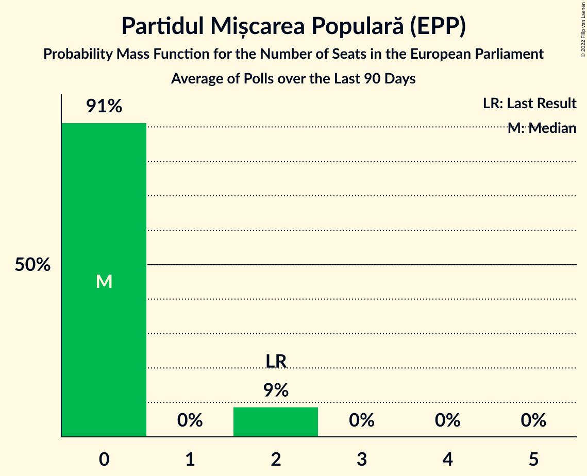

| Number of Seats | Probability | Accumulated | Special Marks |
|:---------------:|:-----------:|:-----------:|:-------------:|
| 0 | 91% | 100% | Median |
| 1 | 0% | 9% |  |
| 2 | 9% | 9% | Last Result |
| 3 | 0% | 0% |  |

### Uniunea Democrată Maghiară din România (EPP)

*For a full overview of the results for this party, see the [Uniunea Democrată Maghiară din România (EPP)](party-uniuneademocratămaghiarădinromâniaepp.html) page.*

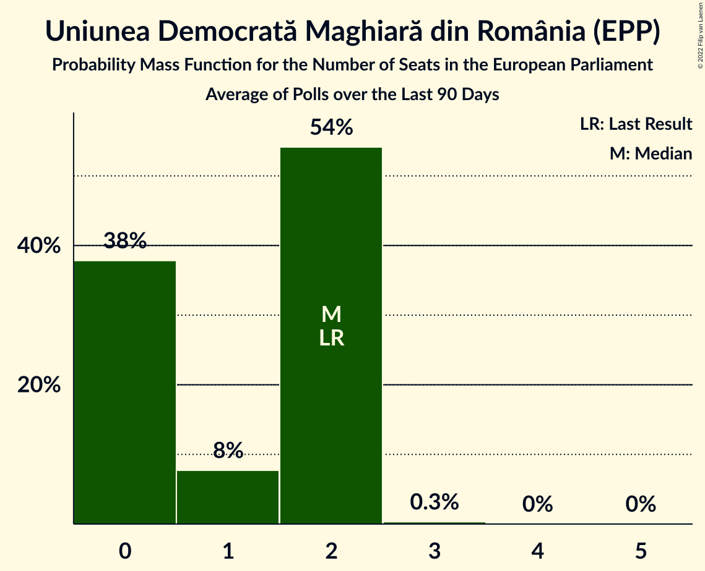

| Number of Seats | Probability | Accumulated | Special Marks |
|:---------------:|:-----------:|:-----------:|:-------------:|
| 0 | 38% | 100% |  |
| 1 | 8% | 62% |  |
| 2 | 54% | 54% | Last Result, Median |
| 3 | 0.3% | 0.3% |  |
| 4 | 0% | 0% |  |

### Partidul Alianța Liberalilor și Democraților (*)

*For a full overview of the results for this party, see the [Partidul Alianța Liberalilor și Democraților (*)](party-partidulalianțaliberalilorșidemocraților.html) page.*

### Alianța pentru Unirea Românilor (ECR)

*For a full overview of the results for this party, see the [Alianța pentru Unirea Românilor (ECR)](party-alianțapentruunirearomânilorecr.html) page.*

| Number of Seats | Probability | Accumulated | Special Marks |
|:---------------:|:-----------:|:-----------:|:-------------:|
| 0 | 0% | 100% | Last Result |
| 1 | 0% | 100% |  |
| 2 | 0% | 100% |  |
| 3 | 3% | 100% |  |
| 4 | 21% | 97% |  |
| 5 | 26% | 76% | Median |
| 6 | 15% | 49% |  |
| 7 | 2% | 34% |  |
| 8 | 16% | 32% |  |
| 9 | 15% | 16% |  |
| 10 | 1.3% | 1.3% |  |
| 11 | 0% | 0% |  |

### Partidul Puterii Umaniste (social-liberal) (S&D)

*For a full overview of the results for this party, see the [Partidul Puterii Umaniste (social-liberal) (S&D)](party-partidulputeriiumanistesocial-liberalsd.html) page.*

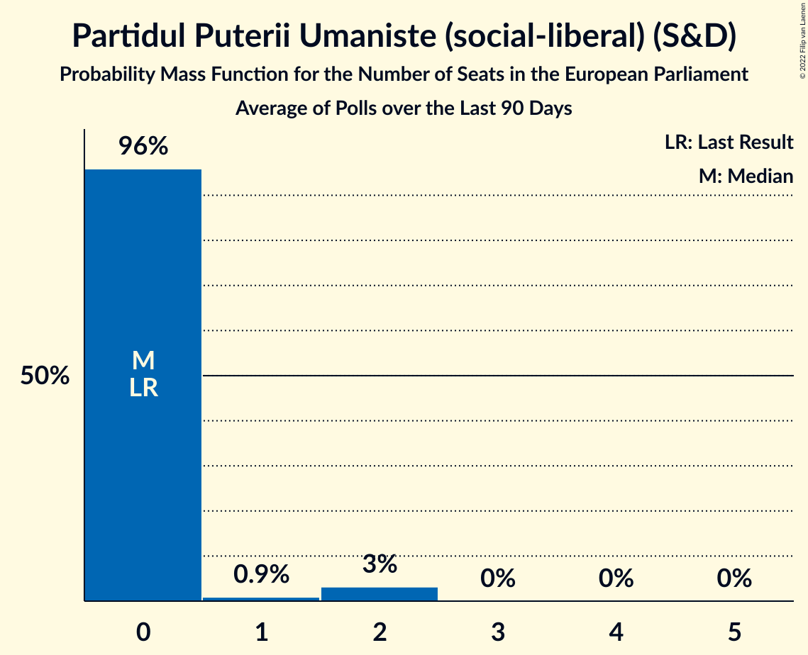

| Number of Seats | Probability | Accumulated | Special Marks |
|:---------------:|:-----------:|:-----------:|:-------------:|
| 0 | 96% | 100% | Last Result, Median |
| 1 | 0.9% | 4% |  |
| 2 | 3% | 3% |  |
| 3 | 0% | 0% |  |

### Partidul Ecologist Român (*)

*For a full overview of the results for this party, see the [Partidul Ecologist Român (*)](party-partidulecologistromân.html) page.*

### Alianța pentru Patrie (*)

*For a full overview of the results for this party, see the [Alianța pentru Patrie (*)](party-alianțapentrupatrie.html) page.*

| Number of Seats | Probability | Accumulated | Special Marks |
|:---------------:|:-----------:|:-----------:|:-------------:|
| 0 | 100% | 100% | Last Result, Median |

### Forța Dreptei (EPP)

*For a full overview of the results for this party, see the [Forța Dreptei (EPP)](party-forțadrepteiepp.html) page.*

| Number of Seats | Probability | Accumulated | Special Marks |
|:---------------:|:-----------:|:-----------:|:-------------:|
| 0 | 100% | 100% | Last Result, Median |

### Reînnoim Proiectul European al României (RE)

*For a full overview of the results for this party, see the [Reînnoim Proiectul European al României (RE)](party-reînnoimproiectuleuropeanalromânieire.html) page.*

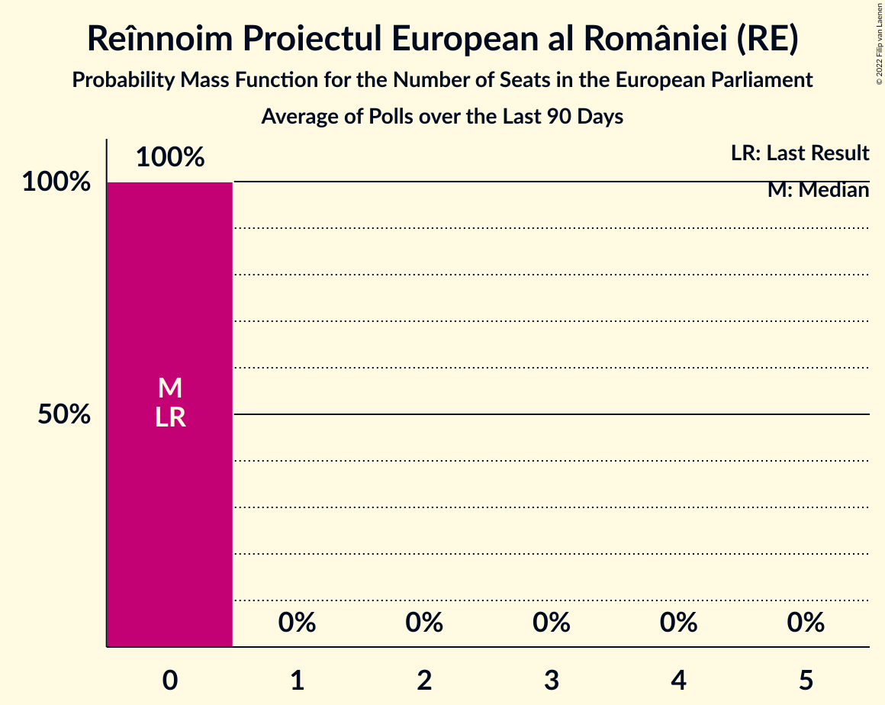

| Number of Seats | Probability | Accumulated | Special Marks |
|:---------------:|:-----------:|:-----------:|:-------------:|
| 0 | 100% | 100% | Last Result, Median |

### Partidul S.O.S. România (*)

*For a full overview of the results for this party, see the [Partidul S.O.S. România (*)](party-partidulsosromânia.html) page.*

| Number of Seats | Probability | Accumulated | Special Marks |
|:---------------:|:-----------:|:-----------:|:-------------:|
| 0 | 100% | 100% | Last Result, Median |

## Coalitions

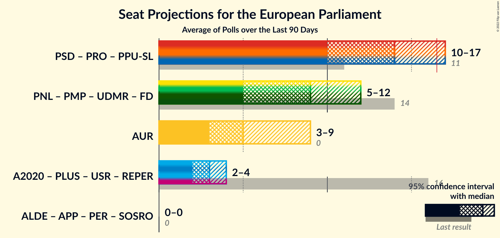

### Confidence Intervals

| Coalition | Last Result | Median | Majority? | 80% Confidence Interval | 90% Confidence Interval | 95% Confidence Interval | 99% Confidence Interval |
|:---------:|:-----------:|:------:|:---------:|:-----------------------:|:-----------------------:|:-----------------------:|:-----------------------:|
| Partidul Social Democrat (S&D) – PRO România (S&D) – Partidul Puterii Umaniste (social-liberal) (S&D) | 11 | 14 | 3% | 11–16 | 10–16 | 10–17 | 10–17 |
| Partidul Național Liberal (EPP) – Partidul Mișcarea Populară (EPP) – Uniunea Democrată Maghiară din România (EPP) – Forța Dreptei (EPP) | 14 | 9 | 0% | 6–11 | 6–12 | 5–12 | 5–13 |
| Alianța pentru Unirea Românilor (ECR) | 0 | 5 | 0% | 4–9 | 4–9 | 3–9 | 3–10 |
| Alianța 2020 USR-PLUS (RE) – Partidul Libertății, Unității și Solidarității (RE) – Uniunea Salvați România (RE) – Reînnoim Proiectul European al României (RE) | 16 | 3 | 0% | 2–4 | 2–4 | 2–4 | 2–4 |
| Partidul Alianța Liberalilor și Democraților (*) – Alianța pentru Patrie (*) – Partidul Ecologist Român (*) – Partidul S.O.S. România (*) | 0 | 0 | 0% | 0 | 0 | 0 | 0 |

### Partidul Social Democrat (S&D) – PRO România (S&D) – Partidul Puterii Umaniste (social-liberal) (S&D)

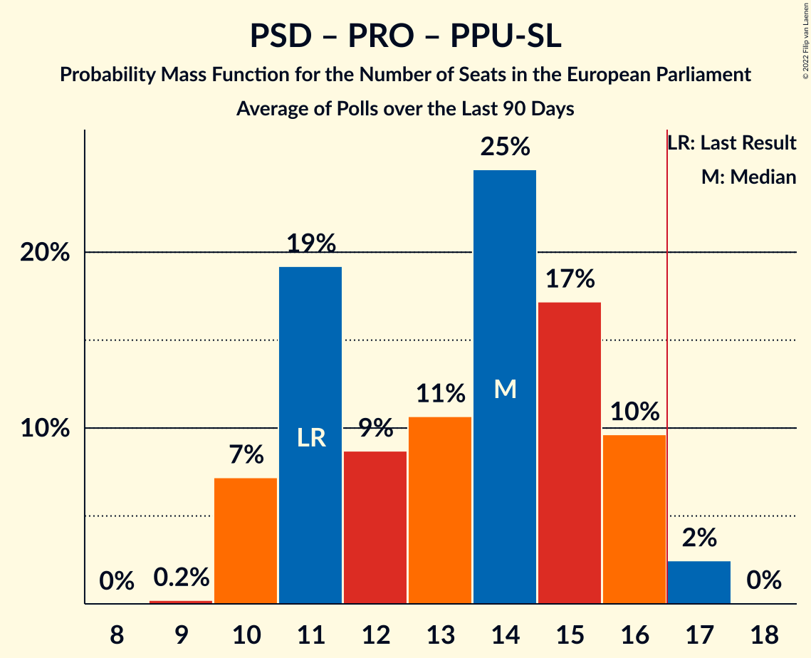

| Number of Seats | Probability | Accumulated | Special Marks |
|:---------------:|:-----------:|:-----------:|:-------------:|
| 9 | 0.2% | 100% |  |
| 10 | 7% | 99.8% |  |
| 11 | 19% | 93% | Last Result |
| 12 | 9% | 73% |  |
| 13 | 11% | 65% |  |
| 14 | 25% | 54% | Median |
| 15 | 17% | 29% |  |
| 16 | 10% | 12% |  |
| 17 | 2% | 3% | Majority |
| 18 | 0% | 0% |  |

### Partidul Național Liberal (EPP) – Partidul Mișcarea Populară (EPP) – Uniunea Democrată Maghiară din România (EPP) – Forța Dreptei (EPP)

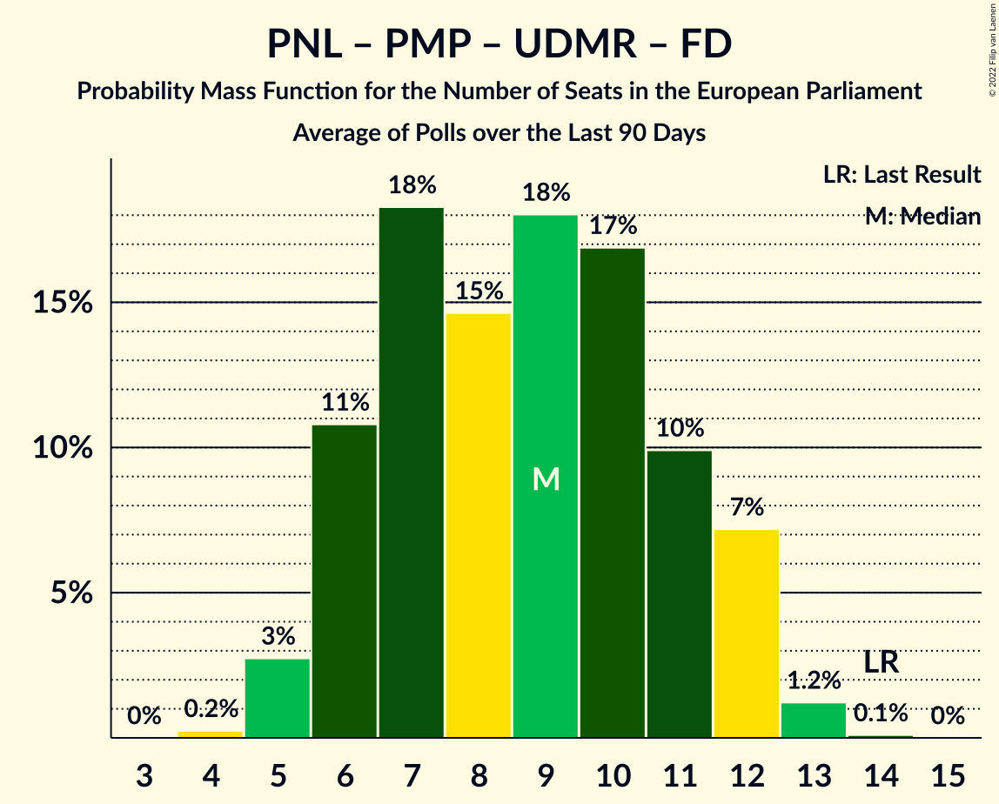

| Number of Seats | Probability | Accumulated | Special Marks |
|:---------------:|:-----------:|:-----------:|:-------------:|
| 4 | 0.2% | 100% |  |
| 5 | 3% | 99.8% |  |
| 6 | 11% | 97% |  |
| 7 | 18% | 86% |  |
| 8 | 15% | 68% |  |
| 9 | 18% | 53% |  |
| 10 | 17% | 35% | Median |
| 11 | 10% | 18% |  |
| 12 | 7% | 9% |  |
| 13 | 1.2% | 1.3% |  |
| 14 | 0.1% | 0.1% | Last Result |
| 15 | 0% | 0% |  |

### Alianța pentru Unirea Românilor (ECR)

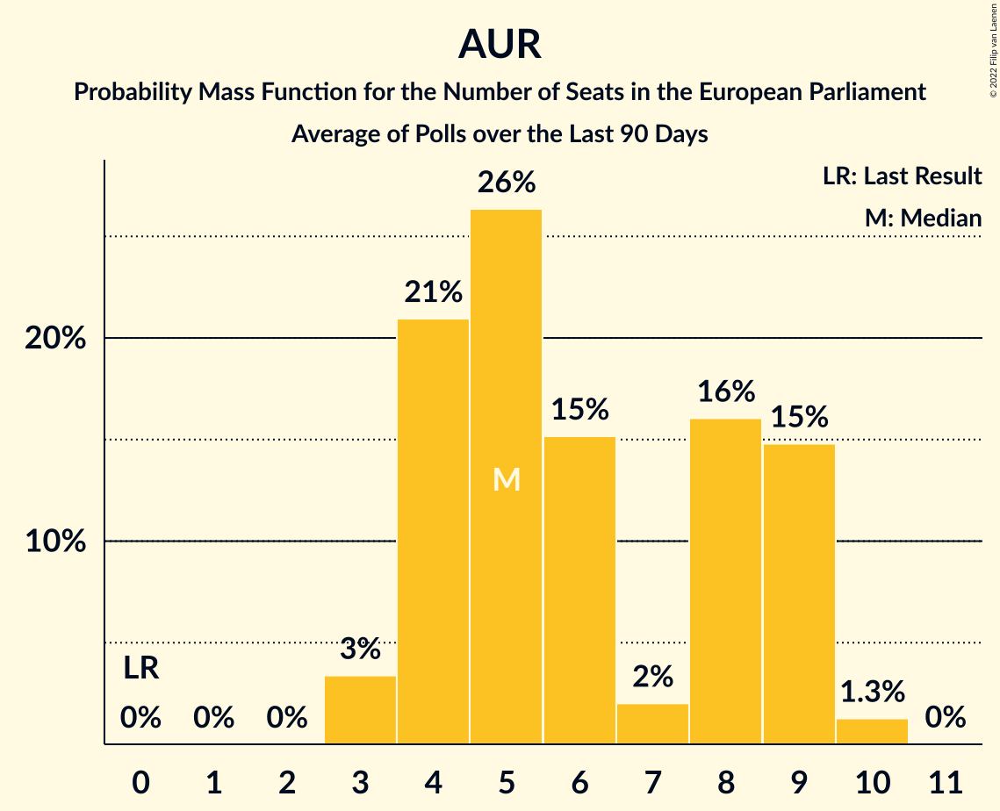

| Number of Seats | Probability | Accumulated | Special Marks |
|:---------------:|:-----------:|:-----------:|:-------------:|
| 0 | 0% | 100% | Last Result |
| 1 | 0% | 100% |  |
| 2 | 0% | 100% |  |
| 3 | 3% | 100% |  |
| 4 | 21% | 97% |  |
| 5 | 26% | 76% | Median |
| 6 | 15% | 49% |  |
| 7 | 2% | 34% |  |
| 8 | 16% | 32% |  |
| 9 | 15% | 16% |  |
| 10 | 1.3% | 1.3% |  |
| 11 | 0% | 0% |  |

### Alianța 2020 USR-PLUS (RE) – Partidul Libertății, Unității și Solidarității (RE) – Uniunea Salvați România (RE) – Reînnoim Proiectul European al României (RE)

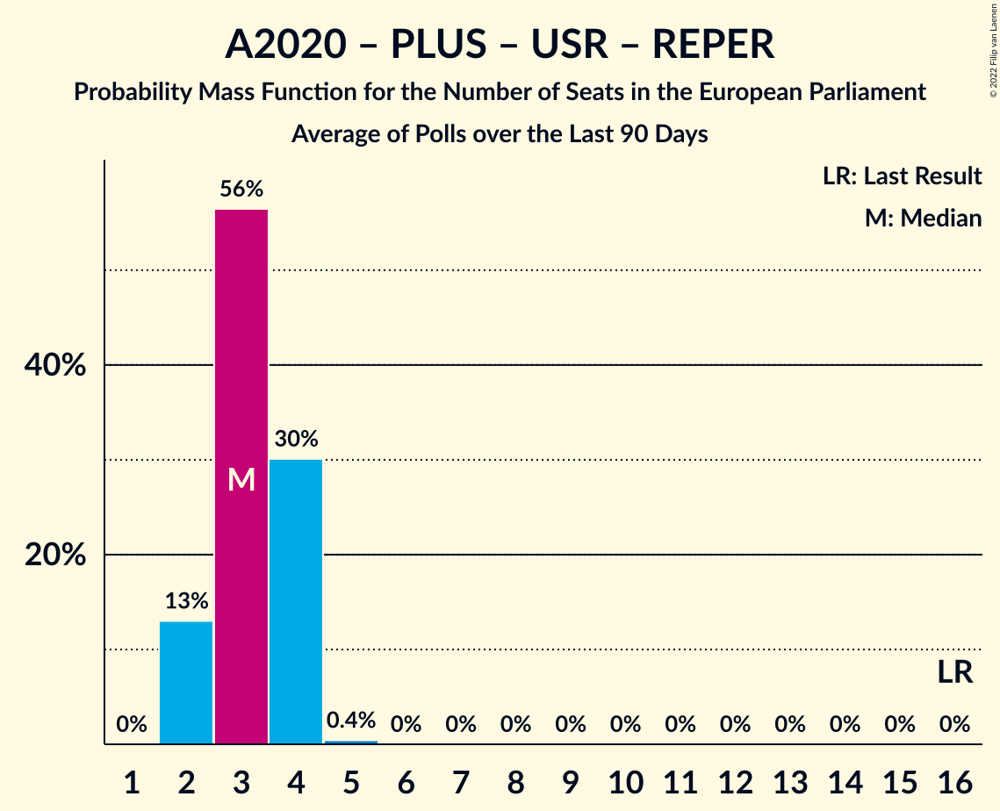

| Number of Seats | Probability | Accumulated | Special Marks |
|:---------------:|:-----------:|:-----------:|:-------------:|
| 2 | 13% | 100% |  |
| 3 | 56% | 87% | Median |
| 4 | 30% | 31% |  |
| 5 | 0.4% | 0.4% |  |
| 6 | 0% | 0% |  |
| 7 | 0% | 0% |  |
| 8 | 0% | 0% |  |
| 9 | 0% | 0% |  |
| 10 | 0% | 0% |  |
| 11 | 0% | 0% |  |
| 12 | 0% | 0% |  |
| 13 | 0% | 0% |  |
| 14 | 0% | 0% |  |
| 15 | 0% | 0% |  |
| 16 | 0% | 0% | Last Result |

### Partidul Alianța Liberalilor și Democraților (*) – Alianța pentru Patrie (*) – Partidul Ecologist Român (*) – Partidul S.O.S. România (*)

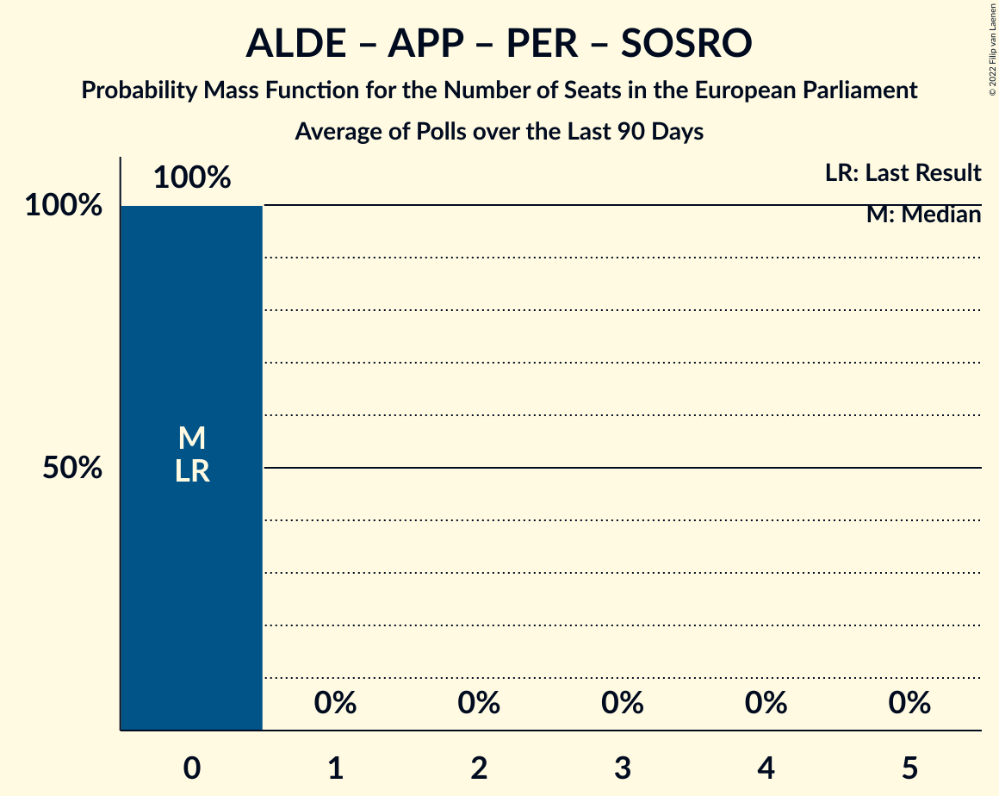

| Number of Seats | Probability | Accumulated | Special Marks |
|:---------------:|:-----------:|:-----------:|:-------------:|
| 0 | 100% | 100% | Last Result, Median |

## Technical Information

+ **Number of polls included in this average:** 3
+ **Lowest number of simulations done in a poll included in this average:** 1,048,576
+ **Total number of simulations done in the polls included in this average:** 3,145,728
+ **Error estimate:** 3.72%
