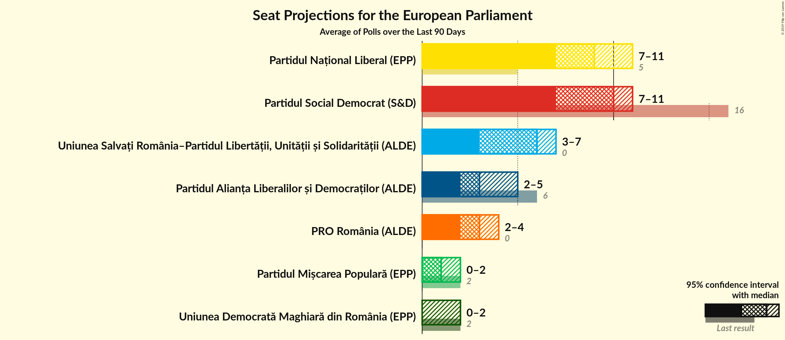
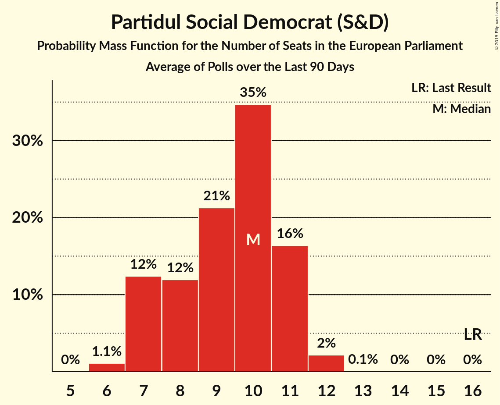
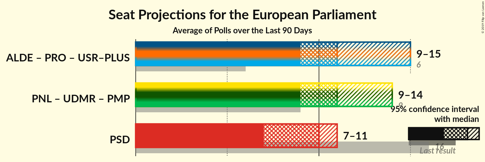
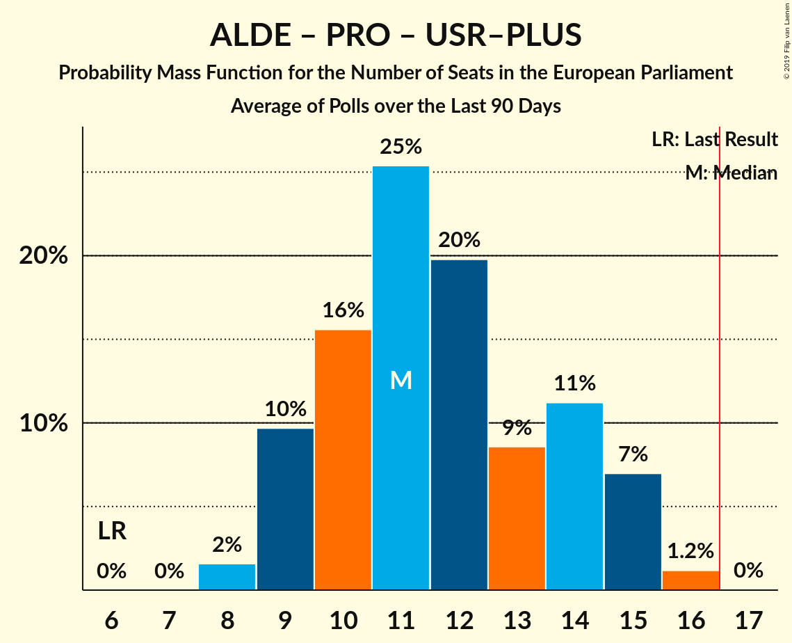
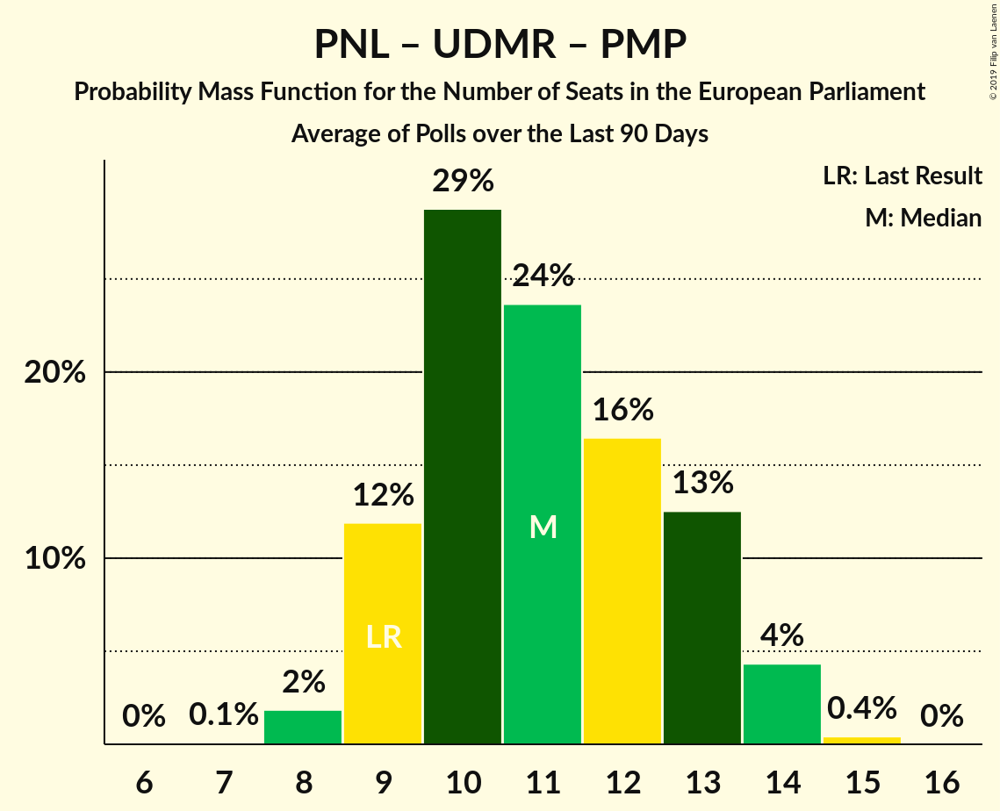
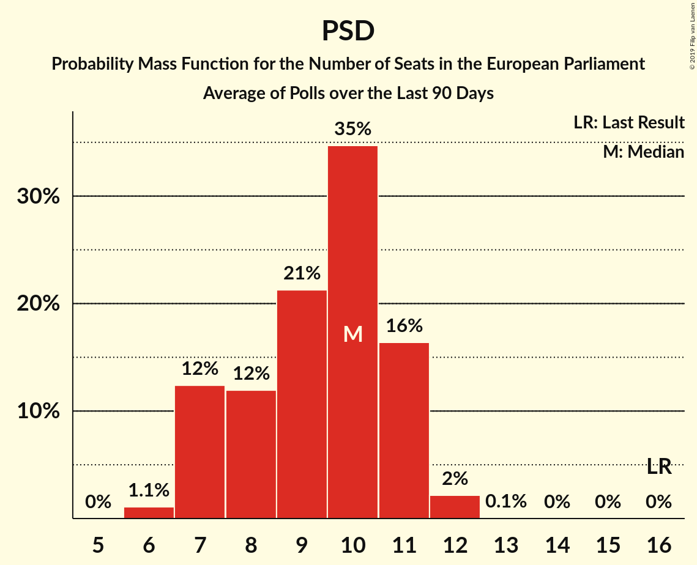

# Poll Average

<a href="#voting-intentions">Voting Intentions</a> | <a href="#seats">Seats</a> | <a href="#coalitions">Coalitions</a> | <a href="#technical-information">Technical Information</a>

## Summary

The table below lists the polls on which the average is based. They are the most recent polls (less than 90 days old) registered and analyzed so far.

| Period     | Polling firm/Commissioner(s) | PSD | ALDE | PNL | UDMR | PMP | PLUS | PRO | USR | USR–PLUS |
|:----------:|:----------------------------:|:--:|:--:|:--:|:--:|:--:|:--:|:--:|:--:|:--:|
| 25 May 2014 | General Election | 37.6%   16 | 15.0%   6 | 12.2%   5 | 6.3%   2 | 6.2%   2 | 0.0%   0 | 0.0%   0 | 0.0%   0 | 0.0%   0 |
| N/A | Poll Average | 20–31%   7–11 | 7–14%   2–5 | 20–32%   7–11 | 4–6%   0–2 | 4–7%   0–2 | N/A   N/A | 7–13%   2–4 | N/A   N/A | 10–20%   3–7 |
| [18 March–3 April 2019](2019-04-03-IMAS.html) | IMAS   Europa FM | 19–24%   6–9 | 11–15%   3–5 | 23–28%   8–10 | 4–7%   0–2 | 4–6%   0–2 | N/A   N/A | 9–13%   3–5 | N/A   N/A | 15–20%   5–7 |
| [12–25 March 2019](2019-03-25-CURS.html) | CURS   STIRIPESURSE.RO | 27–32%   9–12 | 8–11%   2–4 | 20–25%   7–9 | 4–6%   0–2 | 4–7%   0–2 | N/A   N/A | 6–9%   2–3 | N/A   N/A | 15–20%   5–7 |
| [15–20 March 2019](2019-03-20-BCS.html) | BCS   PSnews.ro | 24–29%   8–11 | 7–10%   2–3 | 27–33%   10–12 | 3–6%   0–2 | 5–8%   0–2 | N/A   N/A | 9–12%   3–4 | N/A   N/A | 9–13%   3–4 |
| [5–13 March 2019](2019-03-13-INSCOP.html) | INSCOP   Konrad-Adenauer-Stiftung | 24–30%   9–11 | 8–11%   2–4 | 24–29%   8–11 | 4–7%   0–2 | 3–6%   0–2 | N/A   N/A | 8–11%   2–4 | N/A   N/A | 13–18%   4–6 |
| 25 May 2014 | General Election | 37.6%   16 | 15.0%   6 | 12.2%   5 | 6.3%   2 | 6.2%   2 | 0.0%   0 | 0.0%   0 | 0.0%   0 | 0.0%   0 |

Only polls for which at least the sample size has been published are included in the table above.

**Legend:**
+ **Top half of each row:** Voting intentions (95% confidence interval)
+ **Bottom half of each row:** Seat projections for the European Parliament (95% confidence interval)
+ **PSD:** Partidul Social Democrat (S&D)
+ **ALDE:** Partidul Alianța Liberalilor și Democraților (ALDE)
+ **PNL:** Partidul Național Liberal (EPP)
+ **UDMR:** Uniunea Democrată Maghiară din România (EPP)
+ **PMP:** Partidul Mișcarea Populară (EPP)
+ **PLUS:** Partidul Libertății, Unității și Solidarității (ALDE)
+ **PRO:** PRO România (ALDE)
+ **USR:** Uniunea Salvați România (ALDE)
+ **USR–PLUS:** Uniunea Salvați România–Partidul Libertății, Unității și Solidarității (ALDE)
+ **N/A (single party):** Party not included the published results
+ **N/A (entire row):** Calculation for this opinion poll not started yet

## Voting Intentions

### Confidence Intervals

| Party | Last Result | Median | 80% Confidence Interval | 90% Confidence Interval | 95% Confidence Interval | 99% Confidence Interval |
|:-----:|:-----------:|:------:|:-----------------------:|:-----------------------:|:-----------------------:|:-----------------------:|
| <a href="#partidul-social-democrat-(s&d)">Partidul Social Democrat (S&D)</a> | 37.6% | 26.7% | 21.0–30.0% |20.2–30.7% | 19.7–31.4% | 18.8–32.5% |
| <a href="#partidul-alianța-liberalilor-și-democraților-(alde)">Partidul Alianța Liberalilor și Democraților (ALDE)</a> | 15.0% | 9.5% | 7.9–13.1% |7.5–13.7% | 7.2–14.2% | 6.6–15.1% |
| <a href="#partidul-național-liberal-(epp)">Partidul Național Liberal (EPP)</a> | 12.2% | 25.8% | 21.6–30.2% |20.9–31.0% | 20.4–31.6% | 19.4–32.7% |
| <a href="#uniunea-democrată-maghiară-din-românia-(epp)">Uniunea Democrată Maghiară din România (EPP)</a> | 6.3% | 4.9% | 4.0–5.9% |3.8–6.2% | 3.6–6.4% | 3.2–7.0% |
| <a href="#partidul-mișcarea-populară-(epp)">Partidul Mișcarea Populară (EPP)</a> | 6.2% | 5.3% | 4.1–6.7% |3.8–7.0% | 3.6–7.3% | 3.2–7.9% |
| <a href="#partidul-libertății,-unității-și-solidarității-(alde)">Partidul Libertății, Unității și Solidarității (ALDE)</a> | 0.0% | N/A | N/A |N/A | N/A | N/A |
| <a href="#pro-românia-(alde)">PRO România (ALDE)</a> | 0.0% | 9.7% | 7.4–11.7% |7.0–12.2% | 6.6–12.6% | 6.1–13.4% |
| <a href="#uniunea-salvați-românia-(alde)">Uniunea Salvați România (ALDE)</a> | 0.0% | N/A | N/A |N/A | N/A | N/A |
| <a href="#uniunea-salvați-românia–partidul-libertății,-unității-și-solidarității-(alde)">Uniunea Salvați România–Partidul Libertății, Unității și Solidarității (ALDE)</a> | 0.0% | 16.1% | 10.6–18.5% |10.1–19.1% | 9.7–19.5% | 9.1–20.4% |

### Partidul Social Democrat (S&D)

*For a full overview of the results for this party, see the [Partidul Social Democrat (S&D)](party-partidulsocialdemocratsd.html) page.*

| Voting Intentions | Probability | Accumulated | Special Marks |
|:-----------------:|:-----------:|:-----------:|:-------------:|
| 16.5–17.5% | 0% | 100% |  |
| 17.5–18.5% | 0.3% | 100% |  |
| 18.5–19.5% | 2% | 99.7% |  |
| 19.5–20.5% | 5% | 98% |  |
| 20.5–21.5% | 7% | 93% |  |
| 21.5–22.5% | 6% | 86% |  |
| 22.5–23.5% | 4% | 79% |  |
| 23.5–24.5% | 3% | 76% |  |
| 24.5–25.5% | 7% | 73% |  |
| 25.5–26.5% | 13% | 65% |  |
| 26.5–27.5% | 16% | 52% | Median |
| 27.5–28.5% | 13% | 36% |  |
| 28.5–29.5% | 10% | 24% |  |
| 29.5–30.5% | 7% | 13% |  |
| 30.5–31.5% | 4% | 6% |  |
| 31.5–32.5% | 2% | 2% |  |
| 32.5–33.5% | 0.4% | 0.4% |  |
| 33.5–34.5% | 0.1% | 0.1% |  |
| 34.5–35.5% | 0% | 0% |  |
| 35.5–36.5% | 0% | 0% |  |
| 36.5–37.5% | 0% | 0% |  |
| 37.5–38.5% | 0% | 0% | Last Result |

### Partidul Alianța Liberalilor și Democraților (ALDE)

*For a full overview of the results for this party, see the [Partidul Alianța Liberalilor și Democraților (ALDE)](party-partidulalianțaliberalilorșidemocrațiloralde.html) page.*

| Voting Intentions | Probability | Accumulated | Special Marks |
|:-----------------:|:-----------:|:-----------:|:-------------:|
| 4.5–5.5% | 0% | 100% |  |
| 5.5–6.5% | 0.4% | 100% |  |
| 6.5–7.5% | 5% | 99.6% |  |
| 7.5–8.5% | 18% | 94% |  |
| 8.5–9.5% | 26% | 76% |  |
| 9.5–10.5% | 18% | 50% | Median |
| 10.5–11.5% | 8% | 31% |  |
| 11.5–12.5% | 8% | 23% |  |
| 12.5–13.5% | 9% | 15% |  |
| 13.5–14.5% | 5% | 6% |  |
| 14.5–15.5% | 1.2% | 1.4% | Last Result |
| 15.5–16.5% | 0.2% | 0.2% |  |
| 16.5–17.5% | 0% | 0% |  |

### Partidul Național Liberal (EPP)

*For a full overview of the results for this party, see the [Partidul Național Liberal (EPP)](party-partidulnaționalliberalepp.html) page.*

| Voting Intentions | Probability | Accumulated | Special Marks |
|:-----------------:|:-----------:|:-----------:|:-------------:|
| 11.5–12.5% | 0% | 100% | Last Result |
| 12.5–13.5% | 0% | 100% |  |
| 13.5–14.5% | 0% | 100% |  |
| 14.5–15.5% | 0% | 100% |  |
| 15.5–16.5% | 0% | 100% |  |
| 16.5–17.5% | 0% | 100% |  |
| 17.5–18.5% | 0.1% | 100% |  |
| 18.5–19.5% | 0.6% | 99.9% |  |
| 19.5–20.5% | 3% | 99.4% |  |
| 20.5–21.5% | 6% | 97% |  |
| 21.5–22.5% | 8% | 91% |  |
| 22.5–23.5% | 8% | 82% |  |
| 23.5–24.5% | 9% | 75% |  |
| 24.5–25.5% | 12% | 66% |  |
| 25.5–26.5% | 13% | 54% | Median |
| 26.5–27.5% | 10% | 40% |  |
| 27.5–28.5% | 7% | 30% |  |
| 28.5–29.5% | 8% | 22% |  |
| 29.5–30.5% | 7% | 15% |  |
| 30.5–31.5% | 5% | 8% |  |
| 31.5–32.5% | 2% | 3% |  |
| 32.5–33.5% | 0.5% | 0.6% |  |
| 33.5–34.5% | 0.1% | 0.1% |  |
| 34.5–35.5% | 0% | 0% |  |

### Uniunea Democrată Maghiară din România (EPP)

*For a full overview of the results for this party, see the [Uniunea Democrată Maghiară din România (EPP)](party-uniuneademocratămaghiarădinromâniaepp.html) page.*

| Voting Intentions | Probability | Accumulated | Special Marks |
|:-----------------:|:-----------:|:-----------:|:-------------:|
| 1.5–2.5% | 0% | 100% |  |
| 2.5–3.5% | 2% | 100% |  |
| 3.5–4.5% | 30% | 98% |  |
| 4.5–5.5% | 49% | 68% | Median |
| 5.5–6.5% | 17% | 19% | Last Result |
| 6.5–7.5% | 2% | 2% |  |
| 7.5–8.5% | 0.1% | 0.1% |  |
| 8.5–9.5% | 0% | 0% |  |

### Partidul Mișcarea Populară (EPP)

*For a full overview of the results for this party, see the [Partidul Mișcarea Populară (EPP)](party-partidulmișcareapopularăepp.html) page.*

| Voting Intentions | Probability | Accumulated | Special Marks |
|:-----------------:|:-----------:|:-----------:|:-------------:|
| 1.5–2.5% | 0% | 100% |  |
| 2.5–3.5% | 2% | 100% |  |
| 3.5–4.5% | 22% | 98% |  |
| 4.5–5.5% | 34% | 76% | Median |
| 5.5–6.5% | 29% | 42% | Last Result |
| 6.5–7.5% | 11% | 12% |  |
| 7.5–8.5% | 1.4% | 1.4% |  |
| 8.5–9.5% | 0.1% | 0.1% |  |
| 9.5–10.5% | 0% | 0% |  |

### PRO România (ALDE)

*For a full overview of the results for this party, see the [PRO România (ALDE)](party-proromâniaalde.html) page.*

| Voting Intentions | Probability | Accumulated | Special Marks |
|:-----------------:|:-----------:|:-----------:|:-------------:|
| 0.0–0.5% | 0% | 100% | Last Result |
| 0.5–1.5% | 0% | 100% |  |
| 1.5–2.5% | 0% | 100% |  |
| 2.5–3.5% | 0% | 100% |  |
| 3.5–4.5% | 0% | 100% |  |
| 4.5–5.5% | 0.1% | 100% |  |
| 5.5–6.5% | 2% | 99.9% |  |
| 6.5–7.5% | 10% | 98% |  |
| 7.5–8.5% | 16% | 88% |  |
| 8.5–9.5% | 19% | 72% |  |
| 9.5–10.5% | 22% | 53% | Median |
| 10.5–11.5% | 19% | 30% |  |
| 11.5–12.5% | 9% | 12% |  |
| 12.5–13.5% | 2% | 3% |  |
| 13.5–14.5% | 0.3% | 0.4% |  |
| 14.5–15.5% | 0% | 0% |  |

### Uniunea Salvați România–Partidul Libertății, Unității și Solidarității (ALDE)

*For a full overview of the results for this party, see the [Uniunea Salvați România–Partidul Libertății, Unității și Solidarității (ALDE)](party-uniuneasalvațiromânia–partidullibertățiiunitățiișisolidaritățiialde.html) page.*

| Voting Intentions | Probability | Accumulated | Special Marks |
|:-----------------:|:-----------:|:-----------:|:-------------:|
| 0.0–0.5% | 0% | 100% | Last Result |
| 0.5–1.5% | 0% | 100% |  |
| 1.5–2.5% | 0% | 100% |  |
| 2.5–3.5% | 0% | 100% |  |
| 3.5–4.5% | 0% | 100% |  |
| 4.5–5.5% | 0% | 100% |  |
| 5.5–6.5% | 0% | 100% |  |
| 6.5–7.5% | 0% | 100% |  |
| 7.5–8.5% | 0.1% | 100% |  |
| 8.5–9.5% | 2% | 99.9% |  |
| 9.5–10.5% | 7% | 98% |  |
| 10.5–11.5% | 10% | 91% |  |
| 11.5–12.5% | 5% | 81% |  |
| 12.5–13.5% | 2% | 76% |  |
| 13.5–14.5% | 5% | 74% |  |
| 14.5–15.5% | 11% | 69% |  |
| 15.5–16.5% | 16% | 58% | Median |
| 16.5–17.5% | 18% | 43% |  |
| 17.5–18.5% | 15% | 25% |  |
| 18.5–19.5% | 7% | 10% |  |
| 19.5–20.5% | 2% | 2% |  |
| 20.5–21.5% | 0.4% | 0.4% |  |
| 21.5–22.5% | 0% | 0% |  |

## Seats

### Confidence Intervals

| Party | Last Result | Median | 80% Confidence Interval | 90% Confidence Interval | 95% Confidence Interval | 99% Confidence Interval |
|:-----:|:-----------:|:------:|:-----------------------:|:-----------------------:|:-----------------------:|:-----------------------:|
| <a href="#partidul-social-democrat-(s&d)">Partidul Social Democrat (S&D)</a> | 16 | 10 | 7–11 |7–11 | 7–11 | 6–12 |
| <a href="#partidul-alianța-liberalilor-și-democraților-(alde)">Partidul Alianța Liberalilor și Democraților (ALDE)</a> | 6 | 3 | 2–4 |2–5 | 2–5 | 2–5 |
| <a href="#partidul-național-liberal-(epp)">Partidul Național Liberal (EPP)</a> | 5 | 9 | 8–11 |7–11 | 7–11 | 7–12 |
| <a href="#uniunea-democrată-maghiară-din-românia-(epp)">Uniunea Democrată Maghiară din România (EPP)</a> | 2 | 0 | 0–2 |0–2 | 0–2 | 0–2 |
| <a href="#partidul-mișcarea-populară-(epp)">Partidul Mișcarea Populară (EPP)</a> | 2 | 1 | 0–2 |0–2 | 0–2 | 0–2 |
| <a href="#partidul-libertății,-unității-și-solidarității-(alde)">Partidul Libertății, Unității și Solidarității (ALDE)</a> | 0 | N/A | N/A |N/A | N/A | N/A |
| <a href="#pro-românia-(alde)">PRO România (ALDE)</a> | 0 | 3 | 2–4 |2–4 | 2–4 | 2–5 |
| <a href="#uniunea-salvați-românia-(alde)">Uniunea Salvați România (ALDE)</a> | 0 | N/A | N/A |N/A | N/A | N/A |
| <a href="#uniunea-salvați-românia–partidul-libertății,-unității-și-solidarității-(alde)">Uniunea Salvați România–Partidul Libertății, Unității și Solidarității (ALDE)</a> | 0 | 6 | 3–6 |3–7 | 3–7 | 3–7 |

### Partidul Social Democrat (S&D)

*For a full overview of the results for this party, see the [Partidul Social Democrat (S&D)](party-partidulsocialdemocratsd.html) page.*

| Number of Seats | Probability | Accumulated | Special Marks |
|:---------------:|:-----------:|:-----------:|:-------------:|
| 6 | 1.1% | 100% |  |
| 7 | 12% | 98.9% |  |
| 8 | 12% | 87% |  |
| 9 | 21% | 75% |  |
| 10 | 35% | 53% | Median |
| 11 | 16% | 19% |  |
| 12 | 2% | 2% |  |
| 13 | 0.1% | 0.1% |  |
| 14 | 0% | 0% |  |
| 15 | 0% | 0% |  |
| 16 | 0% | 0% | Last Result |

### Partidul Alianța Liberalilor și Democraților (ALDE)

*For a full overview of the results for this party, see the [Partidul Alianța Liberalilor și Democraților (ALDE)](party-partidulalianțaliberalilorșidemocrațiloralde.html) page.*

| Number of Seats | Probability | Accumulated | Special Marks |
|:---------------:|:-----------:|:-----------:|:-------------:|
| 2 | 12% | 100% |  |
| 3 | 57% | 88% | Median |
| 4 | 24% | 31% |  |
| 5 | 8% | 8% |  |
| 6 | 0.1% | 0.1% | Last Result |
| 7 | 0% | 0% |  |

### Partidul Național Liberal (EPP)

*For a full overview of the results for this party, see the [Partidul Național Liberal (EPP)](party-partidulnaționalliberalepp.html) page.*

| Number of Seats | Probability | Accumulated | Special Marks |
|:---------------:|:-----------:|:-----------:|:-------------:|
| 5 | 0% | 100% | Last Result |
| 6 | 0.2% | 100% |  |
| 7 | 8% | 99.8% |  |
| 8 | 22% | 92% |  |
| 9 | 28% | 69% | Median |
| 10 | 25% | 42% |  |
| 11 | 15% | 17% |  |
| 12 | 2% | 2% |  |
| 13 | 0.1% | 0.1% |  |
| 14 | 0% | 0% |  |

### Uniunea Democrată Maghiară din România (EPP)

*For a full overview of the results for this party, see the [Uniunea Democrată Maghiară din România (EPP)](party-uniuneademocratămaghiarădinromâniaepp.html) page.*

| Number of Seats | Probability | Accumulated | Special Marks |
|:---------------:|:-----------:|:-----------:|:-------------:|
| 0 | 58% | 100% | Median |
| 1 | 17% | 42% |  |
| 2 | 25% | 25% | Last Result |
| 3 | 0% | 0% |  |

### Partidul Mișcarea Populară (EPP)

*For a full overview of the results for this party, see the [Partidul Mișcarea Populară (EPP)](party-partidulmișcareapopularăepp.html) page.*

| Number of Seats | Probability | Accumulated | Special Marks |
|:---------------:|:-----------:|:-----------:|:-------------:|
| 0 | 39% | 100% |  |
| 1 | 13% | 61% | Median |
| 2 | 47% | 47% | Last Result |
| 3 | 0.4% | 0.4% |  |
| 4 | 0% | 0% |  |

### PRO România (ALDE)

*For a full overview of the results for this party, see the [PRO România (ALDE)](party-proromâniaalde.html) page.*

| Number of Seats | Probability | Accumulated | Special Marks |
|:---------------:|:-----------:|:-----------:|:-------------:|
| 0 | 0% | 100% | Last Result |
| 1 | 0% | 100% |  |
| 2 | 19% | 100% |  |
| 3 | 52% | 81% | Median |
| 4 | 28% | 29% |  |
| 5 | 0.7% | 0.7% |  |
| 6 | 0% | 0% |  |

### Uniunea Salvați România–Partidul Libertății, Unității și Solidarității (ALDE)

*For a full overview of the results for this party, see the [Uniunea Salvați România–Partidul Libertății, Unității și Solidarității (ALDE)](party-uniuneasalvațiromânia–partidullibertățiiunitățiișisolidaritățiialde.html) page.*

| Number of Seats | Probability | Accumulated | Special Marks |
|:---------------:|:-----------:|:-----------:|:-------------:|
| 0 | 0% | 100% | Last Result |
| 1 | 0% | 100% |  |
| 2 | 0% | 100% |  |
| 3 | 10% | 100% |  |
| 4 | 15% | 90% |  |
| 5 | 21% | 74% |  |
| 6 | 44% | 53% | Median |
| 7 | 9% | 9% |  |
| 8 | 0.2% | 0.2% |  |
| 9 | 0% | 0% |  |

## Coalitions

### Confidence Intervals

| Coalition | Last Result | Median | Majority? | 80% Confidence Interval | 90% Confidence Interval | 95% Confidence Interval | 99% Confidence Interval |
|:---------:|:-----------:|:------:|:---------:|:-----------------------:|:-----------------------:|:-----------------------:|:-----------------------:|
| Partidul Alianța Liberalilor și Democraților (ALDE) – PRO România (ALDE) – Uniunea Salvați România–Partidul Libertății, Unității și Solidarității (ALDE) | 6 | 11 | 0% | 9–14 | 9–15 | 9–15 | 8–16 |
| Partidul Național Liberal (EPP) – Uniunea Democrată Maghiară din România (EPP) – Partidul Mișcarea Populară (EPP) | 9 | 11 | 0% | 9–13 | 9–13 | 9–14 | 8–14 |
| Partidul Social Democrat (S&D) | 16 | 10 | 0% | 7–11 | 7–11 | 7–11 | 6–12 |

### Partidul Alianța Liberalilor și Democraților (ALDE) – PRO România (ALDE) – Uniunea Salvați România–Partidul Libertății, Unității și Solidarității (ALDE)

| Number of Seats | Probability | Accumulated | Special Marks |
|:---------------:|:-----------:|:-----------:|:-------------:|
| 6 | 0% | 100% | Last Result |
| 7 | 0% | 100% |  |
| 8 | 2% | 100% |  |
| 9 | 10% | 98% |  |
| 10 | 16% | 89% |  |
| 11 | 25% | 73% |  |
| 12 | 20% | 48% | Median |
| 13 | 9% | 28% |  |
| 14 | 11% | 19% |  |
| 15 | 7% | 8% |  |
| 16 | 1.2% | 1.2% |  |
| 17 | 0% | 0% | Majority |

### Partidul Național Liberal (EPP) – Uniunea Democrată Maghiară din România (EPP) – Partidul Mișcarea Populară (EPP)

| Number of Seats | Probability | Accumulated | Special Marks |
|:---------------:|:-----------:|:-----------:|:-------------:|
| 7 | 0.1% | 100% |  |
| 8 | 2% | 99.9% |  |
| 9 | 12% | 98% | Last Result |
| 10 | 29% | 86% | Median |
| 11 | 24% | 57% |  |
| 12 | 16% | 34% |  |
| 13 | 13% | 17% |  |
| 14 | 4% | 5% |  |
| 15 | 0.4% | 0.4% |  |
| 16 | 0% | 0% |  |

### Partidul Social Democrat (S&D)

| Number of Seats | Probability | Accumulated | Special Marks |
|:---------------:|:-----------:|:-----------:|:-------------:|
| 6 | 1.1% | 100% |  |
| 7 | 12% | 98.9% |  |
| 8 | 12% | 87% |  |
| 9 | 21% | 75% |  |
| 10 | 35% | 53% | Median |
| 11 | 16% | 19% |  |
| 12 | 2% | 2% |  |
| 13 | 0.1% | 0.1% |  |
| 14 | 0% | 0% |  |
| 15 | 0% | 0% |  |
| 16 | 0% | 0% | Last Result |

## Technical Information

+ **Number of polls included in this average:** 4
+ **Lowest number of simulations done in a poll included in this average:** 1,048,576
+ **Total number of simulations done in the polls included in this average:** 4,194,304
+ **Error estimate:** 2.16%
