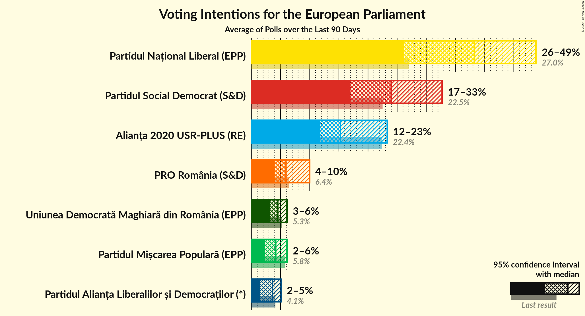
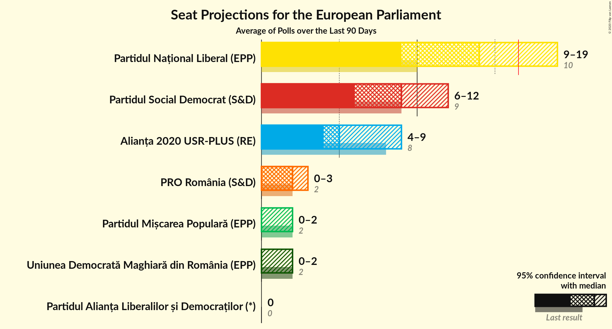
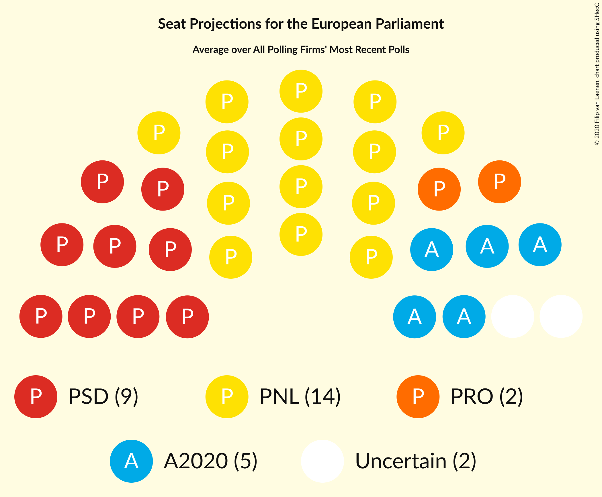
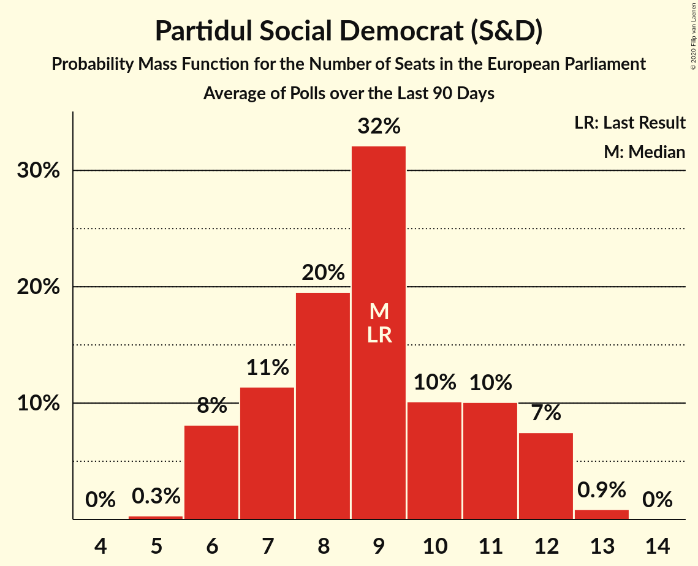
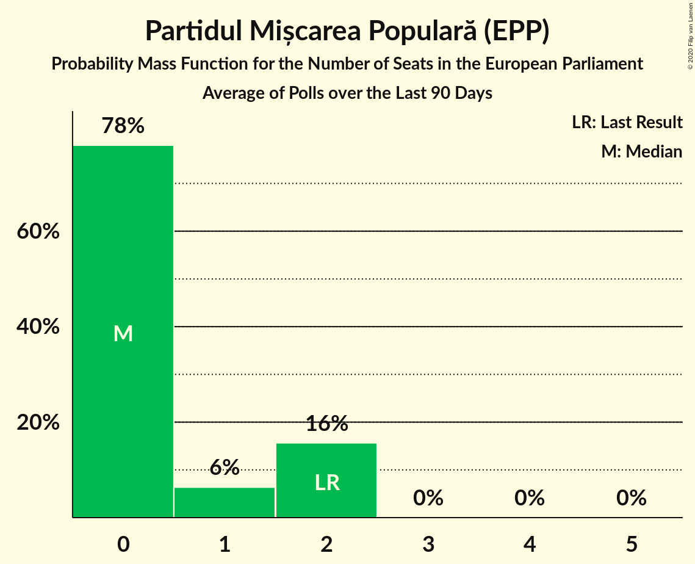
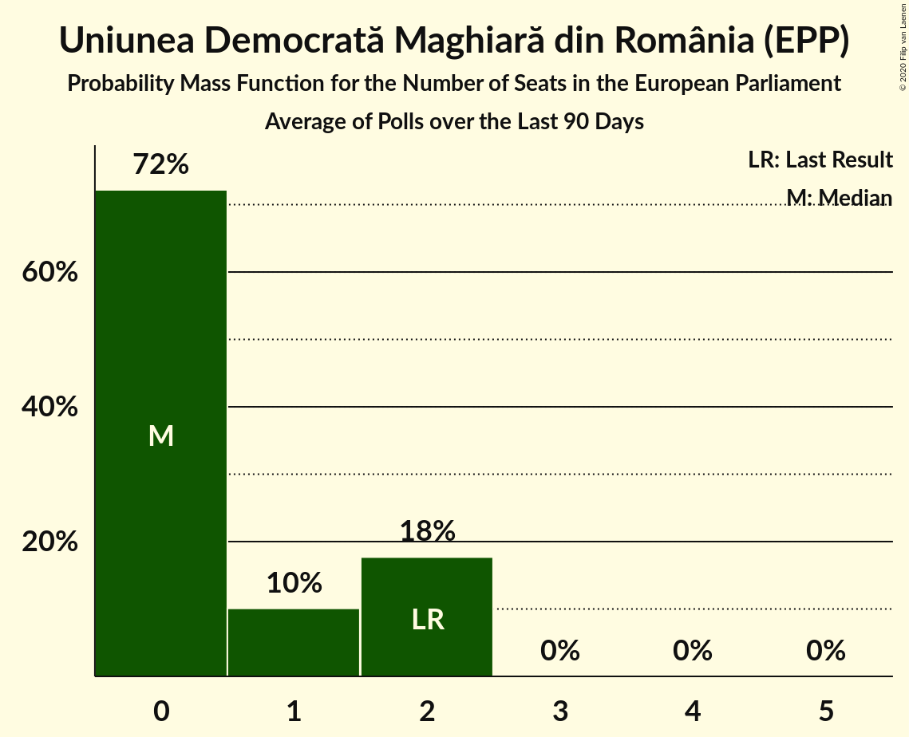
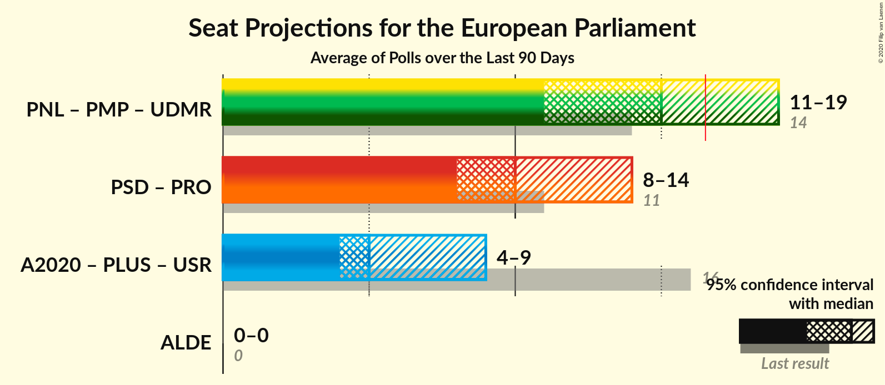
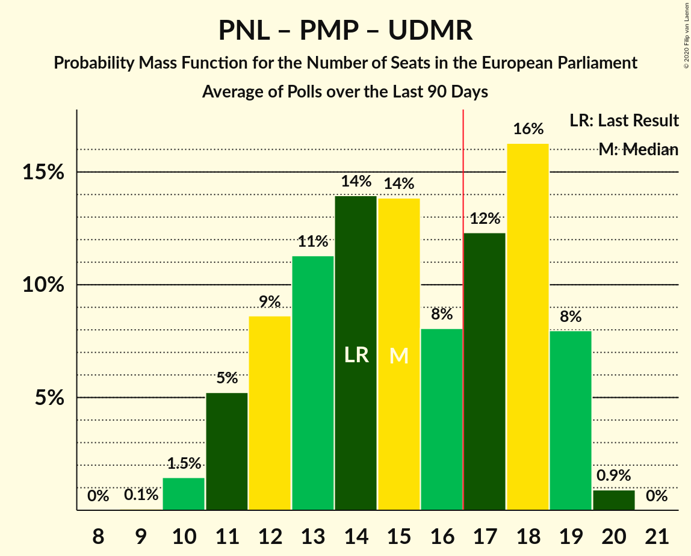
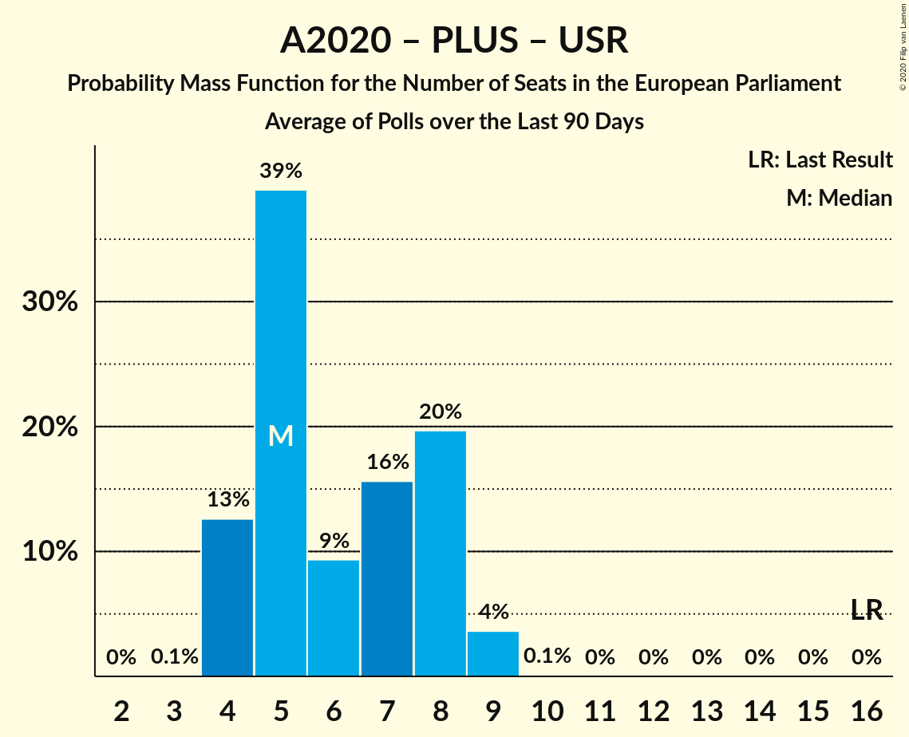
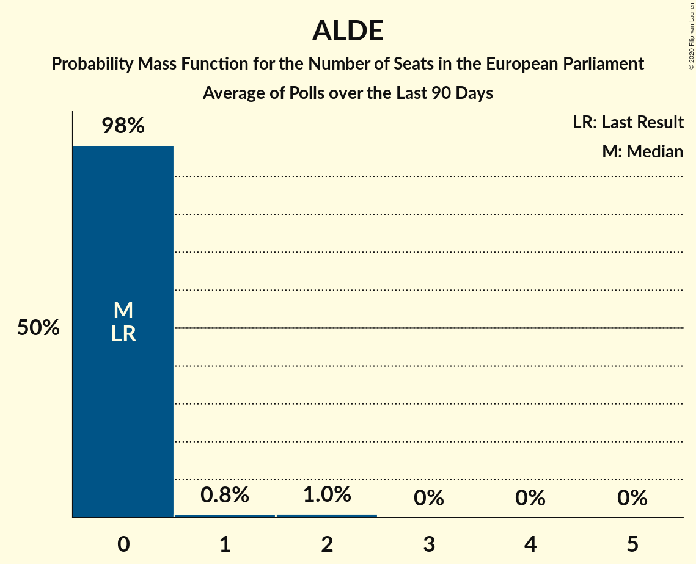

# Poll Average

<a href="#voting-intentions">Voting Intentions</a> | <a href="#seats">Seats</a> | <a href="#coalitions">Coalitions</a> | <a href="#technical-information">Technical Information</a>

## Summary

The table below lists the polls on which the average is based. They are the most recent polls (less than 90 days old) registered and analyzed so far.

| Period     | Polling firm/Commissioner(s) | PNL | PSD | A2020 | PRO | PMP | UDMR | ALDE | PLUS | USR |
|:----------:|:----------------------------:|:--:|:--:|:--:|:--:|:--:|:--:|:--:|:--:|:--:|
| 26 May 2019 | General Election | 27.0%   10 | 22.5%   9 | 22.4%   8 | 6.4%   2 | 5.8%   2 | 5.3%   2 | 4.1%   0 | 22.4%   4 | 22.4%   4 |
| N/A | Poll Average | 26–41%   9–16 | 20–33%   7–12 | 13–24%   4–9 | 4–10%   0–3 | 2–6%   0–2 | 3–6%   0–2 | 3–5%   0–1 | N/A   N/A | N/A   N/A |
| [12–17 December 2019](2019-12-17-CURS.html) | CURS   STIRIPESURSE.RO | 32–38%   12–14 | 28–34%   10–13 | 12–16%   4–6 | 5–8%   0–2 | 4–6%   0–2 | 3–5%   0–2 | 3–5%   0–1 | N/A   N/A | N/A   N/A |
| [11–27 November 2019](2019-11-27-IMAS.html) | IMAS   Europa FM | 36–42%   13–16 | 19–24%   7–9 | 16–21%   6–8 | 5–8%   1–3 | 2–4%   0 | 3–6%   0–2 | 2–5%   0 | N/A   N/A | N/A   N/A |
| [25 October–3 November 2019](2019-11-03-USR.html) | USR | 36–41%   13–16 | 22–26%   8–10 | 18–22%   6–8 | 4–6%   0–2 | 3–6%   0–2 | 3–6%   0–2 | N/A   N/A | N/A   N/A | N/A   N/A |
| [16–20 September 2019](2019-09-20-SocioData.html) | Socio Data | 25–31%   9–12 | 22–27%   8–10 | 19–24%   7–9 | 7–11%   2–4 | 4–6%   0–2 | 4–6%   0–2 | 3–5%   0–2 | N/A   N/A | N/A   N/A |
| 26 May 2019 | General Election | 27.0%   10 | 22.5%   9 | 22.4%   8 | 6.4%   2 | 5.8%   2 | 5.3%   2 | 4.1%   0 | 22.4%   4 | 22.4%   4 |

Only polls for which at least the sample size has been published are included in the table above.

**Legend:**
+ **Top half of each row:** Voting intentions (95% confidence interval)
+ **Bottom half of each row:** Seat projections for the European Parliament (95% confidence interval)
+ **PNL:** Partidul Național Liberal (EPP)
+ **PSD:** Partidul Social Democrat (S&D)
+ **A2020:** Alianța 2020 USR-PLUS (RE)
+ **PRO:** PRO România (S&D)
+ **PMP:** Partidul Mișcarea Populară (EPP)
+ **UDMR:** Uniunea Democrată Maghiară din România (EPP)
+ **ALDE:** Partidul Alianța Liberalilor și Democraților (*)
+ **PLUS:** Partidul Libertății, Unității și Solidarității (RE)
+ **USR:** Uniunea Salvați România (RE)
+ **N/A (single party):** Party not included the published results
+ **N/A (entire row):** Calculation for this opinion poll not started yet

## Voting Intentions

### Confidence Intervals

| Party | Last Result | Median | 80% Confidence Interval | 90% Confidence Interval | 95% Confidence Interval | 99% Confidence Interval |
|:-----:|:-----------:|:------:|:-----------------------:|:-----------------------:|:-----------------------:|:-----------------------:|
| <a href="#partidul-național-liberal-(epp)">Partidul Național Liberal (EPP)</a> | 27.0% | 36.5% | 27.4–39.9% |26.6–40.6% | 26.1–41.1% | 25.0–42.2% |
| <a href="#partidul-social-democrat-(s&d)">Partidul Social Democrat (S&D)</a> | 22.5% | 24.4% | 21.0–31.4% |20.2–32.2% | 19.7–32.9% | 18.7–34.0% |
| <a href="#alianța-2020-usr-plus-(re)">Alianța 2020 USR-PLUS (RE)</a> | 22.4% | 19.2% | 13.7–22.2% |13.1–22.9% | 12.7–23.5% | 11.9–24.5% |
| <a href="#partidul-libertății,-unității-și-solidarității-(re)">Partidul Libertății, Unității și Solidarității (RE)</a> | 22.4% | N/A | N/A |N/A | N/A | N/A |
| <a href="#uniunea-salvați-românia-(re)">Uniunea Salvați România (RE)</a> | 22.4% | N/A | N/A |N/A | N/A | N/A |
| <a href="#pro-românia-(s&d)">PRO România (S&D)</a> | 6.4% | 6.3% | 4.7–9.2% |4.4–9.7% | 4.1–10.1% | 3.7–10.8% |
| <a href="#partidul-mișcarea-populară-(epp)">Partidul Mișcarea Populară (EPP)</a> | 5.8% | 4.5% | 2.8–5.6% |2.5–5.9% | 2.3–6.2% | 2.0–6.7% |
| <a href="#uniunea-democrată-maghiară-din-românia-(epp)">Uniunea Democrată Maghiară din România (EPP)</a> | 5.3% | 4.5% | 3.6–5.4% |3.4–5.7% | 3.2–6.0% | 2.9–6.5% |
| <a href="#partidul-alianța-liberalilor-și-democraților-(*)">Partidul Alianța Liberalilor și Democraților (*)</a> | 4.1% | 3.8% | 3.0–4.7% |2.7–5.0% | 2.6–5.2% | 2.2–5.7% |

### Partidul Național Liberal (EPP)

*For a full overview of the results for this party, see the [Partidul Național Liberal (EPP)](party-partidulnaționalliberalepp.html) page.*

| Voting Intentions | Probability | Accumulated | Special Marks |
|:-----------------:|:-----------:|:-----------:|:-------------:|
| 22.5–23.5% | 0% | 100% |  |
| 23.5–24.5% | 0.2% | 100% |  |
| 24.5–25.5% | 1.0% | 99.8% |  |
| 25.5–26.5% | 3% | 98.8% |  |
| 26.5–27.5% | 6% | 95% | Last Result |
| 27.5–28.5% | 7% | 89% |  |
| 28.5–29.5% | 5% | 82% |  |
| 29.5–30.5% | 2% | 78% |  |
| 30.5–31.5% | 0.7% | 76% |  |
| 31.5–32.5% | 1.0% | 75% |  |
| 32.5–33.5% | 3% | 74% |  |
| 33.5–34.5% | 6% | 71% |  |
| 34.5–35.5% | 7% | 65% |  |
| 35.5–36.5% | 8% | 58% | Median |
| 36.5–37.5% | 11% | 49% |  |
| 37.5–38.5% | 13% | 39% |  |
| 38.5–39.5% | 13% | 26% |  |
| 39.5–40.5% | 8% | 13% |  |
| 40.5–41.5% | 4% | 5% |  |
| 41.5–42.5% | 1.1% | 1.4% |  |
| 42.5–43.5% | 0.2% | 0.3% |  |
| 43.5–44.5% | 0% | 0% |  |

### Partidul Social Democrat (S&D)

*For a full overview of the results for this party, see the [Partidul Social Democrat (S&D)](party-partidulsocialdemocratsd.html) page.*

| Voting Intentions | Probability | Accumulated | Special Marks |
|:-----------------:|:-----------:|:-----------:|:-------------:|
| 16.5–17.5% | 0% | 100% |  |
| 17.5–18.5% | 0.3% | 100% |  |
| 18.5–19.5% | 2% | 99.7% |  |
| 19.5–20.5% | 5% | 98% |  |
| 20.5–21.5% | 8% | 93% |  |
| 21.5–22.5% | 10% | 85% |  |
| 22.5–23.5% | 12% | 75% | Last Result |
| 23.5–24.5% | 15% | 63% | Median |
| 24.5–25.5% | 13% | 48% |  |
| 25.5–26.5% | 7% | 35% |  |
| 26.5–27.5% | 2% | 28% |  |
| 27.5–28.5% | 1.3% | 25% |  |
| 28.5–29.5% | 3% | 24% |  |
| 29.5–30.5% | 5% | 21% |  |
| 30.5–31.5% | 7% | 16% |  |
| 31.5–32.5% | 5% | 9% |  |
| 32.5–33.5% | 3% | 4% |  |
| 33.5–34.5% | 0.8% | 1.0% |  |
| 34.5–35.5% | 0.2% | 0.2% |  |
| 35.5–36.5% | 0% | 0% |  |

### Alianța 2020 USR-PLUS (RE)

*For a full overview of the results for this party, see the [Alianța 2020 USR-PLUS (RE)](party-alianța2020usr-plusre.html) page.*

| Voting Intentions | Probability | Accumulated | Special Marks |
|:-----------------:|:-----------:|:-----------:|:-------------:|
| 9.5–10.5% | 0% | 100% |  |
| 10.5–11.5% | 0.2% | 100% |  |
| 11.5–12.5% | 2% | 99.8% |  |
| 12.5–13.5% | 6% | 98% |  |
| 13.5–14.5% | 9% | 92% |  |
| 14.5–15.5% | 6% | 83% |  |
| 15.5–16.5% | 3% | 77% |  |
| 16.5–17.5% | 6% | 73% |  |
| 17.5–18.5% | 10% | 68% |  |
| 18.5–19.5% | 13% | 58% | Median |
| 19.5–20.5% | 14% | 44% |  |
| 20.5–21.5% | 13% | 30% |  |
| 21.5–22.5% | 10% | 17% | Last Result |
| 22.5–23.5% | 5% | 7% |  |
| 23.5–24.5% | 2% | 2% |  |
| 24.5–25.5% | 0.4% | 0.4% |  |
| 25.5–26.5% | 0.1% | 0.1% |  |
| 26.5–27.5% | 0% | 0% |  |

### PRO România (S&D)

*For a full overview of the results for this party, see the [PRO România (S&D)](party-proromâniasd.html) page.*

| Voting Intentions | Probability | Accumulated | Special Marks |
|:-----------------:|:-----------:|:-----------:|:-------------:|
| 1.5–2.5% | 0% | 100% |  |
| 2.5–3.5% | 0.2% | 100% |  |
| 3.5–4.5% | 8% | 99.8% |  |
| 4.5–5.5% | 22% | 92% |  |
| 5.5–6.5% | 27% | 70% | Last Result, Median |
| 6.5–7.5% | 16% | 43% |  |
| 7.5–8.5% | 10% | 27% |  |
| 8.5–9.5% | 11% | 17% |  |
| 9.5–10.5% | 5% | 6% |  |
| 10.5–11.5% | 0.9% | 1.0% |  |
| 11.5–12.5% | 0.1% | 0.1% |  |
| 12.5–13.5% | 0% | 0% |  |

### Partidul Mișcarea Populară (EPP)

*For a full overview of the results for this party, see the [Partidul Mișcarea Populară (EPP)](party-partidulmișcareapopularăepp.html) page.*

| Voting Intentions | Probability | Accumulated | Special Marks |
|:-----------------:|:-----------:|:-----------:|:-------------:|
| 0.5–1.5% | 0% | 100% |  |
| 1.5–2.5% | 6% | 100% |  |
| 2.5–3.5% | 18% | 94% |  |
| 3.5–4.5% | 29% | 76% |  |
| 4.5–5.5% | 36% | 48% | Median |
| 5.5–6.5% | 11% | 12% | Last Result |
| 6.5–7.5% | 0.9% | 0.9% |  |
| 7.5–8.5% | 0% | 0% |  |

### Uniunea Democrată Maghiară din România (EPP)

*For a full overview of the results for this party, see the [Uniunea Democrată Maghiară din România (EPP)](party-uniuneademocratămaghiarădinromâniaepp.html) page.*

| Voting Intentions | Probability | Accumulated | Special Marks |
|:-----------------:|:-----------:|:-----------:|:-------------:|
| 1.5–2.5% | 0.1% | 100% |  |
| 2.5–3.5% | 9% | 99.9% |  |
| 3.5–4.5% | 47% | 91% | Median |
| 4.5–5.5% | 36% | 44% | Last Result |
| 5.5–6.5% | 7% | 8% |  |
| 6.5–7.5% | 0.5% | 0.5% |  |
| 7.5–8.5% | 0% | 0% |  |

### Partidul Alianța Liberalilor și Democraților (*)

*For a full overview of the results for this party, see the [Partidul Alianța Liberalilor și Democraților (*)](party-partidulalianțaliberalilorșidemocraților.html) page.*

| Voting Intentions | Probability | Accumulated | Special Marks |
|:-----------------:|:-----------:|:-----------:|:-------------:|
| 0.5–1.5% | 0% | 100% |  |
| 1.5–2.5% | 2% | 100% |  |
| 2.5–3.5% | 33% | 98% |  |
| 3.5–4.5% | 50% | 65% | Last Result, Median |
| 4.5–5.5% | 14% | 14% |  |
| 5.5–6.5% | 0.8% | 0.8% |  |
| 6.5–7.5% | 0% | 0% |  |

## Seats

### Confidence Intervals

| Party | Last Result | Median | 80% Confidence Interval | 90% Confidence Interval | 95% Confidence Interval | 99% Confidence Interval |
|:-----:|:-----------:|:------:|:-----------------------:|:-----------------------:|:-----------------------:|:-----------------------:|
| <a href="#partidul-național-liberal-(epp)">Partidul Național Liberal (EPP)</a> | 10 | 14 | 10–15 |10–15 | 9–16 | 9–16 |
| <a href="#partidul-social-democrat-(s&d)">Partidul Social Democrat (S&D)</a> | 9 | 9 | 8–12 |7–12 | 7–12 | 7–13 |
| <a href="#alianța-2020-usr-plus-(re)">Alianța 2020 USR-PLUS (RE)</a> | 8 | 7 | 5–8 |5–8 | 4–9 | 4–9 |
| <a href="#partidul-libertății,-unității-și-solidarității-(re)">Partidul Libertății, Unității și Solidarității (RE)</a> | 4 | N/A | N/A |N/A | N/A | N/A |
| <a href="#uniunea-salvați-românia-(re)">Uniunea Salvați România (RE)</a> | 4 | N/A | N/A |N/A | N/A | N/A |
| <a href="#pro-românia-(s&d)">PRO România (S&D)</a> | 2 | 2 | 0–3 |0–3 | 0–3 | 0–4 |
| <a href="#partidul-mișcarea-populară-(epp)">Partidul Mișcarea Populară (EPP)</a> | 2 | 0 | 0–2 |0–2 | 0–2 | 0–2 |
| <a href="#uniunea-democrată-maghiară-din-românia-(epp)">Uniunea Democrată Maghiară din România (EPP)</a> | 2 | 0 | 0–2 |0–2 | 0–2 | 0–2 |
| <a href="#partidul-alianța-liberalilor-și-democraților-(*)">Partidul Alianța Liberalilor și Democraților (*)</a> | 0 | 0 | 0 |0 | 0–1 | 0–2 |

### Partidul Național Liberal (EPP)

*For a full overview of the results for this party, see the [Partidul Național Liberal (EPP)](party-partidulnaționalliberalepp.html) page.*

| Number of Seats | Probability | Accumulated | Special Marks |
|:---------------:|:-----------:|:-----------:|:-------------:|
| 8 | 0.1% | 100% |  |
| 9 | 3% | 99.9% |  |
| 10 | 13% | 97% | Last Result |
| 11 | 8% | 83% |  |
| 12 | 8% | 75% |  |
| 13 | 17% | 68% |  |
| 14 | 24% | 51% | Median |
| 15 | 22% | 27% |  |
| 16 | 5% | 5% |  |
| 17 | 0.2% | 0.2% | Majority |
| 18 | 0% | 0% |  |

### Partidul Social Democrat (S&D)

*For a full overview of the results for this party, see the [Partidul Social Democrat (S&D)](party-partidulsocialdemocratsd.html) page.*

| Number of Seats | Probability | Accumulated | Special Marks |
|:---------------:|:-----------:|:-----------:|:-------------:|
| 6 | 0.2% | 100% |  |
| 7 | 8% | 99.8% |  |
| 8 | 25% | 91% |  |
| 9 | 32% | 66% | Last Result, Median |
| 10 | 11% | 34% |  |
| 11 | 13% | 23% |  |
| 12 | 9% | 10% |  |
| 13 | 1.1% | 1.1% |  |
| 14 | 0% | 0% |  |

### Alianța 2020 USR-PLUS (RE)

*For a full overview of the results for this party, see the [Alianța 2020 USR-PLUS (RE)](party-alianța2020usr-plusre.html) page.*

| Number of Seats | Probability | Accumulated | Special Marks |
|:---------------:|:-----------:|:-----------:|:-------------:|
| 4 | 4% | 100% |  |
| 5 | 19% | 96% |  |
| 6 | 14% | 77% |  |
| 7 | 33% | 63% | Median |
| 8 | 26% | 30% | Last Result |
| 9 | 5% | 5% |  |
| 10 | 0.1% | 0.1% |  |
| 11 | 0% | 0% |  |

### PRO România (S&D)

*For a full overview of the results for this party, see the [PRO România (S&D)](party-proromâniasd.html) page.*

| Number of Seats | Probability | Accumulated | Special Marks |
|:---------------:|:-----------:|:-----------:|:-------------:|
| 0 | 18% | 100% |  |
| 1 | 4% | 82% |  |
| 2 | 53% | 78% | Last Result, Median |
| 3 | 23% | 25% |  |
| 4 | 1.5% | 1.5% |  |
| 5 | 0% | 0% |  |

### Partidul Mișcarea Populară (EPP)

*For a full overview of the results for this party, see the [Partidul Mișcarea Populară (EPP)](party-partidulmișcareapopularăepp.html) page.*

| Number of Seats | Probability | Accumulated | Special Marks |
|:---------------:|:-----------:|:-----------:|:-------------:|
| 0 | 73% | 100% | Median |
| 1 | 8% | 27% |  |
| 2 | 20% | 20% | Last Result |
| 3 | 0% | 0% |  |

### Uniunea Democrată Maghiară din România (EPP)

*For a full overview of the results for this party, see the [Uniunea Democrată Maghiară din România (EPP)](party-uniuneademocratămaghiarădinromâniaepp.html) page.*

| Number of Seats | Probability | Accumulated | Special Marks |
|:---------------:|:-----------:|:-----------:|:-------------:|
| 0 | 77% | 100% | Median |
| 1 | 9% | 23% |  |
| 2 | 14% | 14% | Last Result |
| 3 | 0% | 0% |  |

### Partidul Alianța Liberalilor și Democraților (*)

*For a full overview of the results for this party, see the [Partidul Alianța Liberalilor și Democraților (*)](party-partidulalianțaliberalilorșidemocraților.html) page.*

| Number of Seats | Probability | Accumulated | Special Marks |
|:---------------:|:-----------:|:-----------:|:-------------:|
| 0 | 97% | 100% | Last Result, Median |
| 1 | 1.2% | 3% |  |
| 2 | 2% | 2% |  |
| 3 | 0% | 0% |  |

## Coalitions

### Confidence Intervals

| Coalition | Last Result | Median | Majority? | 80% Confidence Interval | 90% Confidence Interval | 95% Confidence Interval | 99% Confidence Interval |
|:---------:|:-----------:|:------:|:---------:|:-----------------------:|:-----------------------:|:-----------------------:|:-----------------------:|
| Partidul Național Liberal (EPP) – Partidul Mișcarea Populară (EPP) – Uniunea Democrată Maghiară din România (EPP) | 14 | 14 | 2% | 12–16 | 11–16 | 11–16 | 10–17 |
| Partidul Social Democrat (S&D) – PRO România (S&D) | 11 | 11 | 0% | 9–13 | 9–14 | 8–14 | 8–15 |
| Alianța 2020 USR-PLUS (RE) – Partidul Libertății, Unității și Solidarității (RE) – Uniunea Salvați România (RE) | 16 | 7 | 0% | 5–8 | 5–8 | 4–9 | 4–9 |
| Partidul Alianța Liberalilor și Democraților (*) | 0 | 0 | 0% | 0 | 0 | 0 | 0–2 |

### Partidul Național Liberal (EPP) – Partidul Mișcarea Populară (EPP) – Uniunea Democrată Maghiară din România (EPP)

| Number of Seats | Probability | Accumulated | Special Marks |
|:---------------:|:-----------:|:-----------:|:-------------:|
| 9 | 0.1% | 100% |  |
| 10 | 2% | 99.9% |  |
| 11 | 7% | 98% |  |
| 12 | 11% | 92% |  |
| 13 | 15% | 81% |  |
| 14 | 26% | 66% | Last Result, Median |
| 15 | 29% | 40% |  |
| 16 | 10% | 12% |  |
| 17 | 2% | 2% | Majority |
| 18 | 0.1% | 0.1% |  |
| 19 | 0% | 0% |  |

### Partidul Social Democrat (S&D) – PRO România (S&D)

| Number of Seats | Probability | Accumulated | Special Marks |
|:---------------:|:-----------:|:-----------:|:-------------:|
| 7 | 0.1% | 100% |  |
| 8 | 3% | 99.9% |  |
| 9 | 19% | 97% |  |
| 10 | 21% | 78% |  |
| 11 | 13% | 57% | Last Result, Median |
| 12 | 17% | 44% |  |
| 13 | 18% | 27% |  |
| 14 | 9% | 10% |  |
| 15 | 0.7% | 0.7% |  |
| 16 | 0% | 0% |  |

### Alianța 2020 USR-PLUS (RE) – Partidul Libertății, Unității și Solidarității (RE) – Uniunea Salvați România (RE)

| Number of Seats | Probability | Accumulated | Special Marks |
|:---------------:|:-----------:|:-----------:|:-------------:|
| 4 | 4% | 100% |  |
| 5 | 19% | 96% |  |
| 6 | 14% | 77% |  |
| 7 | 33% | 63% | Median |
| 8 | 26% | 30% |  |
| 9 | 5% | 5% |  |
| 10 | 0.1% | 0.1% |  |
| 11 | 0% | 0% |  |
| 12 | 0% | 0% |  |
| 13 | 0% | 0% |  |
| 14 | 0% | 0% |  |
| 15 | 0% | 0% |  |
| 16 | 0% | 0% | Last Result |

### Partidul Alianța Liberalilor și Democraților (*)

| Number of Seats | Probability | Accumulated | Special Marks |
|:---------------:|:-----------:|:-----------:|:-------------:|
| 0 | 98% | 100% | Last Result, Median |
| 1 | 0.9% | 2% |  |
| 2 | 1.2% | 1.2% |  |
| 3 | 0% | 0% |  |

## Technical Information

+ **Number of polls included in this average:** 4
+ **Lowest number of simulations done in a poll included in this average:** 1,048,576
+ **Total number of simulations done in the polls included in this average:** 4,194,304
+ **Error estimate:** 1.30%
