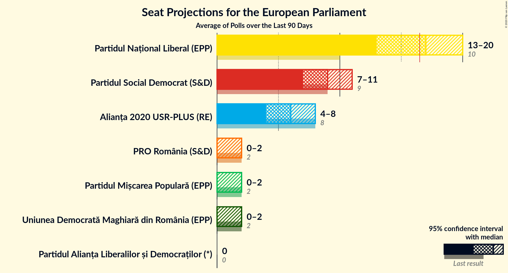
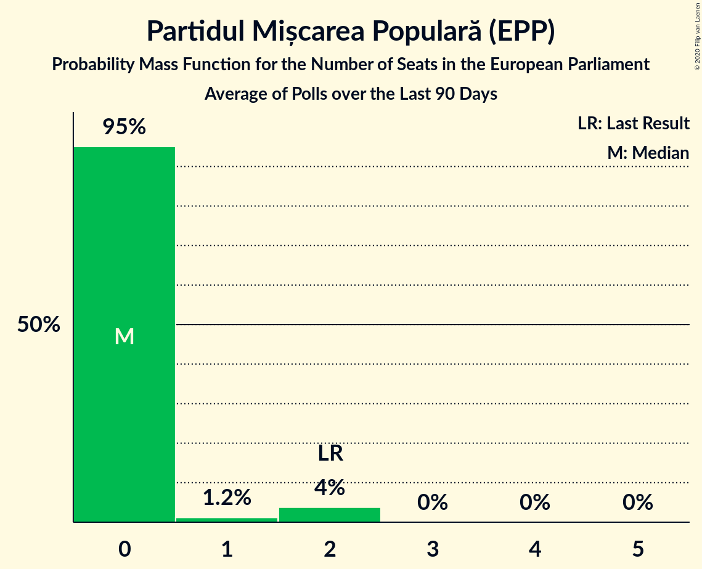
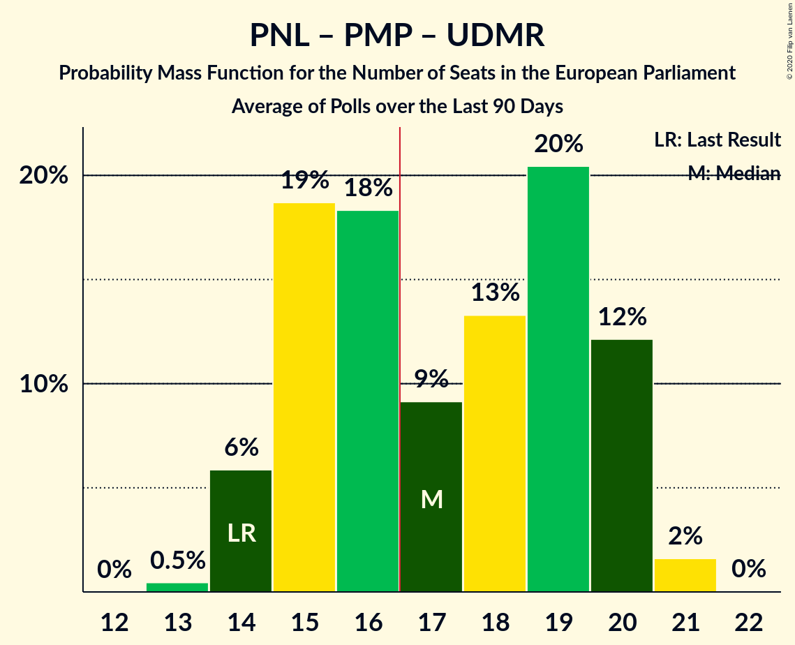
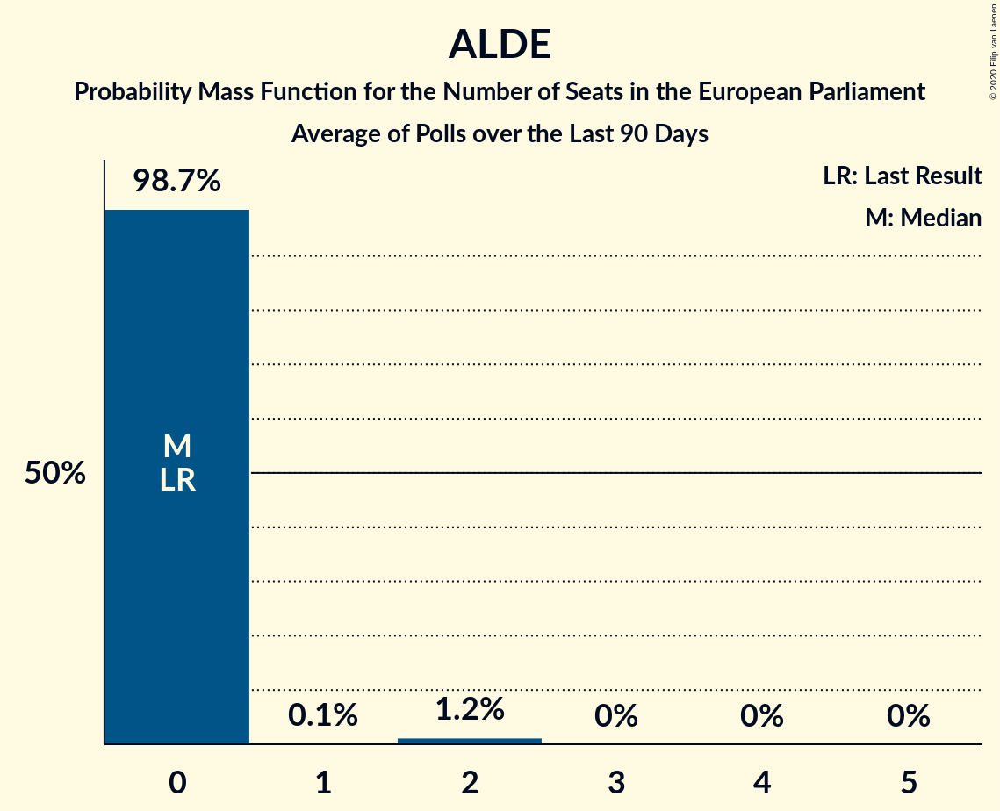

# Poll Average

<a href="#voting-intentions">Voting Intentions</a> | <a href="#seats">Seats</a> | <a href="#coalitions">Coalitions</a> | <a href="#technical-information">Technical Information</a>

## Summary

The table below lists the polls on which the average is based. They are the most recent polls (less than 90 days old) registered and analyzed so far.

| Period     | Polling firm/Commissioner(s) | PNL | PSD | A2020 | PRO | PMP | UDMR | ALDE | PLUS | USR |
|:----------:|:----------------------------:|:--:|:--:|:--:|:--:|:--:|:--:|:--:|:--:|:--:|
| 26 May 2019 | General Election | 27.0%   10 | 22.5%   9 | 22.4%   8 | 6.4%   2 | 5.8%   2 | 5.3%   2 | 4.1%   0 | 22.4%   4 | 22.4%   4 |
| N/A | Poll Average | 26–49%   9–19 | 17–33%   6–12 | 12–23%   4–9 | 4–10%   0–3 | 2–6%   0–2 | 3–6%   0–2 | 2–5%   0 | N/A   N/A | N/A   N/A |
| [13–18 December 2019](2019-12-18-Sociopol.html) | Sociopol | 44–50%   16–19 | 20–26%   7–10 | 11–15%   4–6 | 4–7%   0–2 | 2–4%   0 | 3–5%   0–2 | 1–3%   0 | N/A   N/A | N/A   N/A |
| [4–18 December 2019](2019-12-18-IMAS.html) | IMAS   Europa FM | 41–48%   15–18 | 16–21%   6–8 | 13–17%   4–6 | 5–8%   0–3 | 2–4%   0 | 4–6%   0–2 | 2–5%   0 | N/A   N/A | N/A   N/A |
| [12–17 December 2019](2019-12-17-CURS.html) | CURS   STIRIPESURSE.RO | 32–38%   12–14 | 28–34%   10–13 | 12–16%   4–6 | 5–8%   0–2 | 4–6%   0–2 | 3–5%   0–2 | 3–5%   0–1 | N/A   N/A | N/A   N/A |
| [25 October–3 November 2019](2019-11-03-USR.html) | USR | 36–41%   13–16 | 22–26%   8–10 | 18–22%   6–8 | 4–6%   0–2 | 3–6%   0–2 | 3–6%   0–2 | N/A   N/A | N/A   N/A | N/A   N/A |
| [16–20 September 2019](2019-09-20-SocioData.html) | Socio Data | 25–31%   9–12 | 22–27%   8–10 | 19–24%   7–9 | 7–11%   2–4 | 4–6%   0–2 | 4–6%   0–2 | 3–5%   0–2 | N/A   N/A | N/A   N/A |
| 26 May 2019 | General Election | 27.0%   10 | 22.5%   9 | 22.4%   8 | 6.4%   2 | 5.8%   2 | 5.3%   2 | 4.1%   0 | 22.4%   4 | 22.4%   4 |

Only polls for which at least the sample size has been published are included in the table above.

**Legend:**
+ **Top half of each row:** Voting intentions (95% confidence interval)
+ **Bottom half of each row:** Seat projections for the European Parliament (95% confidence interval)
+ **PNL:** Partidul Național Liberal (EPP)
+ **PSD:** Partidul Social Democrat (S&D)
+ **A2020:** Alianța 2020 USR-PLUS (RE)
+ **PRO:** PRO România (S&D)
+ **PMP:** Partidul Mișcarea Populară (EPP)
+ **UDMR:** Uniunea Democrată Maghiară din România (EPP)
+ **ALDE:** Partidul Alianța Liberalilor și Democraților (*)
+ **PLUS:** Partidul Libertății, Unității și Solidarității (RE)
+ **USR:** Uniunea Salvați România (RE)
+ **N/A (single party):** Party not included the published results
+ **N/A (entire row):** Calculation for this opinion poll not started yet

## Voting Intentions

### Confidence Intervals

| Party | Last Result | Median | 80% Confidence Interval | 90% Confidence Interval | 95% Confidence Interval | 99% Confidence Interval |
|:-----:|:-----------:|:------:|:-----------------------:|:-----------------------:|:-----------------------:|:-----------------------:|
| <a href="#partidul-național-liberal-(epp)">Partidul Național Liberal (EPP)</a> | 27.0% | 38.3% | 27.8–47.2% |26.9–48.1% | 26.2–48.8% | 25.2–50.1% |
| <a href="#partidul-social-democrat-(s&d)">Partidul Social Democrat (S&D)</a> | 22.5% | 24.0% | 18.3–31.0% |17.5–32.0% | 17.0–32.7% | 16.0–33.9% |
| <a href="#alianța-2020-usr-plus-(re)">Alianța 2020 USR-PLUS (RE)</a> | 22.4% | 15.3% | 12.7–22.0% |12.2–22.7% | 11.8–23.3% | 11.0–24.3% |
| <a href="#partidul-libertății,-unității-și-solidarității-(re)">Partidul Libertății, Unității și Solidarității (RE)</a> | 22.4% | N/A | N/A |N/A | N/A | N/A |
| <a href="#uniunea-salvați-românia-(re)">Uniunea Salvați România (RE)</a> | 22.4% | N/A | N/A |N/A | N/A | N/A |
| <a href="#pro-românia-(s&d)">PRO România (S&D)</a> | 6.4% | 5.9% | 4.5–8.9% |4.2–9.5% | 4.0–10.0% | 3.6–10.7% |
| <a href="#partidul-mișcarea-populară-(epp)">Partidul Mișcarea Populară (EPP)</a> | 5.8% | 4.2% | 2.7–5.5% |2.5–5.8% | 2.3–6.1% | 2.0–6.7% |
| <a href="#uniunea-democrată-maghiară-din-românia-(epp)">Uniunea Democrată Maghiară din România (EPP)</a> | 5.3% | 4.5% | 3.6–5.6% |3.4–5.9% | 3.2–6.1% | 2.8–6.7% |
| <a href="#partidul-alianța-liberalilor-și-democraților-(*)">Partidul Alianța Liberalilor și Democraților (*)</a> | 4.1% | 3.6% | 2.0–4.6% |1.7–4.9% | 1.5–5.1% | 1.3–5.6% |

### Partidul Național Liberal (EPP)

*For a full overview of the results for this party, see the [Partidul Național Liberal (EPP)](party-partidulnaționalliberalepp.html) page.*

| Voting Intentions | Probability | Accumulated | Special Marks |
|:-----------------:|:-----------:|:-----------:|:-------------:|
| 22.5–23.5% | 0% | 100% |  |
| 23.5–24.5% | 0.1% | 100% |  |
| 24.5–25.5% | 0.8% | 99.8% |  |
| 25.5–26.5% | 3% | 99.0% |  |
| 26.5–27.5% | 5% | 96% | Last Result |
| 27.5–28.5% | 6% | 91% |  |
| 28.5–29.5% | 4% | 86% |  |
| 29.5–30.5% | 2% | 82% |  |
| 30.5–31.5% | 0.6% | 80% |  |
| 31.5–32.5% | 0.8% | 80% |  |
| 32.5–33.5% | 2% | 79% |  |
| 33.5–34.5% | 5% | 77% |  |
| 34.5–35.5% | 6% | 72% |  |
| 35.5–36.5% | 6% | 66% |  |
| 36.5–37.5% | 6% | 61% |  |
| 37.5–38.5% | 6% | 54% | Median |
| 38.5–39.5% | 5% | 48% |  |
| 39.5–40.5% | 3% | 43% |  |
| 40.5–41.5% | 1.2% | 41% |  |
| 41.5–42.5% | 2% | 40% |  |
| 42.5–43.5% | 4% | 38% |  |
| 43.5–44.5% | 6% | 34% |  |
| 44.5–45.5% | 7% | 29% |  |
| 45.5–46.5% | 7% | 21% |  |
| 46.5–47.5% | 6% | 14% |  |
| 47.5–48.5% | 4% | 8% |  |
| 48.5–49.5% | 2% | 3% |  |
| 49.5–50.5% | 0.8% | 1.1% |  |
| 50.5–51.5% | 0.2% | 0.2% |  |
| 51.5–52.5% | 0% | 0% |  |

### Partidul Social Democrat (S&D)

*For a full overview of the results for this party, see the [Partidul Social Democrat (S&D)](party-partidulsocialdemocratsd.html) page.*

| Voting Intentions | Probability | Accumulated | Special Marks |
|:-----------------:|:-----------:|:-----------:|:-------------:|
| 13.5–14.5% | 0% | 100% |  |
| 14.5–15.5% | 0.2% | 100% |  |
| 15.5–16.5% | 1.1% | 99.8% |  |
| 16.5–17.5% | 4% | 98.7% |  |
| 17.5–18.5% | 6% | 95% |  |
| 18.5–19.5% | 5% | 89% |  |
| 19.5–20.5% | 3% | 83% |  |
| 20.5–21.5% | 3% | 80% |  |
| 21.5–22.5% | 7% | 77% |  |
| 22.5–23.5% | 13% | 70% | Last Result |
| 23.5–24.5% | 16% | 57% | Median |
| 24.5–25.5% | 12% | 41% |  |
| 25.5–26.5% | 6% | 29% |  |
| 26.5–27.5% | 2% | 22% |  |
| 27.5–28.5% | 1.0% | 20% |  |
| 28.5–29.5% | 2% | 19% |  |
| 29.5–30.5% | 4% | 17% |  |
| 30.5–31.5% | 6% | 13% |  |
| 31.5–32.5% | 4% | 7% |  |
| 32.5–33.5% | 2% | 3% |  |
| 33.5–34.5% | 0.7% | 0.8% |  |
| 34.5–35.5% | 0.1% | 0.2% |  |
| 35.5–36.5% | 0% | 0% |  |

### Alianța 2020 USR-PLUS (RE)

*For a full overview of the results for this party, see the [Alianța 2020 USR-PLUS (RE)](party-alianța2020usr-plusre.html) page.*

| Voting Intentions | Probability | Accumulated | Special Marks |
|:-----------------:|:-----------:|:-----------:|:-------------:|
| 8.5–9.5% | 0% | 100% |  |
| 9.5–10.5% | 0.1% | 100% |  |
| 10.5–11.5% | 1.5% | 99.9% |  |
| 11.5–12.5% | 7% | 98% |  |
| 12.5–13.5% | 14% | 92% |  |
| 13.5–14.5% | 17% | 78% |  |
| 14.5–15.5% | 13% | 60% | Median |
| 15.5–16.5% | 6% | 47% |  |
| 16.5–17.5% | 2% | 42% |  |
| 17.5–18.5% | 2% | 40% |  |
| 18.5–19.5% | 5% | 38% |  |
| 19.5–20.5% | 9% | 33% |  |
| 20.5–21.5% | 10% | 23% |  |
| 21.5–22.5% | 8% | 14% | Last Result |
| 22.5–23.5% | 4% | 6% |  |
| 23.5–24.5% | 1.4% | 2% |  |
| 24.5–25.5% | 0.3% | 0.3% |  |
| 25.5–26.5% | 0% | 0% |  |

### PRO România (S&D)

*For a full overview of the results for this party, see the [PRO România (S&D)](party-proromâniasd.html) page.*

| Voting Intentions | Probability | Accumulated | Special Marks |
|:-----------------:|:-----------:|:-----------:|:-------------:|
| 1.5–2.5% | 0% | 100% |  |
| 2.5–3.5% | 0.3% | 100% |  |
| 3.5–4.5% | 11% | 99.7% |  |
| 4.5–5.5% | 29% | 89% |  |
| 5.5–6.5% | 27% | 60% | Last Result, Median |
| 6.5–7.5% | 13% | 34% |  |
| 7.5–8.5% | 8% | 21% |  |
| 8.5–9.5% | 9% | 14% |  |
| 9.5–10.5% | 4% | 5% |  |
| 10.5–11.5% | 0.7% | 0.8% |  |
| 11.5–12.5% | 0.1% | 0.1% |  |
| 12.5–13.5% | 0% | 0% |  |

### Partidul Mișcarea Populară (EPP)

*For a full overview of the results for this party, see the [Partidul Mișcarea Populară (EPP)](party-partidulmișcareapopularăepp.html) page.*

| Voting Intentions | Probability | Accumulated | Special Marks |
|:-----------------:|:-----------:|:-----------:|:-------------:|
| 0.5–1.5% | 0% | 100% |  |
| 1.5–2.5% | 7% | 100% |  |
| 2.5–3.5% | 28% | 93% |  |
| 3.5–4.5% | 28% | 66% | Median |
| 4.5–5.5% | 29% | 38% |  |
| 5.5–6.5% | 9% | 9% | Last Result |
| 6.5–7.5% | 0.7% | 0.7% |  |
| 7.5–8.5% | 0% | 0% |  |

### Uniunea Democrată Maghiară din România (EPP)

*For a full overview of the results for this party, see the [Uniunea Democrată Maghiară din România (EPP)](party-uniuneademocratămaghiarădinromâniaepp.html) page.*

| Voting Intentions | Probability | Accumulated | Special Marks |
|:-----------------:|:-----------:|:-----------:|:-------------:|
| 1.5–2.5% | 0.1% | 100% |  |
| 2.5–3.5% | 8% | 99.9% |  |
| 3.5–4.5% | 43% | 91% |  |
| 4.5–5.5% | 38% | 49% | Last Result, Median |
| 5.5–6.5% | 10% | 10% |  |
| 6.5–7.5% | 0.7% | 0.8% |  |
| 7.5–8.5% | 0% | 0% |  |

### Partidul Alianța Liberalilor și Democraților (*)

*For a full overview of the results for this party, see the [Partidul Alianța Liberalilor și Democraților (*)](party-partidulalianțaliberalilorșidemocraților.html) page.*

| Voting Intentions | Probability | Accumulated | Special Marks |
|:-----------------:|:-----------:|:-----------:|:-------------:|
| 0.0–0.5% | 0% | 100% |  |
| 0.5–1.5% | 3% | 100% |  |
| 1.5–2.5% | 19% | 97% |  |
| 2.5–3.5% | 26% | 78% |  |
| 3.5–4.5% | 41% | 52% | Last Result, Median |
| 4.5–5.5% | 11% | 11% |  |
| 5.5–6.5% | 0.6% | 0.6% |  |
| 6.5–7.5% | 0% | 0% |  |

## Seats

### Confidence Intervals

| Party | Last Result | Median | 80% Confidence Interval | 90% Confidence Interval | 95% Confidence Interval | 99% Confidence Interval |
|:-----:|:-----------:|:------:|:-----------------------:|:-----------------------:|:-----------------------:|:-----------------------:|
| <a href="#partidul-național-liberal-(epp)">Partidul Național Liberal (EPP)</a> | 10 | 14 | 10–18 |10–19 | 9–19 | 9–19 |
| <a href="#partidul-social-democrat-(s&d)">Partidul Social Democrat (S&D)</a> | 9 | 9 | 7–11 |6–12 | 6–12 | 6–13 |
| <a href="#alianța-2020-usr-plus-(re)">Alianța 2020 USR-PLUS (RE)</a> | 8 | 5 | 4–8 |4–8 | 4–9 | 4–9 |
| <a href="#partidul-libertății,-unității-și-solidarității-(re)">Partidul Libertății, Unității și Solidarității (RE)</a> | 4 | N/A | N/A |N/A | N/A | N/A |
| <a href="#uniunea-salvați-românia-(re)">Uniunea Salvați România (RE)</a> | 4 | N/A | N/A |N/A | N/A | N/A |
| <a href="#pro-românia-(s&d)">PRO România (S&D)</a> | 2 | 2 | 0–3 |0–3 | 0–3 | 0–4 |
| <a href="#partidul-mișcarea-populară-(epp)">Partidul Mișcarea Populară (EPP)</a> | 2 | 0 | 0–2 |0–2 | 0–2 | 0–2 |
| <a href="#uniunea-democrată-maghiară-din-românia-(epp)">Uniunea Democrată Maghiară din România (EPP)</a> | 2 | 0 | 0–2 |0–2 | 0–2 | 0–2 |
| <a href="#partidul-alianța-liberalilor-și-democraților-(*)">Partidul Alianța Liberalilor și Democraților (*)</a> | 0 | 0 | 0 |0 | 0 | 0–2 |

### Partidul Național Liberal (EPP)

*For a full overview of the results for this party, see the [Partidul Național Liberal (EPP)](party-partidulnaționalliberalepp.html) page.*

| Number of Seats | Probability | Accumulated | Special Marks |
|:---------------:|:-----------:|:-----------:|:-------------:|
| 9 | 3% | 100% |  |
| 10 | 11% | 97% | Last Result |
| 11 | 7% | 87% |  |
| 12 | 6% | 80% |  |
| 13 | 12% | 74% |  |
| 14 | 12% | 62% | Median |
| 15 | 10% | 50% |  |
| 16 | 9% | 40% |  |
| 17 | 14% | 31% | Majority |
| 18 | 12% | 17% |  |
| 19 | 5% | 5% |  |
| 20 | 0.5% | 0.5% |  |
| 21 | 0% | 0% |  |

### Partidul Social Democrat (S&D)

*For a full overview of the results for this party, see the [Partidul Social Democrat (S&D)](party-partidulsocialdemocratsd.html) page.*

| Number of Seats | Probability | Accumulated | Special Marks |
|:---------------:|:-----------:|:-----------:|:-------------:|
| 5 | 0.3% | 100% |  |
| 6 | 8% | 99.7% |  |
| 7 | 11% | 92% |  |
| 8 | 20% | 80% |  |
| 9 | 32% | 61% | Last Result, Median |
| 10 | 10% | 29% |  |
| 11 | 10% | 18% |  |
| 12 | 7% | 8% |  |
| 13 | 0.9% | 0.9% |  |
| 14 | 0% | 0% |  |

### Alianța 2020 USR-PLUS (RE)

*For a full overview of the results for this party, see the [Alianța 2020 USR-PLUS (RE)](party-alianța2020usr-plusre.html) page.*

| Number of Seats | Probability | Accumulated | Special Marks |
|:---------------:|:-----------:|:-----------:|:-------------:|
| 3 | 0.1% | 100% |  |
| 4 | 13% | 99.9% |  |
| 5 | 39% | 87% | Median |
| 6 | 9% | 48% |  |
| 7 | 16% | 39% |  |
| 8 | 20% | 23% | Last Result |
| 9 | 4% | 4% |  |
| 10 | 0.1% | 0.1% |  |
| 11 | 0% | 0% |  |

### PRO România (S&D)

*For a full overview of the results for this party, see the [PRO România (S&D)](party-proromâniasd.html) page.*

| Number of Seats | Probability | Accumulated | Special Marks |
|:---------------:|:-----------:|:-----------:|:-------------:|
| 0 | 24% | 100% |  |
| 1 | 5% | 76% |  |
| 2 | 50% | 70% | Last Result, Median |
| 3 | 19% | 20% |  |
| 4 | 1.2% | 1.2% |  |
| 5 | 0% | 0% |  |

### Partidul Mișcarea Populară (EPP)

*For a full overview of the results for this party, see the [Partidul Mișcarea Populară (EPP)](party-partidulmișcareapopularăepp.html) page.*

| Number of Seats | Probability | Accumulated | Special Marks |
|:---------------:|:-----------:|:-----------:|:-------------:|
| 0 | 78% | 100% | Median |
| 1 | 6% | 22% |  |
| 2 | 16% | 16% | Last Result |
| 3 | 0% | 0% |  |

### Uniunea Democrată Maghiară din România (EPP)

*For a full overview of the results for this party, see the [Uniunea Democrată Maghiară din România (EPP)](party-uniuneademocratămaghiarădinromâniaepp.html) page.*

| Number of Seats | Probability | Accumulated | Special Marks |
|:---------------:|:-----------:|:-----------:|:-------------:|
| 0 | 72% | 100% | Median |
| 1 | 10% | 28% |  |
| 2 | 18% | 18% | Last Result |
| 3 | 0% | 0% |  |

### Partidul Alianța Liberalilor și Democraților (*)

*For a full overview of the results for this party, see the [Partidul Alianța Liberalilor și Democraților (*)](party-partidulalianțaliberalilorșidemocraților.html) page.*

| Number of Seats | Probability | Accumulated | Special Marks |
|:---------------:|:-----------:|:-----------:|:-------------:|
| 0 | 98% | 100% | Last Result, Median |
| 1 | 1.0% | 2% |  |
| 2 | 1.2% | 1.2% |  |
| 3 | 0% | 0% |  |

## Coalitions

### Confidence Intervals

| Coalition | Last Result | Median | Majority? | 80% Confidence Interval | 90% Confidence Interval | 95% Confidence Interval | 99% Confidence Interval |
|:---------:|:-----------:|:------:|:---------:|:-----------------------:|:-----------------------:|:-----------------------:|:-----------------------:|
| Partidul Național Liberal (EPP) – Partidul Mișcarea Populară (EPP) – Uniunea Democrată Maghiară din România (EPP) | 14 | 15 | 37% | 12–18 | 11–19 | 11–19 | 10–20 |
| Partidul Social Democrat (S&D) – PRO România (S&D) | 11 | 10 | 0% | 8–13 | 8–14 | 8–14 | 7–15 |
| Alianța 2020 USR-PLUS (RE) – Partidul Libertății, Unității și Solidarității (RE) – Uniunea Salvați România (RE) | 16 | 5 | 0% | 4–8 | 4–8 | 4–9 | 4–9 |
| Partidul Alianța Liberalilor și Democraților (*) | 0 | 0 | 0% | 0 | 0 | 0 | 0–2 |

### Partidul Național Liberal (EPP) – Partidul Mișcarea Populară (EPP) – Uniunea Democrată Maghiară din România (EPP)

| Number of Seats | Probability | Accumulated | Special Marks |
|:---------------:|:-----------:|:-----------:|:-------------:|
| 9 | 0.1% | 100% |  |
| 10 | 1.5% | 99.9% |  |
| 11 | 5% | 98% |  |
| 12 | 9% | 93% |  |
| 13 | 11% | 85% |  |
| 14 | 14% | 73% | Last Result, Median |
| 15 | 14% | 59% |  |
| 16 | 8% | 46% |  |
| 17 | 12% | 37% | Majority |
| 18 | 16% | 25% |  |
| 19 | 8% | 9% |  |
| 20 | 0.9% | 0.9% |  |
| 21 | 0% | 0% |  |

### Partidul Social Democrat (S&D) – PRO România (S&D)

| Number of Seats | Probability | Accumulated | Special Marks |
|:---------------:|:-----------:|:-----------:|:-------------:|
| 6 | 0.1% | 100% |  |
| 7 | 0.9% | 99.9% |  |
| 8 | 13% | 99.0% |  |
| 9 | 26% | 86% |  |
| 10 | 15% | 60% |  |
| 11 | 9% | 45% | Last Result, Median |
| 12 | 14% | 35% |  |
| 13 | 14% | 22% |  |
| 14 | 7% | 8% |  |
| 15 | 0.6% | 0.6% |  |
| 16 | 0% | 0% |  |

### Alianța 2020 USR-PLUS (RE) – Partidul Libertății, Unității și Solidarității (RE) – Uniunea Salvați România (RE)

| Number of Seats | Probability | Accumulated | Special Marks |
|:---------------:|:-----------:|:-----------:|:-------------:|
| 3 | 0.1% | 100% |  |
| 4 | 13% | 99.9% |  |
| 5 | 39% | 87% | Median |
| 6 | 9% | 48% |  |
| 7 | 16% | 39% |  |
| 8 | 20% | 23% |  |
| 9 | 4% | 4% |  |
| 10 | 0.1% | 0.1% |  |
| 11 | 0% | 0% |  |
| 12 | 0% | 0% |  |
| 13 | 0% | 0% |  |
| 14 | 0% | 0% |  |
| 15 | 0% | 0% |  |
| 16 | 0% | 0% | Last Result |

### Partidul Alianța Liberalilor și Democraților (*)

| Number of Seats | Probability | Accumulated | Special Marks |
|:---------------:|:-----------:|:-----------:|:-------------:|
| 0 | 98% | 100% | Last Result, Median |
| 1 | 0.8% | 2% |  |
| 2 | 1.0% | 1.0% |  |
| 3 | 0% | 0% |  |

## Technical Information

+ **Number of polls included in this average:** 5
+ **Lowest number of simulations done in a poll included in this average:** 1,048,576
+ **Total number of simulations done in the polls included in this average:** 5,242,880
+ **Error estimate:** 1.30%
