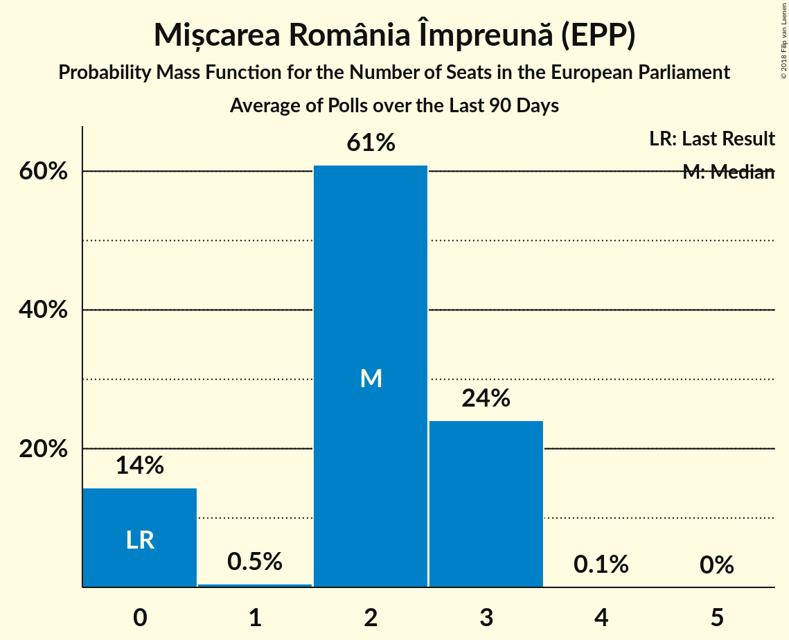

# Poll Average

<a href="#voting-intentions">Voting Intentions</a> | <a href="#seats">Seats</a> | <a href="#coalitions">Coalitions</a> | <a href="#technical-information">Technical Information</a>

## Summary

The table below lists the polls on which the average is based. They are the most recent polls (less than 90 days old) registered and analyzed so far.

| Period     | Polling firm/Commissioner(s) | PSD | ALDE | PNL | UDMR | PMP | RO+ | PRO | USR |
|:----------:|:----------------------------:|:--:|:--:|:--:|:--:|:--:|:--:|:--:|:--:|
| 25 May 2014 | General Election | 37.6%   16 | 15.0%   6 | 12.2%   5 | 6.3%   2 | 6.2%   2 | 0.0%   0 | 0.0%   0 | 0.0%   0 |
| N/A | Poll Average | 26–40%   9–15 | 7–10%   2–3 | 22–31%   7–11 | 4–6%   0–2 | 2–5%   0–1 | 4–9%   0–3 | 4–6%   0–2 | 6–13%   2–4 |
| [23 June–1 July 2018](2018-07-01-CURS.html) | CURS   STIRIPESURSE.RO | 35–40%   12–15 | 7–10%   2–3 | 22–27%   7–11 | 4–7%   0–2 | 3–5%   0–2 | 4–7%   0–2 | 4–7%   0–2 | 6–9%   2–3 |
| [1–30 June 2018](2018-06-30-IMAS.html) | IMAS | 26–31%   9–11 | 7–10%   3 | 27–32%   9–11 | 4–6%   0–2 | 2–4%   0 | 7–10%   2–3 | N/A   N/A | 10–13%   3–4 |
| [22–26 June 2018](2018-06-26-Sociopol.html) | Sociopol   România TV | N/A   N/A | N/A   N/A | N/A   N/A | N/A   N/A | N/A   N/A | N/A   N/A | N/A   N/A | N/A   N/A |
| 25 May 2014 | General Election | 37.6%   16 | 15.0%   6 | 12.2%   5 | 6.3%   2 | 6.2%   2 | 0.0%   0 | 0.0%   0 | 0.0%   0 |

Only polls for which at least the sample size has been published are included in the table above.

**Legend:**
+ **Top half of each row:** Voting intentions (95% confidence interval)
+ **Bottom half of each row:** Seat projections for the European Parliament (95% confidence interval)
+ **PSD:** Partidul Social Democrat (S&D)
+ **ALDE:** Partidul Alianța Liberalilor și Democraților (ALDE)
+ **PNL:** Partidul Național Liberal (EPP)
+ **UDMR:** Uniunea Democrată Maghiară din România (EPP)
+ **PMP:** Partidul Mișcarea Populară (EPP)
+ **RO+:** Mișcarea România Împreună (EPP)
+ **PRO:** PRO România (ECR)
+ **USR:** Uniunea Salvați România (*)
+ **N/A (single party):** Party not included the published results
+ **N/A (entire row):** Calculation for this opinion poll not started yet

## Voting Intentions

### Confidence Intervals

| Party | Last Result | Median | 80% Confidence Interval | 90% Confidence Interval | 95% Confidence Interval | 99% Confidence Interval |
|:-----:|:-----------:|:------:|:-----------------------:|:-----------------------:|:-----------------------:|:-----------------------:|
| <a href="#partidul-social-democrat-(s&d)">Partidul Social Democrat (S&D)</a> | 37.6% | 32.7% | 27.4–38.7% |26.8–39.3% | 26.3–39.9% | 25.5–40.9% |
| <a href="#partidul-alianța-liberalilor-și-democraților-(alde)">Partidul Alianța Liberalilor și Democraților (ALDE)</a> | 15.0% | 8.4% | 7.3–9.5% |7.0–9.8% | 6.8–10.1% | 6.3–10.7% |
| <a href="#partidul-național-liberal-(epp)">Partidul Național Liberal (EPP)</a> | 12.2% | 26.8% | 23.2–30.3% |22.7–30.9% | 22.2–31.4% | 21.3–32.3% |
| <a href="#uniunea-democrată-maghiară-din-românia-(epp)">Uniunea Democrată Maghiară din România (EPP)</a> | 6.3% | 5.1% | 4.3–6.0% |4.1–6.2% | 3.9–6.5% | 3.6–7.0% |
| <a href="#partidul-mișcarea-populară-(epp)">Partidul Mișcarea Populară (EPP)</a> | 6.2% | 3.5% | 2.5–4.6% |2.3–4.9% | 2.2–5.2% | 1.9–5.6% |
| <a href="#mișcarea-românia-împreună-(epp)">Mișcarea România Împreună (EPP)</a> | 0.0% | 6.6% | 4.6–8.7% |4.3–9.1% | 4.1–9.4% | 3.7–10.0% |
| <a href="#pro-românia-(ecr)">PRO România (ECR)</a> | 0.0% | 5.1% | 4.3–6.0% |4.1–6.3% | 3.9–6.5% | 3.6–7.0% |
| <a href="#uniunea-salvați-românia-(*)">Uniunea Salvați România (*)</a> | 0.0% | 9.2% | 6.4–12.2% |6.1–12.6% | 5.9–12.9% | 5.4–13.6% |

### Partidul Social Democrat (S&D)

*For a full overview of the results for this party, see the [Partidul Social Democrat (S&D)](party-partidulsocialdemocratsd.html) page.*

| Voting Intentions | Probability | Accumulated | Special Marks |
|:-----------------:|:-----------:|:-----------:|:-------------:|
| 23.5–24.5% | 0% | 100% |  |
| 24.5–25.5% | 0.5% | 99.9% |  |
| 25.5–26.5% | 3% | 99.4% |  |
| 26.5–27.5% | 9% | 96% |  |
| 27.5–28.5% | 14% | 88% |  |
| 28.5–29.5% | 13% | 73% |  |
| 29.5–30.5% | 7% | 60% |  |
| 30.5–31.5% | 2% | 53% |  |
| 31.5–32.5% | 0.4% | 50% |  |
| 32.5–33.5% | 0.2% | 50% | Median |
| 33.5–34.5% | 1.1% | 50% |  |
| 34.5–35.5% | 4% | 49% |  |
| 35.5–36.5% | 9% | 45% |  |
| 36.5–37.5% | 13% | 36% |  |
| 37.5–38.5% | 12% | 23% | Last Result |
| 38.5–39.5% | 7% | 11% |  |
| 39.5–40.5% | 3% | 4% |  |
| 40.5–41.5% | 0.8% | 0.9% |  |
| 41.5–42.5% | 0.1% | 0.1% |  |
| 42.5–43.5% | 0% | 0% |  |

### Partidul Alianța Liberalilor și Democraților (ALDE)

*For a full overview of the results for this party, see the [Partidul Alianța Liberalilor și Democraților (ALDE)](party-partidulalianțaliberalilorșidemocrațiloralde.html) page.*

| Voting Intentions | Probability | Accumulated | Special Marks |
|:-----------------:|:-----------:|:-----------:|:-------------:|
| 4.5–5.5% | 0% | 100% |  |
| 5.5–6.5% | 1.3% | 100% |  |
| 6.5–7.5% | 15% | 98.7% |  |
| 7.5–8.5% | 42% | 84% | Median |
| 8.5–9.5% | 33% | 42% |  |
| 9.5–10.5% | 8% | 9% |  |
| 10.5–11.5% | 0.8% | 0.8% |  |
| 11.5–12.5% | 0% | 0% |  |
| 12.5–13.5% | 0% | 0% |  |
| 13.5–14.5% | 0% | 0% |  |
| 14.5–15.5% | 0% | 0% | Last Result |

### Partidul Național Liberal (EPP)

*For a full overview of the results for this party, see the [Partidul Național Liberal (EPP)](party-partidulnaționalliberalepp.html) page.*

| Voting Intentions | Probability | Accumulated | Special Marks |
|:-----------------:|:-----------:|:-----------:|:-------------:|
| 11.5–12.5% | 0% | 100% | Last Result |
| 12.5–13.5% | 0% | 100% |  |
| 13.5–14.5% | 0% | 100% |  |
| 14.5–15.5% | 0% | 100% |  |
| 15.5–16.5% | 0% | 100% |  |
| 16.5–17.5% | 0% | 100% |  |
| 17.5–18.5% | 0% | 100% |  |
| 18.5–19.5% | 0% | 100% |  |
| 19.5–20.5% | 0.1% | 100% |  |
| 20.5–21.5% | 0.7% | 99.9% |  |
| 21.5–22.5% | 4% | 99.2% |  |
| 22.5–23.5% | 10% | 96% |  |
| 23.5–24.5% | 15% | 86% |  |
| 24.5–25.5% | 13% | 71% |  |
| 25.5–26.5% | 7% | 59% |  |
| 26.5–27.5% | 6% | 51% | Median |
| 27.5–28.5% | 11% | 45% |  |
| 28.5–29.5% | 15% | 34% |  |
| 29.5–30.5% | 12% | 20% |  |
| 30.5–31.5% | 6% | 8% |  |
| 31.5–32.5% | 2% | 2% |  |
| 32.5–33.5% | 0.3% | 0.3% |  |
| 33.5–34.5% | 0% | 0% |  |

### Uniunea Democrată Maghiară din România (EPP)

*For a full overview of the results for this party, see the [Uniunea Democrată Maghiară din România (EPP)](party-uniuneademocratămaghiarădinromâniaepp.html) page.*

| Voting Intentions | Probability | Accumulated | Special Marks |
|:-----------------:|:-----------:|:-----------:|:-------------:|
| 1.5–2.5% | 0% | 100% |  |
| 2.5–3.5% | 0.4% | 100% |  |
| 3.5–4.5% | 20% | 99.6% |  |
| 4.5–5.5% | 55% | 80% | Median |
| 5.5–6.5% | 22% | 24% | Last Result |
| 6.5–7.5% | 2% | 2% |  |
| 7.5–8.5% | 0% | 0% |  |
| 8.5–9.5% | 0% | 0% |  |

### Partidul Mișcarea Populară (EPP)

*For a full overview of the results for this party, see the [Partidul Mișcarea Populară (EPP)](party-partidulmișcareapopularăepp.html) page.*

| Voting Intentions | Probability | Accumulated | Special Marks |
|:-----------------:|:-----------:|:-----------:|:-------------:|
| 0.5–1.5% | 0% | 100% |  |
| 1.5–2.5% | 12% | 100% |  |
| 2.5–3.5% | 42% | 88% | Median |
| 3.5–4.5% | 35% | 46% |  |
| 4.5–5.5% | 11% | 11% |  |
| 5.5–6.5% | 0.7% | 0.7% | Last Result |
| 6.5–7.5% | 0% | 0% |  |

### Uniunea Salvați România (*)

*For a full overview of the results for this party, see the [Uniunea Salvați România (*)](party-uniuneasalvațiromânia.html) page.*

| Voting Intentions | Probability | Accumulated | Special Marks |
|:-----------------:|:-----------:|:-----------:|:-------------:|
| 0.0–0.5% | 0% | 100% | Last Result |
| 0.5–1.5% | 0% | 100% |  |
| 1.5–2.5% | 0% | 100% |  |
| 2.5–3.5% | 0% | 100% |  |
| 3.5–4.5% | 0% | 100% |  |
| 4.5–5.5% | 0.9% | 100% |  |
| 5.5–6.5% | 11% | 99.1% |  |
| 6.5–7.5% | 24% | 88% |  |
| 7.5–8.5% | 12% | 64% |  |
| 8.5–9.5% | 3% | 52% | Median |
| 9.5–10.5% | 8% | 49% |  |
| 10.5–11.5% | 20% | 41% |  |
| 11.5–12.5% | 16% | 21% |  |
| 12.5–13.5% | 5% | 5% |  |
| 13.5–14.5% | 0.6% | 0.6% |  |
| 14.5–15.5% | 0% | 0% |  |

### Mișcarea România Împreună (EPP)

*For a full overview of the results for this party, see the [Mișcarea România Împreună (EPP)](party-mișcarearomâniaîmpreunăepp.html) page.*

| Voting Intentions | Probability | Accumulated | Special Marks |
|:-----------------:|:-----------:|:-----------:|:-------------:|
| 0.0–0.5% | 0% | 100% | Last Result |
| 0.5–1.5% | 0% | 100% |  |
| 1.5–2.5% | 0% | 100% |  |
| 2.5–3.5% | 0.2% | 100% |  |
| 3.5–4.5% | 9% | 99.8% |  |
| 4.5–5.5% | 27% | 90% |  |
| 5.5–6.5% | 13% | 63% |  |
| 6.5–7.5% | 13% | 50% | Median |
| 7.5–8.5% | 24% | 37% |  |
| 8.5–9.5% | 12% | 13% |  |
| 9.5–10.5% | 2% | 2% |  |
| 10.5–11.5% | 0.1% | 0.1% |  |
| 11.5–12.5% | 0% | 0% |  |

### PRO România (ECR)

*For a full overview of the results for this party, see the [PRO România (ECR)](party-proromâniaecr.html) page.*

| Voting Intentions | Probability | Accumulated | Special Marks |
|:-----------------:|:-----------:|:-----------:|:-------------:|
| 0.0–0.5% | 0% | 100% | Last Result |
| 0.5–1.5% | 0% | 100% |  |
| 1.5–2.5% | 0% | 100% |  |
| 2.5–3.5% | 0.5% | 100% |  |
| 3.5–4.5% | 19% | 99.5% |  |
| 4.5–5.5% | 54% | 81% | Median |
| 5.5–6.5% | 24% | 27% |  |
| 6.5–7.5% | 2% | 2% |  |
| 7.5–8.5% | 0.1% | 0.1% |  |
| 8.5–9.5% | 0% | 0% |  |

## Seats

### Confidence Intervals

| Party | Last Result | Median | 80% Confidence Interval | 90% Confidence Interval | 95% Confidence Interval | 99% Confidence Interval |
|:-----:|:-----------:|:------:|:-----------------------:|:-----------------------:|:-----------------------:|:-----------------------:|
| <a href="#partidul-social-democrat-(s&d)">Partidul Social Democrat (S&D)</a> | 16 | 12 | 9–15 |9–15 | 9–15 | 9–16 |
| <a href="#partidul-alianța-liberalilor-și-democraților-(alde)">Partidul Alianța Liberalilor și Democraților (ALDE)</a> | 6 | 3 | 3 |3 | 2–3 | 2–4 |
| <a href="#partidul-național-liberal-(epp)">Partidul Național Liberal (EPP)</a> | 5 | 10 | 8–11 |8–11 | 7–11 | 7–11 |
| <a href="#uniunea-democrată-maghiară-din-românia-(epp)">Uniunea Democrată Maghiară din România (EPP)</a> | 2 | 2 | 0–2 |0–2 | 0–2 | 0–2 |
| <a href="#partidul-mișcarea-populară-(epp)">Partidul Mișcarea Populară (EPP)</a> | 2 | 0 | 0 |0 | 0–1 | 0–2 |
| <a href="#mișcarea-românia-împreună-(epp)">Mișcarea România Împreună (EPP)</a> | 0 | 2 | 0–3 |0–3 | 0–3 | 0–3 |
| <a href="#pro-românia-(ecr)">PRO România (ECR)</a> | 0 | 2 | 0–2 |0–2 | 0–2 | 0–2 |
| <a href="#uniunea-salvați-românia-(*)">Uniunea Salvați România (*)</a> | 0 | 3 | 3–4 |2–4 | 2–4 | 2–4 |

### Partidul Social Democrat (S&D)

*For a full overview of the results for this party, see the [Partidul Social Democrat (S&D)](party-partidulsocialdemocratsd.html) page.*

| Number of Seats | Probability | Accumulated | Special Marks |
|:---------------:|:-----------:|:-----------:|:-------------:|
| 9 | 36% | 100% |  |
| 10 | 0.2% | 64% |  |
| 11 | 14% | 64% |  |
| 12 | 2% | 50% | Median |
| 13 | 0.8% | 48% |  |
| 14 | 15% | 47% |  |
| 15 | 31% | 32% |  |
| 16 | 1.1% | 1.1% | Last Result |
| 17 | 0% | 0% | Majority |

### Partidul Alianța Liberalilor și Democraților (ALDE)

*For a full overview of the results for this party, see the [Partidul Alianța Liberalilor și Democraților (ALDE)](party-partidulalianțaliberalilorșidemocrațiloralde.html) page.*

| Number of Seats | Probability | Accumulated | Special Marks |
|:---------------:|:-----------:|:-----------:|:-------------:|
| 2 | 5% | 100% |  |
| 3 | 94% | 95% | Median |
| 4 | 0.9% | 0.9% |  |
| 5 | 0% | 0% |  |
| 6 | 0% | 0% | Last Result |

### Partidul Național Liberal (EPP)

*For a full overview of the results for this party, see the [Partidul Național Liberal (EPP)](party-partidulnaționalliberalepp.html) page.*

| Number of Seats | Probability | Accumulated | Special Marks |
|:---------------:|:-----------:|:-----------:|:-------------:|
| 5 | 0% | 100% | Last Result |
| 6 | 0% | 100% |  |
| 7 | 5% | 100% |  |
| 8 | 32% | 95% |  |
| 9 | 10% | 63% |  |
| 10 | 32% | 53% | Median |
| 11 | 21% | 21% |  |
| 12 | 0.1% | 0.1% |  |
| 13 | 0% | 0% |  |

### Uniunea Democrată Maghiară din România (EPP)

*For a full overview of the results for this party, see the [Uniunea Democrată Maghiară din România (EPP)](party-uniuneademocratămaghiarădinromâniaepp.html) page.*

| Number of Seats | Probability | Accumulated | Special Marks |
|:---------------:|:-----------:|:-----------:|:-------------:|
| 0 | 16% | 100% |  |
| 1 | 0.4% | 84% |  |
| 2 | 84% | 84% | Last Result, Median |
| 3 | 0% | 0% |  |

### Partidul Mișcarea Populară (EPP)

*For a full overview of the results for this party, see the [Partidul Mișcarea Populară (EPP)](party-partidulmișcareapopularăepp.html) page.*

| Number of Seats | Probability | Accumulated | Special Marks |
|:---------------:|:-----------:|:-----------:|:-------------:|
| 0 | 95% | 100% | Median |
| 1 | 2% | 5% |  |
| 2 | 2% | 2% | Last Result |
| 3 | 0% | 0% |  |

### Uniunea Salvați România (*)

*For a full overview of the results for this party, see the [Uniunea Salvați România (*)](party-uniuneasalvațiromânia.html) page.*

| Number of Seats | Probability | Accumulated | Special Marks |
|:---------------:|:-----------:|:-----------:|:-------------:|
| 0 | 0% | 100% | Last Result |
| 1 | 0% | 100% |  |
| 2 | 7% | 100% |  |
| 3 | 44% | 93% | Median |
| 4 | 48% | 49% |  |
| 5 | 0.2% | 0.2% |  |
| 6 | 0% | 0% |  |

### Mișcarea România Împreună (EPP)

*For a full overview of the results for this party, see the [Mișcarea România Împreună (EPP)](party-mișcarearomâniaîmpreunăepp.html) page.*

| Number of Seats | Probability | Accumulated | Special Marks |
|:---------------:|:-----------:|:-----------:|:-------------:|
| 0 | 39% | 100% | Last Result |
| 1 | 0% | 61% |  |
| 2 | 33% | 61% | Median |
| 3 | 28% | 28% |  |
| 4 | 0.4% | 0.4% |  |
| 5 | 0% | 0% |  |

### PRO România (ECR)

*For a full overview of the results for this party, see the [PRO România (ECR)](party-proromâniaecr.html) page.*

| Number of Seats | Probability | Accumulated | Special Marks |
|:---------------:|:-----------:|:-----------:|:-------------:|
| 0 | 12% | 100% | Last Result |
| 1 | 0% | 88% |  |
| 2 | 88% | 88% | Median |
| 3 | 0% | 0% |  |

## Coalitions

### Confidence Intervals

| Coalition | Last Result | Median | Majority? | 80% Confidence Interval | 90% Confidence Interval | 95% Confidence Interval | 99% Confidence Interval |
|:---------:|:-----------:|:------:|:---------:|:-----------------------:|:-----------------------:|:-----------------------:|:-----------------------:|
| Partidul Național Liberal (EPP) – Uniunea Democrată Maghiară din România (EPP) – Partidul Mișcarea Populară (EPP) – Mișcarea România Împreună (EPP) | 9 | 13 | 0% | 10–15 | 10–15 | 9–15 | 9–15 |
| Partidul Social Democrat (S&D) | 16 | 12 | 0% | 9–15 | 9–15 | 9–15 | 9–16 |
| Uniunea Salvați România (*) | 0 | 3 | 0% | 3–4 | 2–4 | 2–4 | 2–4 |
| Partidul Alianța Liberalilor și Democraților (ALDE) | 6 | 3 | 0% | 3 | 3 | 2–3 | 2–4 |
| PRO România (ECR) | 0 | 0 | 0% | 0–2 | 0–2 | 0–2 | 0–2 |

### Partidul Național Liberal (EPP) – Uniunea Democrată Maghiară din România (EPP) – Partidul Mișcarea Populară (EPP) – Mișcarea România Împreună (EPP)

| Number of Seats | Probability | Accumulated | Special Marks |
|:---------------:|:-----------:|:-----------:|:-------------:|
| 9 | 5% | 100% | Last Result |
| 10 | 30% | 95% |  |
| 11 | 5% | 65% |  |
| 12 | 3% | 60% |  |
| 13 | 14% | 57% |  |
| 14 | 7% | 43% | Median |
| 15 | 36% | 36% |  |
| 16 | 0.1% | 0.1% |  |
| 17 | 0% | 0% | Majority |

### Partidul Social Democrat (S&D)

| Number of Seats | Probability | Accumulated | Special Marks |
|:---------------:|:-----------:|:-----------:|:-------------:|
| 9 | 36% | 100% |  |
| 10 | 0.2% | 64% |  |
| 11 | 14% | 64% |  |
| 12 | 2% | 50% | Median |
| 13 | 0.8% | 48% |  |
| 14 | 15% | 47% |  |
| 15 | 31% | 32% |  |
| 16 | 1.1% | 1.1% | Last Result |
| 17 | 0% | 0% | Majority |

### Uniunea Salvați România (*)

| Number of Seats | Probability | Accumulated | Special Marks |
|:---------------:|:-----------:|:-----------:|:-------------:|
| 0 | 0% | 100% | Last Result |
| 1 | 0% | 100% |  |
| 2 | 7% | 100% |  |
| 3 | 44% | 93% | Median |
| 4 | 48% | 49% |  |
| 5 | 0.2% | 0.2% |  |
| 6 | 0% | 0% |  |

### Partidul Alianța Liberalilor și Democraților (ALDE)

| Number of Seats | Probability | Accumulated | Special Marks |
|:---------------:|:-----------:|:-----------:|:-------------:|
| 2 | 5% | 100% |  |
| 3 | 94% | 95% | Median |
| 4 | 0.9% | 0.9% |  |
| 5 | 0% | 0% |  |
| 6 | 0% | 0% | Last Result |

### PRO România (ECR)

| Number of Seats | Probability | Accumulated | Special Marks |
|:---------------:|:-----------:|:-----------:|:-------------:|
| 0 | 56% | 100% | Last Result |
| 1 | 0% | 44% |  |
| 2 | 44% | 44% | Median |
| 3 | 0% | 0% |  |

## Technical Information

