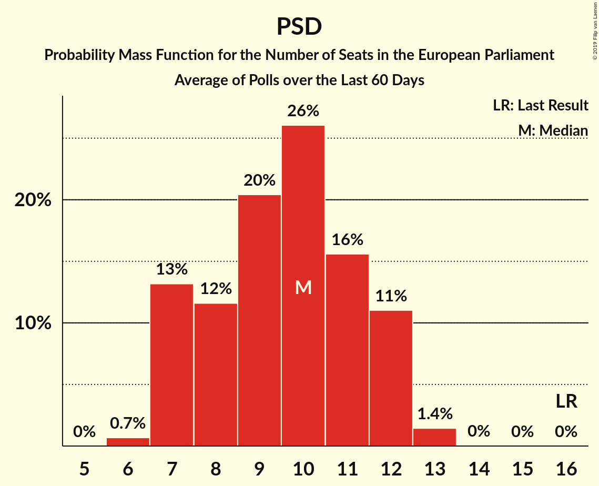
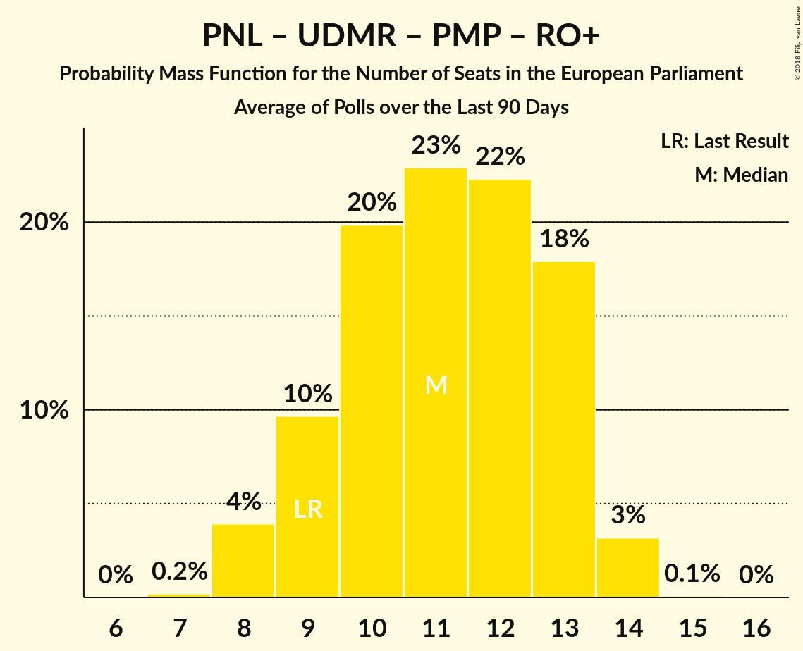

# Poll Average

<a href="#voting-intentions">Voting Intentions</a> | <a href="#seats">Seats</a> | <a href="#coalitions">Coalitions</a> | <a href="#technical-information">Technical Information</a>

## Summary

The table below lists the polls on which the average is based. They are the most recent polls (less than 90 days old) registered and analyzed so far.

| Period     | Polling firm/Commissioner(s) | PSD | ALDE | PNL | UDMR | PMP | RO+ | PRO | USR |
|:----------:|:----------------------------:|:--:|:--:|:--:|:--:|:--:|:--:|:--:|:--:|
| 25 May 2014 | General Election | 37.6%   16 | 15.0%   6 | 12.2%   5 | 6.3%   2 | 6.2%   2 | 0.0%   0 | 0.0%   0 | 0.0%   0 |
| N/A | Poll Average | 27–40%   9–16 | 7–12%   2–4 | 17–31%   6–11 | 3–6%   0–2 | 2–5%   0 | 4–15%   0–5 | 2–6%   0–2 | 6–13%   2–4 |
| [7–20 August 2018](2018-08-20-Sociopol.html) | Sociopol | 32–38%   12–15 | 8–12%   3–4 | 17–22%   6–8 | 3–5%   0–2 | 2–4%   0 | 11–15%   4–6 | 2–4%   0 | 6–10%   2–3 |
| [23 June–1 July 2018](2018-07-01-CURS.html) | CURS   STIRIPESURSE.RO | 35–40%   13–17 | 7–10%   2–4 | 22–27%   8–11 | 4–7%   0–2 | 3–5%   0–2 | 4–7%   0–2 | 4–7%   0–2 | 6–9%   2–3 |
| [1–30 June 2018](2018-06-30-IMAS.html) | IMAS | 26–31%   9–11 | 7–10%   2–3 | 27–32%   9–12 | 4–6%   0–2 | 2–4%   0 | 7–10%   2–3 | N/A   N/A | 10–13%   3–5 |
| 25 May 2014 | General Election | 37.6%   16 | 15.0%   6 | 12.2%   5 | 6.3%   2 | 6.2%   2 | 0.0%   0 | 0.0%   0 | 0.0%   0 |

Only polls for which at least the sample size has been published are included in the table above.

**Legend:**
+ **Top half of each row:** Voting intentions (95% confidence interval)
+ **Bottom half of each row:** Seat projections for the European Parliament (95% confidence interval)
+ **PSD:** Partidul Social Democrat (S&D)
+ **ALDE:** Partidul Alianța Liberalilor și Democraților (ALDE)
+ **PNL:** Partidul Național Liberal (EPP)
+ **UDMR:** Uniunea Democrată Maghiară din România (EPP)
+ **PMP:** Partidul Mișcarea Populară (EPP)
+ **RO+:** Mișcarea România Împreună (EPP)
+ **PRO:** PRO România (ECR)
+ **USR:** Uniunea Salvați România (*)
+ **N/A (single party):** Party not included the published results
+ **N/A (entire row):** Calculation for this opinion poll not started yet

## Voting Intentions

### Confidence Intervals

| Party | Last Result | Median | 80% Confidence Interval | 90% Confidence Interval | 95% Confidence Interval | 99% Confidence Interval |
|:-----:|:-----------:|:------:|:-----------------------:|:-----------------------:|:-----------------------:|:-----------------------:|
| <a href="#partidul-social-democrat-(s&d)">Partidul Social Democrat (S&D)</a> | 37.6% | 34.9% | 27.8–38.3% |27.1–39.0% | 26.6–39.6% | 25.7–40.7% |
| <a href="#partidul-alianța-liberalilor-și-democraților-(alde)">Partidul Alianța Liberalilor și Democraților (ALDE)</a> | 15.0% | 8.8% | 7.5–10.6% |7.2–11.1% | 6.9–11.5% | 6.4–12.3% |
| <a href="#partidul-național-liberal-(epp)">Partidul Național Liberal (EPP)</a> | 12.2% | 24.3% | 18.4–29.9% |17.8–30.6% | 17.3–31.1% | 16.5–32.1% |
| <a href="#uniunea-democrată-maghiară-din-românia-(epp)">Uniunea Democrată Maghiară din România (EPP)</a> | 6.3% | 4.8% | 3.7–5.8% |3.4–6.1% | 3.2–6.3% | 2.8–6.8% |
| <a href="#partidul-mișcarea-populară-(epp)">Partidul Mișcarea Populară (EPP)</a> | 6.2% | 3.3% | 2.5–4.4% |2.3–4.8% | 2.1–5.0% | 1.9–5.5% |
| <a href="#mișcarea-românia-împreună-(epp)">Mișcarea România Împreună (EPP)</a> | 0.0% | 8.0% | 4.8–13.6% |4.4–14.2% | 4.2–14.7% | 3.8–15.5% |
| <a href="#pro-românia-(ecr)">PRO România (ECR)</a> | 0.0% | 4.1% | 2.6–5.7% |2.4–6.0% | 2.2–6.3% | 2.0–6.8% |
| <a href="#uniunea-salvați-românia-(*)">Uniunea Salvați România (*)</a> | 0.0% | 8.2% | 6.6–11.9% |6.3–12.4% | 6.0–12.7% | 5.5–13.5% |

### Partidul Social Democrat (S&D)

*For a full overview of the results for this party, see the [Partidul Social Democrat (S&D)](party-partidulsocialdemocratsd.html) page.*

| Voting Intentions | Probability | Accumulated | Special Marks |
|:-----------------:|:-----------:|:-----------:|:-------------:|
| 23.5–24.5% | 0% | 100% |  |
| 24.5–25.5% | 0.3% | 100% |  |
| 25.5–26.5% | 2% | 99.6% |  |
| 26.5–27.5% | 6% | 98% |  |
| 27.5–28.5% | 10% | 92% |  |
| 28.5–29.5% | 9% | 82% |  |
| 29.5–30.5% | 5% | 73% |  |
| 30.5–31.5% | 2% | 68% |  |
| 31.5–32.5% | 2% | 67% |  |
| 32.5–33.5% | 4% | 65% |  |
| 33.5–34.5% | 8% | 61% |  |
| 34.5–35.5% | 11% | 53% | Median |
| 35.5–36.5% | 13% | 42% |  |
| 36.5–37.5% | 12% | 29% |  |
| 37.5–38.5% | 9% | 17% | Last Result |
| 38.5–39.5% | 5% | 8% |  |
| 39.5–40.5% | 2% | 3% |  |
| 40.5–41.5% | 0.5% | 0.6% |  |
| 41.5–42.5% | 0.1% | 0.1% |  |
| 42.5–43.5% | 0% | 0% |  |

### Partidul Alianța Liberalilor și Democraților (ALDE)

*For a full overview of the results for this party, see the [Partidul Alianța Liberalilor și Democraților (ALDE)](party-partidulalianțaliberalilorșidemocrațiloralde.html) page.*

| Voting Intentions | Probability | Accumulated | Special Marks |
|:-----------------:|:-----------:|:-----------:|:-------------:|
| 4.5–5.5% | 0% | 100% |  |
| 5.5–6.5% | 0.9% | 100% |  |
| 6.5–7.5% | 10% | 99.1% |  |
| 7.5–8.5% | 29% | 89% |  |
| 8.5–9.5% | 30% | 60% | Median |
| 9.5–10.5% | 19% | 30% |  |
| 10.5–11.5% | 9% | 11% |  |
| 11.5–12.5% | 2% | 2% |  |
| 12.5–13.5% | 0.3% | 0.3% |  |
| 13.5–14.5% | 0% | 0% |  |
| 14.5–15.5% | 0% | 0% | Last Result |

### Partidul Național Liberal (EPP)

*For a full overview of the results for this party, see the [Partidul Național Liberal (EPP)](party-partidulnaționalliberalepp.html) page.*

| Voting Intentions | Probability | Accumulated | Special Marks |
|:-----------------:|:-----------:|:-----------:|:-------------:|
| 11.5–12.5% | 0% | 100% | Last Result |
| 12.5–13.5% | 0% | 100% |  |
| 13.5–14.5% | 0% | 100% |  |
| 14.5–15.5% | 0% | 100% |  |
| 15.5–16.5% | 0.6% | 100% |  |
| 16.5–17.5% | 3% | 99.4% |  |
| 17.5–18.5% | 8% | 96% |  |
| 18.5–19.5% | 11% | 89% |  |
| 19.5–20.5% | 8% | 78% |  |
| 20.5–21.5% | 4% | 71% |  |
| 21.5–22.5% | 3% | 67% |  |
| 22.5–23.5% | 7% | 64% |  |
| 23.5–24.5% | 10% | 57% | Median |
| 24.5–25.5% | 8% | 47% |  |
| 25.5–26.5% | 5% | 39% |  |
| 26.5–27.5% | 4% | 34% |  |
| 27.5–28.5% | 7% | 30% |  |
| 28.5–29.5% | 10% | 23% |  |
| 29.5–30.5% | 8% | 13% |  |
| 30.5–31.5% | 4% | 5% |  |
| 31.5–32.5% | 1.1% | 1.3% |  |
| 32.5–33.5% | 0.2% | 0.2% |  |
| 33.5–34.5% | 0% | 0% |  |

### Uniunea Democrată Maghiară din România (EPP)

*For a full overview of the results for this party, see the [Uniunea Democrată Maghiară din România (EPP)](party-uniuneademocratămaghiarădinromâniaepp.html) page.*

| Voting Intentions | Probability | Accumulated | Special Marks |
|:-----------------:|:-----------:|:-----------:|:-------------:|
| 1.5–2.5% | 0.1% | 100% |  |
| 2.5–3.5% | 7% | 99.9% |  |
| 3.5–4.5% | 33% | 93% |  |
| 4.5–5.5% | 43% | 60% | Median |
| 5.5–6.5% | 15% | 17% | Last Result |
| 6.5–7.5% | 1.3% | 1.3% |  |
| 7.5–8.5% | 0% | 0% |  |

### Partidul Mișcarea Populară (EPP)

*For a full overview of the results for this party, see the [Partidul Mișcarea Populară (EPP)](party-partidulmișcareapopularăepp.html) page.*

| Voting Intentions | Probability | Accumulated | Special Marks |
|:-----------------:|:-----------:|:-----------:|:-------------:|
| 0.5–1.5% | 0% | 100% |  |
| 1.5–2.5% | 13% | 100% |  |
| 2.5–3.5% | 50% | 87% | Median |
| 3.5–4.5% | 29% | 37% |  |
| 4.5–5.5% | 7% | 8% |  |
| 5.5–6.5% | 0.5% | 0.5% | Last Result |
| 6.5–7.5% | 0% | 0% |  |

### Uniunea Salvați România (*)

*For a full overview of the results for this party, see the [Uniunea Salvați România (*)](party-uniuneasalvațiromânia.html) page.*

| Voting Intentions | Probability | Accumulated | Special Marks |
|:-----------------:|:-----------:|:-----------:|:-------------:|
| 0.0–0.5% | 0% | 100% | Last Result |
| 0.5–1.5% | 0% | 100% |  |
| 1.5–2.5% | 0% | 100% |  |
| 2.5–3.5% | 0% | 100% |  |
| 3.5–4.5% | 0% | 100% |  |
| 4.5–5.5% | 0.6% | 100% |  |
| 5.5–6.5% | 9% | 99.4% |  |
| 6.5–7.5% | 24% | 91% |  |
| 7.5–8.5% | 23% | 66% | Median |
| 8.5–9.5% | 9% | 44% |  |
| 9.5–10.5% | 7% | 34% |  |
| 10.5–11.5% | 13% | 28% |  |
| 11.5–12.5% | 11% | 14% |  |
| 12.5–13.5% | 3% | 4% |  |
| 13.5–14.5% | 0.4% | 0.4% |  |
| 14.5–15.5% | 0% | 0% |  |

### Mișcarea România Împreună (EPP)

*For a full overview of the results for this party, see the [Mișcarea România Împreună (EPP)](party-mișcarearomâniaîmpreunăepp.html) page.*

| Voting Intentions | Probability | Accumulated | Special Marks |
|:-----------------:|:-----------:|:-----------:|:-------------:|
| 0.0–0.5% | 0% | 100% | Last Result |
| 0.5–1.5% | 0% | 100% |  |
| 1.5–2.5% | 0% | 100% |  |
| 2.5–3.5% | 0.2% | 100% |  |
| 3.5–4.5% | 6% | 99.8% |  |
| 4.5–5.5% | 18% | 94% |  |
| 5.5–6.5% | 9% | 76% |  |
| 6.5–7.5% | 9% | 67% |  |
| 7.5–8.5% | 16% | 58% | Median |
| 8.5–9.5% | 8% | 42% |  |
| 9.5–10.5% | 1.3% | 34% |  |
| 10.5–11.5% | 2% | 33% |  |
| 11.5–12.5% | 8% | 31% |  |
| 12.5–13.5% | 12% | 23% |  |
| 13.5–14.5% | 8% | 11% |  |
| 14.5–15.5% | 3% | 3% |  |
| 15.5–16.5% | 0.4% | 0.5% |  |
| 16.5–17.5% | 0% | 0% |  |

### PRO România (ECR)

*For a full overview of the results for this party, see the [PRO România (ECR)](party-proromâniaecr.html) page.*

| Voting Intentions | Probability | Accumulated | Special Marks |
|:-----------------:|:-----------:|:-----------:|:-------------:|
| 0.0–0.5% | 0% | 100% | Last Result |
| 0.5–1.5% | 0% | 100% |  |
| 1.5–2.5% | 8% | 100% |  |
| 2.5–3.5% | 33% | 92% |  |
| 3.5–4.5% | 19% | 59% | Median |
| 4.5–5.5% | 27% | 41% |  |
| 5.5–6.5% | 12% | 13% |  |
| 6.5–7.5% | 1.2% | 1.2% |  |
| 7.5–8.5% | 0% | 0% |  |

## Seats

### Confidence Intervals

| Party | Last Result | Median | 80% Confidence Interval | 90% Confidence Interval | 95% Confidence Interval | 99% Confidence Interval |
|:-----:|:-----------:|:------:|:-----------------------:|:-----------------------:|:-----------------------:|:-----------------------:|
| <a href="#partidul-social-democrat-(s&d)">Partidul Social Democrat (S&D)</a> | 16 | 13 | 10–15 |10–16 | 9–16 | 9–17 |
| <a href="#partidul-alianța-liberalilor-și-democraților-(alde)">Partidul Alianța Liberalilor și Democraților (ALDE)</a> | 6 | 3 | 2–4 |2–4 | 2–4 | 2–5 |
| <a href="#partidul-național-liberal-(epp)">Partidul Național Liberal (EPP)</a> | 5 | 9 | 7–11 |7–11 | 6–11 | 6–12 |
| <a href="#uniunea-democrată-maghiară-din-românia-(epp)">Uniunea Democrată Maghiară din România (EPP)</a> | 2 | 0 | 0–2 |0–2 | 0–2 | 0–2 |
| <a href="#partidul-mișcarea-populară-(epp)">Partidul Mișcarea Populară (EPP)</a> | 2 | 0 | 0 |0 | 0 | 0–2 |
| <a href="#mișcarea-românia-împreună-(epp)">Mișcarea România Împreună (EPP)</a> | 0 | 3 | 0–5 |0–5 | 0–5 | 0–6 |
| <a href="#pro-românia-(ecr)">PRO România (ECR)</a> | 0 | 0 | 0–2 |0–2 | 0–2 | 0–2 |
| <a href="#uniunea-salvați-românia-(*)">Uniunea Salvați România (*)</a> | 0 | 3 | 2–4 |2–4 | 2–4 | 2–5 |

### Partidul Social Democrat (S&D)

*For a full overview of the results for this party, see the [Partidul Social Democrat (S&D)](party-partidulsocialdemocratsd.html) page.*

| Number of Seats | Probability | Accumulated | Special Marks |
|:---------------:|:-----------:|:-----------:|:-------------:|
| 9 | 3% | 100% |  |
| 10 | 20% | 97% |  |
| 11 | 10% | 77% |  |
| 12 | 4% | 67% |  |
| 13 | 15% | 64% | Median |
| 14 | 26% | 49% |  |
| 15 | 15% | 22% |  |
| 16 | 7% | 8% | Last Result |
| 17 | 1.1% | 1.2% | Majority |
| 18 | 0% | 0% |  |

### Partidul Alianța Liberalilor și Democraților (ALDE)

*For a full overview of the results for this party, see the [Partidul Alianța Liberalilor și Democraților (ALDE)](party-partidulalianțaliberalilorșidemocrațiloralde.html) page.*

| Number of Seats | Probability | Accumulated | Special Marks |
|:---------------:|:-----------:|:-----------:|:-------------:|
| 2 | 14% | 100% |  |
| 3 | 66% | 86% | Median |
| 4 | 20% | 21% |  |
| 5 | 0.6% | 0.6% |  |
| 6 | 0% | 0% | Last Result |

### Partidul Național Liberal (EPP)

*For a full overview of the results for this party, see the [Partidul Național Liberal (EPP)](party-partidulnaționalliberalepp.html) page.*

| Number of Seats | Probability | Accumulated | Special Marks |
|:---------------:|:-----------:|:-----------:|:-------------:|
| 5 | 0% | 100% | Last Result |
| 6 | 3% | 100% |  |
| 7 | 22% | 97% |  |
| 8 | 11% | 75% |  |
| 9 | 17% | 64% | Median |
| 10 | 25% | 46% |  |
| 11 | 19% | 21% |  |
| 12 | 2% | 2% |  |
| 13 | 0% | 0% |  |

### Uniunea Democrată Maghiară din România (EPP)

*For a full overview of the results for this party, see the [Uniunea Democrată Maghiară din România (EPP)](party-uniuneademocratămaghiarădinromâniaepp.html) page.*

| Number of Seats | Probability | Accumulated | Special Marks |
|:---------------:|:-----------:|:-----------:|:-------------:|
| 0 | 56% | 100% | Median |
| 1 | 8% | 44% |  |
| 2 | 36% | 36% | Last Result |
| 3 | 0.1% | 0.1% |  |
| 4 | 0% | 0% |  |

### Partidul Mișcarea Populară (EPP)

*For a full overview of the results for this party, see the [Partidul Mișcarea Populară (EPP)](party-partidulmișcareapopularăepp.html) page.*

| Number of Seats | Probability | Accumulated | Special Marks |
|:---------------:|:-----------:|:-----------:|:-------------:|
| 0 | 98% | 100% | Median |
| 1 | 0.4% | 2% |  |
| 2 | 2% | 2% | Last Result |
| 3 | 0% | 0% |  |

### Uniunea Salvați România (*)

*For a full overview of the results for this party, see the [Uniunea Salvați România (*)](party-uniuneasalvațiromânia.html) page.*

| Number of Seats | Probability | Accumulated | Special Marks |
|:---------------:|:-----------:|:-----------:|:-------------:|
| 0 | 0.1% | 100% | Last Result |
| 1 | 0.1% | 99.9% |  |
| 2 | 31% | 99.8% |  |
| 3 | 40% | 68% | Median |
| 4 | 27% | 28% |  |
| 5 | 1.2% | 1.2% |  |
| 6 | 0% | 0% |  |

### Mișcarea România Împreună (EPP)

*For a full overview of the results for this party, see the [Mișcarea România Împreună (EPP)](party-mișcarearomâniaîmpreunăepp.html) page.*

| Number of Seats | Probability | Accumulated | Special Marks |
|:---------------:|:-----------:|:-----------:|:-------------:|
| 0 | 14% | 100% | Last Result |
| 1 | 0.5% | 86% |  |
| 2 | 33% | 85% |  |
| 3 | 19% | 53% | Median |
| 4 | 10% | 33% |  |
| 5 | 21% | 23% |  |
| 6 | 2% | 2% |  |
| 7 | 0% | 0% |  |

### PRO România (ECR)

*For a full overview of the results for this party, see the [PRO România (ECR)](party-proromâniaecr.html) page.*

| Number of Seats | Probability | Accumulated | Special Marks |
|:---------------:|:-----------:|:-----------:|:-------------:|
| 0 | 73% | 100% | Last Result, Median |
| 1 | 9% | 27% |  |
| 2 | 18% | 18% |  |
| 3 | 0.2% | 0.2% |  |
| 4 | 0% | 0% |  |

## Coalitions

### Confidence Intervals

| Coalition | Last Result | Median | Majority? | 80% Confidence Interval | 90% Confidence Interval | 95% Confidence Interval | 99% Confidence Interval |
|:---------:|:-----------:|:------:|:---------:|:-----------------------:|:-----------------------:|:-----------------------:|:-----------------------:|
| Partidul Social Democrat (S&D) | 16 | 13 | 1.2% | 10–15 | 10–16 | 9–16 | 9–17 |
| Partidul Național Liberal (EPP) – Uniunea Democrată Maghiară din România (EPP) – Partidul Mișcarea Populară (EPP) – Mișcarea România Împreună (EPP) | 9 | 13 | 0% | 11–14 | 11–15 | 10–15 | 9–16 |
| Partidul Alianța Liberalilor și Democraților (ALDE) | 6 | 3 | 0% | 2–4 | 2–4 | 2–4 | 2–5 |
| Uniunea Salvați România (*) | 0 | 3 | 0% | 2–4 | 2–4 | 2–4 | 2–5 |
| PRO România (ECR) | 0 | 0 | 0% | 0–2 | 0–2 | 0–2 | 0–2 |

### Partidul Social Democrat (S&D)

| Number of Seats | Probability | Accumulated | Special Marks |
|:---------------:|:-----------:|:-----------:|:-------------:|
| 9 | 3% | 100% |  |
| 10 | 20% | 97% |  |
| 11 | 10% | 77% |  |
| 12 | 4% | 67% |  |
| 13 | 15% | 64% | Median |
| 14 | 26% | 49% |  |
| 15 | 15% | 22% |  |
| 16 | 7% | 8% | Last Result |
| 17 | 1.1% | 1.2% | Majority |
| 18 | 0% | 0% |  |

### Partidul Național Liberal (EPP) – Uniunea Democrată Maghiară din România (EPP) – Partidul Mișcarea Populară (EPP) – Mișcarea România Împreună (EPP)

| Number of Seats | Probability | Accumulated | Special Marks |
|:---------------:|:-----------:|:-----------:|:-------------:|
| 9 | 0.5% | 100% | Last Result |
| 10 | 2% | 99.5% |  |
| 11 | 13% | 97% |  |
| 12 | 30% | 84% | Median |
| 13 | 25% | 54% |  |
| 14 | 20% | 29% |  |
| 15 | 8% | 9% |  |
| 16 | 0.9% | 0.9% |  |
| 17 | 0% | 0% | Majority |

### Partidul Alianța Liberalilor și Democraților (ALDE)

| Number of Seats | Probability | Accumulated | Special Marks |
|:---------------:|:-----------:|:-----------:|:-------------:|
| 2 | 14% | 100% |  |
| 3 | 66% | 86% | Median |
| 4 | 20% | 21% |  |
| 5 | 0.6% | 0.6% |  |
| 6 | 0% | 0% | Last Result |

### Uniunea Salvați România (*)

| Number of Seats | Probability | Accumulated | Special Marks |
|:---------------:|:-----------:|:-----------:|:-------------:|
| 0 | 0.1% | 100% | Last Result |
| 1 | 0.1% | 99.9% |  |
| 2 | 31% | 99.8% |  |
| 3 | 40% | 68% | Median |
| 4 | 27% | 28% |  |
| 5 | 1.2% | 1.2% |  |
| 6 | 0% | 0% |  |

### PRO România (ECR)

| Number of Seats | Probability | Accumulated | Special Marks |
|:---------------:|:-----------:|:-----------:|:-------------:|
| 0 | 82% | 100% | Last Result, Median |
| 1 | 6% | 18% |  |
| 2 | 12% | 12% |  |
| 3 | 0.1% | 0.1% |  |
| 4 | 0% | 0% |  |

## Technical Information

+ **Number of polls included in this average:** 3
+ **Lowest number of simulations done in a poll included in this average:** 1,048,576
+ **Total number of simulations done in the polls included in this average:** 3,145,728
+ **Error estimate:** 1.62%
