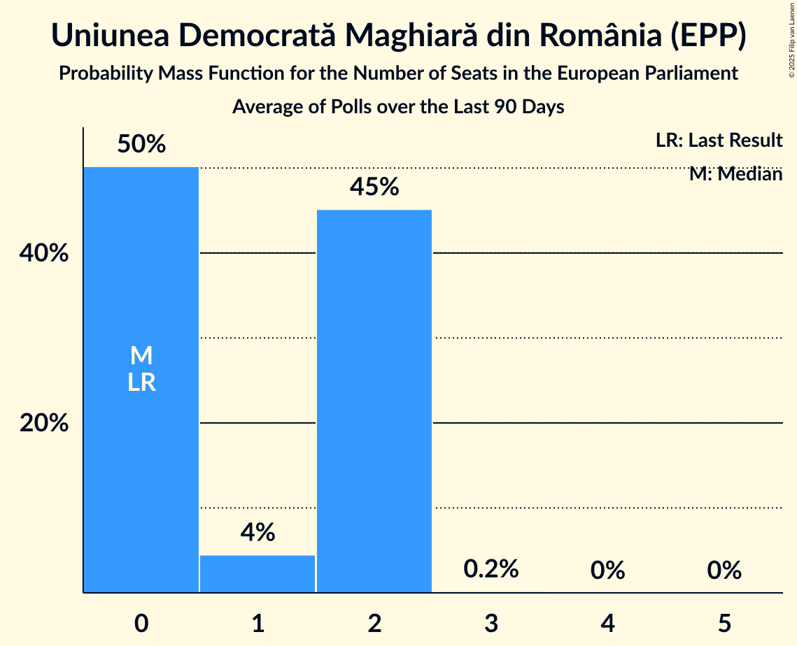

# Poll Average

<a href="#voting-intentions">Voting Intentions</a> | <a href="#seats">Seats</a> | <a href="#coalitions">Coalitions</a> | <a href="#technical-information">Technical Information</a>

## Summary

The table below lists the polls on which the average is based. They are the most recent polls (less than 90 days old) registered and analyzed so far.

| Period     | Polling firm/Commissioner(s) | PNL | PSD | A2020 | PRO | PMP | UDMR | ALDE | PLUS | USR | AUR |
|:----------:|:----------------------------:|:--:|:--:|:--:|:--:|:--:|:--:|:--:|:--:|:--:|:--:|
| 26 May 2019 | General Election | 27.0%   10 | 22.5%   9 | 22.4%   8 | 6.4%   2 | 5.8%   2 | 5.3%   2 | 4.1%   0 | 22.4%   4 | 22.4%   4 | 0.0%   0 |
| N/A | Poll Average | 24–35%   9–13 | 21–37%   7–14 | 12–20%   4–7 | 1–14%   0–5 | 2–6%   0–2 | 3–7%   0–2 | N/A   N/A | N/A   N/A | N/A   N/A | 2–17%   0–6 |
| [17–21 December 2020](2020-12-21-CURS.html) | CURS | 23–29%   9–11 | 32–38%   12–14 | 12–16%   4–6 | 1–3%   0 | 1–3%   0 | 3–5%   0–2 | N/A   N/A | N/A   N/A | N/A   N/A | 13–17%   5–6 |
| [10–20 December 2020](2020-12-20-Avangarde.html) | Avangarde | 23–29%   8–11 | 32–38%   11–14 | 13–17%   4–6 | 1–2%   0 | 1–3%   0 | 4–7%   0–2 | N/A   N/A | N/A   N/A | N/A   N/A | 12–16%   4–6 |
| [2–3 December 2020](2020-12-03-IRES.html) | IRES | 29–35%   11–13 | 32–38%   12–14 | 14–18%   5–7 | 6–9%   2–3 | 2–4%   0 | 2–4%   0 | N/A   N/A | N/A   N/A | N/A   N/A | 2–4%   0 |
| [28–29 November 2020](2020-11-29-Sociopol.html) | Sociopol | 26–32%   9–12 | 25–31%   9–11 | 11–15%   4–5 | 5–8%   0–2 | 2–4%   0 | 5–8%   0–2 | N/A   N/A | N/A   N/A | N/A   N/A | 6–9%   2–3 |
| [22–28 November 2020](2020-11-28-IRSOP.html) | IRSOP | 30–36%   11–14 | 27–33%   10–12 | 15–19%   5–7 | 6–9%   2–3 | 2–4%   0 | 4–7%   0–2 | N/A   N/A | N/A   N/A | N/A   N/A | N/A   N/A |
| [6–27 November 2020](2020-11-27-IMAS.html) | IMAS   Europa FM | 26–31%   9–12 | 21–26%   7–10 | 16–21%   5–7 | 11–15%   4–5 | 3–6%   0–2 | 4–6%   0–2 | N/A   N/A | N/A   N/A | N/A   N/A | N/A   N/A |
| [20–25 November 2020](2020-11-25-Verifield.html) | Verifield | 29–34%   10–13 | 20–25%   7–9 | 15–19%   5–7 | 8–11%   2–4 | 4–6%   0–2 | 4–7%   0–2 | N/A   N/A | N/A   N/A | N/A   N/A | N/A   N/A |
| 26 May 2019 | General Election | 27.0%   10 | 22.5%   9 | 22.4%   8 | 6.4%   2 | 5.8%   2 | 5.3%   2 | 4.1%   0 | 22.4%   4 | 22.4%   4 | 0.0%   0 |

Only polls for which at least the sample size has been published are included in the table above.

**Legend:**
+ **Top half of each row:** Voting intentions (95% confidence interval)
+ **Bottom half of each row:** Seat projections for the European Parliament (95% confidence interval)
+ **PNL:** Partidul Național Liberal (EPP)
+ **PSD:** Partidul Social Democrat (S&D)
+ **A2020:** Alianța 2020 USR-PLUS (RE)
+ **PRO:** PRO România (S&D)
+ **PMP:** Partidul Mișcarea Populară (EPP)
+ **UDMR:** Uniunea Democrată Maghiară din România (EPP)
+ **ALDE:** Partidul Alianța Liberalilor și Democraților (*)
+ **PLUS:** Partidul Libertății, Unității și Solidarității (RE)
+ **USR:** Uniunea Salvați România (RE)
+ **AUR:** Alianța pentru Unirea Românilor (ECR)
+ **N/A (single party):** Party not included the published results
+ **N/A (entire row):** Calculation for this opinion poll not started yet

## Voting Intentions

### Confidence Intervals

| Party | Last Result | Median | 80% Confidence Interval | 90% Confidence Interval | 95% Confidence Interval | 99% Confidence Interval |
|:-----:|:-----------:|:------:|:-----------------------:|:-----------------------:|:-----------------------:|:-----------------------:|
| <a href="#partidul-național-liberal-(epp)">Partidul Național Liberal (EPP)</a> | 27.0% | 29.5% | 25.5–33.3% |24.7–34.0% | 24.2–34.7% | 23.2–35.8% |
| <a href="#partidul-social-democrat-(s&d)">Partidul Social Democrat (S&D)</a> | 22.5% | 30.2% | 22.2–36.1% |21.4–36.8% | 20.8–37.4% | 19.8–38.5% |
| <a href="#alianța-2020-usr-plus-(re)">Alianța 2020 USR-PLUS (RE)</a> | 22.4% | 15.9% | 13.0–18.4% |12.4–19.0% | 12.0–19.5% | 11.2–20.4% |
| <a href="#partidul-libertății,-unității-și-solidarității-(re)">Partidul Libertății, Unității și Solidarității (RE)</a> | 22.4% | N/A | N/A |N/A | N/A | N/A |
| <a href="#uniunea-salvați-românia-(re)">Uniunea Salvați România (RE)</a> | 22.4% | N/A | N/A |N/A | N/A | N/A |
| <a href="#pro-românia-(s&d)">PRO România (S&D)</a> | 6.4% | 6.7% | 1.2–12.3% |1.0–13.2% | 0.8–13.8% | 0.6–14.8% |
| <a href="#partidul-mișcarea-populară-(epp)">Partidul Mișcarea Populară (EPP)</a> | 5.8% | 3.1% | 1.9–5.0% |1.7–5.4% | 1.5–5.7% | 1.3–6.3% |
| <a href="#uniunea-democrată-maghiară-din-românia-(epp)">Uniunea Democrată Maghiară din România (EPP)</a> | 5.3% | 4.9% | 3.2–6.2% |2.8–6.6% | 2.6–6.9% | 2.2–7.6% |
| <a href="#partidul-alianța-liberalilor-și-democraților-(*)">Partidul Alianța Liberalilor și Democraților (*)</a> | 4.1% | N/A | N/A |N/A | N/A | N/A |
| <a href="#alianța-pentru-unirea-românilor-(ecr)">Alianța pentru Unirea Românilor (ECR)</a> | 0.0% | 10.2% | 2.9–15.6% |2.6–16.1% | 2.4–16.6% | 2.1–17.4% |

### Partidul Național Liberal (EPP)

*For a full overview of the results for this party, see the [Partidul Național Liberal (EPP)](party-partidulnaționalliberalepp.html) page.*

| Voting Intentions | Probability | Accumulated | Special Marks |
|:-----------------:|:-----------:|:-----------:|:-------------:|
| 20.5–21.5% | 0% | 100% |  |
| 21.5–22.5% | 0.1% | 100% |  |
| 22.5–23.5% | 0.8% | 99.9% |  |
| 23.5–24.5% | 3% | 99.0% |  |
| 24.5–25.5% | 7% | 96% |  |
| 25.5–26.5% | 9% | 89% |  |
| 26.5–27.5% | 10% | 80% | Last Result |
| 27.5–28.5% | 10% | 70% |  |
| 28.5–29.5% | 10% | 60% |  |
| 29.5–30.5% | 10% | 50% | Median |
| 30.5–31.5% | 11% | 39% |  |
| 31.5–32.5% | 11% | 28% |  |
| 32.5–33.5% | 9% | 17% |  |
| 33.5–34.5% | 5% | 8% |  |
| 34.5–35.5% | 2% | 3% |  |
| 35.5–36.5% | 0.6% | 0.8% |  |
| 36.5–37.5% | 0.1% | 0.1% |  |
| 37.5–38.5% | 0% | 0% |  |

### Partidul Social Democrat (S&D)

*For a full overview of the results for this party, see the [Partidul Social Democrat (S&D)](party-partidulsocialdemocratsd.html) page.*

| Voting Intentions | Probability | Accumulated | Special Marks |
|:-----------------:|:-----------:|:-----------:|:-------------:|
| 17.5–18.5% | 0% | 100% |  |
| 18.5–19.5% | 0.3% | 100% |  |
| 19.5–20.5% | 1.4% | 99.7% |  |
| 20.5–21.5% | 4% | 98% |  |
| 21.5–22.5% | 7% | 94% |  |
| 22.5–23.5% | 7% | 87% | Last Result |
| 23.5–24.5% | 5% | 80% |  |
| 24.5–25.5% | 3% | 75% |  |
| 25.5–26.5% | 3% | 72% |  |
| 26.5–27.5% | 4% | 69% |  |
| 27.5–28.5% | 6% | 66% |  |
| 28.5–29.5% | 6% | 60% |  |
| 29.5–30.5% | 5% | 54% | Median |
| 30.5–31.5% | 4% | 48% |  |
| 31.5–32.5% | 3% | 45% |  |
| 32.5–33.5% | 5% | 41% |  |
| 33.5–34.5% | 9% | 36% |  |
| 34.5–35.5% | 11% | 27% |  |
| 35.5–36.5% | 9% | 15% |  |
| 36.5–37.5% | 5% | 7% |  |
| 37.5–38.5% | 2% | 2% |  |
| 38.5–39.5% | 0.4% | 0.4% |  |
| 39.5–40.5% | 0.1% | 0.1% |  |
| 40.5–41.5% | 0% | 0% |  |

### Alianța 2020 USR-PLUS (RE)

*For a full overview of the results for this party, see the [Alianța 2020 USR-PLUS (RE)](party-alianța2020usr-plusre.html) page.*

| Voting Intentions | Probability | Accumulated | Special Marks |
|:-----------------:|:-----------:|:-----------:|:-------------:|
| 8.5–9.5% | 0% | 100% |  |
| 9.5–10.5% | 0.1% | 100% |  |
| 10.5–11.5% | 1.1% | 99.9% |  |
| 11.5–12.5% | 5% | 98.9% |  |
| 12.5–13.5% | 10% | 94% |  |
| 13.5–14.5% | 13% | 84% |  |
| 14.5–15.5% | 15% | 71% |  |
| 15.5–16.5% | 17% | 56% | Median |
| 16.5–17.5% | 18% | 38% |  |
| 17.5–18.5% | 13% | 21% |  |
| 18.5–19.5% | 6% | 8% |  |
| 19.5–20.5% | 2% | 2% |  |
| 20.5–21.5% | 0.4% | 0.4% |  |
| 21.5–22.5% | 0% | 0% | Last Result |
| 22.5–23.5% | 0% | 0% |  |

### PRO România (S&D)

*For a full overview of the results for this party, see the [PRO România (S&D)](party-proromâniasd.html) page.*

| Voting Intentions | Probability | Accumulated | Special Marks |
|:-----------------:|:-----------:|:-----------:|:-------------:|
| 0.0–0.5% | 0.4% | 100% |  |
| 0.5–1.5% | 14% | 99.6% |  |
| 1.5–2.5% | 12% | 86% |  |
| 2.5–3.5% | 2% | 73% |  |
| 3.5–4.5% | 0.2% | 71% |  |
| 4.5–5.5% | 4% | 71% |  |
| 5.5–6.5% | 14% | 67% | Last Result |
| 6.5–7.5% | 17% | 53% | Median |
| 7.5–8.5% | 10% | 37% |  |
| 8.5–9.5% | 7% | 27% |  |
| 9.5–10.5% | 5% | 20% |  |
| 10.5–11.5% | 3% | 15% |  |
| 11.5–12.5% | 4% | 13% |  |
| 12.5–13.5% | 5% | 9% |  |
| 13.5–14.5% | 3% | 4% |  |
| 14.5–15.5% | 0.7% | 0.8% |  |
| 15.5–16.5% | 0.1% | 0.1% |  |
| 16.5–17.5% | 0% | 0% |  |

### Partidul Mișcarea Populară (EPP)

*For a full overview of the results for this party, see the [Partidul Mișcarea Populară (EPP)](party-partidulmișcareapopularăepp.html) page.*

| Voting Intentions | Probability | Accumulated | Special Marks |
|:-----------------:|:-----------:|:-----------:|:-------------:|
| 0.0–0.5% | 0% | 100% |  |
| 0.5–1.5% | 3% | 100% |  |
| 1.5–2.5% | 28% | 97% |  |
| 2.5–3.5% | 33% | 69% | Median |
| 3.5–4.5% | 18% | 36% |  |
| 4.5–5.5% | 14% | 18% |  |
| 5.5–6.5% | 3% | 4% | Last Result |
| 6.5–7.5% | 0.2% | 0.2% |  |
| 7.5–8.5% | 0% | 0% |  |

### Uniunea Democrată Maghiară din România (EPP)

*For a full overview of the results for this party, see the [Uniunea Democrată Maghiară din România (EPP)](party-uniuneademocratămaghiarădinromâniaepp.html) page.*

| Voting Intentions | Probability | Accumulated | Special Marks |
|:-----------------:|:-----------:|:-----------:|:-------------:|
| 0.5–1.5% | 0% | 100% |  |
| 1.5–2.5% | 2% | 100% |  |
| 2.5–3.5% | 13% | 98% |  |
| 3.5–4.5% | 25% | 85% |  |
| 4.5–5.5% | 35% | 60% | Last Result, Median |
| 5.5–6.5% | 21% | 26% |  |
| 6.5–7.5% | 5% | 5% |  |
| 7.5–8.5% | 0.5% | 0.5% |  |
| 8.5–9.5% | 0% | 0% |  |

### Alianța pentru Unirea Românilor (ECR)

*For a full overview of the results for this party, see the [Alianța pentru Unirea Românilor (ECR)](party-alianțapentruunirearomânilorecr.html) page.*

| Voting Intentions | Probability | Accumulated | Special Marks |
|:-----------------:|:-----------:|:-----------:|:-------------:|
| 0.0–0.5% | 0% | 100% | Last Result |
| 0.5–1.5% | 0% | 100% |  |
| 1.5–2.5% | 4% | 100% |  |
| 2.5–3.5% | 17% | 96% |  |
| 3.5–4.5% | 4% | 80% |  |
| 4.5–5.5% | 0.7% | 75% |  |
| 5.5–6.5% | 6% | 74% |  |
| 6.5–7.5% | 12% | 68% |  |
| 7.5–8.5% | 6% | 57% |  |
| 8.5–9.5% | 0.8% | 51% |  |
| 9.5–10.5% | 0.1% | 50% | Median |
| 10.5–11.5% | 0.3% | 50% |  |
| 11.5–12.5% | 2% | 50% |  |
| 12.5–13.5% | 8% | 48% |  |
| 13.5–14.5% | 15% | 40% |  |
| 14.5–15.5% | 15% | 25% |  |
| 15.5–16.5% | 8% | 11% |  |
| 16.5–17.5% | 2% | 3% |  |
| 17.5–18.5% | 0.4% | 0.4% |  |
| 18.5–19.5% | 0% | 0% |  |

## Seats

### Confidence Intervals

| Party | Last Result | Median | 80% Confidence Interval | 90% Confidence Interval | 95% Confidence Interval | 99% Confidence Interval |
|:-----:|:-----------:|:------:|:-----------------------:|:-----------------------:|:-----------------------:|:-----------------------:|
| <a href="#partidul-național-liberal-(epp)">Partidul Național Liberal (EPP)</a> | 10 | 11 | 9–12 |9–13 | 9–13 | 8–13 |
| <a href="#partidul-social-democrat-(s&d)">Partidul Social Democrat (S&D)</a> | 9 | 11 | 8–13 |7–14 | 7–14 | 7–14 |
| <a href="#alianța-2020-usr-plus-(re)">Alianța 2020 USR-PLUS (RE)</a> | 8 | 6 | 4–7 |4–7 | 4–7 | 4–7 |
| <a href="#partidul-libertății,-unității-și-solidarității-(re)">Partidul Libertății, Unității și Solidarității (RE)</a> | 4 | N/A | N/A |N/A | N/A | N/A |
| <a href="#uniunea-salvați-românia-(re)">Uniunea Salvați România (RE)</a> | 4 | N/A | N/A |N/A | N/A | N/A |
| <a href="#pro-românia-(s&d)">PRO România (S&D)</a> | 2 | 2 | 0–4 |0–5 | 0–5 | 0–5 |
| <a href="#partidul-mișcarea-populară-(epp)">Partidul Mișcarea Populară (EPP)</a> | 2 | 0 | 0 |0–1 | 0–2 | 0–2 |
| <a href="#uniunea-democrată-maghiară-din-românia-(epp)">Uniunea Democrată Maghiară din România (EPP)</a> | 2 | 0 | 0–2 |0–2 | 0–2 | 0–2 |
| <a href="#partidul-alianța-liberalilor-și-democraților-(*)">Partidul Alianța Liberalilor și Democraților (*)</a> | 0 | N/A | N/A |N/A | N/A | N/A |
| <a href="#alianța-pentru-unirea-românilor-(ecr)">Alianța pentru Unirea Românilor (ECR)</a> | 0 | 3 | 0–6 |0–6 | 0–6 | 0–6 |

### Partidul Național Liberal (EPP)

*For a full overview of the results for this party, see the [Partidul Național Liberal (EPP)](party-partidulnaționalliberalepp.html) page.*

| Number of Seats | Probability | Accumulated | Special Marks |
|:---------------:|:-----------:|:-----------:|:-------------:|
| 8 | 1.4% | 100% |  |
| 9 | 16% | 98.6% |  |
| 10 | 29% | 83% | Last Result |
| 11 | 26% | 54% | Median |
| 12 | 21% | 28% |  |
| 13 | 6% | 6% |  |
| 14 | 0.5% | 0.5% |  |
| 15 | 0% | 0% |  |

### Partidul Social Democrat (S&D)

*For a full overview of the results for this party, see the [Partidul Social Democrat (S&D)](party-partidulsocialdemocratsd.html) page.*

| Number of Seats | Probability | Accumulated | Special Marks |
|:---------------:|:-----------:|:-----------:|:-------------:|
| 6 | 0.1% | 100% |  |
| 7 | 5% | 99.9% |  |
| 8 | 15% | 94% |  |
| 9 | 11% | 79% | Last Result |
| 10 | 12% | 69% |  |
| 11 | 11% | 56% | Median |
| 12 | 12% | 45% |  |
| 13 | 25% | 33% |  |
| 14 | 8% | 9% |  |
| 15 | 0.3% | 0.3% |  |
| 16 | 0% | 0% |  |

### Alianța 2020 USR-PLUS (RE)

*For a full overview of the results for this party, see the [Alianța 2020 USR-PLUS (RE)](party-alianța2020usr-plusre.html) page.*

| Number of Seats | Probability | Accumulated | Special Marks |
|:---------------:|:-----------:|:-----------:|:-------------:|
| 3 | 0.1% | 100% |  |
| 4 | 12% | 99.9% |  |
| 5 | 36% | 88% |  |
| 6 | 43% | 53% | Median |
| 7 | 10% | 10% |  |
| 8 | 0.3% | 0.3% | Last Result |
| 9 | 0% | 0% |  |

### Partidul Libertății, Unității și Solidarității (RE)

*For a full overview of the results for this party, see the [Partidul Libertății, Unității și Solidarității (RE)](party-partidullibertățiiunitățiișisolidaritățiire.html) page.*

### Uniunea Salvați România (RE)

*For a full overview of the results for this party, see the [Uniunea Salvați România (RE)](party-uniuneasalvațiromâniare.html) page.*

### PRO România (S&D)

*For a full overview of the results for this party, see the [PRO România (S&D)](party-proromâniasd.html) page.*

| Number of Seats | Probability | Accumulated | Special Marks |
|:---------------:|:-----------:|:-----------:|:-------------:|
| 0 | 30% | 100% |  |
| 1 | 1.3% | 70% |  |
| 2 | 36% | 69% | Last Result, Median |
| 3 | 18% | 33% |  |
| 4 | 10% | 15% |  |
| 5 | 5% | 5% |  |
| 6 | 0.1% | 0.1% |  |
| 7 | 0% | 0% |  |

### Partidul Mișcarea Populară (EPP)

*For a full overview of the results for this party, see the [Partidul Mișcarea Populară (EPP)](party-partidulmișcareapopularăepp.html) page.*

| Number of Seats | Probability | Accumulated | Special Marks |
|:---------------:|:-----------:|:-----------:|:-------------:|
| 0 | 90% | 100% | Median |
| 1 | 5% | 10% |  |
| 2 | 5% | 5% | Last Result |
| 3 | 0% | 0% |  |

### Uniunea Democrată Maghiară din România (EPP)

*For a full overview of the results for this party, see the [Uniunea Democrată Maghiară din România (EPP)](party-uniuneademocratămaghiarădinromâniaepp.html) page.*

| Number of Seats | Probability | Accumulated | Special Marks |
|:---------------:|:-----------:|:-----------:|:-------------:|
| 0 | 56% | 100% | Median |
| 1 | 12% | 44% |  |
| 2 | 32% | 32% | Last Result |
| 3 | 0.1% | 0.1% |  |
| 4 | 0% | 0% |  |

### Partidul Alianța Liberalilor și Democraților (*)

*For a full overview of the results for this party, see the [Partidul Alianța Liberalilor și Democraților (*)](party-partidulalianțaliberalilorșidemocraților.html) page.*

### Alianța pentru Unirea Românilor (ECR)

*For a full overview of the results for this party, see the [Alianța pentru Unirea Românilor (ECR)](party-alianțapentruunirearomânilorecr.html) page.*

| Number of Seats | Probability | Accumulated | Special Marks |
|:---------------:|:-----------:|:-----------:|:-------------:|
| 0 | 25% | 100% | Last Result |
| 1 | 0.3% | 75% |  |
| 2 | 21% | 75% |  |
| 3 | 3% | 53% | Median |
| 4 | 7% | 50% |  |
| 5 | 32% | 43% |  |
| 6 | 11% | 11% |  |
| 7 | 0.1% | 0.1% |  |
| 8 | 0% | 0% |  |

## Coalitions

### Confidence Intervals

| Coalition | Last Result | Median | Majority? | 80% Confidence Interval | 90% Confidence Interval | 95% Confidence Interval | 99% Confidence Interval |
|:---------:|:-----------:|:------:|:---------:|:-----------------------:|:-----------------------:|:-----------------------:|:-----------------------:|
| Partidul Social Democrat (S&D) – PRO România (S&D) | 11 | 13 | 0.4% | 11–15 | 10–16 | 10–16 | 10–16 |
| Partidul Național Liberal (EPP) – Partidul Mișcarea Populară (EPP) – Uniunea Democrată Maghiară din România (EPP) | 14 | 12 | 0% | 10–13 | 9–14 | 9–14 | 9–15 |
| Alianța 2020 USR-PLUS (RE) – Partidul Libertății, Unității și Solidarității (RE) – Uniunea Salvați România (RE) | 16 | 6 | 0% | 4–7 | 4–7 | 4–7 | 4–7 |
| Alianța pentru Unirea Românilor (ECR) | 0 | 5 | 0% | 4–6 | 4–6 | 4–6 | 4–6 |
| Partidul Alianța Liberalilor și Democraților (*) – Alianța pentru Unirea Românilor (ECR) | 0 | 0 | 0% | 0–2 | 0–2 | 0–3 | 0–3 |
| Partidul Alianța Liberalilor și Democraților (*) | 0 | 0 | 0% | 0 | 0 | 0 | 0 |

### Partidul Social Democrat (S&D) – PRO România (S&D)

| Number of Seats | Probability | Accumulated | Special Marks |
|:---------------:|:-----------:|:-----------:|:-------------:|
| 9 | 0.5% | 100% |  |
| 10 | 6% | 99.5% |  |
| 11 | 12% | 94% | Last Result |
| 12 | 24% | 82% |  |
| 13 | 32% | 58% | Median |
| 14 | 12% | 26% |  |
| 15 | 9% | 14% |  |
| 16 | 5% | 5% |  |
| 17 | 0.4% | 0.4% | Majority |
| 18 | 0% | 0% |  |

### Partidul Național Liberal (EPP) – Partidul Mișcarea Populară (EPP) – Uniunea Democrată Maghiară din România (EPP)

| Number of Seats | Probability | Accumulated | Special Marks |
|:---------------:|:-----------:|:-----------:|:-------------:|
| 8 | 0.3% | 100% |  |
| 9 | 9% | 99.6% |  |
| 10 | 17% | 91% |  |
| 11 | 17% | 74% | Median |
| 12 | 29% | 57% |  |
| 13 | 20% | 28% |  |
| 14 | 8% | 9% | Last Result |
| 15 | 1.3% | 1.3% |  |
| 16 | 0% | 0% |  |

### Alianța 2020 USR-PLUS (RE) – Partidul Libertății, Unității și Solidarității (RE) – Uniunea Salvați România (RE)

| Number of Seats | Probability | Accumulated | Special Marks |
|:---------------:|:-----------:|:-----------:|:-------------:|
| 3 | 0.1% | 100% |  |
| 4 | 12% | 99.9% |  |
| 5 | 36% | 88% |  |
| 6 | 43% | 53% | Median |
| 7 | 10% | 10% |  |
| 8 | 0.3% | 0.3% |  |
| 9 | 0% | 0% |  |
| 10 | 0% | 0% |  |
| 11 | 0% | 0% |  |
| 12 | 0% | 0% |  |
| 13 | 0% | 0% |  |
| 14 | 0% | 0% |  |
| 15 | 0% | 0% |  |
| 16 | 0% | 0% | Last Result |

### Alianța pentru Unirea Românilor (ECR)

| Number of Seats | Probability | Accumulated | Special Marks |
|:---------------:|:-----------:|:-----------:|:-------------:|
| 0 | 0% | 100% | Last Result |
| 1 | 0% | 100% |  |
| 2 | 0% | 100% |  |
| 3 | 0% | 100% | Median |
| 4 | 13% | 100% |  |
| 5 | 65% | 87% |  |
| 6 | 22% | 22% |  |
| 7 | 0.2% | 0.2% |  |
| 8 | 0% | 0% |  |

### Partidul Alianța Liberalilor și Democraților (*) – Alianța pentru Unirea Românilor (ECR)

| Number of Seats | Probability | Accumulated | Special Marks |
|:---------------:|:-----------:|:-----------:|:-------------:|
| 0 | 80% | 100% | Last Result |
| 1 | 0.2% | 20% |  |
| 2 | 17% | 20% |  |
| 3 | 3% | 3% | Median |
| 4 | 0% | 0% |  |

### Partidul Alianța Liberalilor și Democraților (*)

| Number of Seats | Probability | Accumulated | Special Marks |
|:---------------:|:-----------:|:-----------:|:-------------:|
| 0 | 100% | 100% | Last Result, Median |

## Technical Information

+ **Number of polls included in this average:** 7
+ **Lowest number of simulations done in a poll included in this average:** 1,048,576
+ **Total number of simulations done in the polls included in this average:** 7,340,032
+ **Error estimate:** 1.36%
