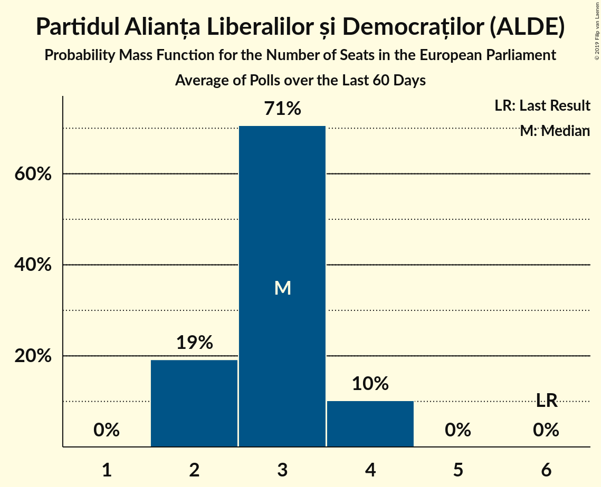
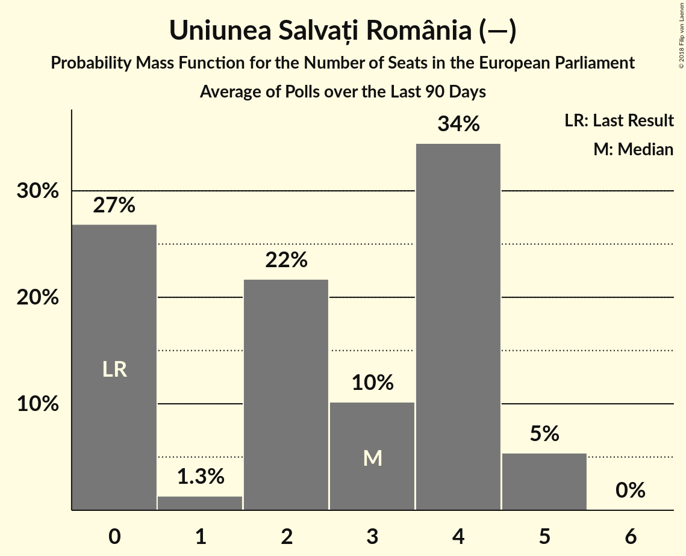

# Poll Average

<a href="#voting-intentions">Voting Intentions</a> | <a href="#seats">Seats</a> | <a href="#coalitions">Coalitions</a> | <a href="#technical-information">Technical Information</a>

## Summary

The table below lists the polls on which the average is based. They are the most recent polls (less than 90 days old) registered and analyzed so far.

| Period     | Polling firm/Commissioner(s) | ALDE | PSD | PMP | PNL | UDMR | USR |
|:----------:|:----------------------------:|:--:|:--:|:--:|:--:|:--:|:--:|
| 25 May 2014 | General Election | 0.0%   0 | 0.0%   0 | 0.0%   0 | 0.0%   0 | 0.0%   0 | 0.0%   0 |
| N/A | Poll Average | 4–15%   0–5 | 27–48%   9–19 | 3–6%   0–2 | 21–35%   8–13 | 4–8%   0–2 | 4–14%   0–5 |
| [27 February–5 March 2018](2018-03-05-Sociopol.html) | Sociopol | 4–7%   0–2 | 31–37%   11–14 | 4–7%   0–2 | 30–36%   10–13 | 5–8%   0–2 | 10–14%   3–5 |
| [1–28 February 2018](2018-02-28-IMAS.html) | IMAS | 9–13%   3–4 | 26–31%   9–12 | 3–6%   0–2 | 27–32%   9–11 | 5–8%   2 | 9–13%   3–4 |
| [3–10 January 2018](2018-01-10-CURS.html) | CURS   STIRIPESURSE.RO | 7–11%   2–3 | 39–45%   15–17 | 4–6%   0–2 | 24–30%   9–10 | 5–8%   2 | 4–6%   0 |
| [24 November–7 December 2017](2017-12-07-Avangarde.html) | Avangarde | 11–16%   4–6 | 42–50%   16–20 | 3–6%   0–2 | 20–26%   7–10 | 4–7%   0–2 | 4–7%   0–2 |
| 25 May 2014 | General Election | 0.0%   0 | 0.0%   0 | 0.0%   0 | 0.0%   0 | 0.0%   0 | 0.0%   0 |

Only polls for which at least the sample size has been published are included in the table above.

**Legend:**
+ **Top half of each row:** Voting intentions (95% confidence interval)
+ **Bottom half of each row:** Seat projections for the European Parliament (95% confidence interval)
+ **ALDE:** Partidul Alianța Liberalilor și Democraților (ALDE)
+ **PSD:** Partidul Social Democrat (S&D)
+ **PMP:** Partidul Mișcarea Populară (EPP)
+ **PNL:** Partidul Național Liberal (EPP)
+ **UDMR:** Uniunea Democrată Maghiară din România (EPP)
+ **USR:** Uniunea Salvați România (—)
+ **N/A (single party):** Party not included the published results
+ **N/A (entire row):** Calculation for this opinion poll not started yet

## Voting Intentions

### Confidence Intervals

| Party | Last Result | Median | 80% Confidence Interval | 90% Confidence Interval | 95% Confidence Interval | 99% Confidence Interval |
|:-----:|:-----------:|:------:|:-----------------------:|:-----------------------:|:-----------------------:|:-----------------------:|
| <a href="#partidul-alianța-liberalilor-și-democraților-(alde)">Partidul Alianța Liberalilor și Democraților (ALDE)</a> | 0.0% | 9.8% | 4.9–13.4% |4.5–14.2% | 4.2–14.8% | 3.8–15.8% |
| <a href="#partidul-social-democrat-(s&d)">Partidul Social Democrat (S&D)</a> | 0.0% | 38.1% | 28.3–46.5% |27.5–47.6% | 26.8–48.4% | 25.8–49.9% |
| <a href="#partidul-mișcarea-populară-(epp)">Partidul Mișcarea Populară (EPP)</a> | 0.0% | 4.7% | 3.7–5.7% |3.4–6.0% | 3.2–6.3% | 2.7–6.8% |
| <a href="#partidul-național-liberal-(epp)">Partidul Național Liberal (EPP)</a> | 0.0% | 28.2% | 22.6–33.4% |21.7–34.3% | 21.1–34.9% | 19.9–36.1% |
| <a href="#uniunea-democrată-maghiară-din-românia-(epp)">Uniunea Democrată Maghiară din România (EPP)</a> | 0.0% | 5.9% | 4.7–7.0% |4.4–7.3% | 4.1–7.6% | 3.6–8.1% |
| <a href="#uniunea-salvați-românia-(—)">Uniunea Salvați România (—)</a> | 0.0% | 8.3% | 4.4–12.6% |4.2–13.1% | 3.9–13.5% | 3.5–14.3% |

### Partidul Social Democrat (S&D)

*For a full overview of the results for this party, see the [Partidul Social Democrat (S&D)](party-partidulsocialdemocratsd.html) page.*

| Voting Intentions | Probability | Accumulated | Special Marks |
|:-----------------:|:-----------:|:-----------:|:-------------:|
| 0.0–0.5% | 0% | 100% | Last Result |
| 0.5–1.5% | 0% | 100% |  |
| 1.5–2.5% | 0% | 100% |  |
| 2.5–3.5% | 0% | 100% |  |
| 3.5–4.5% | 0% | 100% |  |
| 4.5–5.5% | 0% | 100% |  |
| 5.5–6.5% | 0% | 100% |  |
| 6.5–7.5% | 0% | 100% |  |
| 7.5–8.5% | 0% | 100% |  |
| 8.5–9.5% | 0% | 100% |  |
| 9.5–10.5% | 0% | 100% |  |
| 10.5–11.5% | 0% | 100% |  |
| 11.5–12.5% | 0% | 100% |  |
| 12.5–13.5% | 0% | 100% |  |
| 13.5–14.5% | 0% | 100% |  |
| 14.5–15.5% | 0% | 100% |  |
| 15.5–16.5% | 0% | 100% |  |
| 16.5–17.5% | 0% | 100% |  |
| 17.5–18.5% | 0% | 100% |  |
| 18.5–19.5% | 0% | 100% |  |
| 19.5–20.5% | 0% | 100% |  |
| 20.5–21.5% | 0% | 100% |  |
| 21.5–22.5% | 0% | 100% |  |
| 22.5–23.5% | 0% | 100% |  |
| 23.5–24.5% | 0% | 100% |  |
| 24.5–25.5% | 0.3% | 100% |  |
| 25.5–26.5% | 1.4% | 99.7% |  |
| 26.5–27.5% | 4% | 98% |  |
| 27.5–28.5% | 6% | 94% |  |
| 28.5–29.5% | 7% | 88% |  |
| 29.5–30.5% | 4% | 82% |  |
| 30.5–31.5% | 3% | 77% |  |
| 31.5–32.5% | 3% | 74% |  |
| 32.5–33.5% | 5% | 71% |  |
| 33.5–34.5% | 7% | 66% |  |
| 34.5–35.5% | 5% | 59% |  |
| 35.5–36.5% | 3% | 54% |  |
| 36.5–37.5% | 1.0% | 51% |  |
| 37.5–38.5% | 0.4% | 50% | Median |
| 38.5–39.5% | 1.0% | 50% |  |
| 39.5–40.5% | 3% | 49% |  |
| 40.5–41.5% | 5% | 46% |  |
| 41.5–42.5% | 7% | 41% |  |
| 42.5–43.5% | 7% | 33% |  |
| 43.5–44.5% | 6% | 27% |  |
| 44.5–45.5% | 6% | 21% |  |
| 45.5–46.5% | 5% | 15% |  |
| 46.5–47.5% | 5% | 10% |  |
| 47.5–48.5% | 3% | 5% |  |
| 48.5–49.5% | 1.5% | 2% |  |
| 49.5–50.5% | 0.6% | 0.8% |  |
| 50.5–51.5% | 0.2% | 0.2% |  |
| 51.5–52.5% | 0% | 0% |  |

### Partidul Alianța Liberalilor și Democraților (ALDE)

*For a full overview of the results for this party, see the [Partidul Alianța Liberalilor și Democraților (ALDE)](party-partidulalianțaliberalilorșidemocrațiloralde.html) page.*

| Voting Intentions | Probability | Accumulated | Special Marks |
|:-----------------:|:-----------:|:-----------:|:-------------:|
| 0.0–0.5% | 0% | 100% | Last Result |
| 0.5–1.5% | 0% | 100% |  |
| 1.5–2.5% | 0% | 100% |  |
| 2.5–3.5% | 0.2% | 100% |  |
| 3.5–4.5% | 5% | 99.8% |  |
| 4.5–5.5% | 13% | 94% |  |
| 5.5–6.5% | 6% | 81% |  |
| 6.5–7.5% | 1.4% | 76% |  |
| 7.5–8.5% | 7% | 74% |  |
| 8.5–9.5% | 14% | 68% |  |
| 9.5–10.5% | 15% | 54% | Median |
| 10.5–11.5% | 12% | 39% |  |
| 11.5–12.5% | 10% | 27% |  |
| 12.5–13.5% | 8% | 17% |  |
| 13.5–14.5% | 6% | 9% |  |
| 14.5–15.5% | 2% | 3% |  |
| 15.5–16.5% | 0.7% | 0.8% |  |
| 16.5–17.5% | 0.1% | 0.1% |  |
| 17.5–18.5% | 0% | 0% |  |

### Uniunea Salvați România (—)

*For a full overview of the results for this party, see the [Uniunea Salvați România (—)](party-uniuneasalvațiromânia—.html) page.*

| Voting Intentions | Probability | Accumulated | Special Marks |
|:-----------------:|:-----------:|:-----------:|:-------------:|
| 0.0–0.5% | 0% | 100% | Last Result |
| 0.5–1.5% | 0% | 100% |  |
| 1.5–2.5% | 0% | 100% |  |
| 2.5–3.5% | 0.7% | 100% |  |
| 3.5–4.5% | 12% | 99.3% |  |
| 4.5–5.5% | 25% | 88% |  |
| 5.5–6.5% | 11% | 63% |  |
| 6.5–7.5% | 2% | 52% |  |
| 7.5–8.5% | 0.2% | 50% | Median |
| 8.5–9.5% | 1.0% | 50% |  |
| 9.5–10.5% | 7% | 49% |  |
| 10.5–11.5% | 16% | 42% |  |
| 11.5–12.5% | 16% | 27% |  |
| 12.5–13.5% | 8% | 10% |  |
| 13.5–14.5% | 2% | 2% |  |
| 14.5–15.5% | 0.3% | 0.3% |  |
| 15.5–16.5% | 0% | 0% |  |

### Partidul Național Liberal (EPP)

*For a full overview of the results for this party, see the [Partidul Național Liberal (EPP)](party-partidulnaționalliberalepp.html) page.*

| Voting Intentions | Probability | Accumulated | Special Marks |
|:-----------------:|:-----------:|:-----------:|:-------------:|
| 0.0–0.5% | 0% | 100% | Last Result |
| 0.5–1.5% | 0% | 100% |  |
| 1.5–2.5% | 0% | 100% |  |
| 2.5–3.5% | 0% | 100% |  |
| 3.5–4.5% | 0% | 100% |  |
| 4.5–5.5% | 0% | 100% |  |
| 5.5–6.5% | 0% | 100% |  |
| 6.5–7.5% | 0% | 100% |  |
| 7.5–8.5% | 0% | 100% |  |
| 8.5–9.5% | 0% | 100% |  |
| 9.5–10.5% | 0% | 100% |  |
| 10.5–11.5% | 0% | 100% |  |
| 11.5–12.5% | 0% | 100% |  |
| 12.5–13.5% | 0% | 100% |  |
| 13.5–14.5% | 0% | 100% |  |
| 14.5–15.5% | 0% | 100% |  |
| 15.5–16.5% | 0% | 100% |  |
| 16.5–17.5% | 0% | 100% |  |
| 17.5–18.5% | 0% | 100% |  |
| 18.5–19.5% | 0.2% | 100% |  |
| 19.5–20.5% | 1.0% | 99.7% |  |
| 20.5–21.5% | 3% | 98.7% |  |
| 21.5–22.5% | 5% | 96% |  |
| 22.5–23.5% | 6% | 91% |  |
| 23.5–24.5% | 6% | 84% |  |
| 24.5–25.5% | 6% | 79% |  |
| 25.5–26.5% | 7% | 73% |  |
| 26.5–27.5% | 9% | 66% |  |
| 27.5–28.5% | 10% | 56% | Median |
| 28.5–29.5% | 9% | 47% |  |
| 29.5–30.5% | 8% | 37% |  |
| 30.5–31.5% | 7% | 30% |  |
| 31.5–32.5% | 7% | 23% |  |
| 32.5–33.5% | 7% | 16% |  |
| 33.5–34.5% | 5% | 9% |  |
| 34.5–35.5% | 3% | 4% |  |
| 35.5–36.5% | 0.9% | 1.2% |  |
| 36.5–37.5% | 0.2% | 0.2% |  |
| 37.5–38.5% | 0% | 0% |  |

### Uniunea Democrată Maghiară din România (EPP)

*For a full overview of the results for this party, see the [Uniunea Democrată Maghiară din România (EPP)](party-uniuneademocratămaghiarădinromâniaepp.html) page.*

| Voting Intentions | Probability | Accumulated | Special Marks |
|:-----------------:|:-----------:|:-----------:|:-------------:|
| 0.0–0.5% | 0% | 100% | Last Result |
| 0.5–1.5% | 0% | 100% |  |
| 1.5–2.5% | 0% | 100% |  |
| 2.5–3.5% | 0.5% | 100% |  |
| 3.5–4.5% | 7% | 99.5% |  |
| 4.5–5.5% | 28% | 93% |  |
| 5.5–6.5% | 44% | 65% | Median |
| 6.5–7.5% | 18% | 21% |  |
| 7.5–8.5% | 2% | 3% |  |
| 8.5–9.5% | 0.1% | 0.1% |  |
| 9.5–10.5% | 0% | 0% |  |

### Partidul Mișcarea Populară (EPP)

*For a full overview of the results for this party, see the [Partidul Mișcarea Populară (EPP)](party-partidulmișcareapopularăepp.html) page.*

| Voting Intentions | Probability | Accumulated | Special Marks |
|:-----------------:|:-----------:|:-----------:|:-------------:|
| 0.0–0.5% | 0% | 100% | Last Result |
| 0.5–1.5% | 0% | 100% |  |
| 1.5–2.5% | 0.2% | 100% |  |
| 2.5–3.5% | 7% | 99.8% |  |
| 3.5–4.5% | 34% | 93% |  |
| 4.5–5.5% | 44% | 59% | Median |
| 5.5–6.5% | 14% | 15% |  |
| 6.5–7.5% | 1.2% | 1.2% |  |
| 7.5–8.5% | 0% | 0% |  |

## Seats

### Confidence Intervals

| Party | Last Result | Median | 80% Confidence Interval | 90% Confidence Interval | 95% Confidence Interval | 99% Confidence Interval |
|:-----:|:-----------:|:------:|:-----------------------:|:-----------------------:|:-----------------------:|:-----------------------:|
| <a href="#partidul-alianța-liberalilor-și-democraților-(alde)">Partidul Alianța Liberalilor și Democraților (ALDE)</a> | 0 | 3 | 2–5 |0–5 | 0–5 | 0–6 |
| <a href="#partidul-social-democrat-(s&d)">Partidul Social Democrat (S&D)</a> | 0 | 15 | 9–18 |9–18 | 9–19 | 9–20 |
| <a href="#partidul-mișcarea-populară-(epp)">Partidul Mișcarea Populară (EPP)</a> | 0 | 0 | 0–2 |0–2 | 0–2 | 0–2 |
| <a href="#partidul-național-liberal-(epp)">Partidul Național Liberal (EPP)</a> | 0 | 9 | 8–12 |8–12 | 8–13 | 7–13 |
| <a href="#uniunea-democrată-maghiară-din-românia-(epp)">Uniunea Democrată Maghiară din România (EPP)</a> | 0 | 2 | 0–2 |0–2 | 0–2 | 0–2 |
| <a href="#uniunea-salvați-românia-(—)">Uniunea Salvați România (—)</a> | 0 | 3 | 0–4 |0–4 | 0–5 | 0–5 |

### Partidul Social Democrat (S&D)

*For a full overview of the results for this party, see the [Partidul Social Democrat (S&D)](party-partidulsocialdemocratsd.html) page.*

| Number of Seats | Probability | Accumulated | Special Marks |
|:---------------:|:-----------:|:-----------:|:-------------:|
| 0 | 0% | 100% | Last Result |
| 1 | 0% | 100% |  |
| 2 | 0% | 100% |  |
| 3 | 0% | 100% |  |
| 4 | 0% | 100% |  |
| 5 | 0% | 100% |  |
| 6 | 0% | 100% |  |
| 7 | 0% | 100% |  |
| 8 | 0% | 100% |  |
| 9 | 16% | 100% |  |
| 10 | 1.3% | 83% |  |
| 11 | 4% | 82% |  |
| 12 | 17% | 78% |  |
| 13 | 9% | 60% |  |
| 14 | 0.9% | 51% |  |
| 15 | 2% | 50% | Median |
| 16 | 25% | 48% |  |
| 17 | 10% | 23% | Majority |
| 18 | 8% | 13% |  |
| 19 | 3% | 4% |  |
| 20 | 0.7% | 0.8% |  |
| 21 | 0% | 0% |  |

### Partidul Alianța Liberalilor și Democraților (ALDE)

*For a full overview of the results for this party, see the [Partidul Alianța Liberalilor și Democraților (ALDE)](party-partidulalianțaliberalilorșidemocrațiloralde.html) page.*

| Number of Seats | Probability | Accumulated | Special Marks |
|:---------------:|:-----------:|:-----------:|:-------------:|
| 0 | 7% | 100% | Last Result |
| 1 | 0% | 93% |  |
| 2 | 21% | 93% |  |
| 3 | 30% | 72% | Median |
| 4 | 27% | 42% |  |
| 5 | 14% | 15% |  |
| 6 | 1.5% | 1.5% |  |
| 7 | 0% | 0% |  |

### Uniunea Salvați România (—)

*For a full overview of the results for this party, see the [Uniunea Salvați România (—)](party-uniuneasalvațiromânia—.html) page.*

| Number of Seats | Probability | Accumulated | Special Marks |
|:---------------:|:-----------:|:-----------:|:-------------:|
| 0 | 37% | 100% | Last Result |
| 1 | 1.1% | 63% |  |
| 2 | 12% | 62% |  |
| 3 | 11% | 50% | Median |
| 4 | 37% | 39% |  |
| 5 | 3% | 3% |  |
| 6 | 0% | 0% |  |

### Partidul Național Liberal (EPP)

*For a full overview of the results for this party, see the [Partidul Național Liberal (EPP)](party-partidulnaționalliberalepp.html) page.*

| Number of Seats | Probability | Accumulated | Special Marks |
|:---------------:|:-----------:|:-----------:|:-------------:|
| 0 | 0% | 100% | Last Result |
| 1 | 0% | 100% |  |
| 2 | 0% | 100% |  |
| 3 | 0% | 100% |  |
| 4 | 0% | 100% |  |
| 5 | 0% | 100% |  |
| 6 | 0% | 100% |  |
| 7 | 2% | 100% |  |
| 8 | 11% | 98% |  |
| 9 | 40% | 87% | Median |
| 10 | 11% | 48% |  |
| 11 | 21% | 37% |  |
| 12 | 12% | 15% |  |
| 13 | 2% | 3% |  |
| 14 | 0.4% | 0.4% |  |
| 15 | 0% | 0% |  |

### Uniunea Democrată Maghiară din România (EPP)

*For a full overview of the results for this party, see the [Uniunea Democrată Maghiară din România (EPP)](party-uniuneademocratămaghiarădinromâniaepp.html) page.*

| Number of Seats | Probability | Accumulated | Special Marks |
|:---------------:|:-----------:|:-----------:|:-------------:|
| 0 | 15% | 100% | Last Result |
| 1 | 7% | 85% |  |
| 2 | 78% | 78% | Median |
| 3 | 0.4% | 0.4% |  |
| 4 | 0% | 0% |  |

### Partidul Mișcarea Populară (EPP)

*For a full overview of the results for this party, see the [Partidul Mișcarea Populară (EPP)](party-partidulmișcareapopularăepp.html) page.*

| Number of Seats | Probability | Accumulated | Special Marks |
|:---------------:|:-----------:|:-----------:|:-------------:|
| 0 | 57% | 100% | Last Result, Median |
| 1 | 19% | 43% |  |
| 2 | 24% | 24% |  |
| 3 | 0% | 0% |  |

## Coalitions

### Confidence Intervals

| Coalition | Last Result | Median | Majority? | 80% Confidence Interval | 90% Confidence Interval | 95% Confidence Interval | 99% Confidence Interval |
|:---------:|:-----------:|:------:|:---------:|:-----------------------:|:-----------------------:|:-----------------------:|:-----------------------:|
| Partidul Social Democrat (S&D) | 0 | 15 | 23% | 9–18 | 9–18 | 9–19 | 9–20 |
| Partidul Mișcarea Populară (EPP) – Partidul Național Liberal (EPP) – Uniunea Democrată Maghiară din România (EPP) | 0 | 12 | 0% | 9–15 | 9–16 | 8–16 | 8–16 |
| Partidul Alianța Liberalilor și Democraților (ALDE) | 0 | 3 | 0% | 2–5 | 0–5 | 0–5 | 0–6 |
| Uniunea Salvați România (—) | 0 | 3 | 0% | 0–4 | 0–4 | 0–5 | 0–5 |

### Partidul Social Democrat (S&D)

| Number of Seats | Probability | Accumulated | Special Marks |
|:---------------:|:-----------:|:-----------:|:-------------:|
| 0 | 0% | 100% | Last Result |
| 1 | 0% | 100% |  |
| 2 | 0% | 100% |  |
| 3 | 0% | 100% |  |
| 4 | 0% | 100% |  |
| 5 | 0% | 100% |  |
| 6 | 0% | 100% |  |
| 7 | 0% | 100% |  |
| 8 | 0% | 100% |  |
| 9 | 16% | 100% |  |
| 10 | 1.3% | 83% |  |
| 11 | 4% | 82% |  |
| 12 | 17% | 78% |  |
| 13 | 9% | 60% |  |
| 14 | 0.9% | 51% |  |
| 15 | 2% | 50% | Median |
| 16 | 25% | 48% |  |
| 17 | 10% | 23% | Majority |
| 18 | 8% | 13% |  |
| 19 | 3% | 4% |  |
| 20 | 0.7% | 0.8% |  |
| 21 | 0% | 0% |  |

### Partidul Mișcarea Populară (EPP) – Partidul Național Liberal (EPP) – Uniunea Democrată Maghiară din România (EPP)

| Number of Seats | Probability | Accumulated | Special Marks |
|:---------------:|:-----------:|:-----------:|:-------------:|
| 0 | 0% | 100% | Last Result |
| 1 | 0% | 100% |  |
| 2 | 0% | 100% |  |
| 3 | 0% | 100% |  |
| 4 | 0% | 100% |  |
| 5 | 0% | 100% |  |
| 6 | 0% | 100% |  |
| 7 | 0.2% | 100% |  |
| 8 | 4% | 99.7% |  |
| 9 | 7% | 96% |  |
| 10 | 8% | 89% |  |
| 11 | 11% | 80% | Median |
| 12 | 22% | 70% |  |
| 13 | 28% | 47% |  |
| 14 | 7% | 19% |  |
| 15 | 6% | 12% |  |
| 16 | 6% | 6% |  |
| 17 | 0% | 0% | Majority |

### Partidul Alianța Liberalilor și Democraților (ALDE)

| Number of Seats | Probability | Accumulated | Special Marks |
|:---------------:|:-----------:|:-----------:|:-------------:|
| 0 | 7% | 100% | Last Result |
| 1 | 0% | 93% |  |
| 2 | 21% | 93% |  |
| 3 | 30% | 72% | Median |
| 4 | 27% | 42% |  |
| 5 | 14% | 15% |  |
| 6 | 1.5% | 1.5% |  |
| 7 | 0% | 0% |  |

### Uniunea Salvați România (—)

| Number of Seats | Probability | Accumulated | Special Marks |
|:---------------:|:-----------:|:-----------:|:-------------:|
| 0 | 37% | 100% | Last Result |
| 1 | 1.1% | 63% |  |
| 2 | 12% | 62% |  |
| 3 | 11% | 50% | Median |
| 4 | 37% | 39% |  |
| 5 | 3% | 3% |  |
| 6 | 0% | 0% |  |

## Technical Information

