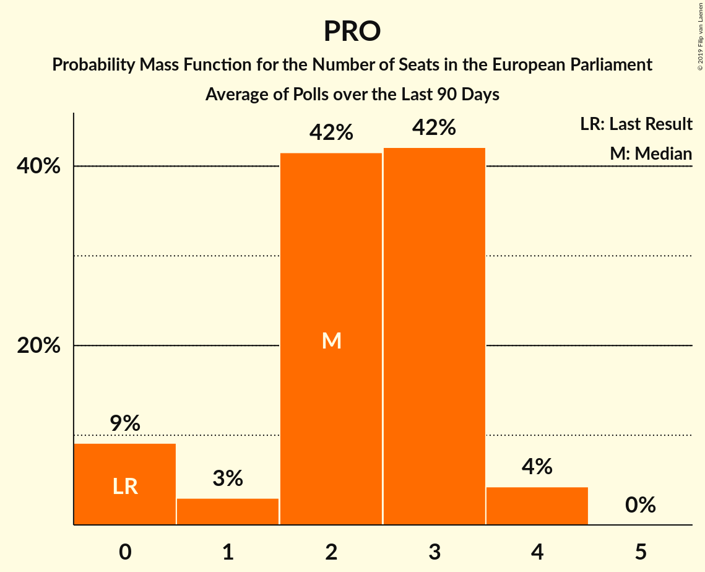

# Poll Average

<a href="#voting-intentions">Voting Intentions</a> | <a href="#seats">Seats</a> | <a href="#coalitions">Coalitions</a> | <a href="#technical-information">Technical Information</a>

## Summary

The table below lists the polls on which the average is based. They are the most recent polls (less than 90 days old) registered and analyzed so far.

| Period     | Polling firm/Commissioner(s) | PSD | ALDE | PNL | UDMR | PMP | RO+ | PRO | USR |
|:----------:|:----------------------------:|:--:|:--:|:--:|:--:|:--:|:--:|:--:|:--:|
| 25 May 2014 | General Election | 37.6%   16 | 15.0%   6 | 12.2%   5 | 6.3%   2 | 6.2%   2 | 0.0%   0 | 0.0%   0 | 0.0%   0 |
| N/A | Poll Average | 23–40%   8–16 | 8–12%   2–4 | 18–28%   6–11 | 3–7%   0–2 | 1–6%   0–2 | 4–10%   0–3 | 4–10%   0–4 | 5–13%   0–5 |
| [4–20 December 2018](2018-12-20-IMAS.html) | IMAS | 23–28%   8–11 | 8–12%   3–4 | 24–29%   9–11 | 3–6%   0–2 | 2–4%   0 | 7–10%   2–3 | 5–8%   0–3 | 10–14%   3–5 |
| [24 November–9 December 2018](2018-12-09-CURS.html) | CURS   STIRIPESURSE.RO | 30–36%   11–14 | 7–11%   2–4 | 18–22%   6–8 | 5–8%   0–2 | 4–6%   0–2 | 4–6%   0–2 | 7–11%   2–4 | 6–9%   2–3 |
| [3–4 October 2018](2018-10-04-Sociopol.html) | Sociopol | 35–41%   13–16 | 8–12%   3–4 | 20–26%   7–10 | 3–6%   0–2 | 1–2%   0 | 4–7%   0–2 | 4–7%   0–2 | 5–8%   0–3 |
| 25 May 2014 | General Election | 37.6%   16 | 15.0%   6 | 12.2%   5 | 6.3%   2 | 6.2%   2 | 0.0%   0 | 0.0%   0 | 0.0%   0 |

Only polls for which at least the sample size has been published are included in the table above.

**Legend:**
+ **Top half of each row:** Voting intentions (95% confidence interval)
+ **Bottom half of each row:** Seat projections for the European Parliament (95% confidence interval)
+ **PSD:** Partidul Social Democrat (S&D)
+ **ALDE:** Partidul Alianța Liberalilor și Democraților (ALDE)
+ **PNL:** Partidul Național Liberal (EPP)
+ **UDMR:** Uniunea Democrată Maghiară din România (EPP)
+ **PMP:** Partidul Mișcarea Populară (EPP)
+ **RO+:** Mișcarea România Împreună (ALDE)
+ **PRO:** PRO România (ECR)
+ **USR:** Uniunea Salvați România (ALDE)
+ **N/A (single party):** Party not included the published results
+ **N/A (entire row):** Calculation for this opinion poll not started yet

## Voting Intentions

### Confidence Intervals

| Party | Last Result | Median | 80% Confidence Interval | 90% Confidence Interval | 95% Confidence Interval | 99% Confidence Interval |
|:-----:|:-----------:|:------:|:-----------------------:|:-----------------------:|:-----------------------:|:-----------------------:|
| <a href="#partidul-social-democrat-(s&d)">Partidul Social Democrat (S&D)</a> | 37.6% | 33.0% | 24.5–38.9% |23.8–39.8% | 23.3–40.4% | 22.3–41.6% |
| <a href="#partidul-alianța-liberalilor-și-democraților-(alde)">Partidul Alianța Liberalilor și Democraților (ALDE)</a> | 15.0% | 9.6% | 8.3–11.0% |8.0–11.4% | 7.7–11.7% | 7.2–12.5% |
| <a href="#partidul-național-liberal-(epp)">Partidul Național Liberal (EPP)</a> | 12.2% | 23.1% | 19.3–27.0% |18.8–27.7% | 18.3–28.3% | 17.4–29.3% |
| <a href="#uniunea-democrată-maghiară-din-românia-(epp)">Uniunea Democrată Maghiară din România (EPP)</a> | 6.3% | 4.8% | 3.6–6.5% |3.4–6.9% | 3.2–7.2% | 2.8–7.8% |
| <a href="#partidul-mișcarea-populară-(epp)">Partidul Mișcarea Populară (EPP)</a> | 6.2% | 2.6% | 0.9–5.4% |0.8–5.7% | 0.7–6.0% | 0.5–6.6% |
| <a href="#mișcarea-românia-împreună-(alde)">Mișcarea România Împreună (ALDE)</a> | 0.0% | 5.6% | 4.4–8.6% |4.1–9.1% | 3.9–9.5% | 3.5–10.2% |
| <a href="#pro-românia-(ecr)">PRO România (ECR)</a> | 0.0% | 6.5% | 4.7–9.5% |4.4–10.0% | 4.1–10.4% | 3.7–11.1% |
| <a href="#uniunea-salvați-românia-(alde)">Uniunea Salvați România (ALDE)</a> | 0.0% | 7.2% | 5.6–12.1% |5.2–12.6% | 4.9–13.0% | 4.4–13.8% |

### Partidul Social Democrat (S&D)

*For a full overview of the results for this party, see the [Partidul Social Democrat (S&D)](party-partidulsocialdemocratsd.html) page.*

| Voting Intentions | Probability | Accumulated | Special Marks |
|:-----------------:|:-----------:|:-----------:|:-------------:|
| 19.5–20.5% | 0% | 100% |  |
| 20.5–21.5% | 0.1% | 100% |  |
| 21.5–22.5% | 0.7% | 99.9% |  |
| 22.5–23.5% | 3% | 99.2% |  |
| 23.5–24.5% | 7% | 96% |  |
| 24.5–25.5% | 9% | 89% |  |
| 25.5–26.5% | 8% | 80% |  |
| 26.5–27.5% | 4% | 72% |  |
| 27.5–28.5% | 1.2% | 68% |  |
| 28.5–29.5% | 0.5% | 67% |  |
| 29.5–30.5% | 1.2% | 66% |  |
| 30.5–31.5% | 4% | 65% |  |
| 31.5–32.5% | 7% | 62% |  |
| 32.5–33.5% | 9% | 54% | Median |
| 33.5–34.5% | 7% | 45% |  |
| 34.5–35.5% | 5% | 38% |  |
| 35.5–36.5% | 5% | 33% |  |
| 36.5–37.5% | 7% | 28% |  |
| 37.5–38.5% | 8% | 21% | Last Result |
| 38.5–39.5% | 7% | 13% |  |
| 39.5–40.5% | 4% | 6% |  |
| 40.5–41.5% | 2% | 2% |  |
| 41.5–42.5% | 0.5% | 0.6% |  |
| 42.5–43.5% | 0.1% | 0.1% |  |
| 43.5–44.5% | 0% | 0% |  |

### Partidul Alianța Liberalilor și Democraților (ALDE)

*For a full overview of the results for this party, see the [Partidul Alianța Liberalilor și Democraților (ALDE)](party-partidulalianțaliberalilorșidemocrațiloralde.html) page.*

| Voting Intentions | Probability | Accumulated | Special Marks |
|:-----------------:|:-----------:|:-----------:|:-------------:|
| 5.5–6.5% | 0% | 100% |  |
| 6.5–7.5% | 2% | 100% |  |
| 7.5–8.5% | 14% | 98% |  |
| 8.5–9.5% | 35% | 85% |  |
| 9.5–10.5% | 33% | 50% | Median |
| 10.5–11.5% | 14% | 18% |  |
| 11.5–12.5% | 3% | 4% |  |
| 12.5–13.5% | 0.4% | 0.4% |  |
| 13.5–14.5% | 0% | 0% |  |
| 14.5–15.5% | 0% | 0% | Last Result |

### Partidul Național Liberal (EPP)

*For a full overview of the results for this party, see the [Partidul Național Liberal (EPP)](party-partidulnaționalliberalepp.html) page.*

| Voting Intentions | Probability | Accumulated | Special Marks |
|:-----------------:|:-----------:|:-----------:|:-------------:|
| 11.5–12.5% | 0% | 100% | Last Result |
| 12.5–13.5% | 0% | 100% |  |
| 13.5–14.5% | 0% | 100% |  |
| 14.5–15.5% | 0% | 100% |  |
| 15.5–16.5% | 0.1% | 100% |  |
| 16.5–17.5% | 0.6% | 99.9% |  |
| 17.5–18.5% | 3% | 99.4% |  |
| 18.5–19.5% | 8% | 96% |  |
| 19.5–20.5% | 11% | 88% |  |
| 20.5–21.5% | 11% | 76% |  |
| 21.5–22.5% | 10% | 66% |  |
| 22.5–23.5% | 10% | 55% | Median |
| 23.5–24.5% | 10% | 45% |  |
| 24.5–25.5% | 10% | 35% |  |
| 25.5–26.5% | 11% | 25% |  |
| 26.5–27.5% | 8% | 14% |  |
| 27.5–28.5% | 4% | 6% |  |
| 28.5–29.5% | 1.4% | 2% |  |
| 29.5–30.5% | 0.3% | 0.3% |  |
| 30.5–31.5% | 0% | 0% |  |
| 31.5–32.5% | 0% | 0% |  |

### Uniunea Democrată Maghiară din România (EPP)

*For a full overview of the results for this party, see the [Uniunea Democrată Maghiară din România (EPP)](party-uniuneademocratămaghiarădinromâniaepp.html) page.*

| Voting Intentions | Probability | Accumulated | Special Marks |
|:-----------------:|:-----------:|:-----------:|:-------------:|
| 0.5–1.5% | 0% | 100% |  |
| 1.5–2.5% | 0.1% | 100% |  |
| 2.5–3.5% | 8% | 99.9% |  |
| 3.5–4.5% | 33% | 92% |  |
| 4.5–5.5% | 30% | 59% | Median |
| 5.5–6.5% | 21% | 29% | Last Result |
| 6.5–7.5% | 8% | 9% |  |
| 7.5–8.5% | 0.9% | 0.9% |  |
| 8.5–9.5% | 0% | 0% |  |

### Partidul Mișcarea Populară (EPP)

*For a full overview of the results for this party, see the [Partidul Mișcarea Populară (EPP)](party-partidulmișcareapopularăepp.html) page.*

| Voting Intentions | Probability | Accumulated | Special Marks |
|:-----------------:|:-----------:|:-----------:|:-------------:|
| 0.0–0.5% | 0.8% | 100% |  |
| 0.5–1.5% | 28% | 99.2% |  |
| 1.5–2.5% | 18% | 71% |  |
| 2.5–3.5% | 18% | 52% | Median |
| 3.5–4.5% | 9% | 35% |  |
| 4.5–5.5% | 18% | 25% |  |
| 5.5–6.5% | 7% | 7% | Last Result |
| 6.5–7.5% | 0.6% | 0.6% |  |
| 7.5–8.5% | 0% | 0% |  |

### Uniunea Salvați România (ALDE)

*For a full overview of the results for this party, see the [Uniunea Salvați România (ALDE)](party-uniuneasalvațiromâniaalde.html) page.*

| Voting Intentions | Probability | Accumulated | Special Marks |
|:-----------------:|:-----------:|:-----------:|:-------------:|
| 0.0–0.5% | 0% | 100% | Last Result |
| 0.5–1.5% | 0% | 100% |  |
| 1.5–2.5% | 0% | 100% |  |
| 2.5–3.5% | 0% | 100% |  |
| 3.5–4.5% | 0.8% | 100% |  |
| 4.5–5.5% | 9% | 99.2% |  |
| 5.5–6.5% | 23% | 90% |  |
| 6.5–7.5% | 23% | 67% | Median |
| 7.5–8.5% | 9% | 44% |  |
| 8.5–9.5% | 2% | 35% |  |
| 9.5–10.5% | 5% | 33% |  |
| 10.5–11.5% | 12% | 28% |  |
| 11.5–12.5% | 11% | 16% |  |
| 12.5–13.5% | 5% | 5% |  |
| 13.5–14.5% | 0.8% | 0.9% |  |
| 14.5–15.5% | 0.1% | 0.1% |  |
| 15.5–16.5% | 0% | 0% |  |

### Mișcarea România Împreună (ALDE)

*For a full overview of the results for this party, see the [Mișcarea România Împreună (ALDE)](party-mișcarearomâniaîmpreunăalde.html) page.*

| Voting Intentions | Probability | Accumulated | Special Marks |
|:-----------------:|:-----------:|:-----------:|:-------------:|
| 0.0–0.5% | 0% | 100% | Last Result |
| 0.5–1.5% | 0% | 100% |  |
| 1.5–2.5% | 0% | 100% |  |
| 2.5–3.5% | 0.6% | 100% |  |
| 3.5–4.5% | 15% | 99.4% |  |
| 4.5–5.5% | 35% | 85% |  |
| 5.5–6.5% | 16% | 50% | Median |
| 6.5–7.5% | 9% | 34% |  |
| 7.5–8.5% | 15% | 26% |  |
| 8.5–9.5% | 9% | 11% |  |
| 9.5–10.5% | 2% | 2% |  |
| 10.5–11.5% | 0.2% | 0.2% |  |
| 11.5–12.5% | 0% | 0% |  |

### PRO România (ECR)

*For a full overview of the results for this party, see the [PRO România (ECR)](party-proromâniaecr.html) page.*

| Voting Intentions | Probability | Accumulated | Special Marks |
|:-----------------:|:-----------:|:-----------:|:-------------:|
| 0.0–0.5% | 0% | 100% | Last Result |
| 0.5–1.5% | 0% | 100% |  |
| 1.5–2.5% | 0% | 100% |  |
| 2.5–3.5% | 0.3% | 100% |  |
| 3.5–4.5% | 7% | 99.7% |  |
| 4.5–5.5% | 21% | 92% |  |
| 5.5–6.5% | 23% | 72% | Median |
| 6.5–7.5% | 14% | 48% |  |
| 7.5–8.5% | 11% | 35% |  |
| 8.5–9.5% | 15% | 24% |  |
| 9.5–10.5% | 8% | 9% |  |
| 10.5–11.5% | 2% | 2% |  |
| 11.5–12.5% | 0.1% | 0.1% |  |
| 12.5–13.5% | 0% | 0% |  |

## Seats

### Confidence Intervals

| Party | Last Result | Median | 80% Confidence Interval | 90% Confidence Interval | 95% Confidence Interval | 99% Confidence Interval |
|:-----:|:-----------:|:------:|:-----------------------:|:-----------------------:|:-----------------------:|:-----------------------:|
| <a href="#partidul-social-democrat-(s&d)">Partidul Social Democrat (S&D)</a> | 16 | 12 | 9–15 |9–15 | 8–16 | 8–17 |
| <a href="#partidul-alianța-liberalilor-și-democraților-(alde)">Partidul Alianța Liberalilor și Democraților (ALDE)</a> | 6 | 3 | 3–4 |3–4 | 2–4 | 2–4 |
| <a href="#partidul-național-liberal-(epp)">Partidul Național Liberal (EPP)</a> | 5 | 9 | 7–10 |7–10 | 6–11 | 6–11 |
| <a href="#uniunea-democrată-maghiară-din-românia-(epp)">Uniunea Democrată Maghiară din România (EPP)</a> | 2 | 0 | 0–2 |0–2 | 0–2 | 0–3 |
| <a href="#partidul-mișcarea-populară-(epp)">Partidul Mișcarea Populară (EPP)</a> | 2 | 0 | 0–2 |0–2 | 0–2 | 0–2 |
| <a href="#mișcarea-românia-împreună-(alde)">Mișcarea România Împreună (ALDE)</a> | 0 | 2 | 0–3 |0–3 | 0–3 | 0–3 |
| <a href="#pro-românia-(ecr)">PRO România (ECR)</a> | 0 | 2 | 0–3 |0–3 | 0–4 | 0–4 |
| <a href="#uniunea-salvați-românia-(alde)">Uniunea Salvați România (ALDE)</a> | 0 | 2 | 2–4 |2–4 | 0–5 | 0–5 |

### Partidul Social Democrat (S&D)

*For a full overview of the results for this party, see the [Partidul Social Democrat (S&D)](party-partidulsocialdemocratsd.html) page.*

| Number of Seats | Probability | Accumulated | Special Marks |
|:---------------:|:-----------:|:-----------:|:-------------:|
| 8 | 4% | 100% |  |
| 9 | 22% | 96% |  |
| 10 | 7% | 74% |  |
| 11 | 6% | 67% |  |
| 12 | 16% | 61% | Median |
| 13 | 16% | 45% |  |
| 14 | 15% | 29% |  |
| 15 | 10% | 14% |  |
| 16 | 3% | 4% | Last Result |
| 17 | 0.6% | 0.6% | Majority |
| 18 | 0% | 0% |  |

### Partidul Alianța Liberalilor și Democraților (ALDE)

*For a full overview of the results for this party, see the [Partidul Alianța Liberalilor și Democraților (ALDE)](party-partidulalianțaliberalilorșidemocrațiloralde.html) page.*

| Number of Seats | Probability | Accumulated | Special Marks |
|:---------------:|:-----------:|:-----------:|:-------------:|
| 2 | 4% | 100% |  |
| 3 | 74% | 96% | Median |
| 4 | 22% | 22% |  |
| 5 | 0.4% | 0.4% |  |
| 6 | 0% | 0% | Last Result |

### Partidul Național Liberal (EPP)

*For a full overview of the results for this party, see the [Partidul Național Liberal (EPP)](party-partidulnaționalliberalepp.html) page.*

| Number of Seats | Probability | Accumulated | Special Marks |
|:---------------:|:-----------:|:-----------:|:-------------:|
| 5 | 0% | 100% | Last Result |
| 6 | 3% | 100% |  |
| 7 | 22% | 97% |  |
| 8 | 25% | 75% |  |
| 9 | 25% | 50% | Median |
| 10 | 23% | 25% |  |
| 11 | 2% | 3% |  |
| 12 | 0.1% | 0.1% |  |
| 13 | 0% | 0% |  |

### Uniunea Democrată Maghiară din România (EPP)

*For a full overview of the results for this party, see the [Uniunea Democrată Maghiară din România (EPP)](party-uniuneademocratămaghiarădinromâniaepp.html) page.*

| Number of Seats | Probability | Accumulated | Special Marks |
|:---------------:|:-----------:|:-----------:|:-------------:|
| 0 | 57% | 100% | Median |
| 1 | 6% | 43% |  |
| 2 | 36% | 37% | Last Result |
| 3 | 0.7% | 0.7% |  |
| 4 | 0% | 0% |  |

### Partidul Mișcarea Populară (EPP)

*For a full overview of the results for this party, see the [Partidul Mișcarea Populară (EPP)](party-partidulmișcareapopularăepp.html) page.*

| Number of Seats | Probability | Accumulated | Special Marks |
|:---------------:|:-----------:|:-----------:|:-------------:|
| 0 | 87% | 100% | Median |
| 1 | 0.1% | 13% |  |
| 2 | 13% | 13% | Last Result |
| 3 | 0% | 0% |  |

### Uniunea Salvați România (ALDE)

*For a full overview of the results for this party, see the [Uniunea Salvați România (ALDE)](party-uniuneasalvațiromâniaalde.html) page.*

| Number of Seats | Probability | Accumulated | Special Marks |
|:---------------:|:-----------:|:-----------:|:-------------:|
| 0 | 4% | 100% | Last Result |
| 1 | 1.0% | 96% |  |
| 2 | 55% | 95% | Median |
| 3 | 12% | 40% |  |
| 4 | 26% | 29% |  |
| 5 | 3% | 3% |  |
| 6 | 0% | 0% |  |

### Mișcarea România Împreună (ALDE)

*For a full overview of the results for this party, see the [Mișcarea România Împreună (ALDE)](party-mișcarearomâniaîmpreunăalde.html) page.*

| Number of Seats | Probability | Accumulated | Special Marks |
|:---------------:|:-----------:|:-----------:|:-------------:|
| 0 | 31% | 100% | Last Result |
| 1 | 7% | 69% |  |
| 2 | 37% | 62% | Median |
| 3 | 24% | 25% |  |
| 4 | 0.2% | 0.2% |  |
| 5 | 0% | 0% |  |

### PRO România (ECR)

*For a full overview of the results for this party, see the [PRO România (ECR)](party-proromâniaecr.html) page.*

| Number of Seats | Probability | Accumulated | Special Marks |
|:---------------:|:-----------:|:-----------:|:-------------:|
| 0 | 16% | 100% | Last Result |
| 1 | 4% | 84% |  |
| 2 | 47% | 80% | Median |
| 3 | 30% | 33% |  |
| 4 | 3% | 3% |  |
| 5 | 0% | 0% |  |

## Coalitions

### Confidence Intervals

| Coalition | Last Result | Median | Majority? | 80% Confidence Interval | 90% Confidence Interval | 95% Confidence Interval | 99% Confidence Interval |
|:---------:|:-----------:|:------:|:---------:|:-----------------------:|:-----------------------:|:-----------------------:|:-----------------------:|
| Partidul Social Democrat (S&D) | 16 | 12 | 0.6% | 9–15 | 9–15 | 8–16 | 8–17 |
| Partidul Național Liberal (EPP) – Uniunea Democrată Maghiară din România (EPP) – Partidul Mișcarea Populară (EPP) | 9 | 10 | 0% | 8–11 | 8–11 | 8–12 | 7–12 |
| Partidul Alianța Liberalilor și Democraților (ALDE) – Mișcarea România Împreună (ALDE) – Uniunea Salvați România (ALDE) | 6 | 7 | 0% | 5–10 | 5–10 | 5–11 | 4–11 |
| PRO România (ECR) | 0 | 2 | 0% | 0–3 | 0–3 | 0–4 | 0–4 |

### Partidul Social Democrat (S&D)

| Number of Seats | Probability | Accumulated | Special Marks |
|:---------------:|:-----------:|:-----------:|:-------------:|
| 8 | 4% | 100% |  |
| 9 | 22% | 96% |  |
| 10 | 7% | 74% |  |
| 11 | 6% | 67% |  |
| 12 | 16% | 61% | Median |
| 13 | 16% | 45% |  |
| 14 | 15% | 29% |  |
| 15 | 10% | 14% |  |
| 16 | 3% | 4% | Last Result |
| 17 | 0.6% | 0.6% | Majority |
| 18 | 0% | 0% |  |

### Partidul Național Liberal (EPP) – Uniunea Democrată Maghiară din România (EPP) – Partidul Mișcarea Populară (EPP)

| Number of Seats | Probability | Accumulated | Special Marks |
|:---------------:|:-----------:|:-----------:|:-------------:|
| 7 | 2% | 100% |  |
| 8 | 16% | 98% |  |
| 9 | 31% | 83% | Last Result, Median |
| 10 | 30% | 51% |  |
| 11 | 17% | 21% |  |
| 12 | 4% | 4% |  |
| 13 | 0.4% | 0.4% |  |
| 14 | 0% | 0% |  |

### Partidul Alianța Liberalilor și Democraților (ALDE) – Mișcarea România Împreună (ALDE) – Uniunea Salvați România (ALDE)

| Number of Seats | Probability | Accumulated | Special Marks |
|:---------------:|:-----------:|:-----------:|:-------------:|
| 3 | 0.4% | 100% |  |
| 4 | 2% | 99.6% |  |
| 5 | 19% | 98% |  |
| 6 | 19% | 79% | Last Result |
| 7 | 21% | 60% | Median |
| 8 | 8% | 40% |  |
| 9 | 7% | 32% |  |
| 10 | 21% | 25% |  |
| 11 | 4% | 4% |  |
| 12 | 0.4% | 0.4% |  |
| 13 | 0% | 0% |  |

### PRO România (ECR)

| Number of Seats | Probability | Accumulated | Special Marks |
|:---------------:|:-----------:|:-----------:|:-------------:|
| 0 | 16% | 100% | Last Result |
| 1 | 4% | 84% |  |
| 2 | 47% | 80% | Median |
| 3 | 30% | 33% |  |
| 4 | 3% | 3% |  |
| 5 | 0% | 0% |  |

## Technical Information

+ **Number of polls included in this average:** 3
+ **Lowest number of simulations done in a poll included in this average:** 131,072
+ **Total number of simulations done in the polls included in this average:** 2,228,224
+ **Error estimate:** 2.39%
