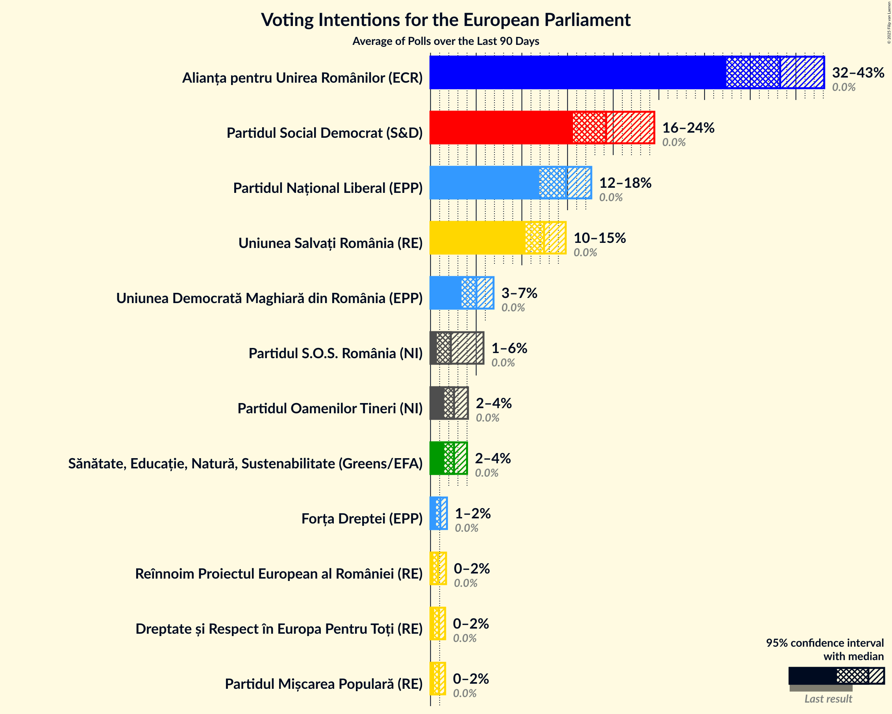

# Overview

The table below lists the most recent polls (less than 90 days old) registered and analyzed so far.

| Period     | Polling firm/Commissioner(s) | PNL | PSD | A2020 | PRO | PMP | UDMR | ALDE | PLUS | USR |
|:----------:|:----------------------------:|:--:|:--:|:--:|:--:|:--:|:--:|:--:|:--:|:--:|
| 26 May 2019 | General Election | 27.0%   10 | 22.5%   9 | 22.4%   8 | 6.4%   2 | 5.8%   2 | 5.3%   2 | 4.1%   0 | 22.4%   4 | 22.4%   4 |
| N/A | [Poll Average](average.html) | 28–35%   10–14 | 19–25%   7–10 | 15–26%   6–10 | 1–13%   0–5 | 3–9%   0–3 | 1–6%   0–2 | 3–7%   0–2 | N/A   N/A | N/A   N/A |
| [8–27 May 2020](2020-05-27-IMAS.html) | IMAS   Europa FM | 30–36%   11–14 | 21–26%   8–10 | 15–19%   5–7 | 9–13%   3–5 | 3–5%   0–1 | 4–7%   0–2 | 3–6%   0–2 | N/A   N/A | N/A   N/A |
| [15–26 May 2020](2020-05-26-Avangarde.html) | Avangarde | N/A   N/A | N/A   N/A | N/A   N/A | N/A   N/A | N/A   N/A | N/A   N/A | N/A   N/A | N/A   N/A | N/A   N/A |
| [15–20 May 2020](2020-05-20-INSCOP.html) | INSCOP | 29–34%   11–13 | 20–24%   7–9 | 18–23%   6–8 | 0–2%   0 | 6–10%   2–3 | 3–6%   0–2 | 3–6%   0–2 | N/A   N/A | N/A   N/A |
| [1–7 May 2020](2020-05-07-BCS.html) | BCS | 28–32%   10–12 | 18–22%   7–8 | 23–27%   8–10 | 3–5%   0 | 4–6%   0–2 | 1–2%   0 | 5–7%   0–2 | N/A   N/A | N/A   N/A |
| 26 May 2019 | General Election | 27.0%   10 | 22.5%   9 | 22.4%   8 | 6.4%   2 | 5.8%   2 | 5.3%   2 | 4.1%   0 | 22.4%   4 | 22.4%   4 |

Only polls for which at least the sample size has been published are included in the table above.

**Legend:**
+ **Top half of each row:** Voting intentions (95% confidence interval)
+ **Bottom half of each row:** Seat projections for the European Parliament (95% confidence interval)
+ **PNL:** Partidul Național Liberal (EPP)
+ **PSD:** Partidul Social Democrat (S&D)
+ **A2020:** Alianța 2020 USR-PLUS (RE)
+ **PRO:** PRO România (S&D)
+ **PMP:** Partidul Mișcarea Populară (EPP)
+ **UDMR:** Uniunea Democrată Maghiară din România (EPP)
+ **ALDE:** Partidul Alianța Liberalilor și Democraților (*)
+ **PLUS:** Partidul Libertății, Unității și Solidarității (RE)
+ **USR:** Uniunea Salvați România (RE)
+ **N/A (single party):** Party not included the published results
+ **N/A (entire row):** Calculation for this opinion poll not started yet

