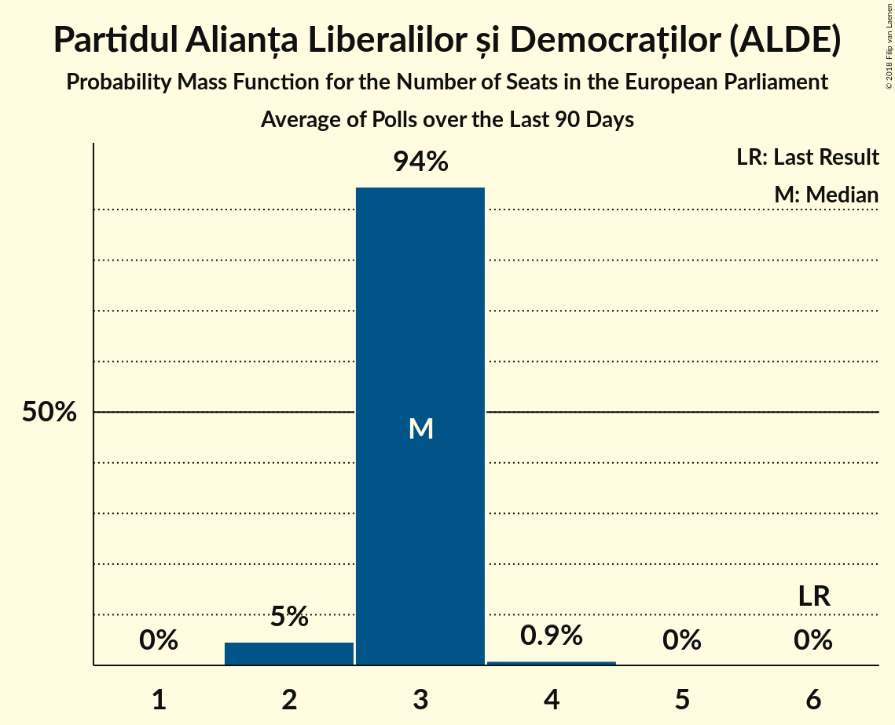

# Partidul Alianța Liberalilor și Democraților (ALDE)

<a href="#voting-intentions">Voting Intentions</a> | <a href="#seats">Seats</a>

## Voting Intentions

Last result: **15.0%** (General Election of 25 May 2014)

### Confidence Intervals

| Period     | Polling firm/Commissioner(s) | Median | 80% Confidence Interval | 90% Confidence Interval | 95% Confidence Interval | 99% Confidence Interval |
|:----------:|:----------------:|:-----------:|:-----------------------:|:-----------------------:|:-----------------------:|:-----------------------:|
| N/A | [Poll Average](average.html) | 9.8% | 7.9–12.5% | 7.5–13.1% | 7.2–13.6% | 6.6–14.4% |
| [5–28 April 2019](2019-04-28-CURS.html) | CURS   STIRIPESURSE.RO | 10.0% | 9.1–11.1% | 8.8–11.4% | 8.6–11.6% | 8.2–12.2% |
| [12–25 April 2019](2019-04-25-IMAS.html) | IMAS   Europa FM | 12.2% | 10.9–13.6% | 10.6–14.0% | 10.3–14.3% | 9.7–15.1% |
| [18 March–3 April 2019](2019-04-03-IMAS.html) | IMAS   Europa FM | 12.8% | 11.5–14.2% | 11.2–14.6% | 10.9–15.0% | 10.3–15.7% |
| [12–25 March 2019](2019-03-25-CURS.html) | CURS   STIRIPESURSE.RO | 10.0% | 8.5–10.8% | 8.2–11.2% | 7.9–11.5% | 7.5–12.1% |
| [15–20 March 2019](2019-03-20-BCS.html) | BCS   PSnews.ro | 8.1% | 7.2–9.3% | 6.9–9.6% | 6.7–9.9% | 6.2–10.4% |
| [5–13 March 2019](2019-03-13-INSCOP.html) | INSCOP   Konrad-Adenauer-Stiftung | 9.3% | 8.2–10.6% | 7.9–10.9% | 7.7–11.2% | 7.2–11.8% |
| [13–28 February 2019](2019-02-28-CURS.html) | CURS   STIRIPESURSE.RO | 12.1% | N/A | N/A | N/A | N/A |
| [1–21 February 2019](2019-02-21-IMAS.html) | IMAS   Europa FM | 12.5% | N/A | N/A | N/A | N/A |
| [21 January–6 February 2019](2019-02-06-CURS.html) | CURS   STIRIPESURSE.RO | 9.0% | N/A | N/A | N/A | N/A |
| [21 January–5 February 2019](2019-02-05-INSCOP.html) | INSCOP   Konrad-Adenauer-Stiftung | 9.2% | N/A | N/A | N/A | N/A |
| [11–30 January 2019](2019-01-30-IMAS.html) | IMAS   Europa FM | 13.0% | N/A | N/A | N/A | N/A |
| [4–20 December 2018](2018-12-20-IMAS.html) | IMAS   Europa FM | 9.6% | N/A | N/A | N/A | N/A |
| [24 November–9 December 2018](2018-12-09-CURS.html) | CURS   STIRIPESURSE.RO | 9.0% | N/A | N/A | N/A | N/A |
| [1–30 November 2018](2018-11-30-IMAS.html) | IMAS   Europa FM | 11.7% | N/A | N/A | N/A | N/A |
| [26 October–12 November 2018](2018-11-12-CURS.html) | CURS   STIRIPESURSE.RO | 15.0% | N/A | N/A | N/A | N/A |
| [1–31 October 2018](2018-10-31-IMAS.html) | IMAS   Europa FM | 10.6% | N/A | N/A | N/A | N/A |
| [3–4 October 2018](2018-10-04-Sociopol.html) | Sociopol | 10.0% | N/A | N/A | N/A | N/A |
| [20 September–1 October 2018](2018-10-01-CURS.html) | CURS   STIRIPESURSE.RO | 9.0% | N/A | N/A | N/A | N/A |
| [1–30 September 2018](2018-09-30-IMAS.html) | IMAS   Europa FM | 11.4% | N/A | N/A | N/A | N/A |
| [22–27 September 2018](2018-09-27-Sociopol.html) | Sociopol | 11.0% | N/A | N/A | N/A | N/A |
| [7–20 August 2018](2018-08-20-Sociopol.html) | Sociopol | 10.0% | N/A | N/A | N/A | N/A |
| [23 June–1 July 2018](2018-07-01-CURS.html) | CURS   STIRIPESURSE.RO | 8.1% | N/A | N/A | N/A | N/A |
| [1–30 June 2018](2018-06-30-IMAS.html) | IMAS | 8.6% | N/A | N/A | N/A | N/A |
| [22–26 June 2018](2018-06-26-Sociopol.html) | Sociopol   România TV | 12.0% | N/A | N/A | N/A | N/A |
| [28 May–8 June 2018](2018-06-08-Sociopol.html) | Sociopol   România TV | 7.0% | N/A | N/A | N/A | N/A |
| [27 April–8 May 2018](2018-05-08-CURS.html) | CURS   STIRIPESURSE.RO | 8.0% | N/A | N/A | N/A | N/A |
| [1–31 March 2018](2018-03-31-CURS.html) | CURS   STIRIPESURSE.RO | 12.0% | N/A | N/A | N/A | N/A |
| [27 February–5 March 2018](2018-03-05-Sociopol.html) | Sociopol   STIRIPESURSE.RO | 5.0% | 4.2–6.0% | 4.0–6.3% | 3.8–6.5% | 3.5–7.1% |
| [1–28 February 2018](2018-02-28-IMAS.html) | IMAS | 10.6% | 9.4–11.9% | 9.1–12.3% | 8.8–12.7% | 8.3–13.3% |
| [3–10 January 2018](2018-01-10-CURS.html) | CURS   STIRIPESURSE.RO | 8.6% | 8.0–10.2% | 7.7–10.6% | 7.4–10.9% | 7.0–11.5% |
| [24 November–7 December 2017](2017-12-07-Avangarde.html) | Avangarde | 13.0% | 11.5–14.8% | 11.1–15.3% | 10.7–15.7% | 10.0–16.6% |
| [1–30 November 2017](2017-11-30-CURS.html) | CURS   STIRIPESURSE.RO | 9.0% | 8.0–10.2% | 7.7–10.6% | 7.4–10.9% | 7.0–11.5% |
| [1–30 September 2017](2017-09-30-IMAS.html) | IMAS | 8.1% | 7.1–9.3% | 6.8–9.7% | 6.6–10.0% | 6.1–10.6% |
| [28 August–14 September 2017](2017-09-14-Sociopol.html) | Sociopol | 6.0% | 5.1–7.0% | 4.9–7.3% | 4.7–7.6% | 4.3–8.2% |
| [15–22 June 2017](2017-06-22-Avangarde.html) | Avangarde | 6.0% | 5.0–7.3% | 4.8–7.6% | 4.6–7.9% | 4.1–8.6% |
| [1–30 April 2017](2017-04-30-IMAS.html) | IMAS | 8.5% | N/A | N/A | N/A | N/A |
| [6–14 March 2017](2017-03-14-Sociopol.html) | Sociopol | 6.0% | 5.1–7.0% | 4.9–7.3% | 4.6–7.6% | 4.3–8.1% |
| [1–31 January 2017](2017-01-31-IMAS.html) | IMAS | 6.8% | N/A | N/A | N/A | N/A |

### Probability Mass Function

The following table shows the probability mass function per percentage block of voting intentions for the [poll average](average.html) for Partidul Alianța Liberalilor și Democraților (ALDE).

| Voting Intentions | Probability | Accumulated | Special Marks |
|:-----------------:|:-----------:|:-----------:|:-------------:|
| 4.5–5.5% | 0% | 100% |  |
| 5.5–6.5% | 0.4% | 100% |  |
| 6.5–7.5% | 5% | 99.6% |  |
| 7.5–8.5% | 16% | 94% |  |
| 8.5–9.5% | 23% | 78% |  |
| 9.5–10.5% | 22% | 55% | Median |
| 10.5–11.5% | 13% | 33% |  |
| 11.5–12.5% | 10% | 20% |  |
| 12.5–13.5% | 7% | 10% |  |
| 13.5–14.5% | 2% | 3% |  |
| 14.5–15.5% | 0.4% | 0.4% | Last Result |
| 15.5–16.5% | 0% | 0% |  |

## Seats

Last result: **6** seats (General Election of 25 May 2014)

### Confidence Intervals

| Period     | Polling firm/Commissioner(s) | Median | 80% Confidence Interval | 90% Confidence Interval | 95% Confidence Interval | 99% Confidence Interval |
|:----------:|:----------------:|:------:|:-----------------------:|:-----------------------:|:-----------------------:|:-----------------------:|
| N/A | [Poll Average](average.html) | 3 | 2–4 | 2–4 | 2–4 | 2–5 |
| [5–28 April 2019](2019-04-28-CURS.html) | CURS   STIRIPESURSE.RO | 3 | 3–4 | 3–4 | 3–4 | 3–4 |
| [12–25 April 2019](2019-04-25-IMAS.html) | IMAS   Europa FM | 4 | 3–4 | 3–5 | 3–5 | 3–5 |
| [18 March–3 April 2019](2019-04-03-IMAS.html) | IMAS   Europa FM | 4 | 4–5 | 4–5 | 3–5 | 3–5 |
| [12–25 March 2019](2019-03-25-CURS.html) | CURS   STIRIPESURSE.RO | 3 | 3–4 | 3–4 | 2–4 | 2–4 |
| [15–20 March 2019](2019-03-20-BCS.html) | BCS   PSnews.ro | 3 | 2–3 | 2–3 | 2–3 | 2–3 |
| [5–13 March 2019](2019-03-13-INSCOP.html) | INSCOP   Konrad-Adenauer-Stiftung | 3 | 3–4 | 3–4 | 2–4 | 2–4 |
| [13–28 February 2019](2019-02-28-CURS.html) | CURS   STIRIPESURSE.RO |  |  |  |  |  |
| [1–21 February 2019](2019-02-21-IMAS.html) | IMAS   Europa FM |  |  |  |  |  |
| [21 January–6 February 2019](2019-02-06-CURS.html) | CURS   STIRIPESURSE.RO |  |  |  |  |  |
| [21 January–5 February 2019](2019-02-05-INSCOP.html) | INSCOP   Konrad-Adenauer-Stiftung |  |  |  |  |  |
| [11–30 January 2019](2019-01-30-IMAS.html) | IMAS   Europa FM |  |  |  |  |  |
| [4–20 December 2018](2018-12-20-IMAS.html) | IMAS   Europa FM |  |  |  |  |  |
| [24 November–9 December 2018](2018-12-09-CURS.html) | CURS   STIRIPESURSE.RO |  |  |  |  |  |
| [1–30 November 2018](2018-11-30-IMAS.html) | IMAS   Europa FM |  |  |  |  |  |
| [26 October–12 November 2018](2018-11-12-CURS.html) | CURS   STIRIPESURSE.RO |  |  |  |  |  |
| [1–31 October 2018](2018-10-31-IMAS.html) | IMAS   Europa FM |  |  |  |  |  |
| [3–4 October 2018](2018-10-04-Sociopol.html) | Sociopol |  |  |  |  |  |
| [20 September–1 October 2018](2018-10-01-CURS.html) | CURS   STIRIPESURSE.RO |  |  |  |  |  |
| [1–30 September 2018](2018-09-30-IMAS.html) | IMAS   Europa FM |  |  |  |  |  |
| [22–27 September 2018](2018-09-27-Sociopol.html) | Sociopol |  |  |  |  |  |
| [7–20 August 2018](2018-08-20-Sociopol.html) | Sociopol |  |  |  |  |  |
| [23 June–1 July 2018](2018-07-01-CURS.html) | CURS   STIRIPESURSE.RO |  |  |  |  |  |
| [1–30 June 2018](2018-06-30-IMAS.html) | IMAS |  |  |  |  |  |
| [22–26 June 2018](2018-06-26-Sociopol.html) | Sociopol   România TV |  |  |  |  |  |
| [28 May–8 June 2018](2018-06-08-Sociopol.html) | Sociopol   România TV |  |  |  |  |  |
| [27 April–8 May 2018](2018-05-08-CURS.html) | CURS   STIRIPESURSE.RO |  |  |  |  |  |
| [1–31 March 2018](2018-03-31-CURS.html) | CURS   STIRIPESURSE.RO |  |  |  |  |  |
| [27 February–5 March 2018](2018-03-05-Sociopol.html) | Sociopol   STIRIPESURSE.RO | 0 | 0–2 | 0–2 | 0–2 | 0–2 |
| [1–28 February 2018](2018-02-28-IMAS.html) | IMAS | 3 | 3–4 | 3–4 | 3–4 | 2–4 |
| [3–10 January 2018](2018-01-10-CURS.html) | CURS   STIRIPESURSE.RO | 3 | 2–3 | 2–3 | 2–4 | 2–4 |
| [24 November–7 December 2017](2017-12-07-Avangarde.html) | Avangarde | 4 | 4–5 | 4–5 | 3–6 | 3–6 |
| [1–30 November 2017](2017-11-30-CURS.html) | CURS   STIRIPESURSE.RO | 3 | 2–3 | 2–3 | 2–4 | 2–4 |
| [1–30 September 2017](2017-09-30-IMAS.html) | IMAS | 2 | 2–3 | 2–3 | 2–3 | 2–3 |
| [28 August–14 September 2017](2017-09-14-Sociopol.html) | Sociopol | 2 | 1–2 | 0–2 | 0–2 | 0–3 |
| [15–22 June 2017](2017-06-22-Avangarde.html) | Avangarde | 2 | 1–2 | 0–2 | 0–2 | 0–3 |
| [1–30 April 2017](2017-04-30-IMAS.html) | IMAS |  |  |  |  |  |
| [6–14 March 2017](2017-03-14-Sociopol.html) | Sociopol | 2 | 1–2 | 0–2 | 0–2 | 0–2 |
| [1–31 January 2017](2017-01-31-IMAS.html) | IMAS |  |  |  |  |  |

### Probability Mass Function

The following table shows the probability mass function per seat for the [poll average](average.html) for Partidul Alianța Liberalilor și Democraților (ALDE).

| Number of Seats | Probability | Accumulated | Special Marks |
|:---------------:|:-----------:|:-----------:|:-------------:|
| 2 | 11% | 100% |  |
| 3 | 59% | 89% | Median |
| 4 | 28% | 30% |  |
| 5 | 2% | 2% |  |
| 6 | 0% | 0% | Last Result |

