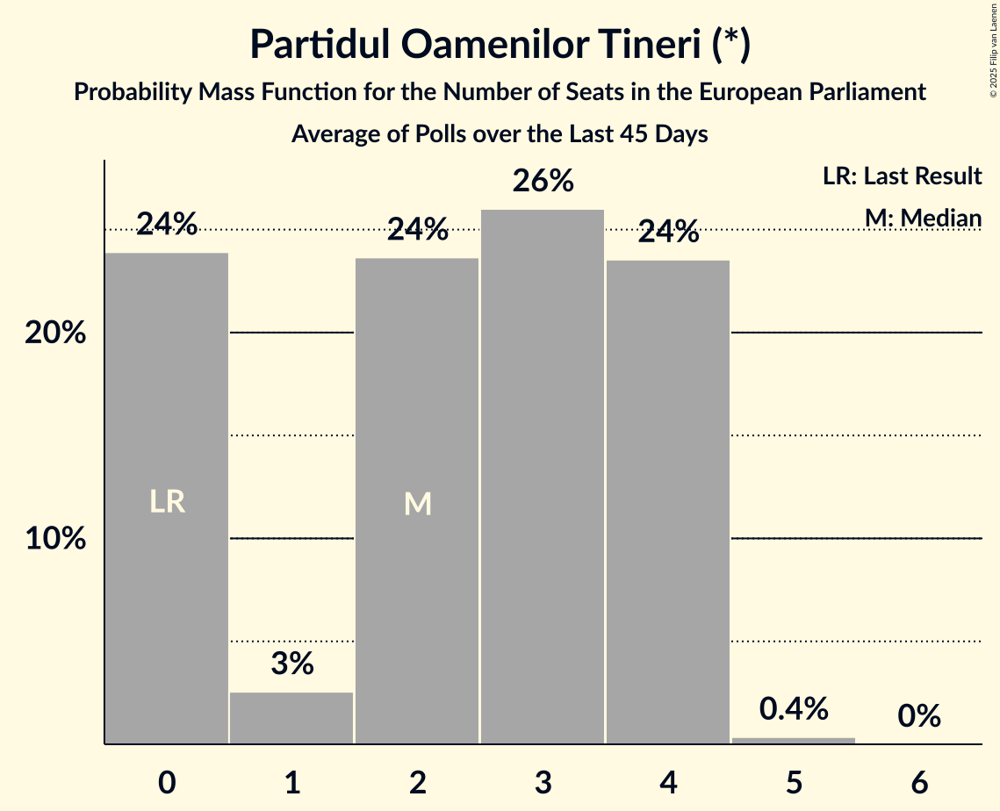

# Partidul Oamenilor Tineri (*)

<a href="#voting-intentions">Voting Intentions</a> | <a href="#seats">Seats</a>

## Voting Intentions

Last result: **0.0%** (General Election of 9 June 2024)

### Confidence Intervals

| Period     | Polling firm/Commissioner(s) | Median | 80% Confidence Interval | 90% Confidence Interval | 95% Confidence Interval | 99% Confidence Interval |
|:----------:|:----------------:|:-----------:|:-----------------------:|:-----------------------:|:-----------------------:|:-----------------------:|
| N/A | [Poll Average](average.html) | 7.0% | 5.8–10.5% | 5.7–11.0% | 5.6–11.4% | 5.3–12.1% |
| [24–28 March 2025](2025-03-28-Verifield.html) | Verifield | 7.0% | 6.1–8.1% | 5.9–8.4% | 5.6–8.7% | 5.2–9.2% |
| [14–16 February 2025](2025-02-16-FlashData.html) | FlashData | 6.0% | 5.6–6.4% | 5.5–6.5% | 5.5–6.6% | 5.3–6.8% |
| [21–25 January 2025](2025-01-25-CURS.html) | CURS | 10.0% | 8.9–11.3% | 8.6–11.6% | 8.4–11.9% | 7.9–12.5% |
| [10–16 January 2025](2025-01-16-Avangarde.html) | Avangarde | 5.0% | 4.3–5.9% | 4.1–6.1% | 4.0–6.3% | 3.7–6.8% |
| [26–28 November 2024](2024-11-28-AtlasIntel.html) | Atlas Intel   HotNews | 4.6% | 4.0–5.2% | 3.9–5.4% | 3.8–5.6% | 3.5–5.9% |
| [9–13 November 2024](2024-11-13-CIRA.html) | CIRA   Newsweek | 0.0% | N/A | N/A | N/A | N/A |
| [7–12 November 2024](2024-11-12-INSCOP.html) | INSCOP   Libertatea | 0.0% | N/A | N/A | N/A | N/A |
| [30 October–5 November 2024](2024-11-05-CURS.html) | CURS | 0.0% | N/A | N/A | N/A | N/A |
| [24–28 October 2024](2024-10-28-BCS.html) | BCS   Newsweek | 0.0% | N/A | N/A | N/A | N/A |
| [11–18 October 2024](2024-10-18-INSCOP.html) | INSCOP   Libertatea | 0.0% | N/A | N/A | N/A | N/A |
| [11–16 October 2024](2024-10-16-CURS.html) | CURS | 0.0% | N/A | N/A | N/A | N/A |
| [11–16 September 2024](2024-09-16-INSCOP.html) | INSCOP   Institutul pentru Libertate și Democrație | 0.0% | N/A | N/A | N/A | N/A |
| [13–27 August 2024](2024-08-27-CURS.html) | CURS | 0.0% | N/A | N/A | N/A | N/A |
| [19–27 June 2024](2024-06-27-INSCOP.html) | INSCOP   News.ro | 0.0% | N/A | N/A | N/A | N/A |

### Probability Mass Function

The following table shows the probability mass function per percentage block of voting intentions for the [poll average](average.html) for Partidul Oamenilor Tineri (*).

| Voting Intentions | Probability | Accumulated | Special Marks |
|:-----------------:|:-----------:|:-----------:|:-------------:|
| 0.0–0.5% | 0% | 100% | Last Result |
| 0.5–1.5% | 0% | 100% |  |
| 1.5–2.5% | 0% | 100% |  |
| 2.5–3.5% | 0% | 100% |  |
| 3.5–4.5% | 0% | 100% |  |
| 4.5–5.5% | 2% | 100% |  |
| 5.5–6.5% | 38% | 98% |  |
| 6.5–7.5% | 17% | 59% | Median |
| 7.5–8.5% | 9% | 42% |  |
| 8.5–9.5% | 9% | 33% |  |
| 9.5–10.5% | 14% | 24% |  |
| 10.5–11.5% | 8% | 10% |  |
| 11.5–12.5% | 2% | 2% |  |
| 12.5–13.5% | 0.2% | 0.2% |  |
| 13.5–14.5% | 0% | 0% |  |

## Seats

Last result: **0** seats (General Election of 9 June 2024)

### Confidence Intervals

| Period     | Polling firm/Commissioner(s) | Median | 80% Confidence Interval | 90% Confidence Interval | 95% Confidence Interval | 99% Confidence Interval |
|:----------:|:----------------:|:------:|:-----------------------:|:-----------------------:|:-----------------------:|:-----------------------:|
| N/A | [Poll Average](average.html) | 2 | 2–4 | 2–4 | 2–4 | 2–4 |
| [24–28 March 2025](2025-03-28-Verifield.html) | Verifield | 2 | 2–3 | 2–3 | 2–3 | 2–3 |
| [14–16 February 2025](2025-02-16-FlashData.html) | FlashData | 2 | 2 | 2 | 2–3 | 2–3 |
| [21–25 January 2025](2025-01-25-CURS.html) | CURS | 3 | 3–4 | 3–4 | 3–4 | 3–5 |
| [10–16 January 2025](2025-01-16-Avangarde.html) | Avangarde | 1 | 0–2 | 0–2 | 0–2 | 0–2 |
| [26–28 November 2024](2024-11-28-AtlasIntel.html) | Atlas Intel   HotNews | 0 | 0–2 | 0–2 | 0–2 | 0–2 |
| [9–13 November 2024](2024-11-13-CIRA.html) | CIRA   Newsweek |  |  |  |  |  |
| [7–12 November 2024](2024-11-12-INSCOP.html) | INSCOP   Libertatea |  |  |  |  |  |
| [30 October–5 November 2024](2024-11-05-CURS.html) | CURS |  |  |  |  |  |
| [24–28 October 2024](2024-10-28-BCS.html) | BCS   Newsweek |  |  |  |  |  |
| [11–18 October 2024](2024-10-18-INSCOP.html) | INSCOP   Libertatea |  |  |  |  |  |
| [11–16 October 2024](2024-10-16-CURS.html) | CURS |  |  |  |  |  |
| [11–16 September 2024](2024-09-16-INSCOP.html) | INSCOP   Institutul pentru Libertate și Democrație |  |  |  |  |  |
| [13–27 August 2024](2024-08-27-CURS.html) | CURS |  |  |  |  |  |
| [19–27 June 2024](2024-06-27-INSCOP.html) | INSCOP   News.ro |  |  |  |  |  |

### Probability Mass Function

The following table shows the probability mass function per seat for the [poll average](average.html) for Partidul Oamenilor Tineri (*).

| Number of Seats | Probability | Accumulated | Special Marks |
|:---------------:|:-----------:|:-----------:|:-------------:|
| 0 | 0.1% | 100% | Last Result |
| 1 | 0% | 99.9% |  |
| 2 | 61% | 99.9% | Median |
| 3 | 24% | 39% |  |
| 4 | 16% | 16% |  |
| 5 | 0.2% | 0.2% |  |
| 6 | 0% | 0% |  |

