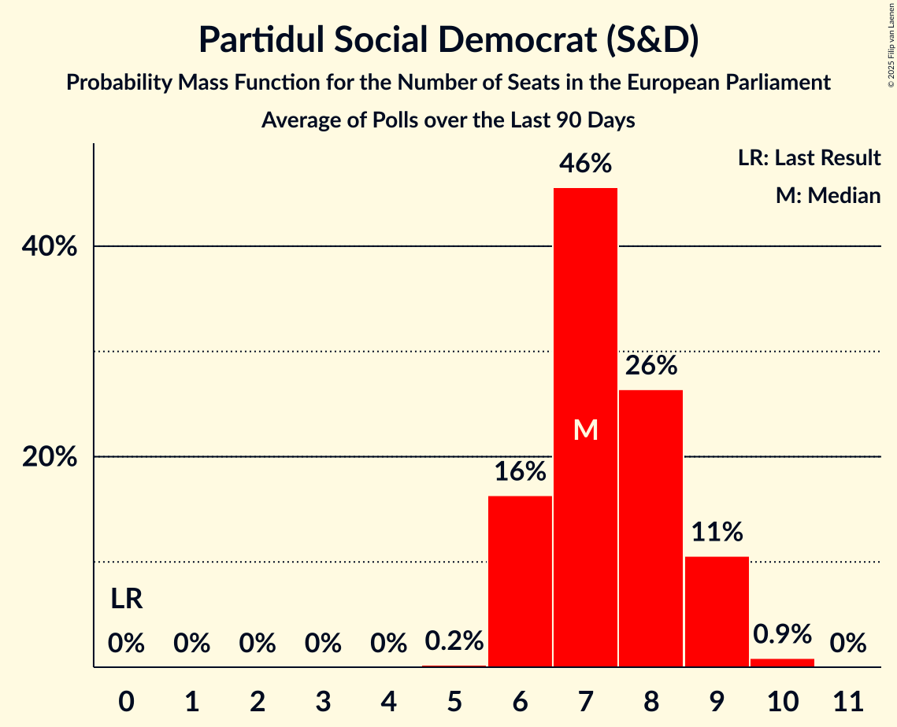

# Partidul Social Democrat (S&D)

<a href="#voting-intentions">Voting Intentions</a> | <a href="#seats">Seats</a>

## Voting Intentions

Last result: **37.6%** (General Election of 25 May 2014)

### Confidence Intervals

| Period     | Polling firm/Commissioner(s) | Median | 80% Confidence Interval | 90% Confidence Interval | 95% Confidence Interval | 99% Confidence Interval |
|:----------:|:----------------:|:-----------:|:-----------------------:|:-----------------------:|:-----------------------:|:-----------------------:|
| N/A | [Poll Average](average.html) | 29.0% | 24.4–33.0% | 23.9–33.6% | 23.4–34.0% | 22.5–34.8% |
| [2–20 May 2019](2019-05-20-IMAS.html) | IMAS   Europa FM | 21.1% | N/A | N/A | N/A | N/A |
| [14–19 May 2019](2019-05-19-Novel.html) | Novel   PNL | 28.1% | N/A | N/A | N/A | N/A |
| [12 April–3 May 2019](2019-05-03-INSCOP.html) | INSCOP   Konrad-Adenauer-Stiftung | 25.5% | 23.9–27.3% | 23.4–27.8% | 23.0–28.3% | 22.2–29.1% |
| [5–28 April 2019](2019-04-28-CURS.html) | CURS   STIRIPESURSE.RO | 32.0% | 30.5–33.6% | 30.1–34.0% | 29.7–34.4% | 29.0–35.2% |
| [12–25 April 2019](2019-04-25-IMAS.html) | IMAS   Europa FM | 22.0% | 20.4–23.7% | 19.9–24.2% | 19.5–24.6% | 18.8–25.5% |
| [18 March–3 April 2019](2019-04-03-IMAS.html) | IMAS   Europa FM | 21.3% | 19.7–23.0% | 19.3–23.5% | 18.9–23.9% | 18.1–24.8% |
| [12–25 March 2019](2019-03-25-CURS.html) | CURS   STIRIPESURSE.RO | 31.0% | 27.8–31.4% | 27.3–31.9% | 26.9–32.3% | 26.0–33.2% |
| [15–20 March 2019](2019-03-20-BCS.html) | BCS   PSnews.ro | 26.5% | 24.9–28.2% | 24.4–28.7% | 24.0–29.1% | 23.2–30.0% |
| [5–13 March 2019](2019-03-13-INSCOP.html) | INSCOP   Konrad-Adenauer-Stiftung | 26.9% | 25.2–28.7% | 24.7–29.2% | 24.3–29.6% | 23.5–30.5% |
| [13–28 February 2019](2019-02-28-CURS.html) | CURS   STIRIPESURSE.RO | 31.3% | N/A | N/A | N/A | N/A |
| [1–21 February 2019](2019-02-21-IMAS.html) | IMAS   Europa FM | 22.7% | N/A | N/A | N/A | N/A |
| [21 January–6 February 2019](2019-02-06-CURS.html) | CURS   STIRIPESURSE.RO | 32.0% | N/A | N/A | N/A | N/A |
| [21 January–5 February 2019](2019-02-05-INSCOP.html) | INSCOP   Konrad-Adenauer-Stiftung | 27.8% | N/A | N/A | N/A | N/A |
| [11–30 January 2019](2019-01-30-IMAS.html) | IMAS   Europa FM | 24.6% | N/A | N/A | N/A | N/A |
| [4–20 December 2018](2018-12-20-IMAS.html) | IMAS   Europa FM | 25.2% | N/A | N/A | N/A | N/A |
| [24 November–9 December 2018](2018-12-09-CURS.html) | CURS   STIRIPESURSE.RO | 33.0% | N/A | N/A | N/A | N/A |
| [1–30 November 2018](2018-11-30-IMAS.html) | IMAS   Europa FM | 24.9% | N/A | N/A | N/A | N/A |
| [26 October–12 November 2018](2018-11-12-CURS.html) | CURS   STIRIPESURSE.RO | 38.0% | N/A | N/A | N/A | N/A |
| [1–31 October 2018](2018-10-31-IMAS.html) | IMAS   Europa FM | 27.6% | N/A | N/A | N/A | N/A |
| [3–4 October 2018](2018-10-04-Sociopol.html) | Sociopol | 38.0% | N/A | N/A | N/A | N/A |
| [20 September–1 October 2018](2018-10-01-CURS.html) | CURS   STIRIPESURSE.RO | 37.0% | N/A | N/A | N/A | N/A |
| [1–30 September 2018](2018-09-30-IMAS.html) | IMAS   Europa FM | 28.1% | N/A | N/A | N/A | N/A |
| [22–27 September 2018](2018-09-27-Sociopol.html) | Sociopol | 36.0% | N/A | N/A | N/A | N/A |
| [7–20 August 2018](2018-08-20-Sociopol.html) | Sociopol | 35.0% | N/A | N/A | N/A | N/A |
| [23 June–1 July 2018](2018-07-01-CURS.html) | CURS   STIRIPESURSE.RO | 37.4% | N/A | N/A | N/A | N/A |
| [1–30 June 2018](2018-06-30-IMAS.html) | IMAS | 28.4% | N/A | N/A | N/A | N/A |
| [22–26 June 2018](2018-06-26-Sociopol.html) | Sociopol   România TV | 41.0% | N/A | N/A | N/A | N/A |
| [28 May–8 June 2018](2018-06-08-Sociopol.html) | Sociopol   România TV | 40.0% | N/A | N/A | N/A | N/A |
| [27 April–8 May 2018](2018-05-08-CURS.html) | CURS   STIRIPESURSE.RO | 39.0% | N/A | N/A | N/A | N/A |
| [1–31 March 2018](2018-03-31-CURS.html) | CURS   STIRIPESURSE.RO | 39.0% | N/A | N/A | N/A | N/A |
| [27 February–5 March 2018](2018-03-05-Sociopol.html) | Sociopol   STIRIPESURSE.RO | 34.0% | 32.1–36.0% | 31.6–36.5% | 31.1–37.0% | 30.2–38.0% |
| [1–28 February 2018](2018-02-28-IMAS.html) | IMAS | 28.6% | 26.8–30.5% | 26.3–31.0% | 25.9–31.5% | 25.1–32.4% |
| [3–10 January 2018](2018-01-10-CURS.html) | CURS   STIRIPESURSE.RO | 40.4% | 40.1–44.0% | 39.6–44.6% | 39.1–45.0% | 38.2–46.0% |
| [24 November–7 December 2017](2017-12-07-Avangarde.html) | Avangarde | 46.0% | 43.6–48.4% | 42.9–49.1% | 42.3–49.7% | 41.2–50.9% |
| [1–30 November 2017](2017-11-30-CURS.html) | CURS   STIRIPESURSE.RO | 43.0% | 41.1–45.0% | 40.5–45.5% | 40.1–46.0% | 39.2–47.0% |
| [1–30 September 2017](2017-09-30-IMAS.html) | IMAS | 38.8% | 36.9–40.8% | 36.3–41.4% | 35.8–41.9% | 34.9–42.8% |
| [28 August–14 September 2017](2017-09-14-Sociopol.html) | Sociopol | 51.0% | 49.0–53.1% | 48.4–53.6% | 47.9–54.1% | 47.0–55.1% |
| [15–22 June 2017](2017-06-22-Avangarde.html) | Avangarde | 46.0% | 43.7–48.3% | 43.0–48.9% | 42.5–49.5% | 41.4–50.6% |
| [1–30 April 2017](2017-04-30-IMAS.html) | IMAS | 40.6% | N/A | N/A | N/A | N/A |
| [6–14 March 2017](2017-03-14-Sociopol.html) | Sociopol | 47.0% | 45.0–49.0% | 44.4–49.6% | 43.9–50.1% | 42.9–51.0% |
| [1–31 January 2017](2017-01-31-IMAS.html) | IMAS | 49.0% | N/A | N/A | N/A | N/A |

### Probability Mass Function

The following table shows the probability mass function per percentage block of voting intentions for the [poll average](average.html) for Partidul Social Democrat (S&D).

| Voting Intentions | Probability | Accumulated | Special Marks |
|:-----------------:|:-----------:|:-----------:|:-------------:|
| 20.5–21.5% | 0% | 100% |  |
| 21.5–22.5% | 0.5% | 100% |  |
| 22.5–23.5% | 3% | 99.5% |  |
| 23.5–24.5% | 8% | 97% |  |
| 24.5–25.5% | 14% | 89% |  |
| 25.5–26.5% | 14% | 75% |  |
| 26.5–27.5% | 8% | 62% |  |
| 27.5–28.5% | 3% | 54% |  |
| 28.5–29.5% | 2% | 51% | Median |
| 29.5–30.5% | 5% | 49% |  |
| 30.5–31.5% | 12% | 45% |  |
| 31.5–32.5% | 16% | 33% |  |
| 32.5–33.5% | 11% | 16% |  |
| 33.5–34.5% | 4% | 5% |  |
| 34.5–35.5% | 0.8% | 0.9% |  |
| 35.5–36.5% | 0.1% | 0.1% |  |
| 36.5–37.5% | 0% | 0% |  |
| 37.5–38.5% | 0% | 0% | Last Result |

## Seats

Last result: **16** seats (General Election of 25 May 2014)

### Confidence Intervals

| Period     | Polling firm/Commissioner(s) | Median | 80% Confidence Interval | 90% Confidence Interval | 95% Confidence Interval | 99% Confidence Interval |
|:----------:|:----------------:|:------:|:-----------------------:|:-----------------------:|:-----------------------:|:-----------------------:|
| N/A | [Poll Average](average.html) | 10 | 9–12 | 9–12 | 8–12 | 8–13 |
| [2–20 May 2019](2019-05-20-IMAS.html) | IMAS   Europa FM |  |  |  |  |  |
| [14–19 May 2019](2019-05-19-Novel.html) | Novel   PNL |  |  |  |  |  |
| [12 April–3 May 2019](2019-05-03-INSCOP.html) | INSCOP   Konrad-Adenauer-Stiftung | 9 | 9–10 | 8–10 | 8–10 | 8–11 |
| [5–28 April 2019](2019-04-28-CURS.html) | CURS   STIRIPESURSE.RO | 11 | 11–12 | 10–12 | 10–13 | 10–13 |
| [12–25 April 2019](2019-04-25-IMAS.html) | IMAS   Europa FM | 7 | 7–8 | 7–8 | 6–9 | 6–9 |
| [18 March–3 April 2019](2019-04-03-IMAS.html) | IMAS   Europa FM | 7 | 7–8 | 7–8 | 6–9 | 6–9 |
| [12–25 March 2019](2019-03-25-CURS.html) | CURS   STIRIPESURSE.RO | 11 | 10–11 | 10–12 | 9–12 | 9–12 |
| [15–20 March 2019](2019-03-20-BCS.html) | BCS   PSnews.ro | 10 | 9–10 | 9–10 | 8–11 | 8–11 |
| [5–13 March 2019](2019-03-13-INSCOP.html) | INSCOP   Konrad-Adenauer-Stiftung | 10 | 9–11 | 9–11 | 9–11 | 8–11 |
| [13–28 February 2019](2019-02-28-CURS.html) | CURS   STIRIPESURSE.RO |  |  |  |  |  |
| [1–21 February 2019](2019-02-21-IMAS.html) | IMAS   Europa FM |  |  |  |  |  |
| [21 January–6 February 2019](2019-02-06-CURS.html) | CURS   STIRIPESURSE.RO |  |  |  |  |  |
| [21 January–5 February 2019](2019-02-05-INSCOP.html) | INSCOP   Konrad-Adenauer-Stiftung |  |  |  |  |  |
| [11–30 January 2019](2019-01-30-IMAS.html) | IMAS   Europa FM |  |  |  |  |  |
| [4–20 December 2018](2018-12-20-IMAS.html) | IMAS   Europa FM |  |  |  |  |  |
| [24 November–9 December 2018](2018-12-09-CURS.html) | CURS   STIRIPESURSE.RO |  |  |  |  |  |
| [1–30 November 2018](2018-11-30-IMAS.html) | IMAS   Europa FM |  |  |  |  |  |
| [26 October–12 November 2018](2018-11-12-CURS.html) | CURS   STIRIPESURSE.RO |  |  |  |  |  |
| [1–31 October 2018](2018-10-31-IMAS.html) | IMAS   Europa FM |  |  |  |  |  |
| [3–4 October 2018](2018-10-04-Sociopol.html) | Sociopol |  |  |  |  |  |
| [20 September–1 October 2018](2018-10-01-CURS.html) | CURS   STIRIPESURSE.RO |  |  |  |  |  |
| [1–30 September 2018](2018-09-30-IMAS.html) | IMAS   Europa FM |  |  |  |  |  |
| [22–27 September 2018](2018-09-27-Sociopol.html) | Sociopol |  |  |  |  |  |
| [7–20 August 2018](2018-08-20-Sociopol.html) | Sociopol |  |  |  |  |  |
| [23 June–1 July 2018](2018-07-01-CURS.html) | CURS   STIRIPESURSE.RO |  |  |  |  |  |
| [1–30 June 2018](2018-06-30-IMAS.html) | IMAS |  |  |  |  |  |
| [22–26 June 2018](2018-06-26-Sociopol.html) | Sociopol   România TV |  |  |  |  |  |
| [28 May–8 June 2018](2018-06-08-Sociopol.html) | Sociopol   România TV |  |  |  |  |  |
| [27 April–8 May 2018](2018-05-08-CURS.html) | CURS   STIRIPESURSE.RO |  |  |  |  |  |
| [1–31 March 2018](2018-03-31-CURS.html) | CURS   STIRIPESURSE.RO |  |  |  |  |  |
| [27 February–5 March 2018](2018-03-05-Sociopol.html) | Sociopol   STIRIPESURSE.RO | 12 | 11–13 | 11–13 | 11–14 | 10–14 |
| [1–28 February 2018](2018-02-28-IMAS.html) | IMAS | 10 | 9–11 | 9–11 | 9–11 | 8–11 |
| [3–10 January 2018](2018-01-10-CURS.html) | CURS   STIRIPESURSE.RO | 15 | 14–16 | 14–16 | 13–16 | 13–17 |
| [24 November–7 December 2017](2017-12-07-Avangarde.html) | Avangarde | 17 | 16–18 | 15–19 | 15–19 | 15–19 |
| [1–30 November 2017](2017-11-30-CURS.html) | CURS   STIRIPESURSE.RO | 15 | 14–16 | 14–17 | 14–17 | 14–17 |
| [1–30 September 2017](2017-09-30-IMAS.html) | IMAS | 14 | 13–15 | 13–15 | 12–15 | 12–16 |
| [28 August–14 September 2017](2017-09-14-Sociopol.html) | Sociopol | 18 | 18–19 | 17–20 | 17–20 | 17–21 |
| [15–22 June 2017](2017-06-22-Avangarde.html) | Avangarde | 16 | 15–17 | 15–18 | 15–18 | 14–18 |
| [1–30 April 2017](2017-04-30-IMAS.html) | IMAS |  |  |  |  |  |
| [6–14 March 2017](2017-03-14-Sociopol.html) | Sociopol | 17 | 16–18 | 15–18 | 15–18 | 15–19 |
| [1–31 January 2017](2017-01-31-IMAS.html) | IMAS |  |  |  |  |  |

### Probability Mass Function

The following table shows the probability mass function per seat for the [poll average](average.html) for Partidul Social Democrat (S&D).

| Number of Seats | Probability | Accumulated | Special Marks |
|:---------------:|:-----------:|:-----------:|:-------------:|
| 8 | 4% | 100% |  |
| 9 | 27% | 96% |  |
| 10 | 20% | 68% | Median |
| 11 | 25% | 49% |  |
| 12 | 21% | 23% |  |
| 13 | 2% | 2% |  |
| 14 | 0% | 0% |  |
| 15 | 0% | 0% |  |
| 16 | 0% | 0% | Last Result |

