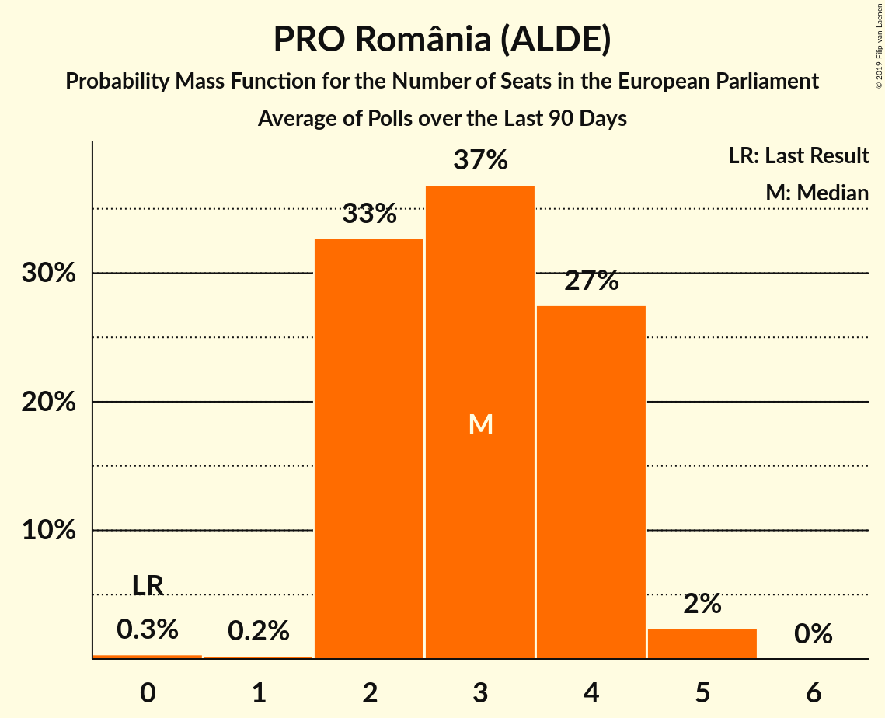

# PRO România (ALDE)

<a href="#voting-intentions">Voting Intentions</a> | <a href="#seats">Seats</a>

## Voting Intentions

Last result: **0.0%** (General Election of 25 May 2014)

### Confidence Intervals

| Period     | Polling firm/Commissioner(s) | Median | 80% Confidence Interval | 90% Confidence Interval | 95% Confidence Interval | 99% Confidence Interval |
|:----------:|:----------------:|:-----------:|:-----------------------:|:-----------------------:|:-----------------------:|:-----------------------:|
| N/A | [Poll Average](average.html) | 9.0% | 6.2–14.0% | 5.9–14.5% | 5.6–15.0% | 5.1–15.9% |
| [1–21 February 2019](2019-02-21-IMAS.html) | IMAS | 13.4% | 12.1–14.8% | 11.7–15.2% | 11.4–15.6% | 10.8–16.3% |
| [21 January–6 February 2019](2019-02-06-CURS.html) | CURS   STIRIPESURSE.RO | 9.0% | 8.0–10.2% | 7.7–10.6% | 7.4–10.9% | 7.0–11.5% |
| [21 January–5 February 2019](2019-02-05-INSCOP.html) | INSCOP   Konrad-Adenauer-Stiftung | 6.6% | 5.7–7.7% | 5.4–8.0% | 5.2–8.2% | 4.8–8.8% |
| [11–30 January 2019](2019-01-30-IMAS.html) | IMAS | 9.0% | 7.9–10.3% | 7.6–10.6% | 7.4–10.9% | 6.9–11.6% |
| [4–20 December 2018](2018-12-20-IMAS.html) | IMAS | 6.2% | 5.3–7.3% | 5.1–7.6% | 4.9–7.9% | 4.5–8.5% |
| [24 November–9 December 2018](2018-12-09-CURS.html) | CURS   STIRIPESURSE.RO | 9.0% | 8.0–10.2% | 7.7–10.6% | 7.4–10.9% | 7.0–11.5% |
| [1–30 November 2018](2018-11-30-IMAS.html) | IMAS | 0.0% | N/A | N/A | N/A | N/A |
| [26 October–12 November 2018](2018-11-12-CURS.html) | CURS   STIRIPESURSE.RO | 9.0% | 8.0–10.2% | 7.7–10.6% | 7.4–10.9% | 7.0–11.5% |
| [1–31 October 2018](2018-10-31-IMAS.html) | IMAS | 0.0% | N/A | N/A | N/A | N/A |
| [3–4 October 2018](2018-10-04-Sociopol.html) | Sociopol | 5.0% | 4.2–6.1% | 4.0–6.4% | 3.8–6.7% | 3.4–7.3% |
| [20 September–1 October 2018](2018-10-01-CURS.html) | CURS   STIRIPESURSE.RO | 6.0% | 5.2–7.0% | 4.9–7.3% | 4.7–7.6% | 4.3–8.1% |
| [1–30 September 2018](2018-09-30-IMAS.html) | IMAS | 0.0% | N/A | N/A | N/A | N/A |
| [22–27 September 2018](2018-09-27-Sociopol.html) | Sociopol | 7.0% | 6.0–8.1% | 5.8–8.4% | 5.5–8.7% | 5.1–9.3% |
| [7–20 August 2018](2018-08-20-Sociopol.html) | Sociopol | 3.0% | 2.4–3.8% | 2.2–4.0% | 2.1–4.2% | 1.8–4.7% |
| [23 June–1 July 2018](2018-07-01-CURS.html) | CURS   STIRIPESURSE.RO | 5.1% | 4.3–6.0% | 4.1–6.3% | 3.9–6.6% | 3.6–7.0% |
| [1–30 June 2018](2018-06-30-IMAS.html) | IMAS | 0.0% | N/A | N/A | N/A | N/A |
| [22–26 June 2018](2018-06-26-Sociopol.html) | Sociopol   România TV | 5.0% | 4.2–6.1% | 4.0–6.4% | 3.8–6.6% | 3.4–7.2% |
| [28 May–8 June 2018](2018-06-08-Sociopol.html) | Sociopol   România TV | 3.0% | 2.4–3.8% | 2.2–4.0% | 2.1–4.3% | 1.8–4.7% |
| [27 April–8 May 2018](2018-05-08-CURS.html) | CURS   STIRIPESURSE.RO | 3.0% | 2.4–3.8% | 2.3–4.0% | 2.1–4.2% | 1.9–4.6% |
| [1–31 March 2018](2018-03-31-CURS.html) | CURS   STIRIPESURSE.RO | 0.0% | N/A | N/A | N/A | N/A |
| [27 February–5 March 2018](2018-03-05-Sociopol.html) | Sociopol   STIRIPESURSE.RO | 0.0% | N/A | N/A | N/A | N/A |
| [1–28 February 2018](2018-02-28-IMAS.html) | IMAS | 0.0% | N/A | N/A | N/A | N/A |
| [3–10 January 2018](2018-01-10-CURS.html) | CURS   STIRIPESURSE.RO | 2.0% | 1.5–2.6% | 1.4–2.8% | 1.3–3.0% | 1.1–3.4% |
| [24 November–7 December 2017](2017-12-07-Avangarde.html) | Avangarde | 0.0% | N/A | N/A | N/A | N/A |
| [1–30 November 2017](2017-11-30-CURS.html) | CURS   STIRIPESURSE.RO | 0.0% | N/A | N/A | N/A | N/A |
| [1–30 September 2017](2017-09-30-IMAS.html) | IMAS | 0.0% | N/A | N/A | N/A | N/A |
| [28 August–14 September 2017](2017-09-14-Sociopol.html) | Sociopol | 0.0% | N/A | N/A | N/A | N/A |
| [15–22 June 2017](2017-06-22-Avangarde.html) | Avangarde | 0.0% | N/A | N/A | N/A | N/A |
| [1–30 April 2017](2017-04-30-IMAS.html) | IMAS | 0.0% | N/A | N/A | N/A | N/A |
| [6–14 March 2017](2017-03-14-Sociopol.html) | Sociopol | 0.0% | N/A | N/A | N/A | N/A |
| [1–31 January 2017](2017-01-31-IMAS.html) | IMAS | 0.0% | N/A | N/A | N/A | N/A |

### Probability Mass Function

The following table shows the probability mass function per percentage block of voting intentions for the [poll average](average.html) for PRO România (ALDE).

| Voting Intentions | Probability | Accumulated | Special Marks |
|:-----------------:|:-----------:|:-----------:|:-------------:|
| 0.0–0.5% | 0% | 100% | Last Result |
| 0.5–1.5% | 0% | 100% |  |
| 1.5–2.5% | 0% | 100% |  |
| 2.5–3.5% | 0% | 100% |  |
| 3.5–4.5% | 0% | 100% |  |
| 4.5–5.5% | 2% | 100% |  |
| 5.5–6.5% | 13% | 98% |  |
| 6.5–7.5% | 15% | 85% |  |
| 7.5–8.5% | 12% | 70% |  |
| 8.5–9.5% | 15% | 58% | Median |
| 9.5–10.5% | 8% | 43% |  |
| 10.5–11.5% | 3% | 35% |  |
| 11.5–12.5% | 6% | 32% |  |
| 12.5–13.5% | 12% | 27% |  |
| 13.5–14.5% | 10% | 15% |  |
| 14.5–15.5% | 4% | 5% |  |
| 15.5–16.5% | 0.8% | 0.9% |  |
| 16.5–17.5% | 0.1% | 0.1% |  |
| 17.5–18.5% | 0% | 0% |  |

## Seats

Last result: **0** seats (General Election of 25 May 2014)

### Confidence Intervals

| Period     | Polling firm/Commissioner(s) | Median | 80% Confidence Interval | 90% Confidence Interval | 95% Confidence Interval | 99% Confidence Interval |
|:----------:|:----------------:|:------:|:-----------------------:|:-----------------------:|:-----------------------:|:-----------------------:|
| N/A | [Poll Average](average.html) | 3 | 2–5 | 2–5 | 2–5 | 1–6 |
| [1–21 February 2019](2019-02-21-IMAS.html) | IMAS | 5 | 4–5 | 4–5 | 4–6 | 4–6 |
| [21 January–6 February 2019](2019-02-06-CURS.html) | CURS   STIRIPESURSE.RO | 3 | 3 | 2–4 | 2–4 | 2–4 |
| [21 January–5 February 2019](2019-02-05-INSCOP.html) | INSCOP   Konrad-Adenauer-Stiftung | 2 | 2–3 | 2–3 | 2–3 | 0–3 |
| [11–30 January 2019](2019-01-30-IMAS.html) | IMAS | 3 | 2–3 | 2–3 | 2–4 | 2–4 |
| [4–20 December 2018](2018-12-20-IMAS.html) | IMAS | 2 | 2 | 1–2 | 1–2 | 0–3 |
| [24 November–9 December 2018](2018-12-09-CURS.html) | CURS   STIRIPESURSE.RO | 3 | 3 | 2–3 | 2–4 | 2–4 |
| [1–30 November 2018](2018-11-30-IMAS.html) | IMAS |  |  |  |  |  |
| [26 October–12 November 2018](2018-11-12-CURS.html) | CURS   STIRIPESURSE.RO | 3 | 3 | 2–3 | 2–3 | 2–4 |
| [1–31 October 2018](2018-10-31-IMAS.html) | IMAS |  |  |  |  |  |
| [3–4 October 2018](2018-10-04-Sociopol.html) | Sociopol | 1 | 0–2 | 0–2 | 0–2 | 0–2 |
| [20 September–1 October 2018](2018-10-01-CURS.html) | CURS   STIRIPESURSE.RO | 2 | 2 | 0–2 | 0–2 | 0–3 |
| [1–30 September 2018](2018-09-30-IMAS.html) | IMAS |  |  |  |  |  |
| [22–27 September 2018](2018-09-27-Sociopol.html) | Sociopol | 2 | 2–3 | 2–3 | 2–3 | 1–3 |
| [7–20 August 2018](2018-08-20-Sociopol.html) | Sociopol | 0 | 0 | 0 | 0 | 0 |
| [23 June–1 July 2018](2018-07-01-CURS.html) | CURS   STIRIPESURSE.RO | 1 | 0–2 | 0–2 | 0–2 | 0–2 |
| [1–30 June 2018](2018-06-30-IMAS.html) | IMAS |  |  |  |  |  |
| [22–26 June 2018](2018-06-26-Sociopol.html) | Sociopol   România TV | 1 | 0–2 | 0–2 | 0–2 | 0–2 |
| [28 May–8 June 2018](2018-06-08-Sociopol.html) | Sociopol   România TV | 0 | 0 | 0 | 0 | 0 |
| [27 April–8 May 2018](2018-05-08-CURS.html) | CURS   STIRIPESURSE.RO | 0 | 0 | 0 | 0 | 0 |
| [1–31 March 2018](2018-03-31-CURS.html) | CURS   STIRIPESURSE.RO |  |  |  |  |  |
| [27 February–5 March 2018](2018-03-05-Sociopol.html) | Sociopol   STIRIPESURSE.RO |  |  |  |  |  |
| [1–28 February 2018](2018-02-28-IMAS.html) | IMAS |  |  |  |  |  |
| [3–10 January 2018](2018-01-10-CURS.html) | CURS   STIRIPESURSE.RO | 0 | 0 | 0 | 0 | 0 |
| [24 November–7 December 2017](2017-12-07-Avangarde.html) | Avangarde |  |  |  |  |  |
| [1–30 November 2017](2017-11-30-CURS.html) | CURS   STIRIPESURSE.RO |  |  |  |  |  |
| [1–30 September 2017](2017-09-30-IMAS.html) | IMAS |  |  |  |  |  |
| [28 August–14 September 2017](2017-09-14-Sociopol.html) | Sociopol |  |  |  |  |  |
| [15–22 June 2017](2017-06-22-Avangarde.html) | Avangarde |  |  |  |  |  |
| [1–30 April 2017](2017-04-30-IMAS.html) | IMAS |  |  |  |  |  |
| [6–14 March 2017](2017-03-14-Sociopol.html) | Sociopol |  |  |  |  |  |
| [1–31 January 2017](2017-01-31-IMAS.html) | IMAS |  |  |  |  |  |

### Probability Mass Function

The following table shows the probability mass function per seat for the [poll average](average.html) for PRO România (ALDE).

| Number of Seats | Probability | Accumulated | Special Marks |
|:---------------:|:-----------:|:-----------:|:-------------:|
| 0 | 0.3% | 100% | Last Result |
| 1 | 0.2% | 99.7% |  |
| 2 | 33% | 99.4% |  |
| 3 | 31% | 67% | Median |
| 4 | 14% | 35% |  |
| 5 | 20% | 21% |  |
| 6 | 1.3% | 1.3% |  |
| 7 | 0% | 0% |  |

