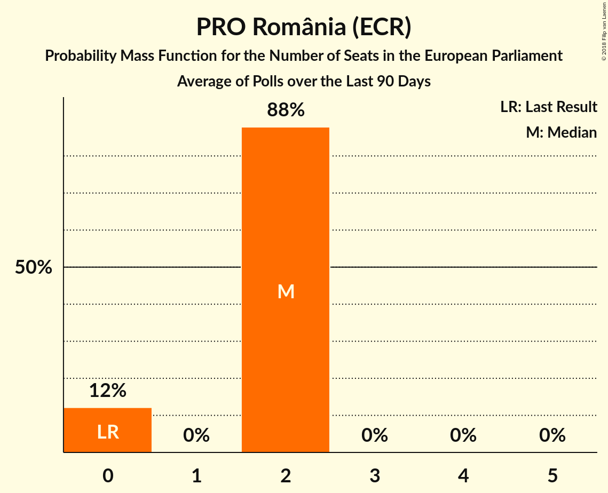

# PRO România (ECR)

<a href="#voting-intentions">Voting Intentions</a> | <a href="#seats">Seats</a>

## Voting Intentions

Last result: **0.0%** (General Election of 25 May 2014)

### Confidence Intervals

| Period     | Polling firm/Commissioner(s) | Median | 80% Confidence Interval | 90% Confidence Interval | 95% Confidence Interval | 99% Confidence Interval |
|:----------:|:----------------:|:-----------:|:-----------------------:|:-----------------------:|:-----------------------:|:-----------------------:|
| N/A | [Poll Average](average.html) | 5.1% | 4.2–6.0% | 4.0–6.3% | 3.8–6.6% | 3.5–7.1% |
| [23 June–1 July 2018](2018-07-01-CURS.html) | CURS   STIRIPESURSE.RO | 5.1% | 4.3–6.0% | 4.1–6.3% | 3.9–6.6% | 3.6–7.0% |
| [1–30 June 2018](2018-06-30-IMAS.html) | IMAS | 0.0% | N/A | N/A | N/A | N/A |
| [22–26 June 2018](2018-06-26-Sociopol.html) | Sociopol   România TV | 5.0% | 4.2–6.1% | 4.0–6.4% | 3.8–6.6% | 3.4–7.2% |
| [28 May–8 June 2018](2018-06-08-Sociopol.html) | Sociopol   România TV | 3.0% | 2.4–3.8% | 2.2–4.0% | 2.1–4.3% | 1.8–4.7% |
| [27 April–8 May 2018](2018-05-08-CURS.html) | CURS   STIRIPESURSE.RO | 3.0% | 2.4–3.8% | 2.3–4.0% | 2.1–4.2% | 1.9–4.6% |
| [27 February–5 March 2018](2018-03-05-Sociopol.html) | Sociopol   STIRIPESURSE.RO | 0.0% | N/A | N/A | N/A | N/A |
| [1–28 February 2018](2018-02-28-IMAS.html) | IMAS | 0.0% | N/A | N/A | N/A | N/A |
| [3–10 January 2018](2018-01-10-CURS.html) | CURS   STIRIPESURSE.RO | 2.0% | 1.5–2.6% | 1.4–2.8% | 1.3–3.0% | 1.1–3.4% |
| [24 November–7 December 2017](2017-12-07-Avangarde.html) | Avangarde | 0.0% | N/A | N/A | N/A | N/A |
| [1–30 November 2017](2017-11-30-CURS.html) | CURS   STIRIPESURSE.RO | 0.0% | N/A | N/A | N/A | N/A |
| [1–30 September 2017](2017-09-30-IMAS.html) | IMAS | 0.0% | N/A | N/A | N/A | N/A |
| [28 August–14 September 2017](2017-09-14-Sociopol.html) | Sociopol | 0.0% | N/A | N/A | N/A | N/A |
| [15–22 June 2017](2017-06-22-Avangarde.html) | Avangarde | 0.0% | N/A | N/A | N/A | N/A |
| [6–14 March 2017](2017-03-14-Sociopol.html) | Sociopol | 0.0% | N/A | N/A | N/A | N/A |

### Probability Mass Function

The following table shows the probability mass function per percentage block of voting intentions for the [poll average](average.html) for PRO România (ECR).

| Voting Intentions | Probability | Accumulated | Special Marks |
|:-----------------:|:-----------:|:-----------:|:-------------:|
| 0.0–0.5% | 0% | 100% | Last Result |
| 0.5–1.5% | 0% | 100% |  |
| 1.5–2.5% | 0% | 100% |  |
| 2.5–3.5% | 0.7% | 100% |  |
| 3.5–4.5% | 20% | 99.3% |  |
| 4.5–5.5% | 52% | 79% | Median |
| 5.5–6.5% | 24% | 27% |  |
| 6.5–7.5% | 3% | 3% |  |
| 7.5–8.5% | 0.1% | 0.1% |  |
| 8.5–9.5% | 0% | 0% |  |

## Seats

Last result: **0** seats (General Election of 25 May 2014)

### Confidence Intervals

| Period     | Polling firm/Commissioner(s) | Median | 80% Confidence Interval | 90% Confidence Interval | 95% Confidence Interval | 99% Confidence Interval |
|:----------:|:----------------:|:------:|:-----------------------:|:-----------------------:|:-----------------------:|:-----------------------:|
| N/A | [Poll Average](average.html) | 1 | 0–2 | 0–2 | 0–2 | 0–2 |
| [23 June–1 July 2018](2018-07-01-CURS.html) | CURS   STIRIPESURSE.RO | 1 | 0–2 | 0–2 | 0–2 | 0–2 |
| [1–30 June 2018](2018-06-30-IMAS.html) | IMAS |  |  |  |  |  |
| [22–26 June 2018](2018-06-26-Sociopol.html) | Sociopol   România TV | 1 | 0–2 | 0–2 | 0–2 | 0–2 |
| [28 May–8 June 2018](2018-06-08-Sociopol.html) | Sociopol   România TV | 0 | 0 | 0 | 0 | 0 |
| [27 April–8 May 2018](2018-05-08-CURS.html) | CURS   STIRIPESURSE.RO | 0 | 0 | 0 | 0 | 0 |
| [27 February–5 March 2018](2018-03-05-Sociopol.html) | Sociopol   STIRIPESURSE.RO |  |  |  |  |  |
| [1–28 February 2018](2018-02-28-IMAS.html) | IMAS |  |  |  |  |  |
| [3–10 January 2018](2018-01-10-CURS.html) | CURS   STIRIPESURSE.RO | 0 | 0 | 0 | 0 | 0 |
| [24 November–7 December 2017](2017-12-07-Avangarde.html) | Avangarde |  |  |  |  |  |
| [1–30 November 2017](2017-11-30-CURS.html) | CURS   STIRIPESURSE.RO |  |  |  |  |  |
| [1–30 September 2017](2017-09-30-IMAS.html) | IMAS |  |  |  |  |  |
| [28 August–14 September 2017](2017-09-14-Sociopol.html) | Sociopol |  |  |  |  |  |
| [15–22 June 2017](2017-06-22-Avangarde.html) | Avangarde |  |  |  |  |  |
| [6–14 March 2017](2017-03-14-Sociopol.html) | Sociopol |  |  |  |  |  |

### Probability Mass Function

The following table shows the probability mass function per seat for the [poll average](average.html) for PRO România (ECR).

| Number of Seats | Probability | Accumulated | Special Marks |
|:---------------:|:-----------:|:-----------:|:-------------:|
| 0 | 46% | 100% | Last Result |
| 1 | 12% | 54% | Median |
| 2 | 42% | 42% |  |
| 3 | 0.2% | 0.2% |  |
| 4 | 0% | 0% |  |

