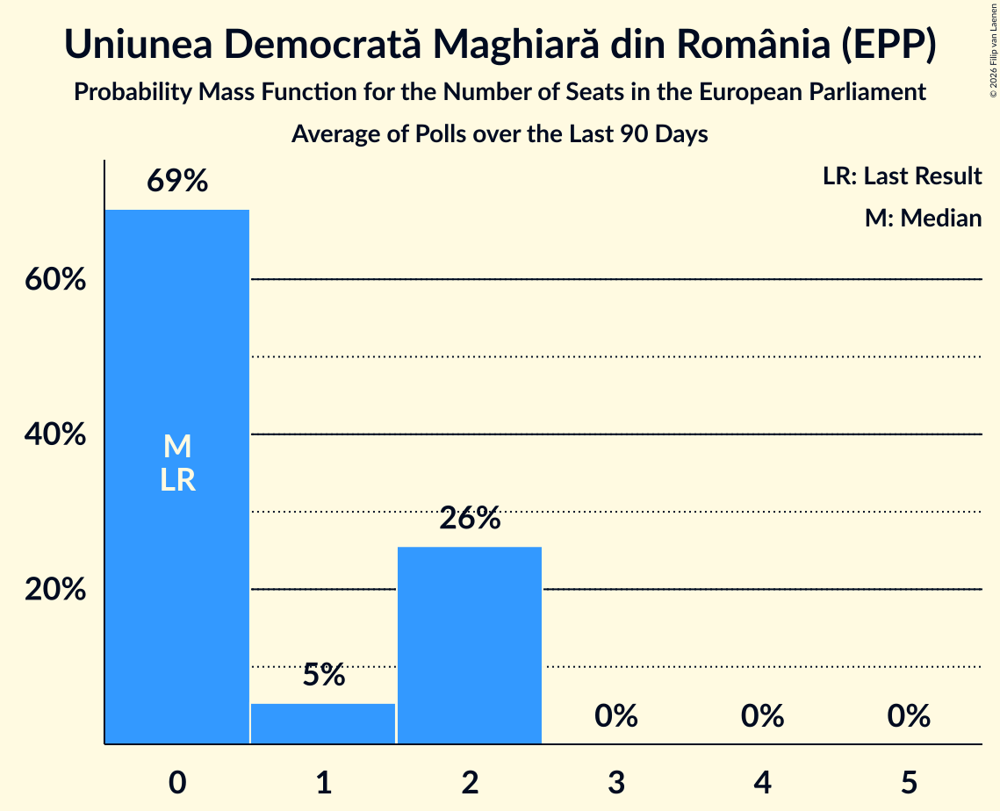

# Uniunea Democrată Maghiară din România (EPP)

<a href="#voting-intentions">Voting Intentions</a> | <a href="#seats">Seats</a>

## Voting Intentions

Last result: **5.3%** (General Election of 26 May 2019)

### Confidence Intervals

| Period     | Polling firm/Commissioner(s) | Median | 80% Confidence Interval | 90% Confidence Interval | 95% Confidence Interval | 99% Confidence Interval |
|:----------:|:----------------:|:-----------:|:-----------------------:|:-----------------------:|:-----------------------:|:-----------------------:|
| N/A | [Poll Average](average.html) | 4.9% | 3.8–6.1% | 3.5–6.5% | 3.4–6.8% | 3.1–7.3% |
| [5–28 September 2019](2019-09-28-IMAS.html) | IMAS   Europa FM | 5.5% | 4.7–6.6% | 4.5–6.9% | 4.3–7.1% | 3.9–7.7% |
| [16–20 September 2019](2019-09-20-SocioData.html) | Socio Data | 5.0% | 4.2–5.9% | 4.0–6.2% | 3.8–6.4% | 3.5–6.9% |
| [5–28 August 2019](2019-08-28-IMAS.html) | IMAS   Europa FM | 4.6% | 3.8–5.5% | 3.6–5.8% | 3.4–6.0% | 3.1–6.5% |
| [19 July–5 August 2019](2019-08-05-CURS.html) | CURS   STIRIPESURSE.RO | 4.0% | 3.4–4.7% | 3.3–4.9% | 3.1–5.1% | 2.9–5.4% |
| [15 July–2 August 2019](2019-08-02-IMAS.html) | IMAS   Europa FM | 4.2% | 3.4–5.1% | 3.2–5.3% | 3.1–5.6% | 2.8–6.1% |
| [28 June–8 July 2019](2019-07-08-CURS.html) | CURS   STIRIPESURSE.RO | 4.0% | 3.4–4.9% | 3.2–5.2% | 3.0–5.4% | 2.7–5.9% |
| [7–26 June 2019](2019-06-26-IMAS.html) | IMAS   Europa FM | 2.5% | 2.0–3.2% | 1.8–3.4% | 1.7–3.6% | 1.5–4.0% |

### Probability Mass Function

The following table shows the probability mass function per percentage block of voting intentions for the [poll average](average.html) for Uniunea Democrată Maghiară din România (EPP).

| Voting Intentions | Probability | Accumulated | Special Marks |
|:-----------------:|:-----------:|:-----------:|:-------------:|
| 1.5–2.5% | 0% | 100% |  |
| 2.5–3.5% | 5% | 100% |  |
| 3.5–4.5% | 33% | 95% |  |
| 4.5–5.5% | 37% | 62% | Last Result, Median |
| 5.5–6.5% | 21% | 25% |  |
| 6.5–7.5% | 4% | 4% |  |
| 7.5–8.5% | 0.3% | 0.3% |  |
| 8.5–9.5% | 0% | 0% |  |

## Seats

Last result: **2** seats (General Election of 26 May 2019)

### Confidence Intervals

| Period     | Polling firm/Commissioner(s) | Median | 80% Confidence Interval | 90% Confidence Interval | 95% Confidence Interval | 99% Confidence Interval |
|:----------:|:----------------:|:------:|:-----------------------:|:-----------------------:|:-----------------------:|:-----------------------:|
| N/A | [Poll Average](average.html) | 0 | 0–2 | 0–2 | 0–2 | 0–2 |
| [5–28 September 2019](2019-09-28-IMAS.html) | IMAS   Europa FM | 2 | 0–2 | 0–2 | 0–2 | 0–2 |
| [16–20 September 2019](2019-09-20-SocioData.html) | Socio Data | 0 | 0–2 | 0–2 | 0–2 | 0–2 |
| [5–28 August 2019](2019-08-28-IMAS.html) | IMAS   Europa FM | 0 | 0–2 | 0–2 | 0–2 | 0–2 |
| [19 July–5 August 2019](2019-08-05-CURS.html) | CURS   STIRIPESURSE.RO | 0 | 0 | 0 | 0–1 | 0–2 |
| [15 July–2 August 2019](2019-08-02-IMAS.html) | IMAS   Europa FM | 0 | 0–1 | 0–2 | 0–2 | 0–2 |
| [28 June–8 July 2019](2019-07-08-CURS.html) | CURS   STIRIPESURSE.RO | 0 | 0 | 0 | 0–2 | 0–2 |
| [7–26 June 2019](2019-06-26-IMAS.html) | IMAS   Europa FM | 0 | 0 | 0 | 0 | 0 |

### Probability Mass Function

The following table shows the probability mass function per seat for the [poll average](average.html) for Uniunea Democrată Maghiară din România (EPP).

| Number of Seats | Probability | Accumulated | Special Marks |
|:---------------:|:-----------:|:-----------:|:-------------:|
| 0 | 63% | 100% | Median |
| 1 | 10% | 37% |  |
| 2 | 27% | 27% | Last Result |
| 3 | 0% | 0% |  |

