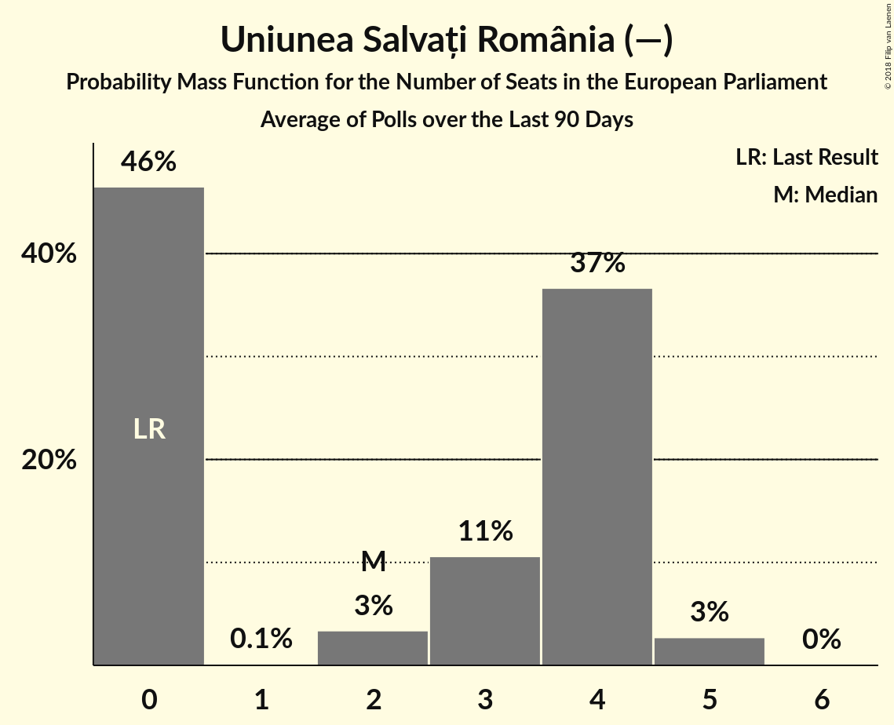

# Uniunea Salvați România (—)

<a href="#voting-intentions">Voting Intentions</a> | <a href="#seats">Seats</a>

## Voting Intentions

Last result: **0.0%** (General Election of 25 May 2014)

### Confidence Intervals

| Period     | Polling firm/Commissioner(s) | Median | 80% Confidence Interval | 90% Confidence Interval | 95% Confidence Interval | 99% Confidence Interval |
|:----------:|:----------------:|:-----------:|:-----------------------:|:-----------------------:|:-----------------------:|:-----------------------:|
| N/A | [Poll Average](average.html) | 8.3% | 4.4–12.6% | 4.2–13.1% | 3.9–13.5% | 3.5–14.3% |
| [27 February–5 March 2018](2018-03-05-Sociopol.html) | Sociopol | 12.0% | 10.8–13.4% | 10.4–13.8% | 10.1–14.2% | 9.6–14.9% |
| [1–28 February 2018](2018-02-28-IMAS.html) | IMAS | 11.2% | 10.0–12.6% | 9.7–13.0% | 9.4–13.3% | 8.8–14.0% |
| [3–10 January 2018](2018-01-10-CURS.html) | CURS   STIRIPESURSE.RO | 5.0% | 4.2–5.9% | 4.0–6.2% | 3.8–6.4% | 3.5–6.9% |
| [24 November–7 December 2017](2017-12-07-Avangarde.html) | Avangarde | 5.0% | 4.1–6.2% | 3.8–6.6% | 3.6–6.9% | 3.2–7.5% |
| [1–30 November 2017](2017-11-30-CURS.html) | CURS   STIRIPESURSE.RO | 5.0% | 4.2–5.9% | 4.0–6.2% | 3.8–6.4% | 3.5–6.9% |
| [1–30 September 2017](2017-09-30-IMAS.html) | IMAS | 6.8% | 5.9–7.9% | 5.6–8.3% | 5.4–8.5% | 5.0–9.1% |
| [28 August–14 September 2017](2017-09-14-Sociopol.html) | Sociopol | 7.0% | 6.0–8.1% | 5.8–8.4% | 5.5–8.7% | 5.1–9.3% |
| [15–22 June 2017](2017-06-22-Avangarde.html) | Avangarde | 9.0% | 7.8–10.4% | 7.4–10.8% | 7.1–11.2% | 6.6–11.9% |
| [6–14 March 2017](2017-03-14-Sociopol.html) | Sociopol | 12.0% | 10.8–13.4% | 10.4–13.8% | 10.2–14.2% | 9.6–14.9% |

### Probability Mass Function

The following table shows the probability mass function per percentage block of voting intentions for the [poll average](average.html) for Uniunea Salvați România (—).

| Voting Intentions | Probability | Accumulated | Special Marks |
|:-----------------:|:-----------:|:-----------:|:-------------:|
| 0.0–0.5% | 0% | 100% | Last Result |
| 0.5–1.5% | 0% | 100% |  |
| 1.5–2.5% | 0% | 100% |  |
| 2.5–3.5% | 0.7% | 100% |  |
| 3.5–4.5% | 12% | 99.3% |  |
| 4.5–5.5% | 25% | 88% |  |
| 5.5–6.5% | 11% | 63% |  |
| 6.5–7.5% | 2% | 52% |  |
| 7.5–8.5% | 0.2% | 50% | Median |
| 8.5–9.5% | 1.0% | 50% |  |
| 9.5–10.5% | 7% | 49% |  |
| 10.5–11.5% | 16% | 42% |  |
| 11.5–12.5% | 16% | 27% |  |
| 12.5–13.5% | 8% | 10% |  |
| 13.5–14.5% | 2% | 2% |  |
| 14.5–15.5% | 0.3% | 0.3% |  |
| 15.5–16.5% | 0% | 0% |  |

## Seats

Last result: **0** seats (General Election of 25 May 2014)

### Confidence Intervals

| Period     | Polling firm/Commissioner(s) | Median | 80% Confidence Interval | 90% Confidence Interval | 95% Confidence Interval | 99% Confidence Interval |
|:----------:|:----------------:|:------:|:-----------------------:|:-----------------------:|:-----------------------:|:-----------------------:|
| N/A | [Poll Average](average.html) | 3 | 0–4 | 0–4 | 0–5 | 0–5 |
| [27 February–5 March 2018](2018-03-05-Sociopol.html) | Sociopol | 4 | 3–5 | 3–5 | 3–5 | 3–5 |
| [1–28 February 2018](2018-02-28-IMAS.html) | IMAS | 4 | 3–4 | 3–4 | 3–4 | 3–5 |
| [3–10 January 2018](2018-01-10-CURS.html) | CURS   STIRIPESURSE.RO | 0 | 0–2 | 0–2 | 0–2 | 0–2 |
| [24 November–7 December 2017](2017-12-07-Avangarde.html) | Avangarde | 1 | 0–2 | 0–2 | 0–2 | 0–2 |
| [1–30 November 2017](2017-11-30-CURS.html) | CURS   STIRIPESURSE.RO | 1 | 0–2 | 0–2 | 0–2 | 0–2 |
| [1–30 September 2017](2017-09-30-IMAS.html) | IMAS | 2 | 2 | 2–3 | 2–3 | 0–3 |
| [28 August–14 September 2017](2017-09-14-Sociopol.html) | Sociopol | 2 | 2–3 | 2–3 | 2–3 | 1–3 |
| [15–22 June 2017](2017-06-22-Avangarde.html) | Avangarde | 3 | 2–3 | 2–4 | 2–4 | 2–4 |
| [6–14 March 2017](2017-03-14-Sociopol.html) | Sociopol | 4 | 4 | 4–5 | 4–5 | 4–5 |

### Probability Mass Function

The following table shows the probability mass function per seat for the [poll average](average.html) for Uniunea Salvați România (—).

| Number of Seats | Probability | Accumulated | Special Marks |
|:---------------:|:-----------:|:-----------:|:-------------:|
| 0 | 27% | 100% | Last Result |
| 1 | 1.3% | 73% |  |
| 2 | 22% | 72% |  |
| 3 | 16% | 50% | Median |
| 4 | 31% | 34% |  |
| 5 | 3% | 3% |  |
| 6 | 0% | 0% |  |

